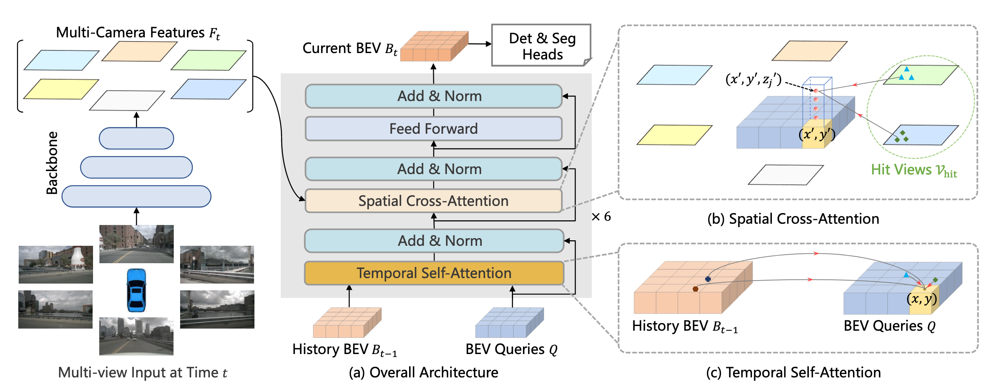
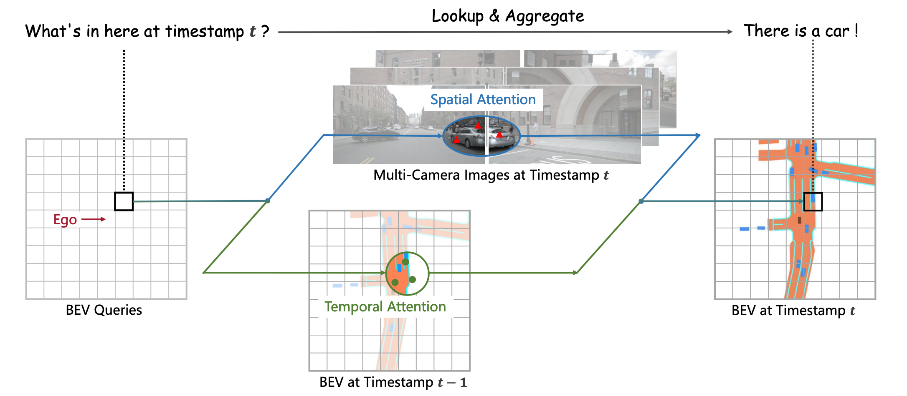
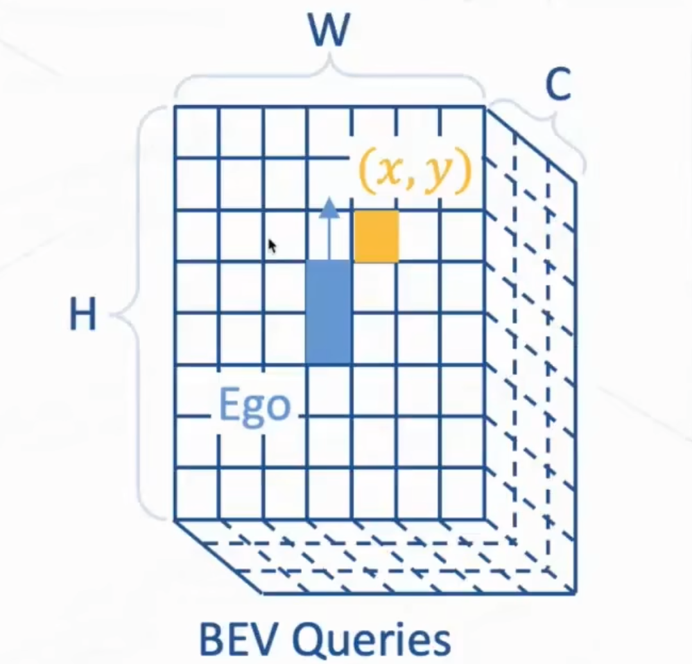
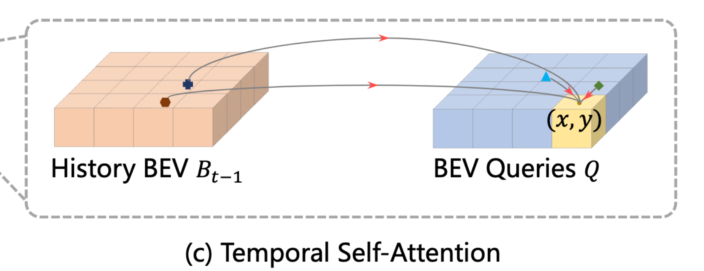
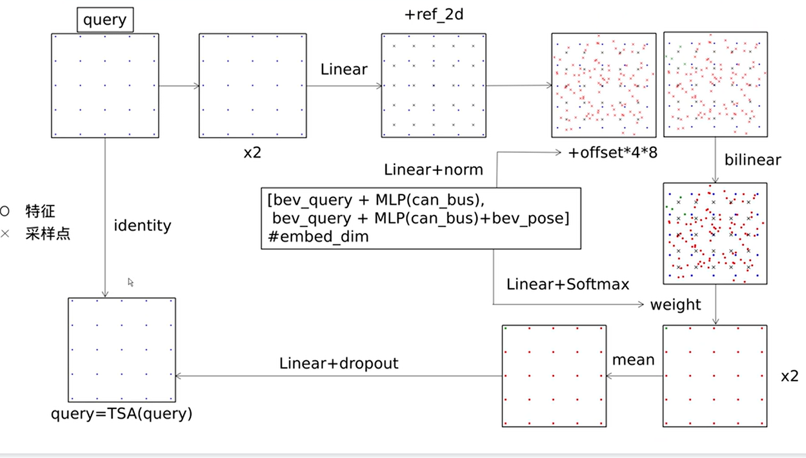
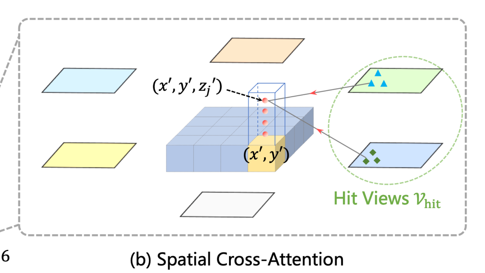
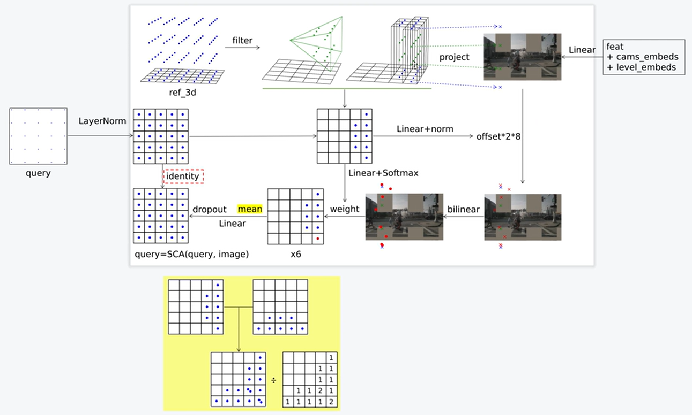

# BEVFormer 系列论文总结


## BEVFormer



### 论文动机

1. 3D目标检测任务需要强的BEV特征去支撑准确的3D bbox 预测，但是从2D平面生成3D特征是病态的。当前框架主要利用深度信息生成BEV特征，对深度的准确性和分布敏感，而不准确的BEV特征会严重损害模型性能。**论文设计了BEV生成方式，不依赖于深度信息，并切能够自适应地学习BEV特征，而不是严格地依赖于3D 先验。使用Transformer 注意力机制去动态地聚合有价值的特征，获得更好的BEV特征**
2. 利用BEV特征去执行感知任务，是由于**BEV特征是连接空间（spatial）和时间（temporal）的可用的桥梁。**时序信息在感知中扮演着重要的角色，如推理目标的运动状态和识别遮挡物体。**我们循环（recurrently）地利用BEV特征从过去到现在传递时间信息，这与RNN模型的隐藏状态具有相同的本质。**
3. 论文基于**Deformable Attention**模型实现了一种融合多视角相机和时序特征的端到端框架，适用于多种感知任务。

### 关键点

#### BEV Query

BEV查询是**BEV网格(grid)形状**的**可学习参数**，*用于查询BEV特征图*，从跨摄像头中查找空间特征，并从历史BEV特征中查找时序特征。



* 每个query为形状为 $H\times W \times C$ 的可学习参数，用来获取BEV特征，其中$H \times W$表示BEV平面的空间形状。
* 每个位于$(x,y)$网格位置的query仅负责查询，表征其对应的小范围区域，每个查询的网格单元对应$s$米的真实大小。
* 通过轮番/迭代查询 空间和时序信息，生成BEV特征。
* 根据普遍的经验，在将查询$Q$输入tansformer之前，添加一个可学习的位置编码（position-embedding）到BEV查询中$Q$中。




* 代码解析

  ```python
  # projects/mmdet3d_plugin/bevformer/dense_heads/bevformer_head.py
  
  point_cloud_range = [-51.2, -51.2, -5.0, 51.2, 51.2, 3.0] # m
  voxel_size = [0.2, 0.2, 8]
  bev_h_ = 200
  bev_w_ = 200
  embed_dims = 256 #  _dim_ = 256
  num_feats = 128 #_pos_dim_ = _dim_//2
  feedforward_channels = 512 # _ffn_dim_ = _dim_*2
  num_query=900 # number query of object
  
  # real_range
  self.real_w = self.pc_range[3] - self.pc_range[0]  # 102.4
  self.real_h = self.pc_range[4] - self.pc_range[1] # 102.4
  
  # construct bev_embedding and query_embedding
  self.bev_embedding = nn.Embedding(self.bev_h * self.bev_w, self.embed_dims) # (200*200, 256)
  self.query_embedding = nn.Embedding(self.num_query, self.embed_dims * 2)  # (900, 512)
  
  # generate position embemdding
  bev_mask = torch.zeros((bs, self.bev_h, self.bev_w),
                         device=bev_queries.device).to(dtype) # (bs, 200, 200)
  bev_pos = self.positional_encoding(bev_mask).to(dtype) # LearnedPositionalEncoding  (bs, 256, 200, 200) 
  
  grid_length=(self.real_h / self.bev_h,
               self.real_w / self.bev_w)  # (0.512, 0.512)m
  
  # mlvl_feats (bs, 6, 256, 15, 25..
  
  # position_embedding for bev_embedding
  # mmdet/models/layers/positional_encoding.py
  class LearnedPositionalEncoding(BaseModule):
      """Position embedding with learnable embedding weights.
      """
      def __init__(
          self,
          num_feats: int,
          row_num_embed: int = 50,
          col_num_embed: int = 50,
          init_cfg: MultiConfig = dict(type='Uniform', layer='Embedding')
      ) -> None:
          super().__init__(init_cfg=init_cfg)
          self.row_embed = nn.Embedding(row_num_embed, num_feats)
          self.col_embed = nn.Embedding(col_num_embed, num_feats)
          self.num_feats = num_feats
          self.row_num_embed = row_num_embed
          self.col_num_embed = col_num_embed
  
      def forward(self, mask: Tensor) -> Tensor:
          """Forward function for `LearnedPositionalEncoding`.
  
          Args:
              mask (Tensor): ByteTensor mask. Non-zero values representing
                  ignored positions, while zero values means valid positions
                  for this image. Shape [bs, h, w].
  
          Returns:
              pos (Tensor): Returned position embedding with shape
                  [bs, num_feats*2, h, w].
          """
          h, w = mask.shape[-2:]
          x = torch.arange(w, device=mask.device)
          y = torch.arange(h, device=mask.device)
          x_embed = self.col_embed(x)  # (bs, w, num_feats)
          y_embed = self.row_embed(y)  # (bs, h, num_feats)
          pos = torch.cat(
              (x_embed.unsqueeze(0).repeat(h, 1, 1), y_embed.unsqueeze(1).repeat(
                  1, w, 1)),
              dim=-1).permute(2, 0,
                              1).unsqueeze(0).repeat(mask.shape[0], 1, 1, 1)
          return pos  # (bs, num_feats*2, h, w)
        
  # next stage -> transformer
  ```
  


#### Transformer

* 代码解析

```python
# projects/mmdet3d_plugin/bevformer/modules/transformer.py
def get_bev_features(
        self,
        mlvl_feats,
        bev_queries,
        bev_h,
        bev_w,
        grid_length=[0.512, 0.512],
        bev_pos=None,
        prev_bev=None,
        **kwargs):
    """
    obtain bev features.
    """
    # ------------------- preprare to get bev feat --------------------
    bs = mlvl_feats[0].size(0)
            bev_queries = bev_queries.unsqueeze(1).repeat(1, bs, 1)
    bev_pos = bev_pos.flatten(2).permute(2, 0, 1)

    # obtain rotation angle and shift with ego motion
    delta_x = np.array([each['can_bus'][0]
                       for each in kwargs['img_metas']])
    delta_y = np.array([each['can_bus'][1]
                       for each in kwargs['img_metas']])
    ego_angle = np.array(
        [each['can_bus'][-2] / np.pi * 180 for each in kwargs['img_metas']])

    # ----------- convert motion from global-coord to bev-coord ---------
    grid_length_y = grid_length[0]
    grid_length_x = grid_length[1]
    translation_length = np.sqrt(delta_x ** 2 + delta_y ** 2)
    translation_angle = np.arctan2(delta_y, delta_x) / np.pi * 180

    bev_angle = ego_angle - translation_angle
    shift_y = translation_length * \
        np.cos(bev_angle / 180 * np.pi) / grid_length_y / bev_h
    shift_x = translation_length * \
        np.sin(bev_angle / 180 * np.pi) / grid_length_x / bev_w
    shift_y = shift_y * self.use_shift
    shift_x = shift_x * self.use_shift
    shift = bev_queries.new_tensor(
        [shift_x, shift_y]).permute(1, 0)  # xy, bs -> bs, xy

    # ----------------- align prev bev to current bev ---------------
    if prev_bev is not None:
        if prev_bev.shape[1] == bev_h * bev_w:
            prev_bev = prev_bev.permute(1, 0, 2)
        if self.rotate_prev_bev:
            for i in range(bs):
                # num_prev_bev = prev_bev.size(1)
                rotation_angle = kwargs['img_metas'][i]['can_bus'][-1]
                tmp_prev_bev = prev_bev[:, i].reshape(
                    bev_h, bev_w, -1).permute(2, 0, 1)
                tmp_prev_bev = rotate(tmp_prev_bev, rotation_angle,
                                      center=self.rotate_center)
                tmp_prev_bev = tmp_prev_bev.permute(1, 2, 0).reshape(
                    bev_h * bev_w, 1, -1)
                prev_bev[:, i] = tmp_prev_bev[:, 0]

    # --------------- add can bus signals (mutimodel fusion) ------------
    can_bus = bev_queries.new_tensor(
        [each['can_bus'] for each in kwargs['img_metas']])  # [:, :]
    can_bus = self.can_bus_mlp(can_bus)[None, :, :]
    bev_queries = bev_queries + can_bus * self.use_can_bus
    
    
    # -------------- stack img feat --------------
    feat_flatten = []
      spatial_shapes = []
      for lvl, feat in enumerate(mlvl_feats):
          bs, num_cam, c, h, w = feat.shape
          spatial_shape = (h, w)
          feat = feat.flatten(3).permute(1, 0, 3, 2)
          if self.use_cams_embeds:
              feat = feat + self.cams_embeds[:, None, None, :].to(feat.dtype)
          feat = feat + self.level_embeds[None,
                                          None, lvl:lvl + 1, :].to(feat.dtype)
          spatial_shapes.append(spatial_shape)
          feat_flatten.append(feat)

      feat_flatten = torch.cat(feat_flatten, 2)
      spatial_shapes = torch.as_tensor(
          spatial_shapes, dtype=torch.long, device=bev_pos.device)
      level_start_index = torch.cat((spatial_shapes.new_zeros(
          (1,)), spatial_shapes.prod(1).cumsum(0)[:-1]))

      feat_flatten = feat_flatten.permute(
          0, 2, 1, 3)  # (num_cam, H*W, bs, embed_dims)
			
      # extract bev feat
      bev_embed = self.encoder(
          bev_queries, # query
          feat_flatten, # key 
          feat_flatten, # value
          bev_h=bev_h,
          bev_w=bev_w,
          bev_pos=bev_pos,
          spatial_shapes=spatial_shapes,
          level_start_index=level_start_index,
          prev_bev=prev_bev,
          shift=shift,
          **kwargs
      )

# next stage =>  encoder
```

#### encoder

* 代码解析

```python
# projects/mmdet3d_plugin/bevformer/modules/encoder.py
# layer -> ('self_attn', 'norm', 'cross_attn', 'norm', 'ffn', 'norm')
num_points_in_pillar = 4
num_layers=6
operation_order=('self_attn', 'norm', 'cross_attn', 'norm', 'ffn', 'norm')

# ref_point for SCA
ref_3d = self.get_reference_points(
            bev_h, bev_w, self.pc_range[5]-self.pc_range[2], self.num_points_in_pillar, dim='3d', bs=bev_query.size(1),  device=bev_query.device, dtype=bev_query.dtype) 
# ref_points for TSA
ref_2d = self.get_reference_points(
    bev_h, bev_w, dim='2d', bs=bev_query.size(1), device=bev_query.device, dtype=bev_query.dtype)

# gen lut from ego to camera
# reference_points_cam => (num_cam, bs, bev_h * bev_w, num_points_in_pillar, uv)
# bev_mask => (num_cam, bs, bev_h * bev_w, num_points_in_pillar)
reference_points_cam, bev_mask = self.point_sampling(
            ref_3d, self.pc_range, kwargs['img_metas'])  

# add shift to ref_points, process dynamic scene
shift_ref_2d = ref_2d.clone()
shift_ref_2d += shift[:, None, None, :]

# (num_query, bs, embed_dims) -> (bs, num_query, embed_dims)
bev_query = bev_query.permute(1, 0, 2)
bev_pos = bev_pos.permute(1, 0, 2)

# ----------------- temporal fusion ---------------
bs, len_bev, num_bev_level, _ = ref_2d.shape
if prev_bev is not None:
    prev_bev = prev_bev.permute(1, 0, 2)

    # concat prev_bev and current_bev(query)
    prev_bev = torch.stack(
        [prev_bev, bev_query], 1).reshape(bs*2, len_bev, -1)
    # concat shift ref_point with rev_point
    hybird_ref_2d = torch.stack([shift_ref_2d, ref_2d], 1).reshape(
        bs*2, len_bev, num_bev_level, 2)
else:
    # repeat ref point when prev_bev not exist
    hybird_ref_2d = torch.stack([ref_2d, ref_2d], 1).reshape(
        bs*2, len_bev, num_bev_level, 2)

# execute all encoder layer(BEVFormerLayer) with iterator method
# len(self.layers) = 6
for lid, layer in enumerate(self.layers):
    output = layer(
        bev_query,
        key,
        value,
        *args,
        bev_pos=bev_pos,
        ref_2d=hybird_ref_2d,
        ref_3d=ref_3d,
        bev_h=bev_h,
        bev_w=bev_w,
        spatial_shapes=spatial_shapes,
        level_start_index=level_start_index,
        reference_points_cam=reference_points_cam,
        bev_mask=bev_mask,
        prev_bev=prev_bev,
        **kwargs)

    bev_query = output  # last layer output query as input of next layer

# -------------------------------- point_sampling -------------------------------------

def point_sampling(self, reference_points, pc_range,  img_metas):
    """
    calculate ref points from bev to camera and valid mask
    Args:
        reference_points: (num_points_in_pillar, H, W, 3)
        pc_range:
        img_metas:

    Returns:

    """
    # NOTE: close tf32 here.
    allow_tf32 = torch.backends.cuda.matmul.allow_tf32
    torch.backends.cuda.matmul.allow_tf32 = False
    torch.backends.cudnn.allow_tf32 = False

    # extra-param
    lidar2img = []
    for img_meta in img_metas:
        lidar2img.append(img_meta['lidar2img'])
    lidar2img = np.asarray(lidar2img)
    lidar2img = reference_points.new_tensor(lidar2img)  # (B, N, 4, 4)
    reference_points = reference_points.clone()

    # bev-coord to ego-coord
    reference_points[..., 0:1] = reference_points[..., 0:1] * \
        (pc_range[3] - pc_range[0]) + pc_range[0]
    reference_points[..., 1:2] = reference_points[..., 1:2] * \
        (pc_range[4] - pc_range[1]) + pc_range[1]
    reference_points[..., 2:3] = reference_points[..., 2:3] * \
        (pc_range[5] - pc_range[2]) + pc_range[2]

    # convert ref_points to homogeneous coordinates
    # (bs, num_points_in_pillar, bev_h * bev_w, x-y-z-1)
    reference_points = torch.cat(
        (reference_points, torch.ones_like(reference_points[..., :1])), -1)

    # (num_points_in_pillar, bs, bev_h * bev_w, x - y - z - 1)
    reference_points = reference_points.permute(1, 0, 2, 3)
    D, B, num_query = reference_points.size()[:3]
    num_cam = lidar2img.size(1)

    # (num_points_in_pillar, bs, num_cam, bev_h * bev_w, x-y-z-1, None)
    reference_points = reference_points.view(
        D, B, 1, num_query, 4).repeat(1, 1, num_cam, 1, 1).unsqueeze(-1)

    # (num_points_in_pillar, bs, num_cam, bev_h * bev_w, 4, 4)
    lidar2img = lidar2img.view(
        1, B, num_cam, 1, 4, 4).repeat(D, 1, 1, num_query, 1, 1)

    # ----------------- ego-coord to cam-coord -------------------
    reference_points_cam = torch.matmul(lidar2img.to(torch.float32),
                                        reference_points.to(torch.float32)).squeeze(-1)

    # -----------------remove invalid ref_points -----------------
    eps = 1e-5

    # filter with depth and maintain the point in front of the camera
    bev_mask = (reference_points_cam[..., 2:3] > eps)

    # filter with feat-range(receptive field)
    # get actual coord in image
    reference_points_cam = reference_points_cam[..., 0:2] / torch.maximum(
        reference_points_cam[..., 2:3], torch.ones_like(reference_points_cam[..., 2:3]) * eps)

    reference_points_cam[..., 0] /= img_metas[0]['img_shape'][0][1]
    reference_points_cam[..., 1] /= img_metas[0]['img_shape'][0][0]
    bev_mask = (bev_mask & (reference_points_cam[..., 1:2] > 0.0)
                & (reference_points_cam[..., 1:2] < 1.0)
                & (reference_points_cam[..., 0:1] < 1.0)
                & (reference_points_cam[..., 0:1] > 0.0))

    if digit_version(TORCH_VERSION) >= digit_version('1.8'):
        bev_mask = torch.nan_to_num(bev_mask)
    else:
        bev_mask = bev_mask.new_tensor(
            np.nan_to_num(bev_mask.cpu().numpy()))
    # (num_cam, bs, bev_h * bev_w, num_points_in_pillar, uv)
    reference_points_cam = reference_points_cam.permute(2, 1, 3, 0, 4)
    # (num_cam, bs, bev_h * bev_w, num_points_in_pillar)（bool）
    bev_mask = bev_mask.permute(2, 1, 3, 0, 4).squeeze(-1)

    torch.backends.cuda.matmul.allow_tf32 = allow_tf32
    torch.backends.cudnn.allow_tf32 = allow_tf32

    return reference_points_cam, bev_mask
  
# -------------------- BEVFormerLayer -------------------
class BEVFormerLayer(MyCustomBaseTransformerLayer):
    """Implements decoder layer in DETR transformer.
    """

    def __init__(self,
                 attn_cfgs,
                 feedforward_channels,
                 ffn_dropout=0.0,
                 operation_order=None,
                 act_cfg=dict(type='ReLU', inplace=True),
                 norm_cfg=dict(type='LN'),
                 ffn_num_fcs=2,
                 **kwargs):
        super(BEVFormerLayer, self).__init__(
            attn_cfgs=attn_cfgs,
            feedforward_channels=feedforward_channels,
            ffn_dropout=ffn_dropout,
            operation_order=operation_order,
            act_cfg=act_cfg,
            norm_cfg=norm_cfg,
            ffn_num_fcs=ffn_num_fcs,
            **kwargs)
        assert len(operation_order) == 6
        assert set(operation_order) == set(
            ['self_attn', 'norm', 'cross_attn', 'ffn'])

    def forward(self,
                query,
                key=None,
                value=None,
                bev_pos=None,
                query_pos=None,
                key_pos=None,
                attn_masks=None,
                query_key_padding_mask=None,
                key_padding_mask=None,
                ref_2d=None,
                ref_3d=None,
                bev_h=None,
                bev_w=None,
                reference_points_cam=None,
                mask=None,
                spatial_shapes=None,
                level_start_index=None,
                prev_bev=None,
                **kwargs):
        """Forward function for `TransformerDecoderLayer`.

        **kwargs contains some specific arguments of attentions.
        Args:
            query (Tensor): The input query with shape
                [num_queries, bs, embed_dims] if
                self.batch_first is False, else
                [bs, num_queries embed_dims].
            key (Tensor): The key tensor with shape [num_keys, bs,
                embed_dims] if self.batch_first is False, else
                [bs, num_keys, embed_dims] .
            value (Tensor): The value tensor with same shape as `key`.
            query_pos (Tensor): The positional encoding for `query`.
                Default: None.
            key_pos (Tensor): The positional encoding for `key`.
                Default: None.
            attn_masks (List[Tensor] | None): 2D Tensor used in
                calculation of corresponding attention. The length of
                it should equal to the number of `attention` in
                `operation_order`. Default: None.
            query_key_padding_mask (Tensor): ByteTensor for `query`, with
                shape [bs, num_queries]. Only used in `self_attn` layer.
                Defaults to None.
            key_padding_mask (Tensor): ByteTensor for `query`, with
                shape [bs, num_keys]. Default: None.

        Returns:
            Tensor: forwarded results with shape [num_queries, bs, embed_dims].
				"""
        norm_index = 0
        attn_index = 0
        ffn_index = 0
        identity = query
   			
        # self_attn -> norm -> cross_attn -> norm -> ffn -> norm
        for layer in self.operation_order:
            # temporal self attention
            if layer == 'self_attn':
                query = self.attentions[attn_index](
                    query, # query
                    prev_bev, # key
                    prev_bev, # value
                    identity if self.pre_norm else None,
                    query_pos=bev_pos,
                    key_pos=bev_pos,
                    attn_mask=attn_masks[attn_index],
                    key_padding_mask=query_key_padding_mask,
                    reference_points=ref_2d,
                    spatial_shapes=torch.tensor(
                        [[bev_h, bev_w]], device=query.device),
                    level_start_index=torch.tensor([0], device=query.device),
                    **kwargs)
                attn_index += 1
                identity = query

            elif layer == 'norm':
                query = self.norms[norm_index](query)
                norm_index += 1

            # spaital cross attention
            elif layer == 'cross_attn':
                query = self.attentions[attn_index](
                    query, # query
                    key, # key
                    value, # value
                    identity if self.pre_norm else None,
                    query_pos=query_pos,
                    key_pos=key_pos,
                    reference_points=ref_3d,
                    reference_points_cam=reference_points_cam,
                    mask=mask,
                    attn_mask=attn_masks[attn_index],
                    key_padding_mask=key_padding_mask,
                    spatial_shapes=spatial_shapes,
                    level_start_index=level_start_index,
                    **kwargs)
                attn_index += 1
                identity = query

            elif layer == 'ffn':
                query = self.ffns[ffn_index](
                    query, identity if self.pre_norm else None)
                ffn_index += 1

        return query
  
# ----------------------next stage -> SCA and TSA
```

#### Deformeable Attention

可变形注意力模块（Deformeable Attention）只关注每个参考点周围关键采样点的一个小集合。


```python


```


#### Temporal Self-Attention(TSA)

时序自注意力模块，*用于融合时序BEV特征*，从历史BEV特征中提取时序信息。

前后帧的时序信息对于推理运动目标的速度和预测遮挡率高的目标至关重要。




具体步骤如下

1. 第一步，根据自车运动信息（定位和姿态），将两帧特征对齐到相同坐标系（align）,使得同一查询网格上的特征对应同一实际位置。
2. 第二步，使用self-attention，分别从对齐后的当前帧特征和历史帧特征去采样特征。
3. 第三步，使用加权方式，融合采样到的当前帧BEV特征和历史帧BEV特征。
4. 第四步，采用RNN风格的方式，迭代地收集历史帧的BEV特征。

* 代码解析

  

  ```python
  # projects/mmdet3d_plugin/bevformer/modules/temporal_self_attention.py
  # spatial_shapes = (bev_h, bev_w) # for TSA
  class TemporalSelfAttention(BaseModule):
      """An attention module used in BEVFormer based on Deformable-Detr.
  
      `Deformable DETR: Deformable Transformers for End-to-End Object Detection.
      <https://arxiv.org/pdf/2010.04159.pdf>`_.
  
      Args:
          embed_dims (int): The embedding dimension of Attention.
              Default: 256.
          num_heads (int): Parallel attention heads. Default: 64.
          num_levels (int): The number of feature map used in
              Attention. Default: 4.
          num_points (int): The number of sampling points for
              each query in each head. Default: 4.
          im2col_step (int): The step used in image_to_column.
              Default: 64.
          dropout (float): A Dropout layer on `inp_identity`.
              Default: 0.1.
          batch_first (bool): Key, Query and Value are shape of
              (batch, n, embed_dim)
              or (n, batch, embed_dim). Default to True.
          norm_cfg (dict): Config dict for normalization layer.
              Default: None.
          init_cfg (obj:`mmcv.ConfigDict`): The Config for initialization.
              Default: None.
          num_bev_queue (int): In this version, we only use one history BEV and one currenct BEV.
           the length of BEV queue is 2.
      """
  
      def __init__(self,
                   embed_dims=256,
                   num_heads=8,
                   num_levels=4,
                   num_points=4,
                   num_bev_queue=2,
                   im2col_step=64,
                   dropout=0.1,
                   batch_first=True,
                   norm_cfg=None,
                   init_cfg=None):
  
          super().__init__(init_cfg)
          if embed_dims % num_heads != 0:
              raise ValueError(f'embed_dims must be divisible by num_heads, '
                               f'but got {embed_dims} and {num_heads}')
          dim_per_head = embed_dims // num_heads
          self.norm_cfg = norm_cfg
          self.dropout = nn.Dropout(dropout)
          self.batch_first = batch_first
          self.fp16_enabled = False
  
          # you'd better set dim_per_head to a power of 2
          # which is more efficient in the CUDA implementation
          def _is_power_of_2(n):
              if (not isinstance(n, int)) or (n < 0):
                  raise ValueError(
                      'invalid input for _is_power_of_2: {} (type: {})'.format(
                          n, type(n)))
              return (n & (n - 1) == 0) and n != 0
  
          if not _is_power_of_2(dim_per_head):
              warnings.warn(
                  "You'd better set embed_dims in "
                  'MultiScaleDeformAttention to make '
                  'the dimension of each attention head a power of 2 '
                  'which is more efficient in our CUDA implementation.')
  
          self.im2col_step = im2col_step
          self.embed_dims = embed_dims
          self.num_levels = num_levels
          self.num_heads = num_heads
          self.num_points = num_points
          self.num_bev_queue = num_bev_queue
  
          # generate offset of sampling points with value
          self.sampling_offsets = nn.Linear(
              embed_dims*self.num_bev_queue, num_bev_queue*num_heads * num_levels * num_points * 2)  # (256*2, 2*8*1*4*2)
          # generate attention weight with value
          self.attention_weights = nn.Linear(embed_dims*self.num_bev_queue,
                                             num_bev_queue*num_heads * num_levels * num_points)  # (256*2, 2*8*1*4)
          self.value_proj = nn.Linear(embed_dims, embed_dims)
          self.output_proj = nn.Linear(embed_dims, embed_dims)
          self.init_weights()
  
      def init_weights(self):
          """Default initialization for Parameters of Module.
             initial sample point around each ref_point
          """
          constant_init(self.sampling_offsets, 0.)
  
          # generate Angles for each Attention head
          thetas = torch.arange(
              self.num_heads,
              dtype=torch.float32) * (2.0 * math.pi / self.num_heads)  # [0, π/4, π/2, 3π/4, π, 5π/4, 3π/2, 7π/4]
          # convert to 2D coord
          grid_init = torch.stack([thetas.cos(), thetas.sin()], -1)
          # normalize and reshape
          grid_init = (grid_init /
                       grid_init.abs().max(-1, keepdim=True)[0]).view(
              self.num_heads, 1, 1,
              2).repeat(1, self.num_levels*self.num_bev_queue, self.num_points, 1)
  
          # scale different of sample point at each head(angle)
          for i in range(self.num_points):
              grid_init[:, :, i, :] *= i + 1
  
          self.sampling_offsets.bias.data = grid_init.view(-1)
          constant_init(self.attention_weights, val=0., bias=0.)
          xavier_init(self.value_proj, distribution='uniform', bias=0.)
          xavier_init(self.output_proj, distribution='uniform', bias=0.)
          self._is_init = True
  
      def forward(self,
                  query,
                  key=None,
                  value=None,
                  identity=None,
                  query_pos=None,
                  key_padding_mask=None,
                  reference_points=None,
                  spatial_shapes=None,  # [bev_h, bev_w]
                  level_start_index=None, # [0]
                  flag='decoder',
  
                  **kwargs):
          """Forward Function of MultiScaleDeformAttention.
  
          Args:
              query (Tensor): Query of Transformer with shape
                  (num_query, bs, embed_dims).
              key (Tensor): The key tensor with shape
                  `(num_key, bs, embed_dims)`.
              value (Tensor): The value tensor with shape
                  `(num_key, bs, embed_dims)`.
              identity (Tensor): The tensor used for addition, with the
                  same shape as `query`. Default None. If None,
                  `query` will be used.
              query_pos (Tensor): The positional encoding for `query`.
                  Default: None.
              key_pos (Tensor): The positional encoding for `key`. Default
                  None.
              reference_points (Tensor):  The normalized reference
                  points with shape (bs, num_query, num_levels, 2),
                  all elements is range in [0, 1], top-left (0,0),
                  bottom-right (1, 1), including padding area.
                  or (N, Length_{query}, num_levels, 4), add
                  additional two dimensions is (w, h) to
                  form reference boxes.
              key_padding_mask (Tensor): ByteTensor for `query`, with
                  shape [bs, num_key].
              spatial_shapes (Tensor): Spatial shape of features in
                  different levels. With shape (num_levels, 2),
                  last dimension represents (h, w).
              level_start_index (Tensor): The start index of each level.
                  A tensor has shape ``(num_levels, )`` and can be represented
                  as [0, h_0*w_0, h_0*w_0+h_1*w_1, ...].
  
          Returns:
               Tensor: forwarded results with shape [num_query, bs, embed_dims].
          """
          # ---------  gen value [prev_bev, curr_bev]------
          # if prev_bev not exist, copy current bev as history bev
          if value is None:
              assert self.batch_first
              bs, len_bev, c = query.shape
              value = torch.stack([query, query], 1).reshape(bs*2, len_bev, c)
              # value = torch.cat([query, query], 0)
  
          # for residual connect
          if identity is None:
              identity = query
              
          # add position embedding
          if query_pos is not None:
              query = query + query_pos
  
          if not self.batch_first:
              # change to (bs, num_query ,embed_dims)
              query = query.permute(1, 0, 2)
              value = value.permute(1, 0, 2)
          bs,  num_query, embed_dims = query.shape
  
          _, num_value, _ = value.shape
          assert (spatial_shapes[:, 0] * spatial_shapes[:, 1]).sum() == num_value
          assert self.num_bev_queue == 2
  
          # concat prev bev and current query as new query
          query = torch.cat([value[:bs], query], -1)  # (bs, num_query, embed_dims*2)
          value = self.value_proj(value)  # (bs, num_key, embed_dims)
  
          # fill empty as 0, due to no feat value in some position after prev_bev rotation
          if key_padding_mask is not None:
              value = value.masked_fill(key_padding_mask[..., None], 0.0)
  
          # ------------  spit value for multi-head attention -------------
          # (bs*2, num_value, num_heads, head_dim)
          value = value.reshape(bs*self.num_bev_queue,
                                num_value, self.num_heads, -1)
  
          # ------- project sampling offset and attention weight for multi-head attention --------
          # embed_dims*self.num_bev_queue, num_bev_queue*num_heads * num_levels * num_points * 2)
          sampling_offsets = self.sampling_offsets(query)
          sampling_offsets = sampling_offsets.view(
              bs, num_query, self.num_heads,  self.num_bev_queue, self.num_levels, self.num_points, 2)
          attention_weights = self.attention_weights(query).view(
              bs, num_query,  self.num_heads, self.num_bev_queue, self.num_levels * self.num_points)
          attention_weights = attention_weights.softmax(-1)
  
          attention_weights = attention_weights.view(bs, num_query,
                                                     self.num_heads,
                                                     self.num_bev_queue,
                                                     self.num_levels,
                                                     self.num_points)
  
          attention_weights = attention_weights.permute(0, 3, 1, 2, 4, 5)\
              .reshape(bs*self.num_bev_queue, num_query, self.num_heads, self.num_levels, self.num_points).contiguous()
          sampling_offsets = sampling_offsets.permute(0, 3, 1, 2, 4, 5, 6)\
              .reshape(bs*self.num_bev_queue, num_query, self.num_heads, self.num_levels, self.num_points, 2)
  
          # ---------------------- normalize sample location ----------------------
          if reference_points.shape[-1] == 2:  # point [x, y]
              offset_normalizer = torch.stack(
                  [spatial_shapes[..., 1], spatial_shapes[..., 0]], -1)
              sampling_locations = reference_points[:, :, None, :, None, :] \
                  + sampling_offsets \
                  / offset_normalizer[None, None, None, :, None, :]
  
          elif reference_points.shape[-1] == 4:  # box [x, y, w, h]
              sampling_locations = reference_points[:, :, None, :, None, :2] \
                  + sampling_offsets / self.num_points \
                  * reference_points[:, :, None, :, None, 2:] \
                  * 0.5
          else:
              raise ValueError(
                  f'Last dim of reference_points must be'
                  f' 2 or 4, but get {reference_points.shape[-1]} instead.')
  
          # cal multiScale Deformable Attention
          # output => (bs*num_bev_queue, num_query, embed_dims)
          if torch.cuda.is_available() and value.is_cuda:
              # using fp16 deformable attention is unstable because it performs many sum operations
              if value.dtype == torch.float16:
                  MultiScaleDeformableAttnFunction = MultiScaleDeformableAttnFunction_fp32
              else:
                  MultiScaleDeformableAttnFunction = MultiScaleDeformableAttnFunction_fp32
              output = MultiScaleDeformableAttnFunction.apply(
                  value, spatial_shapes, level_start_index, sampling_locations,
                  attention_weights, self.im2col_step)
          else:
  
              output = multi_scale_deformable_attn_pytorch(
                  value, spatial_shapes, sampling_locations, attention_weights)
  
          # (bs*num_bev_queue, num_query, embed_dims)-> (num_query, embed_dims, bs*num_bev_queue)
          output = output.permute(1, 2, 0)
  
          # fuse history value and current value
          # (num_query, embed_dims, bs*num_bev_queue)-> (num_query, embed_dims, bs, num_bev_queue)
          output = output.view(num_query, embed_dims, bs, self.num_bev_queue)
          output = output.mean(-1)
  
          # (num_query, embed_dims, bs)-> (bs, num_query, embed_dims)
          output = output.permute(2, 0, 1)
  
          output = self.output_proj(output)
  
          if not self.batch_first:
              output = output.permute(1, 0, 2)
  
          return self.dropout(output) +  identity
  ```

  

#### Spatial Cross-Attention(SCA)

空间交叉注意力模块，*用于融合多视角特征*，去集成来自多个相机图片的空间特征。



具体步骤如下

1. 第一步，将$(x, y)$位置的BEV 查询$Q$，通过采样不同的高度，将查询点提升(lift)为柱体(pillar)的不同高度的3D点。
2. 第二步，从柱体采样采样$N_{ref}$个3D点，并利用相机内外参，将采样的3D点投影到不同相机视角下的2D平面。
3. 第三步，**将2D平面击中的的点视为查询$Q$的参考点**，从被击中(hit)视角的对应区域，通过Deformable Attention方式采样特征。
4. 第四步，使用加权方式融合从击中视角采样到的特征，得到$(x,y)$查询点对应的BEV特征


* 代码解析

  
  
  ```python
  # projects/mmdet3d_plugin/bevformer/modules/spatial_cross_attention.py
  # spatial_shapes = (feat_h, feat_w) # for SCA
  # key = (num_cam, feat_h*feat_w, bs, embed_dims) # feat_flatten
  # value = (num_cam, feat_h*feat_w, bs, embed_dims) # feat_flatten
  # reference_points_cam = (num_cam, bs, bev_h * bev_w, num_points_in_pillar, uv)
  # bev_mask = (num_cam, bs, bev_h * bev_w, num_points_in_pillar)
  
  class SpatialCrossAttention(BaseModule):
      """An attention module used in BEVFormer.
      Args:
          embed_dims (int): The embedding dimension of Attention.
              Default: 256.
          num_cams (int): The number of cameras
          dropout (float): A Dropout layer on `inp_residual`.
              Default: 0..
          init_cfg (obj:`mmcv.ConfigDict`): The Config for initialization.
              Default: None.
          deformable_attention: (dict): The config for the deformable attention used in SCA.
      """
  
      def __init__(self,
                   embed_dims=256,
                   num_cams=6,
                   pc_range=None,
                   dropout=0.1,
                   init_cfg=None,
                   batch_first=False,
                   deformable_attention=dict(
                       type='MSDeformableAttention3D',
                       embed_dims=256,
                       num_levels=4),
                   **kwargs
                   ):
          super(SpatialCrossAttention, self).__init__(init_cfg)
  
          self.init_cfg = init_cfg
          self.dropout = nn.Dropout(dropout)
          self.pc_range = pc_range
          self.fp16_enabled = False
          self.deformable_attention = build_attention(deformable_attention)
          self.embed_dims = embed_dims
          self.num_cams = num_cams
          self.output_proj = nn.Linear(embed_dims, embed_dims)
          self.batch_first = batch_first
          self.init_weight()
  
      def init_weight(self):
          """Default initialization for Parameters of Module."""
          xavier_init(self.output_proj, distribution='uniform', bias=0.)
      
      @force_fp32(apply_to=('query', 'key', 'value', 'query_pos', 'reference_points_cam'))
      def forward(self,
                  query,  # (bs, num_query, embed_dims)
                  key,  # (num_cam, feat_h*feat_w, bs, embed_dims)
                  value,  # (num_cam, feat_h*feat_w, bs, embed_dims)
                  residual=None,
                  query_pos=None,
                  key_padding_mask=None,
                  reference_points=None,
                  spatial_shapes=None,  # (feat_h, feat_w)
                  reference_points_cam=None,  # (num_cam, bs, bev_h * bev_w, num_points_in_pillar, uv)
                  bev_mask=None,  # (num_cam, bs, bev_h * bev_w, num_points_in_pillar)
                  level_start_index=None,
                  flag='encoder',
                  **kwargs):
          """Forward Function of Detr3DCrossAtten.
          Args:
              query (Tensor): Query of Transformer with shape
                  (num_query, bs, embed_dims).
              key (Tensor): The key tensor with shape
                  `(num_key, bs, embed_dims)`.
              value (Tensor): The value tensor with shape
                  `(num_key, bs, embed_dims)`. (B, N, C, H, W)
              residual (Tensor): The tensor used for addition, with the
                  same shape as `x`. Default None. If None, `x` will be used.
              query_pos (Tensor): The positional encoding for `query`.
                  Default: None.
              key_pos (Tensor): The positional encoding for  `key`. Default
                  None.
              reference_points (Tensor):  The normalized reference
                  points with shape (bs, num_query, 4),
                  all elements is range in [0, 1], top-left (0,0),
                  bottom-right (1, 1), including padding area.
                  or (N, Length_{query}, num_levels, 4), add
                  additional two dimensions is (w, h) to
                  form reference boxes.
              key_padding_mask (Tensor): ByteTensor for `query`, with
                  shape [bs, num_key].
              spatial_shapes (Tensor): Spatial shape of features in
                  different level. With shape  (num_levels, 2),
                  last dimension represent (h, w).
              level_start_index (Tensor): The start index of each level.
                  A tensor has shape (num_levels) and can be represented
                  as [0, h_0*w_0, h_0*w_0+h_1*w_1, ...].
          Returns:
               Tensor: forwarded results with shape [num_query, bs, embed_dims].
          """
  
          if key is None:
              key = query
          if value is None:
              value = key
  
          # for residual connect
          if residual is None:
              inp_residual = query
              slots = torch.zeros_like(query)
  
          # add position embedding
          if query_pos is not None:
              query = query + query_pos
  
          bs, num_query, _ = query.size()
  
          D = reference_points_cam.size(3)  # num_points_in_pillar=4
  
          # -------------- Find valid pillar index of each camera ---------
          # find the pillar index of each camera that at least one points can hit the image
          indexes = []
          for i, mask_per_img in enumerate(bev_mask):
              index_query_per_img = mask_per_img[0].sum(-1).nonzero().squeeze(-1)
              indexes.append(index_query_per_img)
  
          # compute max len for padding
          max_len = max([len(each) for each in indexes])
  
          # ------------- get invalid query and ref_points -----------
          # each camera only interacts with its corresponding BEV queries. This step can  greatly save GPU memory.
          queries_rebatch = query.new_zeros(
              [bs, self.num_cams, max_len, self.embed_dims])
          reference_points_rebatch = reference_points_cam.new_zeros(
              [bs, self.num_cams, max_len, D, 2])
  
          # take the bev_query and ref_point that camera can see
          for j in range(bs):
              for i, reference_points_per_img in enumerate(reference_points_cam):  # camera
                  index_query_per_img = indexes[i]
                  queries_rebatch[j, i, :len(index_query_per_img)] = query[j, index_query_per_img]
                  reference_points_rebatch[j, i, :len(index_query_per_img)] = reference_points_per_img[j, index_query_per_img]
  
          num_cams, l, bs, embed_dims = key.shape  # l = num_key => feat_h*feat_w
          key = key.permute(2, 0, 1, 3).reshape(
              bs * self.num_cams, l, self.embed_dims)
          value = value.permute(2, 0, 1, 3).reshape(
              bs * self.num_cams, l, self.embed_dims)
  
          # ----------------- get multi-scale camera feat of query with Deformable Cross-Attention -----------------
          # (bs*num_cam, max_len, self.embed_dims)
          queries = self.deformable_attention(query=queries_rebatch.view(bs*self.num_cams, max_len, self.embed_dims), 
                                              key=key, 
                                              value=value,
                                              reference_points=reference_points_rebatch.view(bs*self.num_cams, max_len, D, 2), 
                                              spatial_shapes=spatial_shapes,
                                              level_start_index=level_start_index).view(bs, self.num_cams, max_len, self.embed_dims)
  
          # ------------------- fusion feat from diff camera -------------------
          # step 1: accumulate feat from diff camera
          # slots: (bs, num_query, embed_dims)
          for j in range(bs):
              for i, index_query_per_img in enumerate(indexes):
                  # accumulate the eigenvectors of different cameras
                  slots[j, index_query_per_img] += queries[j, i, :len(index_query_per_img)]
  
          # step 2: multi camera feat normalization by average
          count = bev_mask.sum(-1) > 0
          count = count.permute(1, 2, 0).sum(-1)
          count = torch.clamp(count, min=1.0)
          slots = slots / count[..., None]
          slots = self.output_proj(slots)
  
          return self.dropout(slots) + inp_residual
  ```
  
  

## BEVFormerV2


## 参考资料

* BEVFormer: Learning Bird's-Eye-View Representation from Multi-Camera Images via Spatiotemporal Transformers

* Deformable DETR: Deformable Transformers for End-to-End Object Detection

* https://zhuanlan.zhihu.com/p/543335939

* https://zhuanlan.zhihu.com/p/718845744

  