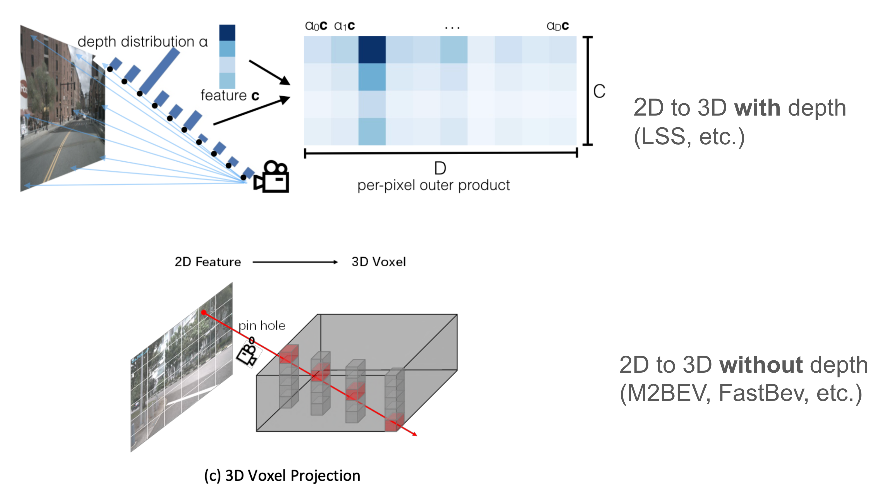
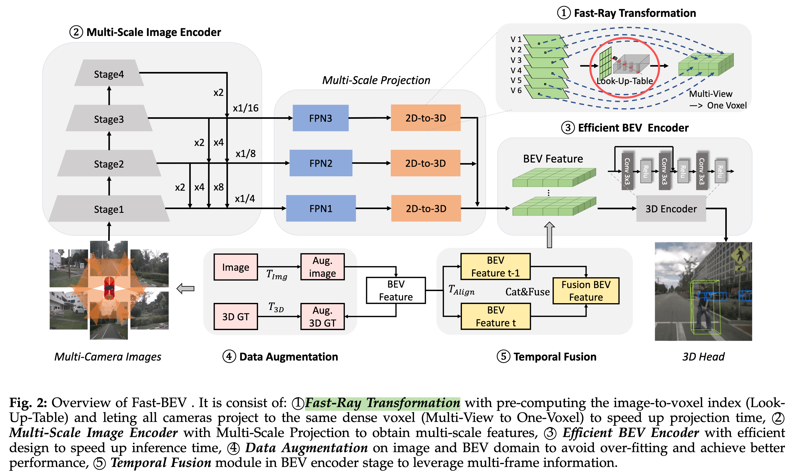
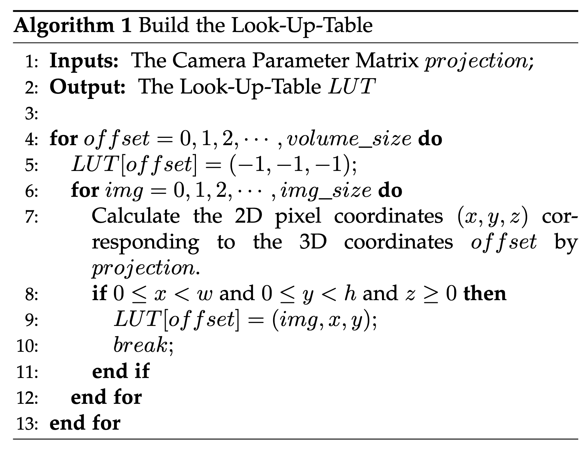
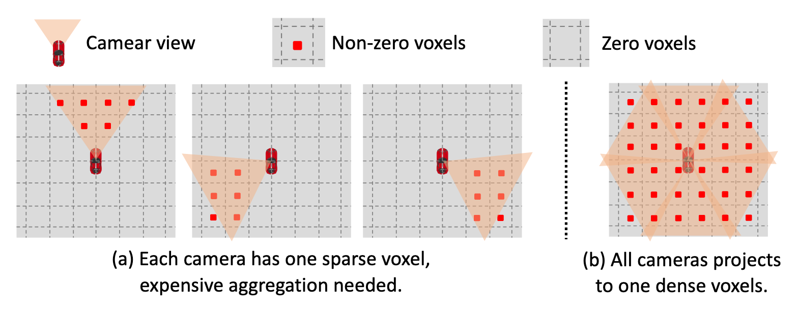
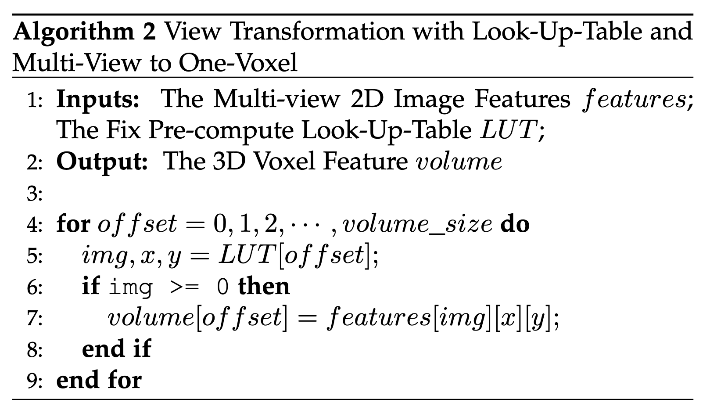

# FastBEV 论文总结

## 动机

现有的BEV表示方案依赖很大的资源来做推理并且性能不佳。论文提出了一个简单且有效的的BEV表示方法，命名为*fastbev*，能够更快地执行BEV感知。



Fastbev 的 核心思想是基于**M2BEV**的深度均匀（uniform depth distribution）假设，并提出了快速射线（fast-ray）变换，通过查找表（look-up-table,lut）和多视图到一个体素的操作，加速了2D到3D的BEV转换过程。

### 深度均匀假设

* 什么是深度均匀假设

  **Fastbev/m2bev**投影方案与**LSS**的主要区别是不预测2D的深度分布，因此也不需要将一条射线上不同深度分布的概率值与对应的语义特征叉乘，得到$D$(深度的个数)份特征。

   **Fastbev/m2bev**的投影，可以理解为假设在相机射线下的每一个像素其在不同深度下的特征都是等值的。如上图中，经过光心到的统一条射线上的体素，*共用*/*复制*同一份2D图像语义特征。

* 深度均匀假设为什么work

  2D图像/特征的每个像素点，一般只对应于一个真实世界的目标或位置（少数情况，也可能存在双峰情况，即一条射线上有多个目标，深度预测有多个峰值），即同一个图像特征位置对应的LSS深度预测有很大概率只集中于一个位置（LSS的典型算法如*BEVDepth*，只每个图像特征的位置，**只使用一个确切的点云深度去做辅助监督**）。

  LSS的的思想是，每个2D特征的射线上，**占用为空的深度**对应的特征的语义特征大小趋近于0，而占用深度的特征的语义特征被保留。通过跨视角区域特征做Pooling融合，构建BEV特征。
  
  Fastbev/m2bev的思想是，每个2D特征的射线上，**每个深度都采样相同的语义特征值**。通过跨视角区域特征做Pooling融合，构建BEV特征。

## 关键点



### 快速射线变换（fast-Ray transformation）

* lut/查询表（look-up-table）

  视图转换（view transform）是从2D图像特征到3D BEV空间重要的组键，并且在真个流程中也占据了主要的耗时。
  
  **M2BEV**假设沿着射线的深度分布是均匀的。这样的优势是，只要获得了相机的内外参，可以很容易地知道2D到3D的投影变换。由于没有可学习参数，因此可以直接计算图像特征到BEV特征之间的映射矩阵。
  
  **投影索引**指从2D图像空间到3D体素空间的映射索引。实际场景中，每个感知系统（车辆）的相机的安装位置（外参）和相机的硬件（内参）是固定的，并且由于不依赖于深度预测。因此，每次输入投影索引是相同的，我们不需要每次迭代都计算投影索引。
  
  论文提出，利用相机的内外参，预计算投影索引，并存储为一个静态的**查询表（look-up-table, lut）**。推理时，通过查询lut表，获得投影映射，对于硬件部署很友好。
  
  lut 表构建过程如下，通过像机参数矩阵投影，建立与输出的三维体素空间**相同维数**的查找表lut。
  
  
  
  1. 第一层循环表示，迭代每个体素单元，并**通过投影矩阵计算出体素的3D坐标对应的3D像素坐标**。其中`volume_size`表示，大小为$H \times W \times Z$，表示3D体素网格的长、宽和高的乘积。
  2. 第二层循环表示，**迭代地计算每个体素网格单元，分别对应于不同视角相机的2D像素坐标**。特别地，对于每个视角相机，*只有部分体素网格的3D点能够击中对应视角的2D特征点*，称为**有效点**，除此之外的**无效点**需要被过滤掉。其中$0\leq x<w$和$0< \leq y< h$ 表示，有效点需要在图像范围内；$z\geq 0$，表示有效点的深度必须大于0（过滤图像后的投影点）。
  
* 多视角到一体素（Multi-View to One-Voxel）

  

  基本的通过视觉转换去构建BEV特征，*首先存储每个相机视角的**离散**BEV体素特征，然后通过聚合不同相机的BEV体素特征得到最终的体素特BEV征*。由于每个相机的投影被限制到有效的角度，因此每个BEV体素特征非常稀疏，比如只有17%的位置是非空的。而聚合不同相机的BEV体素特征是很耗时的，如上图a所示。

  基于上述结论，论文提出**多视角到单体素（Multi-View to One-Voxel）**的BEV特征构建方案。让来自不同相机视角的图像特征投影到相同的体素特征，产生一个稠密的体素特征，如上图所示。具体流程如下

  

  将多个视角的2D特征图转换到体素的3D空间。对于每个体素，使用有预先计算的投影lut 表查询的有效2D特征进行填充。


* 代码解析

```python

# https://github.com/Sense-GVT/Fast-BEV/blob/dev/mmdet3d/datasets/pipelines/multi_view.py
class KittiSetOrigin:
    def __init__(self, point_cloud_range):
        point_cloud_range = np.array(point_cloud_range, dtype=np.float32)
        self.origin = (point_cloud_range[:3] + point_cloud_range[3:]) / 2.

    def __call__(self, results):
        results['lidar2img']['origin'] = self.origin.copy()
        return results
      
# reference https://github.com/Sense-GVT/Fast-BEV/blob/dev/mmdet3d/models/detectors/fastbev.py
class FastBEV(BaseDetector):
    def __init__(
            self,
            backbone,
            neck,
            neck_fuse,
            neck_3d,
            bbox_head,
            seg_head,
            n_voxels,  # n_voxels=[[200, 200, 4]],
            voxel_size,  # voxel_size=[[0.5, 0.5, 1.5]],
            bbox_head_2d=None,
            train_cfg=None,
            test_cfg=None,
            train_cfg_2d=None,
            test_cfg_2d=None,
            pretrained=None,
            init_cfg=None,
            extrinsic_noise=0,
            seq_detach=False,
            multi_scale_id=None,  # multi_scale_id=[0]
            multi_scale_3d_scaler=None,
            with_cp=False,
            backproject='inplace',
            style='v1',
    ):
        super().__init__(init_cfg=init_cfg)
        self.backbone = build_backbone(backbone)
        self.neck = build_neck(neck)
        self.neck_3d = build_neck(neck_3d)
        if isinstance(neck_fuse['in_channels'], list):
            for i, (in_channels, out_channels) in enumerate(zip(neck_fuse['in_channels'], neck_fuse['out_channels'])):
                self.add_module(
                    f'neck_fuse_{i}',
                    nn.Conv2d(in_channels, out_channels, 3, 1, 1))
        else:
            self.neck_fuse = nn.Conv2d(neck_fuse["in_channels"], neck_fuse["out_channels"], 3, 1, 1)

        # style
        # v1: fastbev wo/ ms
        # v2: fastbev + img ms
        # v3: fastbev + bev ms
        # v4: fastbev + img/bev ms
        self.style = style
        assert self.style in ['v1', 'v2', 'v3', 'v4'], self.style
        self.multi_scale_id = multi_scale_id
        self.multi_scale_3d_scaler = multi_scale_3d_scaler

        if bbox_head is not None:
            bbox_head.update(train_cfg=train_cfg)
            bbox_head.update(test_cfg=test_cfg)
            self.bbox_head = build_head(bbox_head)
            self.bbox_head.voxel_size = voxel_size
        else:
            self.bbox_head = None

        if seg_head is not None:
            self.seg_head = build_seg_head(seg_head)
        else:
            self.seg_head = None

        if bbox_head_2d is not None:
            bbox_head_2d.update(train_cfg=train_cfg_2d)
            bbox_head_2d.update(test_cfg=test_cfg_2d)
            self.bbox_head_2d = build_head(bbox_head_2d)
        else:
            self.bbox_head_2d = None

        self.n_voxels = n_voxels
        self.voxel_size = voxel_size
        self.train_cfg = train_cfg
        self.test_cfg = test_cfg

        # test time extrinsic noise
        self.extrinsic_noise = extrinsic_noise
        if self.extrinsic_noise > 0:
            for i in range(5):
                print("### extrnsic noise: {} ###".format(self.extrinsic_noise))

        # detach adj feature
        self.seq_detach = seq_detach
        self.backproject = backproject
        # checkpoint
        self.with_cp = with_cp

    @staticmethod
    def _compute_projection(img_meta, stride, noise=0):
        """
        get porjection of ego-coord to img-feat-coord for front camera(no suitable for fisheye cameras)
        """
        projection = []
        intrinsic = torch.tensor(img_meta["lidar2img"]["intrinsic"][:3, :3])
        intrinsic[:2] /= stride
        extrinsics = map(torch.tensor, img_meta["lidar2img"]["extrinsic"])
        # get ego2image of per camera view
        for extrinsic in extrinsics:
            if noise > 0:
                projection.append(intrinsic @ extrinsic[:3] + noise)
            else:
                projection.append(intrinsic @ extrinsic[:3])  # ego -> image

        return torch.stack(projection)
   

    def extract_feat(self, img, img_metas, mode):
        """
        extract bev feat
        """
        batch_size = img.shape[0]
        img = img.reshape(
            [-1] + list(img.shape)[2:]
        )  # [1, 6, 3, 928, 1600] -> [6, 3, 928, 1600]

        # -------------------- extract image feature --------------------
        x = self.backbone(
            img
        )  # [6, 256, 232, 400]; [6, 512, 116, 200]; [6, 1024, 58, 100]; [6, 2048, 29, 50]

        # use for vovnet
        if isinstance(x, dict):
            tmp = []
            for k in x.keys():
                tmp.append(x[k])
            x = tmp

        # -------------------- fuse multi level features -------------------
        def _inner_forward(x):
            out = self.neck(x)
            return out  # [6, 64, 232, 400]; [6, 64, 116, 200]; [6, 64, 58, 100]; [6, 64, 29, 50])

        if self.with_cp and x.requires_grad:
            mlvl_feats = cp.checkpoint(_inner_forward, x)
        else:
            mlvl_feats = _inner_forward(x)  # mlvl(multi-level)
        mlvl_feats = list(mlvl_feats)

        features_2d = None
        if self.bbox_head_2d:
            features_2d = mlvl_feats

        if self.multi_scale_id is not None:
            mlvl_feats_ = []
            for msid in self.multi_scale_id:
                # fpn output fusion
                if getattr(self, f'neck_fuse_{msid}', None) is not None:
                    fuse_feats = [mlvl_feats[msid]]
                    for i in range(msid + 1, len(mlvl_feats)):
                        resized_feat = resize(
                            mlvl_feats[i],
                            size=mlvl_feats[msid].size()[2:],
                            mode="bilinear",
                            align_corners=False)
                        fuse_feats.append(resized_feat)

                    if len(fuse_feats) > 1:
                        fuse_feats = torch.cat(fuse_feats, dim=1)
                    else:
                        fuse_feats = fuse_feats[0]
                    fuse_feats = getattr(self, f'neck_fuse_{msid}')(fuse_feats)
                    mlvl_feats_.append(fuse_feats)
                else:
                    mlvl_feats_.append(mlvl_feats[msid])
            mlvl_feats = mlvl_feats_
        # v3 bev ms
        if isinstance(self.n_voxels, list) and len(mlvl_feats) < len(self.n_voxels):
            pad_feats = len(self.n_voxels) - len(mlvl_feats)
            for _ in range(pad_feats):
                mlvl_feats.append(mlvl_feats[0])

        # --------------- visual transform to get bev volume of bev (2D -> 3D) --------------
        mlvl_volumes = []
        for lvl, mlvl_feat in enumerate(mlvl_feats):
            stride_i = math.ceil(img.shape[-1] / mlvl_feat.shape[-1])  # P4 880 / 32 = 27.5
            # [bs*seq*nv, c, h, w] -> [bs, seq*nv, c, h, w]
            mlvl_feat = mlvl_feat.reshape([batch_size, -1] + list(mlvl_feat.shape[1:]))
            # [bs, seq*nv, c, h, w] -> list([bs, nv, c, h, w])
            mlvl_feat_split = torch.split(mlvl_feat, 6, dim=1)

            volume_list = []
            for seq_id in range(len(mlvl_feat_split)):
                volumes = []
                for batch_id, seq_img_meta in enumerate(img_metas):
                    feat_i = mlvl_feat_split[seq_id][batch_id]  # [nv, c, h, w]
                    img_meta = copy.deepcopy(seq_img_meta)
                    img_meta["lidar2img"]["extrinsic"] = img_meta["lidar2img"]["extrinsic"][seq_id * 6:(seq_id + 1) * 6]
                    if isinstance(img_meta["img_shape"], list):
                        img_meta["img_shape"] = img_meta["img_shape"][seq_id * 6:(seq_id + 1) * 6]
                        img_meta["img_shape"] = img_meta["img_shape"][0]

                    # --------------- get shape of image feature ---------------------
                    height = math.ceil(img_meta["img_shape"][0] / stride_i)
                    width = math.ceil(img_meta["img_shape"][1] / stride_i)

                    # -------- get projection from ego coord to image coord ------------
                    projection = self._compute_projection(
                        img_meta, stride_i, noise=self.extrinsic_noise).to(feat_i.device)
                    if self.style in ['v1', 'v2']:
                        # wo/ bev ms
                        n_voxels, voxel_size = self.n_voxels[0], self.voxel_size[0]
                    else:
                        # v3/v4 bev ms
                        n_voxels, voxel_size = self.n_voxels[lvl], self.voxel_size[lvl]

                    # ------------- get all coord points at ego coord ------------
                    points = get_points(  # [3, vx, vy, vz]
                        n_voxels=torch.tensor(n_voxels),
                        voxel_size=torch.tensor(voxel_size),
                        origin=torch.tensor(img_meta["lidar2img"]["origin"]),# origin coord is center of ego(KittiSetOrigin)
                    ).to(feat_i.device)

                    # ------------- get bev feat volume ------------------
                    if self.backproject == 'inplace':
                        volume = backproject_inplace(
                            feat_i[:, :, :height, :width], points, projection)  # [c, vx, vy, vz]
                    else:
                        volume, valid = backproject_vanilla(
                            feat_i[:, :, :height, :width], points, projection)

                        # fusion all bev volume to all camera view
                        volume = volume.sum(dim=0)
                        valid = valid.sum(dim=0)

                        # set invalid voxel index to 0
                        volume = volume / valid
                        valid = valid > 0
                        volume[:, ~valid[0]] = 0.0

                    volumes.append(volume)
                volume_list.append(torch.stack(volumes))  # list([bs, c, vx, vy, vz])

            mlvl_volumes.append(torch.cat(volume_list, dim=1))  # list([bs, seq*c, vx, vy, vz])

        # if self.style in ['v1', 'v2']:
        mlvl_volumes = torch.cat(mlvl_volumes, dim=1)  # [bs, lvl*seq*c, vx, vy, vz]

        x = mlvl_volumes

        def _inner_forward(x):
            # v1/v2: [bs, lvl*seq*c, vx, vy, vz] -> [bs, c', vx, vy]
            # v3/v4: [bs, z1*c1+z2*c2+..., vx, vy, 1] -> [bs, c', vx, vy]
            out = self.neck_3d(x)
            return out

        if self.with_cp and x.requires_grad:
            x = cp.checkpoint(_inner_forward, x)
        else:
            x = _inner_forward(x)

        return x, None, features_2d


@torch.no_grad()
def get_points(n_voxels, voxel_size, origin):
    """
    get cloud point at ego points, notes the origin coord at center of ego
    """
    points = torch.stack(
        torch.meshgrid(
            [
                torch.arange(n_voxels[0]),
                torch.arange(n_voxels[1]),
                torch.arange(n_voxels[2]),
            ]
        )
    )
    new_origin = origin - n_voxels / 2.0 * voxel_size  # orgin_coord
    points = points * voxel_size.view(3, 1, 1, 1) + new_origin.view(3, 1, 1, 1)  # trans coord to ego-coord
    return points

def backproject_vanilla(features, points, projection):
    '''
    function: 2d feature + predefined point cloud -> 3d volume
    input:
        features: [6, 64, 225, 400]
        points: [3, 200, 200, 12]
        projection: [6, 3, 4]
    output:
        volume: [6, 64, 200, 200, 12]
        valid: [6, 1, 200, 200, 12]
    '''
    n_images, n_channels, height, width = features.shape
    n_x_voxels, n_y_voxels, n_z_voxels = points.shape[-3:]
    # [3, 200, 200, 12] -> [1, 3, 480000] -> [6, 3, 480000]
    points = points.view(1, 3, -1).expand(n_images, 3, -1)
    #  convert to homogeneous coordinates: [6, 3, 480000] -> [6, 4, 480000]
    points = torch.cat((points, torch.ones_like(points[:, :1])), dim=1)
    # --------- ego_to_img(3D -> 2D): project ego-point to image coord -------------
    # [6, 3, 4] * [6, 4, 480000] -> [6, 3, 480000]
    points_2d_3 = torch.bmm(projection, points)  # lidar2img

    # --------- convert to pixel coord -----------------
    x = (points_2d_3[:, 0] / points_2d_3[:, 2]).round().long()  # [6, 480000]
    y = (points_2d_3[:, 1] / points_2d_3[:, 2]).round().long()  # [6, 480000]
    z = points_2d_3[:, 2]  # [6, 480000] #

    # --------- remove invalid feat index --------------
    valid = (x >= 0) & (y >= 0) & (x < width) & (y < height) & (z > 0)  # [6, 480000]
    volume = torch.zeros(
        (n_images, n_channels, points.shape[-1]), device=features.device
    ).type_as(features)  # [6, 64, 480000]

    # --------- average bev feat volume of all camera ---------
    for i in range(n_images):
        volume[i, :, valid[i]] = features[i, :, y[i, valid[i]], x[i, valid[i]]]
    # [6, 64, 480000] -> [6, 64, 200, 200, 12]
    volume = volume.view(n_images, n_channels, n_x_voxels, n_y_voxels, n_z_voxels)
    # [6, 480000] -> [6, 1, 200, 200, 12]
    valid = valid.view(n_images, 1, n_x_voxels, n_y_voxels, n_z_voxels)

    return volume, valid
```

### 多尺度图像编码器

为了利用多尺度图像特征的潜力。

1. 在图像编码器中使用使用一个三层的FPN结构构。分别输出$F_{1/4}$、$F_{1/8}$和$F_{1/16}$的层级的综合图像特征作为输出。
2. 基于多尺度投影的fast-ray方式，分别得到三个层级图像特征对应的BEV特征。

### 高效BEV编码器

为了避免昂贵的3D卷积操作，在BEV 编码器中使用space-to-channel (S2C) 操作来做加速。具体步骤如下

1. 在$X$和$Y$维度做上采样，将多尺度BEV特征通过上采样的相同的大小。
2. 在通道维度concat 多尺度。
3. 融合通道维度，从大的参数量到小的参数量。

从而加速BEV编码器的计算耗时。

### 数据增强

输入增强会带来显著的数据表现增益。论文同时使用图像增强和BEV增强。

### 时序融合

**时序融合可以看作是帧级的BEV特征增强方式**。

通过空间对齐操作和拼接操作，将历史帧的特征与当前帧的相应特征进行融合。

具体地，论文采样当前帧和三个历史关键帧，并且每个关键帧有0.5s的间隔。

## 参考资料

* Fast-BEV: A Fast and Strong Bird's-Eye View Perception Baseline
* M2BEV: Multi-Camera Joint 3D Detection and Segmentation with Unified Birds-Eye View Representation
* https://zhuanlan.zhihu.com/p/688153778
