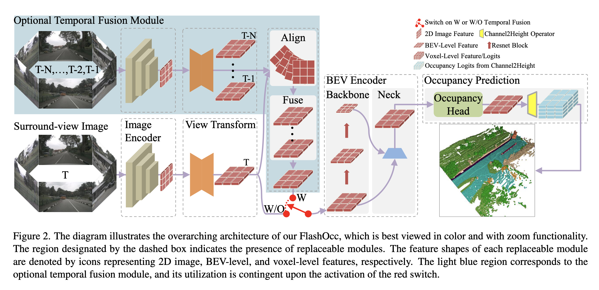

# FlashOCC 论文总结

## 动机

FlashOCC的核心动机是解决自动驾驶中3D占用预测的计算效率和内存瓶颈，同时保持精度。

**基于体素级的3D占用预测（Voxel-level 3D Occupancy prediction）**，将空间划分为稠密的体素网格，如OCC3D、RenderOCC等。依赖3D卷积提取特征，导致**计算复杂度和内存消耗极高**。

**基于BEV特征的3D场景预测（BEV-based 3D Scene Perception）**，利用向量去表示BEV网格上的整个柱空间的特征，与基于体素的预测相比，降低了高度维度的特征表示，从而避免了3D卷积的需要，对部署更友好。然而，**基于BEV级的特征可以隐式地捕获高度信**，并已经在非均匀道路和悬空障碍物目标等领域被验证过，这提示我们可以使用BEV级的特征去进行有效率的占用预测。

**高效的亚像素范式（Sub-pixel Paradigm）**：亚像素卷积层首先在超分网络中被使用，与转置卷积相比，能够以很少的额外计算成本将低分辨率数据超分辨率地分解到高分辨率空间。我们提出，**通道到高度变换（Channel-to-Height transformation ）**是一种有效的占用预测方法，其中占用的logit通过通道到高度的变换，从拍平的BEV特征直接变形得到。通过只使用BEV级特征，完全避免了3D卷积的使用。

## 关键点

FlashOCC 可以被分为五个基本模块

### 图像编码器（Image Encoder）

图像编码器负责从多个相机的图像中提取图像特征。

### 视图转换模块（View Transformer）

视角转换模块用于将2D的感知图像特征映射到3D-BEV特征

Flashocc 使用改进LSS的BEVPool 作为视图转换器。

### BEV编码器（BEV Encoder）

BEV编码器负责处理BEV特征信息，类似于图像编码器。通过BEV编码器增强由视图转换模块获得的粗糙BEV特征，得到更详细3D特征表示，并缓解LSS的中心特征消失问题。

### 占用预测模块（Occupancy Prediction Module）

占用预测模块用来预测每个体素的语义信息。

占用头由多层卷积网络或复杂的多尺度特征融合模块组成。多尺度融合具有更优的全局感受野，同时提供对局部细节更精细的表征。

由占用头产生的BEV特征通过通道到高度模块（Channel-to-Height module）传递。该模块沿通道维度执行简单的变形炒作，将BEV特征从$B \times C \times W \times H$的形状转换为$B \times C^* \times Z \times W \times H$的占用logits，其中$C=C^* \times Z$, $W$,$H$, $Z$分别代表 $x$,$y$,$z$维度在3D空间对应的数量。

### 时序融合模块（Temporal Fusion Module）

时序融合模块被设计为去集成历史帧的信息，去提升性能

## 参考资料

* 
