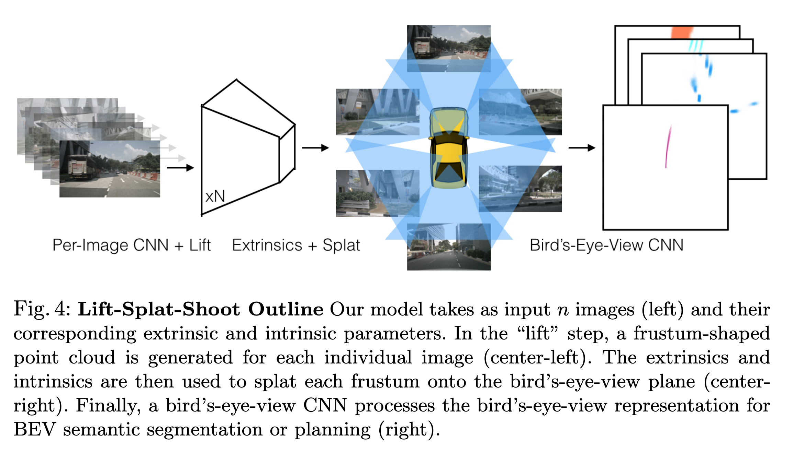
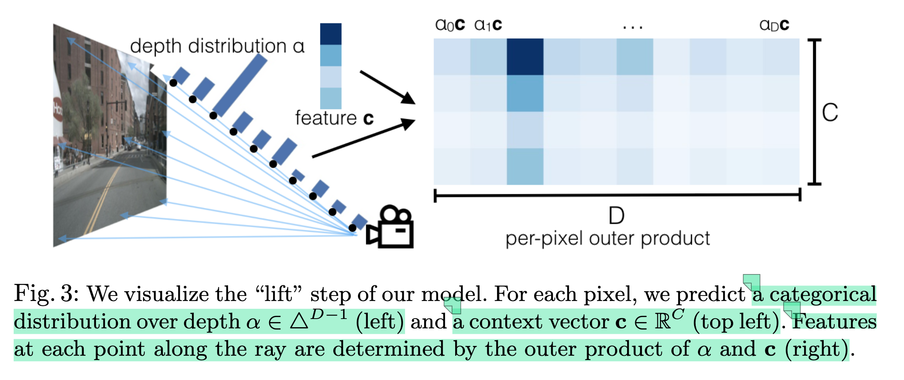

# LSS 论文总结

## 背景

在自动驾驶或者机器人领域，需要从摄像头获取的二维图像中提取三维信息，特别是从任意配置的摄像头中获取三维信息。从二维图像中的点映射回3D空间中，即反投影过程（back-projection）,其核心是通过相机内参和外参建立几何映射关系。

反投影得到的是从相机光心出发经过图像点的射线，*而非唯一的3D坐标*。需要依赖深度值z，去计算具体的3D位置坐标。

> 视觉BEV感知的核心在于将透视视图下的图像信息变换到BEV视图。这是一个理论上的病态问题，因为一个图像像素会对应3D空间中的多个位置。这种一对多的歧义性是因为我们不知道像素在3D空间中对应的高度或者深度。这二者知其一（下图中的Oy或者Oz），我们就可以通过相机的内外参矩阵将图像的每一个像素都变换到3D空间。
>
> 因此，**图像到BEV的视图转换也大致有两种思路：一种假设高度（Oy）已知，一种假设深度（Oz）已知**。
>
> 前者的典型思路是假设目标位于路面，因此高度为0，这样就可以采用Homography变换将图像转换到BEV视图，比如**BEV-IPM**。在实际应用中，路面并非绝对平坦，而且除了车道线以外，其他的目标都有一定的高度。在这些情况下，高度已知的假设并不成立，变换后的图像误差也很大。因此，反变换的方法在BEV感知中采用的相对较少。
>
> 后者通常会依赖于主动传感器直接获得深度信息（比如激光雷达）或者从图像中通过显式或者隐式的方式获得深度信息。

### 视觉转换方案

#### 3D to 2D

* 原理：通过将3D点投影回2D空间，去索引3D点对应的2D空间中的特征，从而构建BEV特征。

* 主要问题，射线上（不同深度）的多个3D点会击中相同的2D像素。
* 解决思路：根据3D到2D的投影，索引（index）/采样图像局部特征。
* 典型方案：DETR3D，PETR、BEVFormer等

#### 2D to 3D

* 原理：直接将2D特征投影到3D空间中，去构建BEV特征。

* 主要问题：由于深度未知，无法从图像坐标系（2D）转换到相机坐标系（3D）。
* 解决思路：估计并预测深度
* 典型方案：LSS、BEVDet、BevDepth、BEVFusion等

### 概述

LSS(Lift-Splat-Shoot) 范式的本质是三步：第一步，通过2D特征和每个像素的深度估计，形成2.5D的**相机（camera）坐标系**的视锥点云/视锥特征；第二步，通过相机内外参，将视锥点云从相机坐标系转换到**自车（ego）坐标系**，形成3D空间的**稠密点云**；第三步，构建**体素空间**（点云空间的稀疏化表示），通过`voxel_pooling`对同一网格的所有点云进行求和池化，形成BEV特征。

具体论文中， Lift 对应第一步，Splat 包含第二步和第三步， 而Shoot，表示在BEV特征图上执行下游任务。

## 关键点

### Lift(提升，估计潜在深度分布)

Lift的作用是将单目（monocular）图像的2D特征提升到3D空间，生成视锥点云（Frustum Point Cloud）

融合多个单目相机的难度在于，需要依赖深度信息才能将像素投影到参考坐标系（自车/世界坐标系），但是对于二维图像每个像素的“深度”本质上是模糊的。

#### 执行步骤

* 生成视锥坐标云

  

  Lift，为每个像素添加depth信息时，通过为**每个像素估计一个深度分布（每个像素在不同深度的概率）**，*用离散深度采样代替显示深度预测，避免误差累计*，将2D的图像的点“提升”到假设的3D空间中的点云。生成的3D点云包含所有可能的三维坐标分布，三维坐标的深度分布通过BEV空间的具体的监督任务进行学习。

  第一步，根据图像特征大小和深度大小生成**基于图像坐标系**的视锥点frustum_point: (B,D,H,W,3)，

  第二步，利用相机内外参，将视锥点由图像坐标系转换到自车（ego）坐标系，得到最终的视锥体点云frustum_point: (B,D,H,W,3)。 

  ```python
  def create_frustum(self):
    	"""
    	创建基于图像坐标系的特征图视锥点云，锥点（特征图上的点）到原图的映射关系。
    	
    	"""
      # make grid in image plane
      ogfH, ogfW = self.data_aug_conf['final_dim']  # 128, 352
      fH, fW = ogfH // self.downsample, ogfW // self.downsample  # 特征图尺寸 8=128/16, 22=352/16
      # self.grid_conf['dbound'] = [4, 45, 1] 表示原图在深度方向上的范围，4m~45m，间隔为1m
      
      # 构建点云网格
      # ds -> (41,8,22)
      ds = torch.arange(*self.grid_conf['dbound'], dtype=torch.float).view(-1, 1, 1).expand(-1, fH, fW) 
      D, _, _ = ds.shape  # 41
      xs = torch.linspace(0, ogfW - 1, fW, dtype=torch.float).view(1, 1, fW).expand(D, fH, fW) # (41,8,22)
      ys = torch.linspace(0, ogfH - 1, fH, dtype=torch.float).view(1, fH, 1).expand(D, fH, fW) # (41,8,22)
  
      # D x H x W x 3
      # frustum ->（D,H,W,3）特征点在原图的的映射, frustum[i,j,k] 表示特征图上(i,j)位置，对应深度为k的锥点在原图的坐标
      frustum = torch.stack((xs, ys, ds), -1)
      return nn.Parameter(frustum, requires_grad=False)
  
  def get_geometry(self, rots, trans, intrins, post_rots, post_trans):
      """
      计算视锥点云中的点在自车坐标系中坐标(x,y,z) 
      视锥点云从图像坐标系转换到自车坐标系（ego）。
      rots: [4,6,3,3] 
      trans: [4,6,3] 
      intrins: [4,6,3,3]
      post_rots: [4,6,3,3]
      post_trans: [4,6,3] 
      """
      B, N, _ = trans.shape  # batch_size, num_camera
  
      # undo post-transformation
      # 抵消数据增强及预处理对像素的变化，
      # B x N x D x H x W x 3
      points = self.frustum - post_trans.view(B, N, 1, 1, 1, 3)
      points = torch.inverse(post_rots).view(B, N, 1, 1, 1, 3, 3).matmul(points.unsqueeze(-1))
  
      # 相机坐标系转换到自车坐标系
      # 反归一化：图像坐标系 -> 相机坐标系
      points = torch.cat((points[:, :, :, :, :, :2] * points[:, :, :, :, :, 2:3],
                          points[:, :, :, :, :, 2:3]), 5)
      # 相机坐标系 -> 自车坐标系
      combine = rots.matmul(torch.inverse(intrins))
      points = combine.view(B, N, 1, 1, 1, 3, 3).matmul(points).squeeze(-1)
      points += trans.view(B, N, 1, 1, 1, 3)
  
      return points
  ```

* 构建视锥/图像特征点

  通过特征外积构建视锥特征，对于每个像素的深度特征（depth_feature: (B, D, H, W)）和语义特征（img_feature: (B, C, H, W)）通过**外积**操作， 生成每个深度对应的3D特征，构造视锥特征(frustum_feature: (B, C, D, H, W))。
  
  

​		第一步，输入图像分别提取特征图每个位置对应的深度方向概率分布特征和语义特征 (x_feature: (B, D+C, H, W), D表示离散深度的维度，C表示每个位置语义特征的维度)。

​		第二步，对估计出来的离散深度特征(B, D, H, W)，执行softmax操作，计算深度方向的概率密度，得到深度概率密度特征（B, D, H, W）。

​		第三步，利用深度概率密度特征(B, D, H, W)和语义特征(B, C, H, W)，执行外积操作，构建视锥特征点（B, D, H, W, C）

```python
def get_depth_dist(self, x, eps=1e-20):
  """
  对深度维执行softmax，得到每个像素不同深度的概率
  """
		return x.softmax(dim=1)

def get_depth_feat(self, x):
    """
    x:(bs*N,3,8,22) 
    """
    # efficientnet提取得到的特征 
    x = self.eff_feat(x) # (bs*N,512,8,22) 
    # 获取特征点深度方向的概率密度
    x = self.depthnet(x)  # 1x1卷积变换维度  x: (4*6,105(C+D),8,22) C->64, D->41
    depth = self.get_depth_dist(x[:, :self.D])  # softmax  depth: （4*6,41,8,22）
    # 获取特征点的语义特征
    feature = x[:, self.D:(self.D + self.C)]  # （4*6,64,8,22）
    # 构建图像特征点云，概率密度与语义特征做外积
    new_x = depth.unsqueeze(1) * feature.unsqueeze(2)  #（4*6,64,41,8,22）
    return depth, new_x
  
def camencode(self, x):
  """
  """
  depth, x = self.get_depth_feat(x) 
  return x
  
def get_cam_feats(self, x):
    """Return B x N x D x H/downsample x W/downsample x C
    """
    B, N, C, imH, imW = x.shape  # B: 4  N: 6  C: 3  imH: 128  imW: 352
    x = x.view(B*N, C, imH, imW) 
    x = self.camencode(x) # （4*64,64,41,8,22）
    x = x.view(B, N, self.camC, self.D, imH//self.downsample, imW//self.downsample)  # x:(4,6,64,41,8,22)
    x = x.permute(0, 1, 3, 4, 5, 2)  # x: (4,6,41,8,22,64)
    return x
```

### Splat(拍扁/Pillar Pooling)

Splat，将多个相机通过Lift中“提升”得到的3D点云投影到统一的BEV空间，生成BEV特征（俯视图特征）。

Pillar Pooing 中的“柱”是有无限高度的体素网格，分配每个点云到最近的“柱”，然后执行加和池化去构建BEV特征（bev_feature: (B,C,H,W)）。

```python
grid_conf = {
        'xbound': [-50.0, 50.0, 0.5],  # 体素网格 x 轴的网格范围和间距, 单位为m
        'ybound': [-50.0, 50.0, 0.5],  # 体素网格 x 轴的网格范围和间距, 单位为m 
        'zbound': [-10.0, 10.0, 20.0], # 体素网格 z 轴的网格范围和间距, 单位为m
        'dbound': [4.0, 45.0, 1.0],  # 视锥点云深度方向的网格范围和间距, 单位为m
    }


def gen_dx_bx(xbound, ybound, zbound):
  	"""
  	获得体素网格参数
  	BEV感知范围： x轴(-50m, 50m), 体素大小为0.5m; y轴(-50m, 50m), 体素大小为0.5m; z轴(-10m, 10m), 体素大小为20m
  	BEV网格尺寸： (200, 200, 1)
  	"""
    # x,y,z方向的网格间距 (0.5, 0.5, 20.0)
    dx = torch.Tensor([row[2] for row in [xbound, ybound, zbound]]) 
    # x,y,z方向的第一个体素网格的中心点坐标 （-49.75, -49.75, 0）
    bx = torch.Tensor([row[0] + row[2]/2.0 for row in [xbound, ybound, zbound]])
    # x,y,z方向的第一个体素网格的中心点坐标 （200, 200, 1）
    nx = torch.LongTensor([(row[1] - row[0]) / row[2] for row in [xbound, ybound, zbound]])

    return dx, bx, nx


def voxel_pooling(self, geom_feats, x):
  	"""
  	geom_feats: (4 x 6 x 41 x 8 x 22 x 3)
    x: (4 x 6 x 41 x 8 x 22 x 64)
  	"""
    B, N, D, H, W, C = x.shape
    Nprime = B*N*D*H*W

    # flatten x
    # 将所有相机的特征点展平
    x = x.reshape(Nprime, C) # (B*N*D*H*W, 4)

    # flatten indices
    # 空间坐标 -> 体素坐标， 将ego坐标系的视锥点空间坐标转换到体素网格坐标，并取整。
    geom_feats = ((geom_feats - (self.bx - self.dx/2.)) / self.dx).long() # (4,6,41,8,22,3)
    # 将体素网格坐标点展平
    geom_feats = geom_feats.view(Nprime, 3) # (B*N*D*H*W, 3)
    # 计算体坐标点每个点对应的batch索引
    batch_ix = torch.cat([torch.full([Nprime//B, 1], ix,
                         device=x.device, dtype=torch.long) for ix in range(B)]) # # (B*N*D*H*W, 1)
    geom_feats = torch.cat((geom_feats, batch_ix), 1)  # (B*N*D*H*W, 3)

    # filter out points that are outside box
    # 获取网格尺寸边界内的有效点，过滤边界之外的点 [0:200, 0:200, 0:1]
    kept = (geom_feats[:, 0] >= 0) & (geom_feats[:, 0] < self.nx[0])\
        & (geom_feats[:, 1] >= 0) & (geom_feats[:, 1] < self.nx[1])\
        & (geom_feats[:, 2] >= 0) & (geom_feats[:, 2] < self.nx[2])
    x = x[kept]
    geom_feats = geom_feats[kept]

    # get tensors from the same voxel next to each other
    # 多维索引编码，将多维索引映射到一维，计算每个点的rank值，不同位置，不同批次的的体素点有唯一的索引表示。
    # index = x1 * (D2 * D3 * ... * DN) + x2 * (D3 * ... * DN) + ... + xN-1 * DN +xN
    # 具体：先按x索引从小到大；在x相同的情况下，按y索引从小到大；在x,y相同的情况下，按z索引从小到大 ；在x,y,z相同的情况下，按批次索引从小到大。从而保证，排序后每个体素内点都连续排列
    ranks = geom_feats[:, 0] * (self.nx[1] * self.nx[2] * B)\
        + geom_feats[:, 1] * (self.nx[2] * B)\
        + geom_feats[:, 2] * B\
        + geom_feats[:, 3]
    # 属于同一体素的所有点连续排列，以便后续高效聚合
    sorts = ranks.argsort() # （B*N*D*H*W, 1）
    x, geom_feats, ranks = x[sorts], geom_feats[sorts], ranks[sorts] 

    # cumsum trick
    # 执行voxel pooling，每个批次内的每个体素网格内的的点执行累计求和
 		# x -> (B*C*nx[2]*nx[1]*nx[0], 64)
  	# geom_feats -> (B*C*nx[2]*nx[1]*nx[0], 4)
    if not self.use_quickcumsum:
        x, geom_feats = cumsum_trick(x, geom_feats, ranks)
    else:
        x, geom_feats = QuickCumsum.apply(x, geom_feats, ranks) 

    # griddify (B x C x Z x X x Y)
    # 将聚合后的特征值放入对应的体素位置
    final = torch.zeros((B, C, self.nx[2], self.nx[0], self.nx[1]), device=x.device)
    final[geom_feats[:, 3], :, geom_feats[:, 2], geom_feats[:, 0], geom_feats[:, 1]] = x

    # collapse Z
    # 将3D网格压缩z维度（深度），得到2.5DBEV特征表示（其中0.5D表示z轴的高度信息被编码到通道维度）
    # 沿着Z轴解绑，然后在通道维度拼接，从而将z轴的深度信息，编码到通道维度中
    final = torch.cat(final.unbind(dim=2), 1)  # (B,C*Z,X,Y)

    return final

def get_voxels(self, x, rots, trans, intrins, post_rots, post_trans):
  	"""
  	获取BEV特征
  	x: (4,6,3, 128,352) # B, N, C, imH, imW
  	rots: (4,6,3,3) cam2lidar-外参旋转矩阵
    trans: (4,6,3) cam2lidar-外参平移矩阵
    intrins: (4,6,3,3) # 相机内参
    post_rots: (4,6,3,3) # 预处理/图像增强旋转矩阵
    post_trans: (4,6,3) # 预处理/图像增强平移矩阵
  	"""
  	# 构建视锥点云，获取像素坐标到自车中坐标的映射关系
		geom = self.get_geometry(rots, trans, intrins, post_rots, post_trans)  # (4 x 6 x 41 x 8 x 22 x 3)
    # 提取图像特征并预测深度编码
    x = self.get_cam_feats(x)  # (4 x 6 x 41 x 8 x 22 x 64)
    # 获取BEV特征
		x = self.voxel_pooling(geom, x)  # （4 x 200 x 200)
    return x
```

#### 执行步骤

* 融合不同摄像头点云

  融合不同摄像头的点云信息，生成一个稠密的三维表示

* 体素池化（voxel pooling）  
  * 构建固定大小的体素/网格空间，为每个点分配网格索引
  * 累计池化，通过网格索引聚合特征。

### Shoot(预测)

Shoot，在BEV特征图上执行下游任务，如OCC、3D-OD或轨迹预测等。

#### 执行步骤

* BEV特征编码
* 任务头设计

## 参考资料

* [LSS论文与代码详解-掘金](https://juejin.cn/post/7385375139305668627)
* https://zhuanlan.zhihu.com/p/567926611
* https://zhuanlan.zhihu.com/p/668846159
* https://zhuanlan.zhihu.com/p/6144337348

* https://jordicenzano.name/front-test/2d-3d-paradigm-overview-2011/camera-model/
* https://zhuanlan.zhihu.com/p/654311603?utm_id=0
* https://developer.d-robotics.cc/forumDetail/143772473308124163

