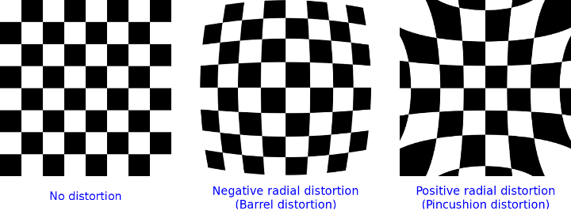
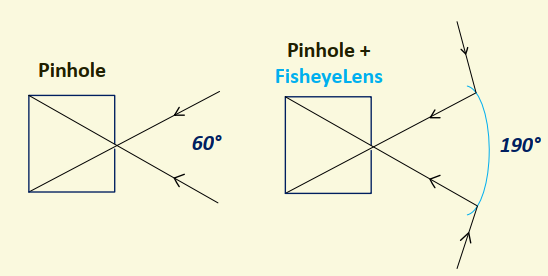

# 环视鱼眼感知

## 简述

### 环视感知系统

环视鱼眼系统用于近距离（near-filed）感知。如下图所示，一个典型的自动驾驶环视感知系统，包含位于自车前后左右的的四个鱼眼摄像头组成。每个用于近距离感知的鱼眼相机的视野范围均超过180度，使得由四个鱼眼相机组成的系统足够去覆盖车辆周围180度的区域。

## 相机模型

在实际中，由于制造精度、镜头曲面和装配偏差等原因，导致图像产生畸变。主要表现为径向畸变（radial distortion）和切向畸变（tangential distortion）两种。

鱼眼相机具有较大的径向畸变，感知系统必须要考虑这种相机系统固有的图像畸变。

### 径向畸变

径向畸变指的是沿着透镜半径方向分布的畸变，原因是远离透镜中心的区域比透镜中心光线更弯曲，表现为成像时直线会变弯曲。

径向畸变模型

$$\begin{aligned}
x'= x(1+k_1r^2+k_2r^4+k_3r^6) \\
y'= y(1+k_1r^2+k_2r^4+k_3r^6) \\
\end{aligned}$$

其中，$r$表示原始点到中心点的距离；$x'$和$y'$分别表示畸变后的距离；$k_1$、$k_2$、$k_3$表示畸变系数

### 切向畸变

切向畸变是指装备时透镜平面与传感器成像平面不平行造成的畸变。切向畸变主要表现为图像的倾斜或偏移。

切向畸变模型

$$\begin{aligned}
x'= x+[2p_1xy+p_2(r^2+2x^2)] \\
y'= y+[2p_1(r^2+2y^2)+2p_2xy]\\
\end{aligned}$$

其中，$(x,y)$是原始坐标；$(x',y')$是切向畸变后的坐标；$p_1$和$p_2$是切向畸变系数；$r$表示原始点到中心点的距离。

### opencv 实现

Opencv 针对普通相机和鱼眼相机使用了两种畸变模型。

* 普通相机模型

  普通相机模型，利用径向畸变参数和切向畸变参数构建相机模型，对应的畸变参数和排雷顺序为$(k_1,k_2,p_1,p_2[,k3[k_4,k_5,k6]])$，

  其中，$k_1, k_2,k_3,k_4,k_5,k_6$为径向畸变参数，$p_1,p_2$为切向畸变参数。

  * 标定接口

    `cv::calibrateCamera`

  * 去畸变接口

    `cv::undistort`

* 鱼眼相机模型

  鱼眼模型，基于**Kannala-Brandt**模型，直接利用角度$\theta$计算从相机坐标到虚拟投影球面的坐标。

  鱼眼畸变模型如下

  假设**相机坐标系**中点P的坐标为$(x,y,z)$，根据小孔投影(pinhole projection)原理，可以得到点P在**成像平面**的无畸变投影点坐标$(a,b)$

  其中小孔相机模型的投影公式如下

  $$\begin{aligned}
  a=\frac{x}{z}，b=\frac{y}{z}
  \end{aligned}$$

  容易得到，点$(a,b)$到光轴的距离$r$，公式如下

  $$r^2=a^2+b^2$$

  进一步可以得到投影角度$\theta$，此为非畸变的投影角度，公式如下

  $$\theta=arctan(r)$$

  鱼眼畸变会引入非线形的投影角度，其中畸变角度$\theta_d$用一个多项式来描述，得到**鱼眼畸变模型**如下

  $$\theta_d=\theta(1+k_1\theta^2+k_2\theta^4+k_3^theta^6+k_4\theta^8)$$

  **其中$\theta$表示无畸变的投影角度；$k_1,k_2,k_3,k_4$表示鱼眼径向畸变系数，描述鱼眼镜头的畸变程度。**

  **成像平面畸变后的投影点坐标**$(x'，y')$通过畸变角度$\theta_d$进行缩放得到

  $$\begin{aligned}
  x'=\left(\frac{\theta_d}{r}\right)a，b=\left(\frac{\theta_d}{r}\right){b}
  \end{aligned}$$

  最后，将畸变后的坐标$(x'y')$转换到**图像坐标系**的像素坐标$(u,v)$,公式如下

  $$\begin{aligned}
  u=f_xx'+c_x \\
  y'= f_yy'+c_y\\
  \end{aligned}$$

  其中$f_x,f_y$表示水平方向和垂直方向的焦距；$c_x,c_y$表示主点坐标，表示图像的中心位置。

  * 标定接口

    `fisheye::calibrate`

  * 去畸变接口

    `cv::fisheye::undistortImage`

    `cv::fisheye::undistortPoints`

## 鱼眼成像原理

理论上，针孔相机视场角FOV(Field-Of-View)是180度，但是由于孔径大小和成像尺寸的限制，普通针孔相机的视角一般很难超过80度。**鱼眼透镜，由于折射(refaraction)，视场角可以大幅增加到190度**，如上图所示。

鱼眼相机的优势带来的副作用就是，鱼眼相机相比其他针孔相机具有较大的径向畸变，这对感知任务会造成很大挑战。

## 参考资料

* Surround-view Fisheye Camera Perception for Automated Driving: Overview, Survey & Challenges
* https://docs.opencv.org/4.x/d9/d0c/group__calib3d.html
* https://docs.opencv.org/4.x/db/d58/group__calib3d__fisheye.html#ga167df4b00a6fd55287ba829fbf9913b9

* https://blog.csdn.net/qq_25458977/article/details/109991695