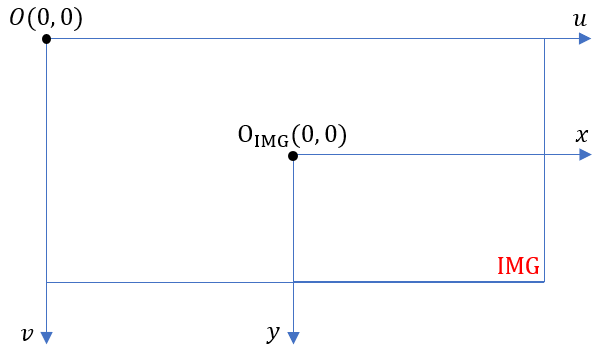

# 视觉系统常见坐标系及其相互转换公式

在视觉系统中，经常涉及不同坐标系之间的相互转化 。这些坐标系用于表示不同的参考系。

按照坐标系的维度可以分为2D坐标系和3D坐标系两种。

按照参考系的不同可以分为像素坐标系(pixel coordinate)、图像坐标系(image coordinate)、相机坐标系(camera coordinate)、自车坐标系(vehicle/Egocentric coordinate)、世界坐标系坐标系(world/global coordinate)等。每种坐标系之间可以通过齐次坐标转换公式来完成。

不同坐标系的转换需要依赖相机的内参（intrinsic parameter）和相机外参（extrinsic parameter）矩阵来完成。相机的内参和外参分别定义了相机的内部属性和相对于外部世界的空间位置。。

本文主要总结不同坐标系的概念、应用及相互转换公式。

## 坐标系概念

### 像素坐标系

像素(Pixel)坐标系是图像处理中最基本的坐标系，使用像素坐标来来表示图像中每个像素点的位置，是**2D**坐标系。与图像处理的坐标系一致。

像素坐标系的坐标用$(u,v)$表示，坐标原点$O(0,0)$位于图像的左上角，像素坐标用整数表示。

$u$轴正方向水平水平向右；$v$轴正方向垂直向下。；

### 图像坐标系(ICS)

图像坐标系(Image Coordinate System,  ICS)用来描述像素点的物理位置，**2D**坐标系。图像坐标系使用物理单位（如毫米）而不是像素单位，。

图像坐标系的坐标用$(x，y)$表示，坐标原点$O_{img}(0,0)$位于图像中心。

$x$轴正方向水平水平向右；$y$轴正方向垂直向下。

*图像坐标系通过相机内参矩阵与像素坐标系产生联系*。

### 相机坐标系(CCS)

相机坐标系(Camera Coordinate System, CCS)用来表示相机成像时物体相对于相机的位置，用来描述相机看到的三维世界，是**3D**坐标系。

相机坐标系的坐标用$(x_c, y_c,z_c)$表示，坐标原点位于相机光心。

$x_c$轴朝相机右侧；$y_c$轴相机下方；$z_c$轴朝相机的光轴方向。

*相机坐标系通过相机的内外参与其他坐标系产生联系*。

### 自车坐标系(VCS)

自车(Ego)坐标系(Vehicle Coordinate Systme, VCS)是以车辆为参考体建立的坐标系，用于描述物体相对于车辆的的空间位置，是**3D**坐标系。

自车坐标系的原点为车辆的中心点或者后轴中心点，与车辆的运动方向相关。

$x$轴指向车辆的前进方向；$y$轴垂直与车辆前进方向，指向车辆的左侧；$z$轴垂直于地面，朝上。

### 世界坐标系(WCS)

世界坐标系(World Coordinate System, WCS)是一个全局的、统一的参考坐标系，用来描述车辆在地图或整个环境中的绝对位置和方向，是**3D**坐标系。

世界坐标系的坐标用$(x_w, y_w,z_w)$表示，通常以一个固定的参考点作为原点。

$x$轴、$y$轴和$z$轴分别表示世界的左、前和上。

### 相机内参

相机内参用于描述相机内部的几何和光学属性。*相机内参用于将相机坐标系的三维点投影到相机的二维图像平面*。

**内参矩阵（intrinsic matrix）**表示如下

$$K_1 = \begin{bmatrix} f_x & 0 & c_x \\ 0 & f_y & c_y \\ 0 & 0 & 1 \end{bmatrix}$$

其中，$f_x$和$f_y$分别表示相机在$x$轴和$y$轴方向的焦距，在数字图像中以像素为单位表示；$c_x$和$c_y$表示主点（图像中心）的坐标，

### 相机外参

相机外参用于描述相机相对于世界坐标系的位置和方向，即描述相机在三维空间中的位姿（位置和方向）。*相机外参用于将世界坐标系的点转换到相机坐标系*。

**外参矩阵（extrinsic matrix）**由旋转矩阵$R$和平移矩阵$T$组成，表示如下

$$K_2 = \begin{bmatrix} R_{3\times3} & T_{3\times1} \\ 0_{1\times3} & 1  \end{bmatrix} =\begin{bmatrix} r_{11} & r_{12} & r_{13} & t_x \\ r_{21} & r_{22} & r_{23} & t_y \\ r_{31} & r_{32} & r_{33} & t_z \\ 0 & 0 & 0 & 1\end{bmatrix}$$

其中$R$是一个$3\times3$的矩阵，用于表示相机坐标系相对于世界坐标系的**旋转关系**；T是一个$3\times1$的矩阵，用于表示相机坐标系相对于世界坐标系的平移关系。

## 坐标系转换公式

不同坐标系之间的相互变换涉及到相机内外参矩阵、投影变换和几何变换等。变换公式具体如下

### **图像坐标系 → 像素坐标系**

图像坐标系和像素坐标系都在成像平面上，只是由于各自的原点和度量单位不同。

图像坐标系的原点位于图像平面的中心，单位是mm，是物理单位。而像素坐标系的原点一般位于图像左上角，单位是像素（pixel）。因此，图像坐标系和像素坐标系之间的点之间，相差了一个*缩放变换*和*平移变换*。如下图

图像坐标系和像素坐标系都属于**2D坐标系**，因此图像坐标系到像素坐标系的转换属于**仿射变换**。

假设$dx$和$dy$ 分别表示每行和每列中，每毫米对应多少像素，单位为pixle/mm。 图像图像坐标系的原点$$\Omicron_{img}$$在像素坐标系中对应的的位置为$(u_0,v_0)$。

图像坐标系中的点$(x,y)$，可以通过一个$3\times 3$的矩阵转换到像素坐标系中的点$(u,v)$。公式如下

$$\begin{bmatrix} u \\ v \\ 1  \end{bmatrix} =\begin{bmatrix} \frac{1}{dx} & 0 & u_0 \\ 0 & \frac{1}{dy} & v_0 \\ 0 & 0 & 1 \end{bmatrix}\begin{bmatrix} x \\ y \\ 1  \end{bmatrix}$$

### 相机坐标系  → 图像坐标系

相机坐标系与图像坐标系通过*相机内参矩阵*进行转换。由于相机坐标系是**3D坐标系**，图像坐标系是**2D坐标系**，因此，相机坐标系到图像坐标系的转换属于**投影变换**。

利用相机内参矩阵$K_1$，图像坐标系中的点$(x_c,y_c,z_c)$可以转换到像素坐标系中的点$(x,y)$，公式如下。

$$\begin{bmatrix} x \\ y \\ 1  \end{bmatrix} =\frac{1}{z_c}K_1\begin{bmatrix} x_c \\ y_c \\ z_c  \end{bmatrix}$$

为了齐次表示，转换公式可以进一步表示为

$$\begin{bmatrix} x \\ y \\ 1  \end{bmatrix} =\frac{1}{z_c}\begin{bmatrix}K_1 & 0_{3\times1}\end{bmatrix}\begin{bmatrix} x_c \\ y_c \\ z_c \\ 1  \end{bmatrix}$$

### 自车坐标系  → 相机坐标系

略

### 世界坐标系  → 相机坐标系

世界坐标系与相机坐标系利用*相机外参矩阵*进行转换。由于世界坐标系与相机坐标系都属于**3D坐标系**，因此世界坐标系与相机坐标系的转换属于**投影变换**。

利用相机内参矩阵$K_2$，图像坐标系中的点$(x_w,y_w,z_w)$可以转换到相机坐标系中的点$(x_c,y_c,z_c)$，公式如下。

$$\begin{bmatrix} x_c \\ y_c \\ z_c \\ 1  \end{bmatrix} =K_2\begin{bmatrix} x_w \\ y_w \\ z_w \\ 1  \end{bmatrix}$$

### 世界坐标系  → 像素坐标系

综上，容易得到世界坐标系中的点$(x_w,y_w,z_w)$到像素坐标系的转换公式，公式如下

$$\begin{bmatrix} u \\ v \\ 1  \end{bmatrix} =\frac{1}{z_c}\begin{bmatrix} \frac{1}{dx} & 0 & u_0 \\ 0 & \frac{1}{dy} & v_0 \\ 0 & 0 & 1 \end{bmatrix}\begin{bmatrix}K_1 & 0_{3\times1}\end{bmatrix}K_2\begin{bmatrix} x_w \\ y_w \\ z_w \\ 1  \end{bmatrix}$$

### 像素坐标系  → 世界坐标系

略

## 参考资料

* https://blog.csdn.net/weixin_47691066/article/details/131991392
* https://zhuanlan.zhihu.com/p/453081175

