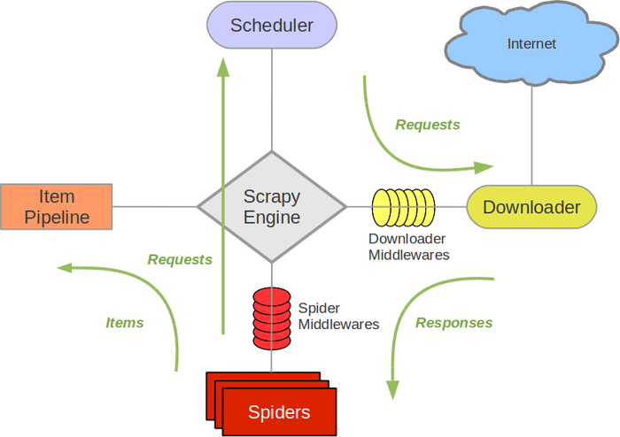
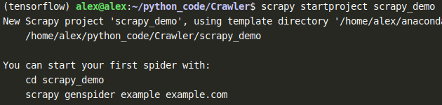
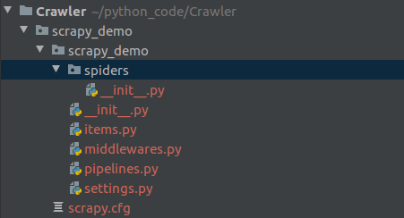

# scrapy 入门实践

## 概念

## scrapy 架构



## Scrapy项目实践

**主要分为四步**：

1. 创建一个Scrapy 项目
2. 定义提取的目标Item
3. 制作Spider并提取Item
4. 设计管道(pipleline)存储爬取到的内容

### 创建scrapy项目

执行scrapy  startproject 命令 创建一个名称为scrapy_demo的爬虫项目

```shell
scrapy startproject scrapy_demo
```



scrapy_demo项目的结构如下



```shell
scrapy_demo/
    scrapy_demo.cfg
    scrapy_demo/
        __init__.py
        items.py
        middleware.py
        pipelines.py
        settings.py
        spiders/
            __init__.py
            ...
```


## 参考资料

* [参考资料一——scrapy 官方文档](https://docs.scrapy.org/en/latest/)
* [参考资料二](https://scrapy-chs.readthedocs.io/zh_CN/latest/intro/tutorial.html "scrapy中文文档")
* [参考资料三](https://segmentfault.com/a/1190000013178839 "segmentfalut")
* [参考资料四——Xpath](https://www.w3school.com.cn/xpath/index.asp)
* [参考资料五](https://juejin.im/post/5af95280f265da0ba17ca1ba  "juejin")

