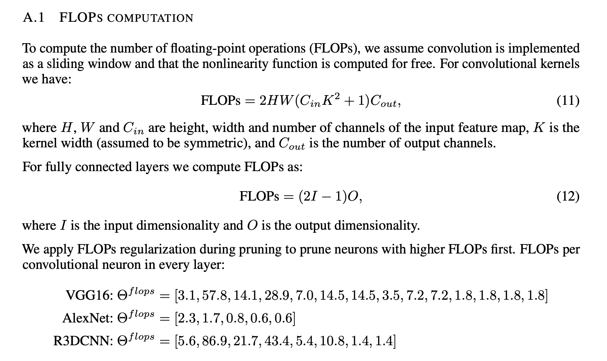

#  MACs  与 FLOPs 区别

## FLOPS 与 FLOPs 区别

* FLOPS: FLoating point Operations Per Second**
* FLOPs: FLoting OPerations

## FLOPs 与 MACs 区别

* MACs: Multiply-ACcumulate operation

$$FLOPs \approx  2 \times MACs$$

## 参考资料

* https://github.com/sovrasov/flops-counter.pytorch/issues/16
* https://github.com/sovrasov/flops-counter.pytorch
* https://github.com/Lyken17/pytorch-OpCounter

* [pruning convolutional neural networks for resource efficient inferenc](https://arxiv.org/pdf/1611.06440.pdf)

