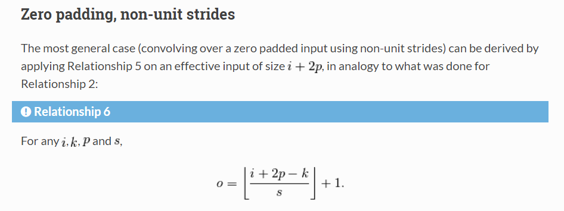
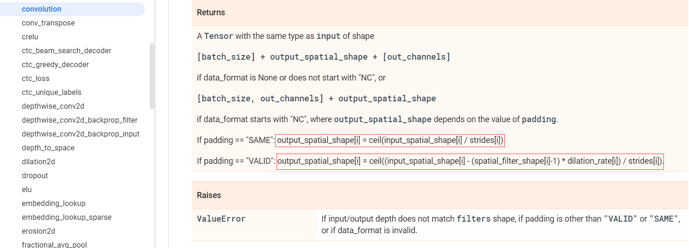

#  tensorflow中卷积层输出特征尺寸计算和padding参数解析

##  前置条件

### 离散卷积( discrete convolutions)

​		神经网络的基础是仿射变换：一个向量作为输入被接收，然后与一个矩阵相乘产生一个输出（通常在通过非线性传递结果之前加上一个偏置向量）。这适用于任何类型的输入，无论是图像、声音片段还是无序的特征集合：无论它们的维数是多少，它们的表示都可以在转换之前展平为向量。

​		图像、声音片段和许多其他类似类型的数据具有内在的结构。更正式地说，它们共享这些重要的属性：

*  它们存储为多维数组。
*  它们具有一个或多个排序重要的轴（例如，图像的宽度和高度轴，声音剪辑的时间轴）。
*  一个轴称为通道轴，用于访问数据的不同视图（例如，彩色图像的红色、绿色和蓝色通道，或立体声音轨的左声道和右声道）。

​       但是当应用仿射变换时，这些性质不会被利用；事实上，所有的轴都被以相同的方式处理，并且不考虑拓扑信息。但是，利用数据的隐式结构可能在解决计算机视觉问题或语音识别等问题时非常方便，在这些情况下，最好保留它。这就是离散卷积发挥作用的地方。

​		离散卷积是一种线性变换，它保留了排序的概念。它是稀疏的（只有少数输入单元对给定的输出单元有贡献）并且重用参数（相同的权重应用于输入中的多个位置）。

​		下面就是一个离散卷积的示例


​		左边图中，浅蓝色的网格称为输入的特征图(feature map), 阴影部分称为卷积核(kernel)或滤波器(filter),卷积核的形状如下：
$$
\left[
 \begin{matrix}
   0 & 1 & 2 \\
   2 & 2 & 0 \\
   0 & 1 & 2
  \end{matrix}
  \right] \tag{1}
$$
​        卷积核在输入特征图上沿着从左到右，从上到下的方式滑动。在每个位置，计算卷积核的每个元素与其重叠的输入元素之间的乘积，并将结果相加以获得当前位置的输出。这个过程的最终输出是一个称为输出特征映射（feature map）的矩阵(右边绿色矩阵)。

### 特征尺寸大小

​		在神经网络中，每一层的输入和输出称为**特征图(feature map)**或**特征(feature)**。卷积神经网络的设计和构建过程中，我们必须要知道网络中每一层的输入和输出的特征尺寸大小。对于二维卷积为例， 特征尺寸的形式为$[None, Height, Width, Channels]$， 依次代表批次大小，高度， 宽度和通道数。那么，我们如何准确计算输出特征尺寸的大小就成为一个关键的问题。

### 向下取整

- 概念

  对数字进行向下取整

* 数学符号
  $$
  \lfloor v \rfloor \tag{2}
  $$

* 接口函数

  ```python
  import numpy as np
  import tensorflow as tf
  
  np.floor()
  tf.floor()
  ```

* 示例

  ```python
  import numpy as np
  
  if __name__ == "__main__":
      f = int(np.floor(5 / 2))
      print(f)
  ```

* 结果

  ```
  2
  ```

### 向上取整

- 概念

  对数字进行向上取整

* 数学符号
  $$
  \lceil v \rceil \tag{3}
  $$

* 接口函数

  ```python
  import numpy as np
  import tensorflow as tf
  
  np.ceil()
  tf.ceil()
  ```

* 示例

  ```python
  import numpy as np
  
  if __name__ == "__main__":
      f = int(np.ceil(5 / 2))
      print(f)
  ```

* 结果

  ```
  3
  ```

### tf.pad

* 函数说明

```python
pad(tensor, paddings, mode="CONSTANT", name=None, constant_values=0)
```

​	    tf.pad 实现对输入的tensor进行扩展操作的， paddings控制各个维度扩展的大小，constant_values 表示填充的数值， 默认为0。

 * 示例

   ```python
   import tensorflow as tf
   
   if __name__ == "__main__":
   
       r0 = tf.random_uniform(shape=(2, 3))
   
       paddings = tf.constant([[1, 2], [2, 1]])
       # Pads a tensor
       result0 = tf.pad(tensor=r0, paddings=paddings, mode="CONSTANT")
   
       init = tf.global_variables_initializer()
       with tf.Session() as sess:
           sess.run(init)
           r0, result0 = sess.run([r0, result0])
           print(r0)
           print(result0)
   ```

   ​	这里paddings 中的第一项[1, 2]代表第一维的上下填充列数， 第一项[2, 1]代表第二维的左右填充列数

* 结果

  ```
  [[ 0.99163067  0.8513397   0.45607805]
   [ 0.76089442  0.25182366  0.58479083]]
  [[ 0.          0.          0.          0.          0.          0.        ]
   [ 0.          0.          0.99163067  0.8513397   0.45607805  0.        ]
   [ 0.          0.          0.76089442  0.25182366  0.58479083  0.        ]
   [ 0.          0.          0.          0.          0.          0.        ]
   [ 0.          0.          0.          0.          0.          0.        ]]
  ```

  


### 两种卷积填充模式

​	填充是在输入特征图的每一边添加适当数目的行和列，使得每个输入方块都能作为卷积窗口的中心。

​	下图表示 输入特征图大小$I=5$, 卷积核大小$K=3$，填充补丁大小$P=1$, 步幅$S=2$的卷积操作的过程


* 填充模式为VALID

  表示不使用填充，如果**滤波器(filter)**和**步幅(stride)**不能完全覆盖(cover)输入的特征图，卷积操作就会丢弃**右边**或者**下边**的单元格。（只使用有效的窗口位置  ）


* 填充模式为SAME

  表示使用填充，卷积操作将会在特征图对应维度的每一边均匀地填充一定的行或列。这里所以称为SAME, 是因为当步幅$S=1$时，卷积操作的输出特征图与输入特征图具有相同的形状。(如下图)

  


### requirement enviroment

* **software**: tensorflow==1.14.0

* **numpy**: numpy==1.16.4

* **hardware**: GTX 2060

  

------

## 特征尺寸计算

### 公式描述

​		关于输出特征尺寸的计算，我们常见的有如下两种计算公式:

  * 第一种公式
    $$
    O = \lfloor\frac{I + 2P - F}{S}\rfloor + 1 \tag{4}
    $$
    ·
    $$
    L\_P = R\_P = P = \lfloor\frac{K}{2}\rfloor \tag{5}
    $$
    

    式中 $I$代表输入(Input)维度的尺寸大小

    ​		 $P$输入维度补丁(Padding)的大小，这里是对半(half)补丁，因此$P$的值代表的是，当前维度一个方向上补丁的大 小，对应当前维度总的补丁大小为$2P$，理解这一点很重要。当`paddings='VALID'`时$P=0$

    ​		 $F$为滤波器(Filter)或卷积核的尺寸大小

    ​		$S$代表卷积操作的步长(Stride)

    ​		$L\_P$$和$$R\_ P$$分别代表当前维度两个方向上的补丁的大小

  * 第二种公式

    当 `paddings='VALID'`:

    ​	
    $$
    O = \lceil\frac{I-F + 1}{S}\rceil \tag{6}
    $$
    当 `paddings='SAME'`:
    $$
    O = \lceil\frac{I}{S}\rceil \tag{7}
    $$
    式中 $I$代表输入(Input)维度的尺寸大小

    ​       $F$为滤波器(Filter)或卷积核的尺寸大小

    ​	   $S$代表卷积操作的步长(Stride)

    padding的计算公式如下：

    ​	    这里首先计算当前维度总的padding大小$SUM\_ P$，再分别得到不同方向上的补丁的大小$L\_P$和$R\_P$，这里$SUM\_P$的计算参考工公式$(4)$, 用$SUM\_P$代替$2 P$进行推导，即可得到公式$(8.1)$。
    $$
    \begin{eqnarray*}
    & SUM\_P&= (O-1)\times S + F - I \tag{8.1} \\
    & L\_P &= \lfloor\frac{SUM\_P}{2}\rfloor \tag{8.2} \\
    & R\_P &= SUM\_P - L\_P \tag{8.3}
    \end{eqnarray*}
    $$
    式中$L\_P$和$R\_P$分别代表当前维度两个方向上的补丁的大小

    ​	 容易得出，如果要添加的padding 列的总数是偶数时，会均匀地左右填充；当如果要添加的padding 列的总数是奇数时，会将额外的列添加到右侧， 右侧会比左侧多一列零填充（同理对于垂直方向，底部会比上部多一行零填充）

### 公式解析

#### 公式出处

​        很多博客在介绍卷积层输出特征图大小的时候，都会引用上述两个公式中的一个或者同时引用。但是，往往都没有解释两种计算公式有什么区别，这导致了一些问题问题，这两个公式有什么差别，这两种公式的适用于什么情况。为了解决这个问题，我们必须首先知道，这两个公式分别出自哪里。

​		经过查找，最终分别找到了两个公式的来源：

   * 第一种计算公式来源于[theano框架教程](http://deeplearning.net/software/theano/tutorial/conv_arithmetic.html)

     


   * 第二种计算公式来源于[tensorflow框架教程](https://www.tensorflow.org/api_docs/python/tf/nn/convolution)

     注意：这里不考虑空洞卷积(dilation convolution)，因此$dilation\_rate=1$

     


> 为了便于描述，接下来的部分，分别用**theano公式**代替**第一种公式**关键词描述，**tensorflow公式**代替**第二种公式**关键词描述。

#### 公式区别

这里最明显的区别就是，对于**theano公式**来说，在SAME模式时需要首先计算补丁(padding)的大小， 再利用公式得到输出特征的尺寸。而对于**tensorflow公式**而言，不论时VALID模式，还是SAME模式，我们都不需要计算补丁(padding)大小，直接计算输出特征图尺寸大小。

这里我们会很困惑，通过这两种公式进行卷积操作，最后得到的输出特征结果是一样的么？经过计算，可以得到如下结论：

* **对于VALID 模式，应用两种计算公式进行卷积操作，得到的特征图尺寸大小和对应位置数值都相同**
* **对于SAME 模式，当卷积核大小为奇数(OOD)时，应用两种计算公式进行卷积操作，得到的特征图尺寸大小和对应位置数值都相同**
* **对于SAME 模式，当卷积核大小为偶数(EVEN)时，应用两种计算公式进行卷积操作，得到的特征图尺寸大小相同，但是特征图对应位置数值不相同，即最终得到的特征图并不相同。**

​        结论：**theano公式**适用于theano框架计算，当padding模式为VALID和padding模式为SAME且卷积核尺寸为奇数时，也适用于tensorflow 框架计算；同理，**tensorflow公式**适用于tensorflow框架计算，当padding模式为VALID和padding模式为SAME且卷积核尺寸为奇数时，也适用于theano框架计算。

​		接下来我们通过奇偶两种类型的卷积核尺寸，验证上述结论。

#### 公式验证

关于VALID模式和SAME模式的卷积操作的步骤如下：

**VALID模式**：直接利用卷积核平滑输入特征图，完成卷积操作

**SAME模式**： 大致可以分为两步，首先，进行padding操作，扩张输入特征图尺寸；然后再利用卷积核平滑扩张后的特征图，完成卷积操作

* 卷积核大小为奇数

  具体输入参数如下：

  * 输入特征图尺寸： $5\times5$，即 $I=5$

  * 卷积核大小： $3\times3$，即 $F=3$

  * 步幅大小：2，即 $S=2$

  **当padding为VALID模式：**

  **theano公式**
  $$
  \begin{eqnarray*}
   &L\_P=R\_P = P=0 \tag{9.1} \\
   &O=\lfloor\frac{(5-3+2\times0)}{2}\rfloor + 1 = 2 \tag{9.2}
  \end{eqnarray*}
  $$
  **tensorflow公式**
  $$
  \begin{eqnarray*}
   & O = \lceil\frac{(5-3 + 1）}{2}\rceil = 2 \tag{9.3} \\
   &L\_P=R\_P = SUM\_P = 0\tag{9.4}
  \end{eqnarray*}
  $$
  **当padding为SAME模式：**

  **theano公式**
  $$
  \begin{eqnarray*} &L\_P=R\_P = P=\lfloor\frac{3}{2}\rfloor=1 \tag{10.1} \\ 
  &O=\lfloor\frac{(5-3+2\times1)}{2}\rfloor + 1 = 3 \tag{10.2}
  \end{eqnarray*}
  $$
  **tensorflow公式**
  $$
  \begin{eqnarray*} 
  &O = \lceil\frac{5}{2}\rceil = 3 \tag{10.3} \\ 
  &SUM\_P = (3 - 1) \times 2 + 3 - 5 = 2 \tag{10.4} \\
  &L\_P= \lfloor\frac{2}{2}\rfloor=1 \tag{10.5} \\
  &R\_P=2-2=1 \tag{10.6}
  \end{eqnarray*}
  $$
  可以看出， 当卷积核大小为奇数时，**theano**和**tensorflow**两种公式在**SAME**和**VALID**两种模式的卷积操作的结果都相同

* 卷积核大小为偶数

  具体输入参数如下：

  * 输入特征图尺寸： $5\times5$，即 $I=5$

  * 卷积核大小： $4\times4$，即 $F=4$

  * 步幅大小：2，即 $S=2$

  **当padding为VALID模式：**

  **theano公式**
  $$
  \begin{eqnarray*}
   &L\_P=R\_P = P=0 \tag{11.1} \\
   &O=\lfloor\frac{(5-4+2\times0)}{2}\rfloor + 1 = 1 \tag{11.2}
  \end{eqnarray*}
  $$
  **tensorflow公式**
  $$
  \begin{eqnarray*}
   & O = \lceil\frac{(5-4 + 1）}{2}\rceil = 1 \tag{11.3} \\
   &L\_P=R\_P = SUM\_P = 0\tag{11.4}
  \end{eqnarray*}
  $$
  **当padding为SAME模式：**

  **theano公式**
  $$
  \begin{eqnarray*} &L\_P=R\_P = P=\lfloor\frac{4}{2}\rfloor=2 \tag{12.1} \\ 
  &O=\lfloor\frac{(5-4+2\times2)}{2}\rfloor + 1 = 3 \tag{12.2}
  \end{eqnarray*}
  $$
  **tensorflow公式**
  $$
  \begin{eqnarray*} &O = \lceil\frac{5}{2}\rceil = 3 \tag{12.3} \\ 
  &SUM\_P = (3 - 1) \times 2 + 4 - 5 = 3 \tag{12.4} \\
  &L\_P= \lfloor\frac{3}{2}\rfloor=1 \tag{12.5} \\
  &R\_P=3-1=2 \tag{12.6}\end{eqnarray*}
  $$
  可以看出， 当卷积核大小为偶数时，**theano**和**tensorflow**两种公式在**VALID**模式的卷积操作的结果相同， 但是在**SAME**模式下，由于特征图补丁操作对应的左右padding个数$L\_P$和$R\_P$不同，会导致最终的卷积操作的结果也不同。

## 基于tensorflow的自定义SAME模式实现和验证

​		为了验证上述的推断，接下来分别使用自定义的卷积操作方法，与调用tensorflow卷积操作接口的结果进行对比。对于VALID 模式，卷积操作过程是卷积核遵循从左到右，从上到下的的方向在输入特征图进行滑动， 如果剩余的尺寸不能够满足卷积核的尺寸和步幅要求，则采用丢弃策略，得到最终的卷积操作结果。由于VALID模式没有补丁(padding)操作，卷积操作的结果都相同。**这里使用SAME模式，通过对比自定义的卷积操作在SAME模式的结果与tensorflow接口的结果，进行验证**

​		这里再次说明SAME模式的操作步骤，主要分为两步：

1. 对输入特征图进行填充操作，得到扩张后的特征图

2. 对填充后的特征图进行VDLID模式进行卷积，得到卷积操作的输出特征图

   对应于公式解析中的卷积核大小为奇数和偶数两种情况，接下来也分别对两种情况进行验证。

* 配置参数如下

  ```python
  BATCH_SIZE = 6
  IMAGE_HEIGHT = 5
  IMAGE_WIDTH = 5
  CHANNELS = 3
  NUM_OUTPUTS = 6
  STRIDE = [1, 2, 2, 1]
  tf.random.set_random_seed(0)
  image_batch = tf.Variable(tf.random_uniform(shape=(BATCH_SIZE, IMAGE_HEIGHT, IMAGE_WIDTH, 3), minval=0, maxval=225,dtype=tf.float32))
  ```

  IMAGE_HEIGHT，IMAGE_WIDTH， CHANNELS表示输入特征的尺寸为$5\times 5 \times 3$,  

  STRIDE 表示卷积操作的步数为2

* padding 计算说明

  ```python
  # reference formula output_size = np.floor(input_size + num_padding - filter_size) / stride + 1
  # => num_padding  = (output_size - 1) * stride + filter_size - input_size
  # according to the padding rule of conv2d interface
  # => height_top = np.floor(num_padding / 2)
  # => height_bottom = num_padding - height_top
  # => width_left = np.floor(num_padding / 2)
  # => width_right = num_padding - width_left
  # => paddings = [[0, 0], [height_top, height_bottom], [width_left, width_right], [0, 0]]
  ```

### 卷积核为奇数

* 卷积核的大小为$F= 3$

```python
filters_3x3 = tf.Variable(initial_value=tf.random_uniform(shape=[3, 3, CHANNELS, NUM_OUTPUTS]))
```

* 使用tensorflow接口进行卷积操作

  SAME模式

  ```python
  output_same_3x3 = tf.nn.conv2d(input=image_batch, filter=filters_3x3, strides=STRIDE, padding='SAME', name='same_3x3')
  ```

  VALID 模式

  ```python
  output_valid_3x3 = tf.nn.conv2d(input=image_batch, filter=filters_3x3, strides=STRIDE, padding='VALID', name='valid_3x3')
  ```

* 自定义SAME操作

  首先进行padding操作

  ```python
  # custom SAME mode of convolution
  # step 1 add padding to extend the size of input shape
  # input_size = 5, filter_size = 3, stride = 2
  # => output_size = np.ceil(5 / 2) = 3
  # => num_padding = (3 -1) * 2 + 3 - 5 = 2
  # according to the padding rule (where the num_padding is even)
  # => height_top = np.floor(2 / 2) = 1
  # => height_bottom = 2 -1  = 1
  # => width_left = np.floor(2 / 2) = 1
  # => width_right = 2 - 1 = 1
  padding_batch_3x3  = tf.pad(tensor=image_batch, paddings=[[0, 0], [1, 1], [1, 1], [0, 0]])
  ```

  然后执行卷积操作

  ```python
  # step 2 execute convolution operation
  output_same_3x3_custom = tf.nn.conv2d(input=padding_batch_3x3, filter=filters_3x3, strides=STRIDE, padding='VALID', name='custom_same_3x3')
  ```

###  卷积核为偶数

* 卷积核的大小为$F= 4$

```python
filters_4x4 = tf.Variable(initial_value=tf.random_uniform(shape=[4, 4, CHANNELS, NUM_OUTPUTS]))
```

* 使用tensorflow接口进行卷积操作

  SAME模式

  ```python
  output_same_4x4 = tf.nn.conv2d(input=image_batch, filter=filters_4x4, strides=STRIDE, padding='SAME',name='same_4x4')
  ```

  VALID 模式

  ```python
  output_valid_4x4 = tf.nn.conv2d(input=image_batch, filter=filters_4x4, strides=STRIDE, padding='VALID', name='valid_4x4')
  ```

* 自定义SAME操作

  首先进行padding操作

  ```python
  # custom SAME mode of convolution
  # step 1 add padding to extend the size of input shape
  # input_size = 5, filter_size = 4, stride = 2
  # => output_size = np.ceil(5 / 2) = 3
  # => num_padding = (3 -1) * 2 + 4 - 5 = 3
  # according to the padding rule(where the num_padding is odd)
  # => height_top = np.floor(3 / 2) = 1
  # => height_bottom = 3 - 1 = 2
  # => width_left = np.floor(3 / 2) = 1
  # => width_right = 3 - 2  = 2
  padding_batch_4x4 = tf.pad(tensor=image_batch, paddings=[[0, 0], [1, 2], [1, 2], [0, 0]])
  ```

  然后执行卷积操作

  ```python
  # step 2 execute convolution operation
  output_same_4x4_custom = tf.nn.conv2d(input=padding_batch_4x4, filter=filters_4x4, strides=STRIDE, padding='VALID',name='custom_same_4x4')
  ```

### 自定义卷积操作接口

自定义SAME模式卷积操作分为以下四步：

1. 利用公式计算输出特征图的尺寸
2. 利用得到的输出特征图的尺寸和其他相关参数计算各个维度的padding大小
3. 执行填充操作
4. 执行卷积操作

```python
def conv2d_custom(input, filter=None, strides=None, padding=None, data_format="NHWC", name=None):
    """
    custom conv2d to evaluate padding operation
    :param input:
    :param filter:
    :param strides:
    :param padding:
    :param data_format:
    :param name:
    :return:
    """
    net = None
    if padding == 'VALID':
        net = tf.nn.conv2d(input=input, filter=filter, strides=strides, data_format=data_format, name=name)
    elif padding == "SAME":
        input_shape = list(map(int, list(input.get_shape())))
        filter_shape = list(map(int, list(filter.get_shape())))
        # ------------------------------padding part-----------------------------------
        # step 1 get outputs shape
        height_size = int(np.ceil(input_shape[1]/ strides[1]))
        width_size = int(np.ceil(input_shape[2] / strides[2]))

        # step 2 get padding size
        num_height_padding = (height_size - 1) * strides[1] + filter_shape[0] - input_shape[1]
        num_width_padding = (width_size -1) * strides[2] + filter_shape[1] - input_shape[2]

        height_top = int(np.floor(num_height_padding / 2))
        height_bottom = num_height_padding - height_top
        width_left = int(np.floor(num_width_padding / 2))
        width_right = num_width_padding - width_left

        if data_format == "NHWC":
            padding = [[0, 0], [height_top, height_bottom], [width_left, width_right], [0, 0]]
        elif data_format == "NCHW":
            padding = [[0, 0], [0, 0], [height_top, height_bottom], [width_left, width_right]]

        # step 3  execute padding operation
        padding_input = tf.pad(tensor=input, paddings=padding)
        # ------------------------------ VALID convolution part----------------------------
        # step 4
        net = tf.nn.conv2d(input=padding_input, filter=filter, strides=strides, data_format=data_format,padding="VALID", name=name)

    return net
```


## 完成代码示例

### 完成代码

```python
import numpy as np
import tensorflow as tf


def conv2d_custom(input, filter=None, strides=None, padding=None, data_format="NHWC", name=None):
    """
    custom conv2d to evaluate padding operation
    :param input:
    :param filter:
    :param strides:
    :param padding:
    :param data_format:
    :param name:
    :return:
    """
    net = None
    if padding == 'VALID':
        net = tf.nn.conv2d(input=input, filter=filter, strides=strides, data_format=data_format, name=name)
    elif padding == "SAME":
        input_shape = list(map(int, list(input.get_shape())))
        filter_shape = list(map(int, list(filter.get_shape())))
        # ------------------------------padding part-----------------------------------
        # step 1 get outputs shape

        height_size = int(np.ceil(input_shape[1]/ strides[1]))
        width_size = int(np.ceil(input_shape[2] / strides[2]))

        # step 2 get padding size
        num_height_padding = (height_size - 1) * strides[1] + filter_shape[0] - input_shape[1]
        num_width_padding = (width_size -1) * strides[2] + filter_shape[1] - input_shape[2]

        height_top = int(np.floor(num_height_padding / 2))
        height_bottom = num_height_padding - height_top
        width_left = int(np.floor(num_width_padding / 2))
        width_right = num_width_padding - width_left

        if data_format == "NHWC":
            padding = [[0, 0], [height_top, height_bottom], [width_left, width_right], [0, 0]]
        elif data_format == "NCHW":
            padding = [[0, 0], [0, 0], [height_top, height_bottom], [width_left, width_right]]

        # step 3  execute padding operation
        padding_input = tf.pad(tensor=input, paddings=padding)
        # ------------------------------ VALID convolution part----------------------------
        # step 4 execute convolution operation
        net = tf.nn.conv2d(input=padding_input, filter=filter, strides=strides, data_format=data_format, padding="VALID", name=name)

    return net


def main():
    # ++++++++++++++++++++++++++++++++++++++config and data part+++++++++++++++++++++++++++++
    BATCH_SIZE = 6
    IMAGE_HEIGHT = 5
    IMAGE_WIDTH = 5
    CHANNELS = 3
    NUM_OUTPUTS = 6
    STRIDE = [1, 2, 2, 1]
    tf.random.set_random_seed(0)
    image_batch = tf.Variable(tf.random_uniform(shape=(BATCH_SIZE, IMAGE_HEIGHT, IMAGE_WIDTH, 3), minval=0, maxval=225,dtype=tf.float32))

    config = tf.ConfigProto()
    config.gpu_options.allow_growth = True
    #+++++++++++++++++++++++++++++++++ custom SAME mode of ood case++++++++++++++++++++++++++++++++++++
    filters_3x3 = tf.Variable(initial_value=tf.random_uniform(shape=[3, 3, CHANNELS, NUM_OUTPUTS]))
    with tf.variable_scope("part_1"):
        output_same_3x3 = tf.nn.conv2d(input=image_batch, filter=filters_3x3, strides=STRIDE, padding='SAME', name='same_3x3')
        output_valid_3x3 = tf.nn.conv2d(input=image_batch, filter=filters_3x3, strides=STRIDE, padding='VALID', name='valid_3x3')

        # custom SAME mode of convolution
        #  sample 1:  filter size is 3
        # input_size = 5, filter_size = 3, stride = 2
        # => output_size = np.ceil(5 / 2) = 3
        # => num_padding = (3 -1) * 2 + 3 - 5 = 2
        # according to the padding rule (where the num_padding is even)
        # => height_top = np.floor(2 / 2) = 1
        # => height_bottom = 2 -1  = 1
        # => width_left = np.floor(2 / 2) = 1
        # => width_right = 2 - 1 = 1
        padding_batch_3x3 = tf.pad(tensor=image_batch, paddings=[[0, 0], [1, 1], [1, 1], [0, 0]])
        # step 2 execute convolution operation
        output_same_3x3_custom = tf.nn.conv2d(input=padding_batch_3x3, filter=filters_3x3, strides=STRIDE, padding='VALID', name='custom_same_3x3')

    init_op_1 = tf.group(tf.local_variables_initializer(),
                       tf.global_variables_initializer())
    with tf.Session(config=config) as sess:
        sess.run(init_op_1)
        print("custom SAME mode of ood case:")
        # paddings == 'SAME'
        assert output_same_3x3.shape == (BATCH_SIZE,
                                         np.ceil(IMAGE_HEIGHT / STRIDE[1]),
                                         np.ceil(IMAGE_WIDTH / STRIDE[2]),
                                         NUM_OUTPUTS)
        print(output_same_3x3.shape)  # (6, 3, 3, 6)

        # paddings == 'VALID'
        # output_size = np.ceil((input_size - filter_size + 1) / stride)
        # output_size = np.ceil((5 -3 + 1) / 2) = 2
        assert output_valid_3x3.shape == (BATCH_SIZE,
                                         np.ceil((IMAGE_HEIGHT - 3 + 1)/ STRIDE[1]),
                                         np.ceil((IMAGE_WIDTH - 3 + 1) / STRIDE[2]),
                                         NUM_OUTPUTS)
        print(output_valid_3x3.shape)  # (6, 2, 2, 6)

        assert output_same_3x3_custom.shape == (BATCH_SIZE,
                                                np.ceil(IMAGE_HEIGHT / STRIDE[1]),
                                                np.ceil(IMAGE_WIDTH / STRIDE[2]),
                                                NUM_OUTPUTS)
        # the custom operation result is equal to office interface
        assert (sess.run(output_same_3x3) == sess.run(output_same_3x3_custom)).all()
        print(output_same_3x3_custom.shape) # (6, 2, 2, 6)

    # +++++++++++++++++++++++++++++++++ custom SAME mode of even case++++++++++++++++++++++++++++++++++++
    with tf.variable_scope("part_2"):
        filters_4x4 = tf.Variable(initial_value=tf.random_uniform(shape=[4, 4, CHANNELS, NUM_OUTPUTS]))

        output_same_4x4 = tf.nn.conv2d(input=image_batch, filter=filters_4x4, strides=STRIDE, padding='SAME',name='same_4x4')
        output_valid_4x4 = tf.nn.conv2d(input=image_batch, filter=filters_4x4, strides=STRIDE, padding='VALID',name='valid_4x4')
        # sample 2: filter size is 4
        # input_size = 5, filter_size = 4, stride = 2
        # => output_size = np.ceil(5 / 2) = 3
        # => num_padding = (3 -1) * 2 + 4 - 5 = 3
        # according to the padding rule(where the num_padding is odd)
        # => height_top = np.floor(3 / 2) = 1
        # => height_bottom = 3 - 1 = 2
        # => width_left = np.floor(3 / 2) = 1
        # => width_right = 3 - 2  = 2
        padding_batch_4x4 = tf.pad(tensor=image_batch, paddings=[[0, 0], [1, 2], [1, 2], [0, 0]])
        output_same_4x4_custom = tf.nn.conv2d(input=padding_batch_4x4, filter=filters_4x4, strides=STRIDE, padding='VALID', name='custom_same_4x4')

    init_op_2 = tf.group(tf.local_variables_initializer(),
                         tf.global_variables_initializer())
    with tf.Session(config=config) as sess:
        # +++++++++++++++++++++++++++++++++ custom SAME mode++++++++++++++++++++++++++++++++++++
        sess.run(init_op_2)
        print("custom SAME mode of even case:")
        assert output_valid_4x4.shape == (BATCH_SIZE,
                                          np.ceil((IMAGE_HEIGHT - 4 + 1) / STRIDE[1]),
                                          np.ceil((IMAGE_WIDTH - 4 + 1) / STRIDE[2]),
                                          NUM_OUTPUTS)
        print(output_valid_4x4.shape)  # (6, 1, 1, 6)

        assert output_same_4x4_custom.shape == (BATCH_SIZE,
                                                np.ceil(IMAGE_HEIGHT / STRIDE[1]),
                                                np.ceil(IMAGE_WIDTH / STRIDE[2]),
                                                NUM_OUTPUTS)
        # the custom operation result is equal to office interface
        assert (sess.run(output_same_4x4) == sess.run(output_same_4x4_custom)).all()
        print(output_same_4x4_custom.shape)  # (6, 3, 3, 6)

    #+++++++++++++++++++++++++++++++++test custom conv2d module++++++++++++++++++++++++++++++++++
    with tf.variable_scope("part_3"):
        custom_same_3x3 = conv2d_custom(input=image_batch, filter=filters_3x3, strides=STRIDE, padding='SAME',name = "custom_same_3x3")

        custom_same_4x4 = conv2d_custom(input=image_batch, filter=filters_4x4, strides=STRIDE, padding='SAME',name = "custom_same_4x4")

    init_op_3 = tf.group(tf.local_variables_initializer(),
                         tf.global_variables_initializer())
    with tf.Session(config=config) as sess:
        # +++++++++++++++++++++++++++++++++ custom SAME mode++++++++++++++++++++++++++++++++++++
        sess.run(init_op_3)
        print("test custom conv2d module:")
        assert custom_same_3x3.shape == (BATCH_SIZE,
                                         np.ceil(IMAGE_HEIGHT / STRIDE[1]),
                                         np.ceil(IMAGE_WIDTH / STRIDE[2]),
                                         NUM_OUTPUTS)
        # the custom operation result is equal to office interface
        assert (sess.run(output_same_3x3) == sess.run(custom_same_3x3)).all()
        print(custom_same_3x3.shape)  # (6, 3, 3, 6)

        assert custom_same_4x4.shape == (BATCH_SIZE,
                                         np.ceil(IMAGE_HEIGHT / STRIDE[1]),
                                         np.ceil(IMAGE_WIDTH / STRIDE[2]),
                                         NUM_OUTPUTS)
        # the custom operation result is equal to office interface
        assert (sess.run(output_same_4x4) == sess.run(custom_same_4x4)).all()
        print(custom_same_4x4.shape)  # (6, 3, 3, 6)


if __name__ == "__main__":
    main()

#+++++++++++++++++++++++++++how to get padding size++++++++++++++++++++++++++++++++++++++
# ------------------------------rule elaborate part----------------------------------------
# reference formula output_size = np.floor(input_size + num_padding - filter_size) / stride + 1
# => num_padding  = (output_size - 1) * stride + filter_size - input_size
# according to the padding rule of conv2d interface
# => height_top = np.floor(num_padding / 2)
# => height_bottom = num_padding - height_top
# => width_left = np.floor(num_padding / 2)
# => width_right = num_padding - width_left
# => paddings = [[0, 0], [height_top, height_bottom], [width_left, width_right], [0, 0]]
```

### 执行结果

```
custom SAME mode of ood case:
(6, 3, 3, 6)
(6, 2, 2, 6)
(6, 3, 3, 6)
custom SAME mode of even case:
(6, 1, 1, 6)
(6, 3, 3, 6)
test custom conv2d module:
(6, 3, 3, 6)
(6, 3, 3, 6)
```


## 参考资料

* [参考资料一](http://deeplearning.net/software/theano/tutorial/conv_arithmetic.html  "theano")
* [参考资料二](https://www.tensorflow.org/api_docs/python/tf/nn/convolution "tensorflow")
* [参考资料三](https://stackoverflow.com/questions/37674306/what-is-the-difference-between-same-and-valid-padding-in-tf-nn-max-pool-of-t "stackoverflow")
* [参考资料四](https://stanford.edu/~shervine/teaching/cs-230/cheatsheet-convolutional-neural-networks#filter "stanford")

