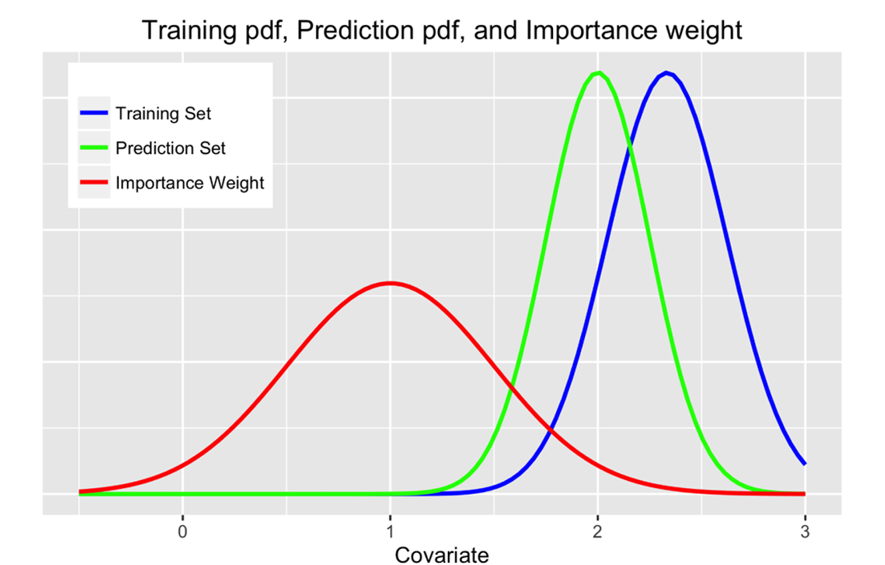
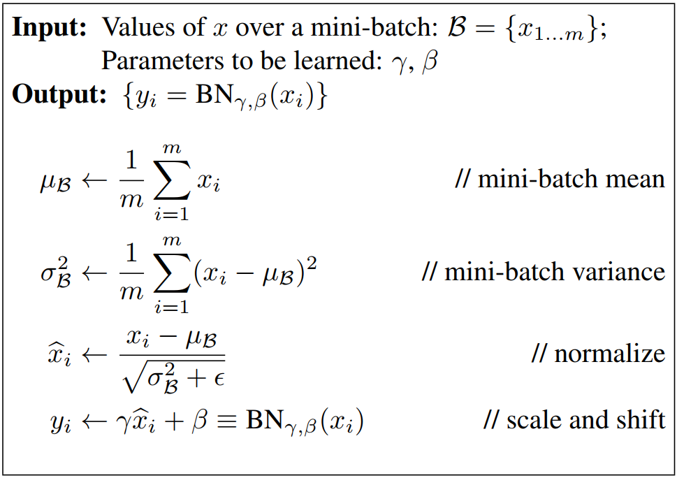

# 批归一化和层归一化的区别

## 基本概念

### 协变量偏移

协变量偏移（Covariate Shift）。 协变量是一个统计学概念，是可能影响预测结果的统计变量。在机器学习中，协变量可以看作是输入。一般的机器学习算法都要求输入在训练集和测试集上的分布是相似的。如果不满足这个假设，在训练集上学习到的模型在测试集上的表现P会比较差。  下图中分别表示训练集、预测及的权重的概率密度函数（Probability Density Function, PDF）

### 内部协变量偏移

在深层神经网络中，中间某一层的输入是其之前的神经层的输出。因此，其之前的神经层的参数变化会导致其输入的分布发生较大的差异。在使用随机梯度下降来训练网络时，每次参数更新都会导致网络中间每一层的输入的分布发生改变。越深的层，其输入的分布会改变得越明显。**从机器学习角度来看， 如果一个神经层的输入分布发生了改变， 那么其参数需要重新学习， 这种现象叫作内部协变量偏移（ Internal Covariate Shift）**    

为了解决内部协变量偏移问题，就要使得每一个神经层的输入的分布在训练过程中要保持一致。最简单直接的方法就是对每一个神经层都进行归一化操作，使其分布保存稳定。  常见的方法有：**批归一化（ Batch Normalization， BN）   **、**层归一化（ Layer Normalization）  **、**权重归一化（ Weight Normalization）**等。

## 批归一化

* batch normalization makes you hyper-parameter search problem much easier.
* make the neural network much more robust to the choice of hyper-parameters
* enable to much more easily train even very deep networks

### 批归一化应用到网络

* BN 一般应用于激活函数之前, 即批归一化的计算发生在$z$和$a$之间。
* $z^{[l]} = w^{[l]}a^{[l-1]} + b^{[l]}$,BN将${z^{[l]}}$归一化为，均值为0和方差为1的标准正态分布，再由$\gamma$和$\beta$进行尺度变换和偏移操作，这意味着$b^{[l]}$的值无论是多少，都会被均值减法所抵消，变得没有意义。因此在应用BN操作中实际上可以把$b^{[l]}$去掉或者设置为0，这时$z^{[l]}$的计算公式可以表示为$z^{[l]} = w^{[l]}a^{[l-1]}$。
* BN 一次能处理一个mini-batch的数据，即在一个mini-batch上计算均值和方差。

### 批归一化的作用

why does Batch Norm work?

### Internal Covariate Shift(ICS)

### Batch Norm as regularization

* 每一个最小批次都是按照该最小批次计算的均值和方差进行缩放的。由于在小部分数据数据上估计得出，计算均值和方差会引入噪声。
* $z^{[l]}$的值也会引入一些噪声，因为它是用有噪声的均值和方差计算得到的。它会往每个隐藏层的激活值上增加了噪音。
* BN 有轻微的正则化效果。
* 类似于dropout， 可以通过增大batch-batch，来减小噪声，达到减小正则化的效果。

### 批归一化实现

* 全连接层做批归一化

  批归一化层一般位于全连接层的仿射变换和激活函数之间。

* 卷积层做批归一化

  对卷积层来说，批量归一化发生在卷积计算之后、应用激活函数之前。**如果卷积计算输出多个通道，我们需要对这些通道的输出分别做批量归一化，且每个通道都拥有独立的拉伸和偏移参数，并均为标量**。设小批量中有$m$个样本。在单个通道上，假设卷积计算输出的高和宽分别为$p$和$q$。我们需要对该通道中$m\times p \times q$个元素同时做批量归一化。对这些元素做标准化计算时，我们使用相同的均值和方差，即该通道中$m\times p \times q$个元素的均值和方差。

* 测试阶段

  利用训练阶段， 通过指数加权平均跟踪训练过程得到的$\mu$和$\sigma^{2}$估算值，用于测试阶段对所需隐藏单元的$z$值进行调整。

## 层归一化

## 批归一化和层归一化的区别

层归一化和批量归一化整体上是十分类似的， 差别在于归一化的方法不同．对于 𝐾 个样本的一个小批量集合 $𝒁(𝑙) = [𝒛(1,𝑙); ⋯ ; 𝒛(𝐾,𝑙)] $ **层归一化是对矩阵$𝒁(𝑙)$的每一列进行归一化， 而批量归一化是对每一行进行归一化。** 一般而言， 批量归一化是一种更好的选择． 当小批量样本数量比较小时， 可以选择层归一化。 

## 参考资料

[动手学深度学习-批量归一化](https://zh.gluon.ai/chapter_convolutional-neural-networks/batch-norm.html)