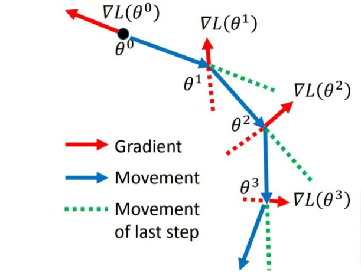
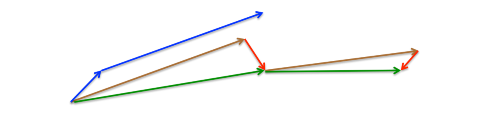
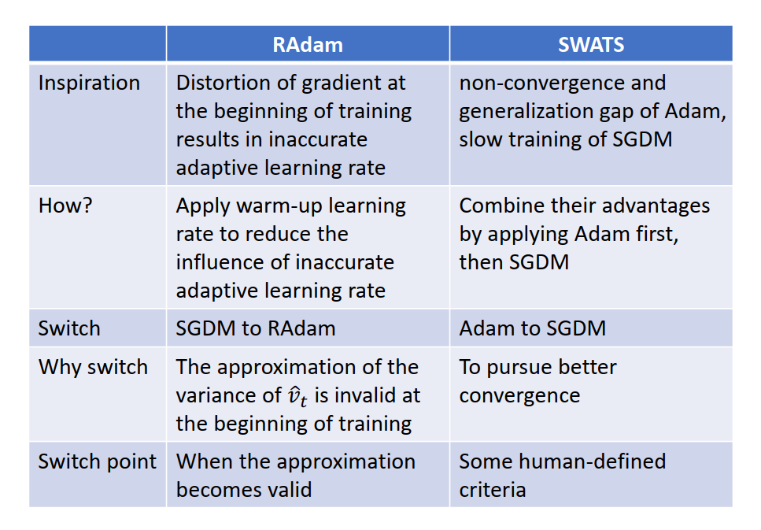
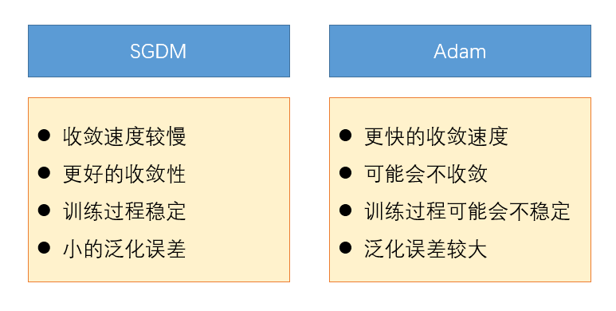

# 深度学习中常用优化器的总结

> 优化问题定义为寻找神经网络上的一组参数$\theta$, 能够显著地降低代价/损失函数$L(\theta)$, 该代价函数通常包括整个训练集上的性能评估和额外的正则化项。

​      深层神经网络的参数学习主要是通过梯度下降方法来寻找一组可以最小化结构风险的参数。

​	 为了方便下面进一步描述算法，下面定义几个常用符号(notation)

* $(x_k, y_k)$：表示训练集中第$k$个样本
* $\theta_t$： 在训练时间步$t$时的模型的参数值
* $L(\theta_t)$：在训练时间步$t$时的模型的损失函数值。
* $g(\theta_t)$：$g(\theta_t)=\nabla L(\theta_t)$, 在训练时间步$t$时的损失函数相对于参数的梯度值，用于更新$\theta_{t+1}$
* $\eta$：学习率/步长大小
* $m_{t+1}$：从第0时间步到第$t$时间步时的动量累计（一阶矩），**有方向**，用于计算$\theta_{t+1}$
* $s_{t+1}$：从第0时间步到第$t$时间步时的梯度历史平方和的累计（非中心二阶矩），**没有方向**，用于计算$\theta_{t+1}$
* $\epsilon$：为了保持数值稳定性而设置的非常小的常数，一般取值$e^{-7}$ 到$e^{-10}$。  

## 梯度下降算法

根据训练过程中每一次迭代使用的数据量的大小， 可以分为批量梯度下降、随机梯度下降和小批量随机梯度下降等三种优化算法。根据不同的数据量和参数量，可以选择一种具体的实现形式。

#### 批量梯度下降(batch)

使用整个训练集的优化算法称为批量（batch）梯度或离线（off-line）算法。

#### 随机梯度下降(stochastic)

每次只使用单个样本的优化算法称为随机（stochastic）或在线（on-line）算法。

#### 小批量随机梯度下降(mini-batch  stochastic)

深度学习算法中一般介于上面两者之间，使用一个以上而又不是全部的训练样本，称为小批量（mini-batch）或小批量（mini-batch stochastic）算法。

* 更新公式,：

$$
\theta_t = \theta_{t-1} - \eta g_t \tag{1-1}
$$

* 特点

  SGD[Robbins & Monro,1951]  算法在每次迭代中，梯度下降根据自变量当前位置，沿着当前位置的梯度更新自变量。由于每次选取的样本数量比较少，损失会呈现震荡的方式下降。

> 为了更有效地进行训练深层神经网络，在标准的小批量梯度下降方法的基础上，也经常使用一些改进方法以加快优化速度。常见的改进方法主要从以下两个方面进行改进： **学习率衰减**和**梯度方向优化**，**其中学习率衰减可以理解为在对参数更新的步数大小做调整，而梯度方向优化可以理解为对更新的方向做调整**。这些改进的优化方法也同样可以应用在批量或随机梯度下降方法上。 

## 梯度优化算法

动量算法通过梯度的[指数移动平均]( https://zhuanlan.zhihu.com/p/151786842)（累计了之前的梯度值）来代替每次的实际梯度， 缓解梯度震荡，从而加速学习。

#### SGDM(Momentum)

SGDM[Sutskever et al., 2013]  动量算法引入了动量$v$充当速度角色，它代表参数在参数空间移动的方向和速率。速度被设为负梯度的指数移动平均。动量在物理上定义为质量乘以速度，这里我们假设是单位质量， 因此速度$m$也看作是粒子的动量。

**超参数$\gamma \in [0,1)$决定了之前梯度的贡献衰减得有多快​**， 当$\gamma=0$时，动量算法等价于小批量随机梯度下降。

* 更新公式
  $$
  \begin{align}
  m_t =\gamma& m_{t-1} - (1-\gamma)(\frac{\eta}{(1-\gamma)}) g_t = \gamma m_{t-1} - \eta g_t \tag{1-2} \\
  \theta_t =& \theta_{t-1} + m_t \tag{1-3} \\
  \end{align}
  $$

#### NAG(Nesterov Momentum Gradient)

Nesterov[Yoshua et al., 2012]动量与标准动量得区别体现在梯度计算上。Nesterov 动量中，梯度计算在施加当前速度之后。

Nesterov 是 momentum算法得改进算法： Momentum保留了上一时刻的梯度 $g_{\theta_t}$，对其没有进行任何改变，NAG是在梯度更新时做一个矫正。

在动量法中，实际的参数更新方向$m_t$为上一步的参数更新方向$m_{t-1}$和当前梯度$g_t$的叠加。这样，$m_t$可以被拆分为两步进行，先根据$m_{t-1}$更新一次得到参数$\hat{\theta}$，再用$g_t$进行更新。  
$$
\begin{align}
\hat{\theta} =& \theta_{t-1} + \gamma m_{t-1}\tag{1-4} \\
\theta_{t} =& \hat{\theta} - \eta g_{t} \tag{1-5} \\
\end{align}
$$
**注意，这里$g_{t}$为梯度在时间步$t$的梯度，因此更合理的更新方向应该是$\hat{\theta}$上的梯度**。合并后的更新方向改变为 $\eta\nabla L(\theta_t + \gamma m_t)$。

* 更新公式
  $$
  \begin{align}
  m_t =& \gamma m_{t-1} - \eta\nabla L(\theta_{t-1} + \gamma m_{t-1}) = m_{t-1} - \eta g_{(\theta_{t-1} + \gamma m_{t-1})} \tag{1-6} \\
  \theta_t =& \theta_{t-1} + m_t \tag{1-7} \\
  \end{align}
  $$

* 物理意义

  Nesterov 动量算法的思想，可以理解为“超前部署”或“向前看一步”：

  第一步：在之前累计（accumulated）的梯度方向做一个大的跳跃（jump）。

  第二步： 然后再测量跳跃结束时的梯度，做一个修正。

  图中蓝色线为标准动量算法的更新方式：先计算当前时刻$t$梯度方向，然后再叠加时间步$t$累计的梯度方向，完成更新。

  图中棕色线、红色线、绿色线分别代表Nesterov 动量算法中的跳跃（jump）、梯度修正（correction）和梯度累加（accumulated gradient ）

##  自适应学习率优化算法

> 在梯度下降中，学习率$\eta$的取值非常关键，如果过大可能不会收敛，过小则收敛速度太慢。从经验上看，学习率在一开始要保持大些来保证收敛速度，在收敛到最优点附近时要小些以避免来回震荡。因此，比较简单直接的学习率调整可以通过学习率衰减（Learning Rate Decay）的方式来实现。  

常见得指数衰减做法有指数衰减，分段常数衰减等。除了固定衰减率的调整学习率方法外，还有些自适应地调整学习率的方法，比如AdaGrad、 RMSprop、 AdaDelta等。  

#### AdaGrad

AdaGrad[Duchi et al., 2011] 是借鉴L2正则化的思想，每次迭代时自适应地调整每个参数的学习率。

* 更新公式

AdaGrad算法会使用一个小批量随机梯度 $g_t$ 按元素平方的累加变量 $s_t$。在时间步0，AdaGrad将 $s_0$ 中每个元素初始化为0。在时间步 t ，首先将小批量随机梯度$s_t$按元素平方后累加到变量$s_t$
$$
s_t = s_{t-1} + g_t \odot g_t \tag{2-1}
$$
接着，我们将目标函数自变量中每个元素的学习率通过按元素运算重新调整：
$$
\theta_{t} = \theta_{t-1} - \frac{\eta}{\sqrt{s_t+\epsilon}} \odot g_t \tag{2-2}
$$

* 特点

  Adagrad算法的缺点是在经过一定次数的迭代依然没有找到最优点时，由于这时的学习率已经非常小，很难再继续找到最优点。  

### RMSProp

​	RMSProp[Hinton，2012]修改了AdaGrad 以在非凸设定下效果更好，改变梯度累计为指数加权的移动平均。AdaGrad 旨在应用于凸问题和梯度稀疏的快速收敛的问题。但是在训练非凸且梯度密集神经网络时， 学习轨迹可能穿过了很多不同的结构，最终达到一个局部为凸的区域而停止收敛。**这是由于AdaGrad 根据平方梯度的整个历史收缩学习率，导致学习率快速衰减，可能使得学习率在达到这样的凸结构前就变得太小了，陷入局部最优，性能会变差。**这个问题在深度学习产生的高维问题中尤其严重。

​	RMSProp使用指数（衰减）移动平均，相当于丢弃了较早时间步的历史，只使用距离当前时间步最近的固定大小的项进行学习率的更新，使其能够在找到局部凸结构后快速收敛。

* 更新公式

  给定超参数，权重因子$\gamma$
  $$
  s_t = \gamma s_{t-1} + (1-\gamma)g_t \odot g_t \tag{2-3}
  $$
  接下来和AdaGrad算法一样，RMSProp算法将目标函数自变量中每个元素的学习率通过按元素运算重新调整，然后更新自变量
  $$
  \theta_{t} = \theta_{t-1} - \frac{\eta}{\sqrt{s_t+\epsilon}} \odot g_t \tag{2-4}
  $$

* 特点

  RMSpop 的状态量$s_t$可以看作是最近$\frac{1}{1-\gamma}$个时间步的小批量随机梯度平方项的指数移动平均（关于移动平均可以参考[指数移动平均]([指数移动平均]( https://zhuanlan.zhihu.com/p/151786842))）， 这样参数参数的学习率在迭代过程中就不会一直降低，而是根据最近一段时间步的更新方向进行自适应地调整。

#### AdaDelta

AdaDelta算法[Zeiler et al., 2012]也是针对AdaGrad算法在迭代后期可能较难找到有用解的问题做了改进 。**AdaDelta算法没有学习率$\eta$​这一超参数。**

* 更新公式

  AdaDelta算法也像RMSProp算法一样，使用了小批量随机梯度$g_t$按元素平方的指数加权移动平均变量$s_t$，$s_t$的更新公式与$(2-3)$相同。
  $$
  s_t = \gamma s_{t-1} + (1-\gamma)g_t \odot g_t \tag{2-5}
  $$
  **与RMSProp算法的主要区别是，AdaDelta算法引入了每次参数更新差$\Delta \theta$ 的平方的指数衰减权移动平均 $\Delta x$， 其中$\Delta x_0 =0$。**  使用$\Delta x_{t-1}$ 和 $s_t$来更新参数更新差$\Delta \theta_t$
  $$
  \Delta \theta_t = \sqrt{\frac{\Delta x_{t-1}+\epsilon}{s_t+\epsilon}} \odot g_t \tag{2-6}
  $$
  接着完成参数更新
  $$
  \theta_{t} = \theta_{t-1} - \Delta \theta_t \tag{2-7}
  $$
  最后更新参数更新差的平方和累计器$\Delta x_t$
  $$
  \Delta x_{t} = \gamma \Delta x_{t-1} + (1-\gamma) \Delta \theta_{t} \odot \Delta \theta_{t} \tag{2-8}
  $$
  
* 特点

  如不考虑ϵ的影响，AdaDelta算法与RMSProp算法的不同之处在于使用$\sqrt{\Delta x_{t-1}+\epsilon}$来替代学习率的超参数$\eta$。

  - 训练初中期，加速效果不错，很快。
  - 训练后期，反复在局部最小值附近抖动。

## 其他优化算法

### Adam

自适应动量估计（Adaptive Moment Estimation， Adam）算法[Kingma and Ba，2014]是另一种自适应学习率算法，可以看作是动量法和 RMSprop 的结合，不但使用动量作为参数更新方向，而且可以自适应调整学习率。  **Adam = RMSProp  + Momentum**

* 更新公式

  给定移动平均衰减率超参数$\beta_1 \in(0, 1)$(算法建议为0.9)，，时间步t的动量变量$m_t$即小批量随机梯度$g_t$的指数加权移动平均(和动量法类似):
  $$
  m_{t} \leftarrow \beta_1 m_{t-1} + (1-\beta_1)g_t  \tag{3-1}
  $$
  给定移动平均衰减率超参数$\beta_2 \in(0, 1)$(算法建议为0.999)， 将小批量随机梯度按元素平方后的项$g_t \odot g_t$做指数加权移动平均得到$s_t$(和RMSProp 算法类似):
  $$
  s_t \leftarrow \beta_2 s_{t-1} + (1-\beta_2)g_t \odot g_t \tag{3-2}
  $$
  $m_t$以看作是梯度的均值（一阶矩）， $s_t$可以看作是梯度的未减去均值的方差（非中心二阶矩）  

  由于初始阶段$m_0$和$s_0$都被初始化为0，导致在迭代初期$m_t$和$s_t$ 的值会比真实的均值和方差要小。特别是当$\beta_1$和$\beta_2$ 都接近于1时，偏差会很大。因此，需要对偏差进行修正。(可以参考[指数移动平均]([指数移动平均]( https://zhuanlan.zhihu.com/p/151786842))中的证明过程)
  $$
  \begin{align}
  \hat{m_t} \leftarrow \frac{m_t}{1-\beta_1^t} \tag{3-3} \\
  \hat{s_t} \leftarrow \frac{s_t}{1-\beta_2^t} \tag{3-4}\\
  \end{align}
  $$
  接下来使用修正偏差后的$\hat{m_t}$和$\hat{s_t}$获取参数的更新差值
  $$
  \Delta \theta_t=  \frac{\eta}{\sqrt{\hat{s_t}}+\epsilon}\hat{m_t} \tag{3-5}
  $$
  最后更新参数
  $$
  \theta_t=\theta_{t-1} - \Delta \theta_t \tag{3-6}
  $$

### AdamW

L2 正则化的目的是通过约束参数的范数不要过大， 在一定程度上减小过拟合，提高模型的泛化能力。

**L2 正则化**和 **权重衰减（Weight Decay）** 的目的都是使得权重系数趋近于0， 进一步描述 **Weight Decay是最终的目标， 而L2 正则化只是实现Weight Decay 的一种方法， 因此L2 正则化和 weight decay并不完全等价**：

* L2 正则化是在损失/目标函数中直接加上一个正则化项， 直接修改我们的优化目标, 即 $f_t^{reg}(\theta) = f_t(\theta) + \frac{{\lambda}’}{2}||\theta||_2^2$
* 权重衰减是在权重的梯度更新时直接增加一项， 对网络中的参数直接进行衰减， 损失/目标函数不变化: $x_{t+1} = (1 -\lambda)\theta_t + \alpha \nabla f_t(\theta_t)$

**L2 正则化的作用是在计算梯度的时候会加上对正则化项求梯度的结构, 较大的权重所对应的梯度值也越大，这样 越大的权重受到越大的惩罚， 从而指导模型朝着小权重的方向学习， 达到Weight Decay 的目标。**

**对于SGD/SGDM 来说， L2 正则化等价于 Weight Decay**， 但是**对于Adam 优化算法而言， L2 正则化并不能达到Weight Decay 的效果, 即Adam 中的 L2 正则化并不有效**：在Adam 优化算法中， 参数的梯度会除以梯度平方的累计和， 利用得到的梯度进行参数更新。 对于**Adam+L2**来说， 梯度项会包含正则化项，**因此正则化项也会被除以梯度平方的累计和**， 使得正则化项的实际值变得很小， **导致了Adam 无法对 权重过大的项进行惩罚**。 这也是很多时候 Adam 的效果反而不如直接使用 SGDM 效果好。

**AdamW 是对 Adam+L2 正则化的改进算法**。 AdamW 通过分析Adam+L2 存在的问题， 引入直接的权重方式。 具体地说 Adam+L2 的权重衰减执行的步骤在图中粉色位置， AdamW 的权重衰减的作用在图中的绿色位置。 即相对于Adam 而言， **AdamW 的权重衰减发生在梯度项变换操作之后，在参数更新的时候进行执行梯度衰减**， 从而保证越大的权重受到越大的惩罚。

AdamW 相当于同时实现了Adam 和 L2 正则化的功能， 因此**AdamW 不再需要独立的正则化项**。

[AdamW](https://github.com/macanv/BERT-BiLSTM-CRF-NER/blob/master/bert_base/bert/optimization.py)实现代码

### Nadam

Adam算法是RMSProp与Momentum算法的结合，因此一种自然的Adam的改进方法是引入Nesterov加速梯度，称为Nadam[Duchi et al., 2011] 算法 。 **Nadam = Adam  + Nesterov**

* 更新公式

  Nadam 与Adam 更新公式唯一的区别是一阶矩$\hat{m_t}$的修正公式， 其他公式都相同。
  $$
  \hat{m_t} = \frac{\beta_1}{1-\beta_1^{t+1}} + \frac{(1-\beta_1)}{1-\beta_1^{t}}g_t \tag{3-7}
  $$

### AMSGrad

AMSGrad[Sashank et al.,2018], 通过单调（monotonically）地减小步长，解决了Adam的不收敛问题。AMSGrad 提出了一个新的指数移动平均的准则，在保证收敛的同时保留 Adam 和 RMSProp 的实际利益。

### SWATS

 **SWATS= Adam+SGDM**，SWATS(Switches from Adam To SGD, SWATD) 。SWART [Nitish et al., 2017]结合了Adam在训练和泛化指标方面都优于SGD和SGD 泛化能力强的特点，提出组合（hybrid）策略。前期采用 Adam 进行训练, 当满足触发条件， 优化器就由 Adam 切换为 SGD。

### RAdam

**RAdam =  SGDM + warm-up**，RAdam（Rectified Adam ）。RAdam[Liyuan et al., 2020] 通过采用预热启发式算法，提高了自适应学习率算法训练的稳定性、收敛速度和泛化能力。

## 优化过程可视化

## SGDM 与 Adam 区别

Adam拥有速度快、调参容易的有点，如在Transform 与 BigGAN中的应用。但是Adam有时也存在泛化性与收敛问题而被诟病。因此在很多的算法的论文中仍然使用传统的SGDM来做分析。下面分析Adam问题和产生的原因。

### Adam 缺点

* 泛化问题

  在讨论模型的泛化问题时，我们希望模型找的的极小值是一个平坦（flat）的位置，而不是陡峭（sharp）的位置。一般认为，一个平坦极小值对应低的精确度，而一个陡峭的极小值对应高的精确度。在一个陡峭的极小值下，训练函数的高灵敏度会对训练模型泛化新数据的能力产生负面影响。根据minimum description length (MDL) 理论，需要较少比特来描述的统计模型（即复杂度低）具有更优的泛化能力。通过下图可以看出，由于平坦极小值的精度比尖锐极小值要低，因此它们往往具有更好的泛化性能。

](../graph/image-20200803082556002.png)

​		已经有很多论文证明，Adam 在训练阶段收敛速度很快，且能够达到较高的准确率；但是泛化能力有时并非最优。

](../graph/image-20200803180148111.png)

​		上图为不同优化算法在MNIST数据集上的表现，可以看出Adam 在训练集上的收敛速度和准确率方面表现都是最好的，但是测试集上		的表现却是最差的

​		针对泛化能力差的问提出的改进算法有SWATS。

* 收敛性问题

  关于Adam 的收敛性问题， 2018 ICLR的 best paper [ON THE CONVERGENCE OF ADAM AND BEYOND](https://openreview.net/pdf?id=ryQu7f-RZ)，设计实验并讨论了Adam不收敛各种情况。

  在深度学习训练过程中，**首先通常会设置[固定的学习率衰减策略](https://zhuanlan.zhihu.com/p/166110607)进行模型训练，这本质上也是优化算法的一部分。然后再选择合适的损失函数和优化算法执行模型的训练。**

  对于SGD和SGDM优化算法，只是用一阶动量（梯度）对模型进行优化，因此在训练过程中学习率等于自定义的学习率衰减策略的轨迹，学习率逐渐衰减。对于AdaGrad 优化算法， 使用二阶动量（梯度的平方）更新学习率，根据公式$(2-1)$可以看出，随着二阶动量会随着训练次数的增加而增大，而学习率按二阶动量的的开方为尺度比率（scaled）减小。因此，根据SGD、SDRM和AdaGrad优化算法的更新规则，会得到“不增加”的学习率。

  对于RMSProp、AdaDelta 和 Adam等自适应学习率优化算法针对AdaGrad算法学习率下降速度的过快的问题，提出了利用过去二阶动量的[指数移动平均](https://zhuanlan.zhihu.com/p/151786842)值来减缓学习速率的快速衰减。根据指数移动的概念，这种做法本质上等价于限制了只依赖于过去一段的几个梯度（固定窗口）的累计来更新二阶动量。但是这同时会引起另一个问题：**在通常的训练过程中可以观察到，一些比较稀少的的小批量数据提供了大的梯度，但是这些大的梯度对应着大的信息量。但是由于指数移动平均，它们的影响很快消失，这就可能导致模型的不收敛。**

  针对Adam 可能不收敛问题，提出了AMSGrad。

* 可能陷入局部最优

  研究发现，RMSprop、Adam等自适应学习率算法，可能会收敛到可疑的或坏的局部最优点。**由于早期阶段缺少足够的样本，自适应学习率算法有不期望的大的方差，导致了可疑的/坏的局部最优解。**通常需要求助于启发式的预热策略去缓解这一问题。

  针对这一问题提出的改进优化算法有RAdam。

### Adam 与 SGDM 的性能比较

## 参考资料

* [An overview of gradient descent optimization algorithms](https://ruder.io/optimizing-gradient-descent/index.html)

* [优化算法Optimizer比较和总结](https://zhuanlan.zhihu.com/p/55150256)

* [一个框架看懂优化算法之异同 SGD/AdaGrad/Adam](https://zhuanlan.zhihu.com/p/32230623)

* [动手学深度学习-优化算法](https://zh.gluon.ai/chapter_optimization/index.html)

* <http://www.cs.toronto.edu/~tijmen/csc321/slides/lecture_slides_lec6.pdf>

* [ON LARGE-BATCH TRAINING FOR DEEP LEARNING: GENERALIZATION GAP AND SHARP MINIMA](https://openreview.net/pdf?id=H1oyRlYgg)

* [ADAPTIVE GRADIENT METHODS WITH DYNAMIC BOUND OF LEARNING RATE](https://openreview.net/pdf?id=Bkg3g2R9FX)
* [ON THE CONVERGENCE OF ADAM AND BEYOND](https://openreview.net/pdf?id=ryQu7f-RZ)
* [Improving Generalization Performance by Switching from Adam to SGD](https://arxiv.org/abs/1712.07628)
* [The Marginal Value of Adaptive Gradient Methods in Machine Learning ](https://arxiv.org/abs/1705.08292)
* [On the Variance of the Adaptive Learning Rate and Beyond](https://arxiv.org/abs/1908.03265)
* 《李宏毅机器学习-2020》