# 深度学习中的固定学习率衰减策略总结

**深层神经网络的参数学习主要是通过梯度下降方法来寻找一组可以最小化结构风险的参数**。  在梯度下降中学习率的取值非常关键，如果过大可能不会收敛，过小则收敛速度太慢。

通常的策略的在一开始采用大的学习率保证收敛，在收敛到最优点附近时要小些以避免来回震荡。因此，比较简单直接的学习率
调整可以通过学习率衰减（Learning Rate Decay）的方式来实现。  

**学习率衰减策略可以分为两种：固定策略的学习率衰减和自适应学习率衰减，其中固定学习率衰减包括分段衰减、逆时衰减、指数衰减等，自适应学习率衰减包括AdaGrad、 RMSprop、 AdaDelta等。**一般情况，两种策略会结合使用。

本文主要基于tensorflow，对一些常见的固定策略衰减策略进行总结，包括基本的衰减策略、循环学习率衰减和单循环学习率衰减。

## 基本学习率衰减

### piecewise  decay

分段常数衰减， 在训练过程中不同阶段设置不同的学习率，便于更精细的调参。在目标检测任务如Faster RCNN 和 SSD 的训练中都采用分段常数衰减策略，调整学习率。

* 方法接口

  ```python
  tf.train.piecewise_constant_decay
  ```

  * boundaries：学习率衰减边界；
  *  values：不同阶段对应学习率。

  **注意由于boundaries忽略了初始边界0，因此values的长度会比boundaries多1。**

* 验证代码

  ```python
  import os
  import tensorflow as tf
  
  summary_path = './summary'
  method = 'piecewise_decay'
  
  max_step = 20000
  base_learning_rate = 0.01
  decay_boundaries = [5000, 8000]
  learning_rate_value = [base_learning_rate, base_learning_rate/10., base_learning_rate/100.]
  summary_step = 10
  
  def main():
  
      global_step_op = tf.train.get_or_create_global_step()
  
      # x = tf.get_variable(shape=[1], initializer=tf.random_normal_initializer(), name="x")
      learning_rate =  tf.train.piecewise_constant_decay(global_step_op,
                                                         boundaries=decay_boundaries,
                                                         values=learning_rate_value)
      tf.summary.scalar("learning_rate", learning_rate)
      summary_op = tf.summary.merge_all()
  
      init_op = tf.group(tf.global_variables_initializer(),
                         tf.local_variables_initializer())
  
      with tf.Session() as sess:
          sess.run(init_op)
  
          summary_write = tf.summary.FileWriter(os.path.join(summary_path, method))
          coord = tf.train.Coordinator()
          threads = tf.train.start_queue_runners(sess, coord)
          try:
              if not coord.should_stop():
                  for step in range(max_step):
                      if step % summary_step == 0:
                          summary, global_step = sess.run([summary_op, global_step_op], feed_dict={global_step_op:step})
                          summary_write.add_summary(summary, global_step=global_step)
                          summary_write.flush()
  
                      summary, global_step = sess.run([summary_op, global_step_op], feed_dict={global_step_op:step})
  
          except Exception as e:
              # Report exceptions to the coordinator.
              coord.request_stop(e)
          finally:
              coord.request_stop()
              coord.join(threads)
              print('all threads are asked to stop!')
  
  if __name__ == "__main__":
      main()
  ```

  

* 输出结果

  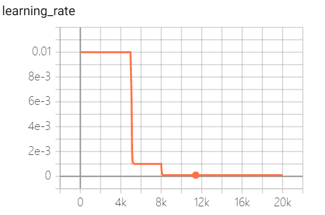

### exponential decay

* 函数接口

  ```
  tf.train.exponential_decay
  ```

  * learning_rate: 基学习率
  * decay_rate: 衰减率
  * decay_steps: 衰减步数/周期
  * staircase: 是否以离散的时间间隔衰减学习率

指数衰减：学习率以指数的形式进行衰减，其中指数函数的底为decay_rate， 指数为 global_step / decay_steps

* 验证代码

  ```python
  import os
  import tensorflow as tf
  
  summary_path = './summary'
  method = 'exponential_decay'
  
  max_step = 20000
  base_learning_rate = 0.01
  decay_rate = 0.98
  decay_steps = 2000
  summary_step = 10
  
  def main():
  
      global_step_op = tf.train.get_or_create_global_step()
      #  decayed_learning_rate = learning_rate * decay_rate ^ (global_step / decay_steps)
      learning_rate_no_stair =  tf.train.exponential_decay(learning_rate=base_learning_rate,
                                                  decay_rate=decay_rate,
                                                  decay_steps=decay_steps,
                                                  staircase=False,
                                                  global_step=global_step_op,
                                                  name="exponential_decay_no_stair")
      tf.summary.scalar("exponential_decay_no_stair", learning_rate_no_stair)
      learning_rate_no_stair = tf.train.exponential_decay(learning_rate=base_learning_rate,
                                                          decay_rate=decay_rate,
                                                          decay_steps=decay_steps,
                                                          staircase=True,
                                                          global_step=global_step_op,
                                                          name="exponential_decay_use_stair")
      tf.summary.scalar("exponential_decay_use_stair", learning_rate_no_stair)
      summary_op = tf.summary.merge_all()
  
      init_op = tf.group(tf.global_variables_initializer(),
                         tf.local_variables_initializer())
  
      with tf.Session() as sess:
          sess.run(init_op)
  
          summary_write = tf.summary.FileWriter(os.path.join(summary_path, method))
          coord = tf.train.Coordinator()
          threads = tf.train.start_queue_runners(sess, coord)
          try:
              if not coord.should_stop():
                  for step in range(max_step):
                      if step % summary_step == 0:
                          summary, global_step = sess.run([summary_op, global_step_op], feed_dict={global_step_op:step})
                          summary_write.add_summary(summary, global_step=global_step)
                          summary_write.flush()
  
                      summary, global_step = sess.run([summary_op, global_step_op], feed_dict={global_step_op:step})
  
          except Exception as e:
              # Report exceptions to the coordinator.
              coord.request_stop(e)
          finally:
              coord.request_stop()
              coord.join(threads)
              print('all threads are asked to stop!')
  
  if __name__ == "__main__":
      main()
  ```

* 输出结果

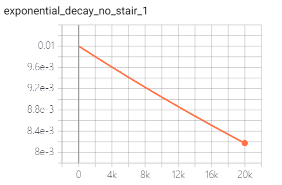

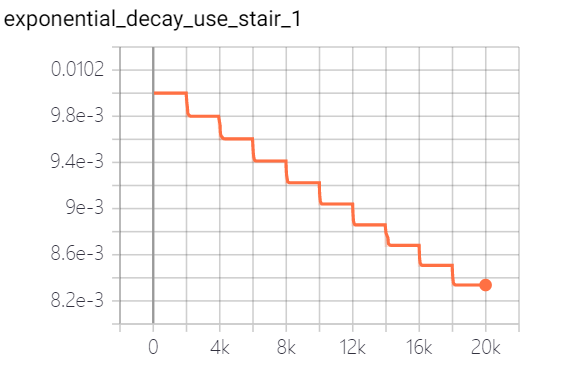

### natural  exponential decay

自然指数衰减:学习率以自然指数进行衰减，其中指数函数底为自然常数e, 指数为-decay_rate * global_step / decay_step， 相比指数衰减具有更快的衰减速度。

* 方法接口

  ```python
  tf.train.natural_exp_decay
  ```

  * learning_rate: 基学习率
  * decay_rate: 衰减率
  * decay_steps: 衰减步数/周期
  * staircase: 是否以离散的时间间隔衰减学习率

* 验证代码

  ```python
  import os
  import tensorflow as tf
  
  summary_path = './summary'
  method = 'natural_exp_decay'
  
  max_step = 20000
  base_learning_rate = 0.01
  decay_rate = 0.98
  decay_steps = 2000
  summary_step = 10
  
  def main():
  
      global_step_op = tf.train.get_or_create_global_step()
  
      # decayed_learning_rate = learning_rate * exp(-decay_rate * global_step / decay_step)
      learning_rate_no_stair =  tf.train.natural_exp_decay(learning_rate=base_learning_rate,
                                                          decay_rate=decay_rate,
                                                          decay_steps=decay_steps,
                                                          staircase=False,
                                                          global_step=global_step_op,
                                                          name="natural_exp_decay_no_stair")
      tf.summary.scalar("natural_exp_decay_no_stair", learning_rate_no_stair)
      learning_rate_no_stair = tf.train.natural_exp_decay(learning_rate=base_learning_rate,
                                                          decay_rate=decay_rate,
                                                          decay_steps=decay_steps,
                                                          staircase=True,
                                                          global_step=global_step_op,
                                                          name="natural_exp_decay_use_stair")
      tf.summary.scalar("natural_exp_decay_use_stair", learning_rate_no_stair)
      summary_op = tf.summary.merge_all()
  
      init_op = tf.group(tf.global_variables_initializer(),
                         tf.local_variables_initializer())
  
      with tf.Session() as sess:
          sess.run(init_op)
  
          summary_write = tf.summary.FileWriter(os.path.join(summary_path, method))
          coord = tf.train.Coordinator()
          threads = tf.train.start_queue_runners(sess, coord)
          try:
              if not coord.should_stop():
                  for step in range(max_step):
                      if step % summary_step == 0:
                          summary, global_step = sess.run([summary_op, global_step_op], feed_dict={global_step_op:step})
                          summary_write.add_summary(summary, global_step=global_step)
                          summary_write.flush()
  
                      summary, global_step = sess.run([summary_op, global_step_op], feed_dict={global_step_op:step})
  
          except Exception as e:
              # Report exceptions to the coordinator.
              coord.request_stop(e)
          finally:
              coord.request_stop()
              coord.join(threads)
              print('all threads are asked to stop!')
  
  if __name__ == "__main__":
      main()
  ```

* 输出结果


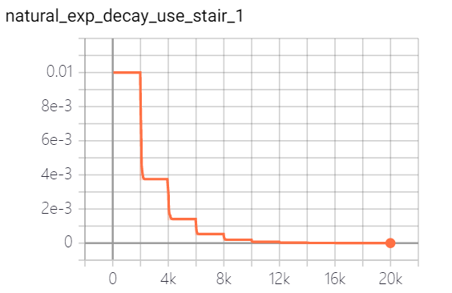

### polynomial decay

多项式衰减：调整学习率的衰减轨迹以多项式对应的轨迹进行。其中（1 - global_step / decay_steps） 为幂函数的底； power为指数，控制衰减的轨迹。

* 方法接口

  ```python
  tf.train.polynomial_decay
  ```

  * learning_rate: 基学习率
  * decay_steps: 衰减率衰减步数
  * power: 多项式的幂
  * end_learning_rate：最小学习率

* 验证代码

  ```python
  import os
  import tensorflow as tf
  
  summary_path = './summary'
  method = 'polynomial_decay'
  
  max_step = 20000
  base_learning_rate = 0.01
  decay_steps = 10000
  end_learning_rate = 0.00001
  summary_step = 10
  
  def main():
  
      global_step_op = tf.train.get_or_create_global_step()
  
      # global_step = min(global_step, decay_steps)
      # decayed_learning_rate = (learning_rate - end_learning_rate) *
      #                           (1 - global_step / decay_steps) ^ (power) + end_learning_rate
      learning_rate_power_1 =  tf.train.polynomial_decay(learning_rate=base_learning_rate,
                                                          decay_steps=decay_steps,
                                                          end_learning_rate = end_learning_rate,
                                                          power=1.,
                                                          global_step=global_step_op,
                                                          name="polynomial_decay_power_1")
      tf.summary.scalar("polynomial_decay_power_1", learning_rate_power_1)
      learning_rate_power_05 = tf.train.polynomial_decay(learning_rate=base_learning_rate,
                                                        decay_steps=decay_steps,
                                                        end_learning_rate=end_learning_rate,
                                                        power=0.5,
                                                        global_step=global_step_op,
                                                        name="polynomial_decay_power_05")
      tf.summary.scalar("polynomial_decay_power_05", learning_rate_power_05)
      learning_rate_power_2 = tf.train.polynomial_decay(learning_rate=base_learning_rate,
                                                         decay_steps=decay_steps,
                                                         end_learning_rate=end_learning_rate,
                                                         power=2,
                                                         global_step=global_step_op,
                                                         name="polynomial_decay_power_2")
      tf.summary.scalar("polynomial_decay_power_2", learning_rate_power_2)
      summary_op = tf.summary.merge_all()
  
      init_op = tf.group(tf.global_variables_initializer(),
                         tf.local_variables_initializer())
  
      with tf.Session() as sess:
          sess.run(init_op)
  
          summary_write = tf.summary.FileWriter(os.path.join(summary_path, method))
          coord = tf.train.Coordinator()
          threads = tf.train.start_queue_runners(sess, coord)
          try:
              if not coord.should_stop():
                  for step in range(max_step):
                      if step % summary_step == 0:
                          summary, global_step = sess.run([summary_op, global_step_op], feed_dict={global_step_op:step})
                          summary_write.add_summary(summary, global_step=global_step)
                          summary_write.flush()
  
                      summary, global_step = sess.run([summary_op, global_step_op], feed_dict={global_step_op:step})
  
          except Exception as e:
              # Report exceptions to the coordinator.
              coord.request_stop(e)
          finally:
              coord.request_stop()
              coord.join(threads)
              print('all threads are asked to stop!')
  
  if __name__ == "__main__":
      main()
  ```

* 输出结果

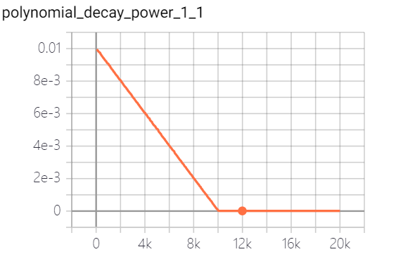

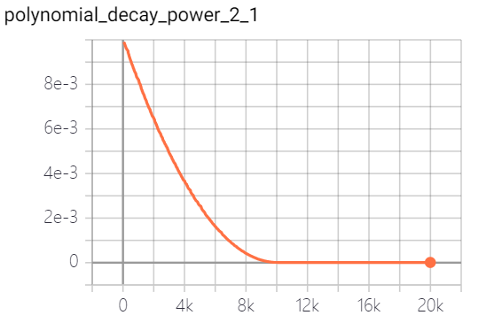

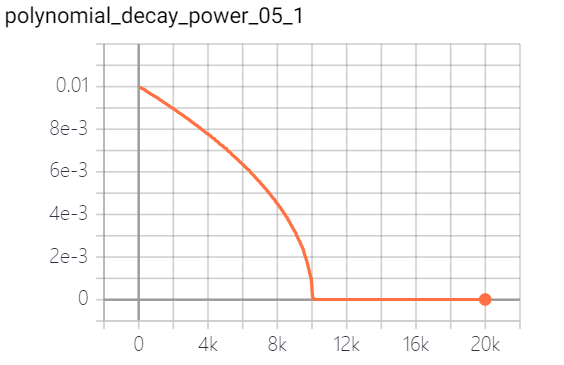

### cosine decay

余弦衰减：学习率以cosine 函数曲线进行进行衰减， 其中余弦函数的周期为$T=\frac{2*\pi}{\pi}=2$, 自变量为$\frac{global\_step}{decay\_step} \in (0,1)$

* 函数接口

  ```python
  tf.train.cosine_decay
  ```

  * learning_rate: 基学习率
  * decay_steps: 衰减率衰减步数
  * alpha: 最小学习率

* 代码验证

  ```python
  import os
  import tensorflow as tf
  
  summary_path = './summary'
  method = 'cosine_decay'
  
  max_step = 20000
  base_learning_rate = 0.01
  decay_steps = 10000
  alpha = 0.001
  summary_step = 10
  
  def main():
  
      global_step_op = tf.train.get_or_create_global_step()
  
      # global_step = min(global_step, decay_steps)
      # cosine_decay = 0.5 * (1 + cos(pi * global_step / decay_steps))
      # decayed = (1 - alpha) * cosine_decay + alpha
      # decayed_learning_rate = learning_rate * decayed
      # update learning rate(decayed learning rate) just according to decayed parameter and learning no change
      learning_rate =  tf.train.cosine_decay(learning_rate=base_learning_rate,
                                             decay_steps=decay_steps,
                                             alpha=alpha,
                                             global_step=global_step_op,
                                             name="cosine_decay")
      tf.summary.scalar("learning_rate", learning_rate)
      summary_op = tf.summary.merge_all()
  
      init_op = tf.group(tf.global_variables_initializer(),
                         tf.local_variables_initializer())
  
      with tf.Session() as sess:
          sess.run(init_op)
  
          summary_write = tf.summary.FileWriter(os.path.join(summary_path, method))
          coord = tf.train.Coordinator()
          threads = tf.train.start_queue_runners(sess, coord)
          try:
              if not coord.should_stop():
                  for step in range(max_step):
                      if step % summary_step == 0:
                          summary, global_step = sess.run([summary_op, global_step_op], feed_dict={global_step_op:step})
                          summary_write.add_summary(summary, global_step=global_step)
                          summary_write.flush()
  
                      summary, global_step = sess.run([summary_op, global_step_op], feed_dict={global_step_op:step})
  
          except Exception as e:
              # Report exceptions to the coordinator.
              coord.request_stop(e)
          finally:
              coord.request_stop()
              coord.join(threads)
              print('all threads are asked to stop!')
  
  if __name__ == "__main__":
      main()
  ```

  

* 输出结果

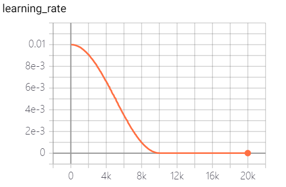

### linear cosine decay

线性余弦衰减：动机式在开始的几个周期，执行warm up 操作，线性余弦衰减比余弦衰减更具aggressive，通常可以使用更大的初始学习速率。其中余弦函数的周期 为 $T=\frac{2\pi}{2\times\pi\times {num\_period}}= \frac{1}{{num\_period}} $，自变量为$\frac{ global\_step}{decay\_step} \in (0, 1)$。

* 函数接口

  ```
  tf.train.linear_cosine_decay
  ```

  * learning_rate: 基学习率
  * decay_steps: 衰减率衰减步数

  * alpha: 调节学习率衰减系数

  * beta: 最小学习率
  * num_periods：余弦衰减部分周期数

* 代码验证

  ```python
  import os
  import tensorflow as tf
  
  summary_path = './summary'
  method = 'linear_cosine_decay'
  
  max_step = 20000
  base_learning_rate = 0.01
  decay_steps = 10000
  num_periods_05= 0.5
  num_periods_4 = 4
  alpha = 0.001
  beta = 0.001
  summary_step = 10
  
  def main():
  
      global_step_op = tf.train.get_or_create_global_step()
  
      # global_step = min(global_step, decay_steps)
      # linear_decay = (decay_steps - global_step) / decay_steps)
      # cosine_decay = 0.5 * (
      # 1 + cos(pi * 2 * num_periods * global_step / decay_steps))
      # decayed = (alpha + linear_decay + eps_t) * cosine_decay + beta
      # decayed_learning_rate = learning_rate * decayed
      linear_cosine_decay_05 = tf.train.linear_cosine_decay(learning_rate=base_learning_rate,
                                                           decay_steps=decay_steps,
                                                           num_periods=num_periods_05,
                                                           alpha=alpha,
                                                           beta=beta,
                                                           global_step=global_step_op,
                                                           name="linear_cosine_decay_05")
      tf.summary.scalar("linear_cosine_decay_05", linear_cosine_decay_05)
      linear_cosine_decay_4 =  tf.train.linear_cosine_decay(learning_rate=base_learning_rate,
                                                     decay_steps=decay_steps,
                                                     num_periods=num_periods_4,
                                                     alpha=alpha,
                                                     beta = beta,
                                                     global_step=global_step_op,
                                                     name="linear_cosine_decay_4")
      tf.summary.scalar("linear_cosine_decay_4", linear_cosine_decay_4)
      summary_op = tf.summary.merge_all()
  
      init_op = tf.group(tf.global_variables_initializer(),
                         tf.local_variables_initializer())
  
      with tf.Session() as sess:
          sess.run(init_op)
  
          summary_write = tf.summary.FileWriter(os.path.join(summary_path, method))
          coord = tf.train.Coordinator()
          threads = tf.train.start_queue_runners(sess, coord)
          try:
              if not coord.should_stop():
                  for step in range(max_step):
                      if step % summary_step == 0:
                          summary, global_step = sess.run([summary_op, global_step_op], feed_dict={global_step_op:step})
                          summary_write.add_summary(summary, global_step=global_step)
                          summary_write.flush()
  
                      summary, global_step = sess.run([summary_op, global_step_op], feed_dict={global_step_op:step})
  
          except Exception as e:
              # Report exceptions to the coordinator.
              coord.request_stop(e)
          finally:
              coord.request_stop()
              coord.join(threads)
              print('all threads are asked to stop!')
  
  if __name__ == "__main__":
      main()
  ```

* 输出结果

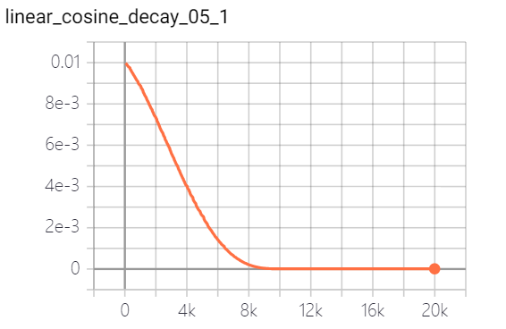

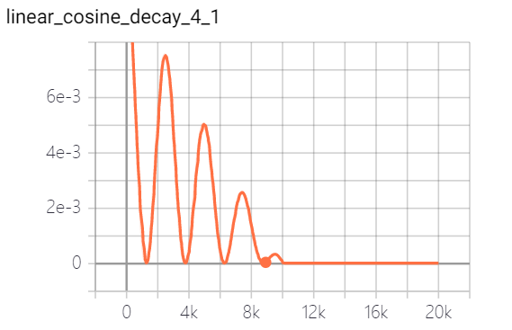


## 循环学习率衰减

循环学习率衰减：参考[Stochastic Gradient Descent  with warm Restart (SGDR)](https://arxiv.org/abs/1608.03983)，学习率以循环周期进行衰减。

* 方法接口

  ```
  tf.train.cosine_decay_restarts
  ```

  * learning_rate: 基学习率
  * first_decay_steps: 第一个衰减周期迭代次数

  * t_mul: 迭代次数因子，用于推导第i个周期的迭代次数

  * m_mul: 学习率衰减因子，用于推导第i个周期的初始学习率
  * alpha：最小学习率

* 代码验证

* ```python
  import os
  import tensorflow as tf
  
  summary_path = './summary'
  method = 'cosine_decay_cycle'
  
  max_step = 20000
  base_learning_rate = 0.01
  first_decay_step = 5000
  alpha = 0.0001
  summary_step = 10
  
  def main():
  
      global_step_op = tf.train.get_or_create_global_step()
  
      learning_rate =  tf.train.cosine_decay_restarts(learning_rate=base_learning_rate,
                                                      first_decay_steps=first_decay_step,
                                                      t_mul = 1,
                                                      m_mul = 1,
                                                      alpha=alpha,
                                                      global_step=global_step_op,
                                                      name="cosine_decay_cycle")
      tf.summary.scalar("cosine_decay_cycle_1_1", learning_rate)
      learning_rate = tf.train.cosine_decay_restarts(learning_rate=base_learning_rate,
                                                     first_decay_steps=first_decay_step,
                                                     t_mul=2,
                                                     m_mul=1,
                                                     alpha=alpha,
                                                     global_step=global_step_op,
                                                     name="cosine_decay_cycle")
      tf.summary.scalar("cosine_decay_cycle_2_1", learning_rate)
      learning_rate = tf.train.cosine_decay_restarts(learning_rate=base_learning_rate,
                                                     first_decay_steps=first_decay_step,
                                                     t_mul=2,
                                                     m_mul=0.5,
                                                     alpha=alpha,
                                                     global_step=global_step_op,
                                                     name="cosine_decay_cycle")
      tf.summary.scalar("cosine_decay_cycle_2_05", learning_rate)
      summary_op = tf.summary.merge_all()
  
      init_op = tf.group(tf.global_variables_initializer(),
                         tf.local_variables_initializer())
  
      with tf.Session() as sess:
          sess.run(init_op)
  
          summary_write = tf.summary.FileWriter(os.path.join(summary_path, method))
          coord = tf.train.Coordinator()
          threads = tf.train.start_queue_runners(sess, coord)
          try:
              if not coord.should_stop():
                  for step in range(max_step):
                      if step % summary_step == 0:
                          summary, global_step = sess.run([summary_op, global_step_op], feed_dict={global_step_op:step})
                          summary_write.add_summary(summary, global_step=global_step)
                          summary_write.flush()
  
                      summary, global_step = sess.run([summary_op, global_step_op], feed_dict={global_step_op:step})
  
          except Exception as e:
              # Report exceptions to the coordinator.
              coord.request_stop(e)
          finally:
              coord.request_stop()
              coord.join(threads)
              print('all threads are asked to stop!')
  
  if __name__ == "__main__":
      main()
  ```

* 输出结果


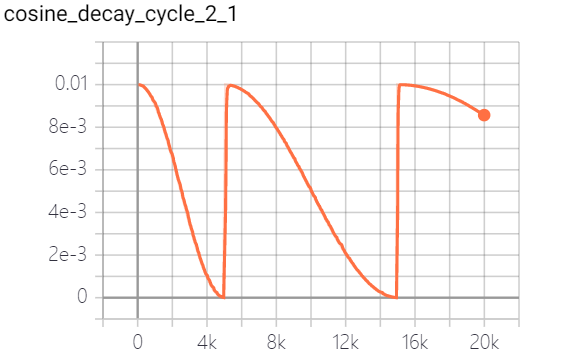

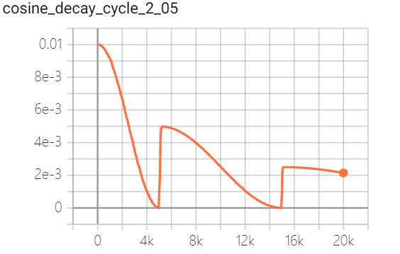

## 单循环学习率衰减 

单循环学习率衰减比较有代表性的就是warm-up衰减策略，它可以分为两个阶段：第一个阶段，学习率从很小的学习率（warm-up learning rate）增加到基学习率（base learning rate），这一阶段也称为warm-up阶段。第二阶段，从基学习开始，执行学习率衰减。

warm-up 动机：

* 对于第一阶段，由于刚开始训练时,模型的权重(weights)是随机初始化的，这时模型对于数据的“分布”理解为零，在初始训练阶段， 每个输入数据对模型来说都是新的， 模型会根据数据对模型权重进行修正。此时若选择一个较大的学习率,如果这时候学习率就很大，极有可能导致模型对开始的数据“过拟合”，后面要通过多轮训练才能拉回来，浪费时间。当训练了一段（几个epoch）后，模型已经对数据集分布有一定了解，或者说对当前的batch而言有了一些正确的先验，较大的学习率就不那么容易会使模型跑偏，所以可以适当调大学习率。这个过程就可以看做是warm-up。对于第二阶段，当模型一定阶段（如十几个epoch）后,模型的分布就已经比较固定了，模型慢慢趋于稳定。这时再执行学习率衰减， 可以使得模型获得更快的收敛速度。warm-up 有助于减缓模型在初始阶段对mini-batch的提前过拟合现象，保持分布的平稳。
* 我们通常采用mini-batch作为输入数据喂入网络进行训练，小的mini-batch会导致样本方差较大。对于小的mini-batch,在训练的过程中，如果有mini-batch内的数据分布方差特别大，这就会导致模型学习剧烈波动，使其学得的权重很不稳定，这在训练初期最为明显，最后期较为缓解。warm-up策略有助于保持模型深层的稳定性。

### exponential decay with born-in

学习率在刚开始的固定时间段内固定在 特定学习率，然后再转换为常规的指数衰减阶段。

* 方法接口

  ```python
  exponential_decay_with_burnin
  ```

  * learning_rate_base：基学习率
  *  learning_rate_decay_steps=：学习率衰减步数
  * learning_rate_decay_factor：学习率衰减因子
  * burnin_learning_rate：在born-in阶段的初始学习率
  * burnin_steps：born-in 阶段的步数
  * staircase：是否以离散的时间间隔衰减学习率

* 代码验证

  ```python
  import os
  import tensorflow as tf
  
  summary_path = './summary'
  method = 'exponential_decay_with_burnin'
  
  max_step = 20000
  base_learning_rate = 0.01
  decay_rate = 0.98
  decay_steps = 2000
  burnin_learning_rate = 0.001  # burn-in learning rate
  burnin_steps = 2000
  summary_step = 10
  
  def main():
  
      global_step_op = tf.train.get_or_create_global_step()
  
      learning_rate = exponential_decay_with_burnin(learning_rate_base=base_learning_rate,
                                                    learning_rate_decay_steps=decay_steps,
                                                    learning_rate_decay_factor=decay_rate,
                                                    burnin_learning_rate=burnin_learning_rate,
                                                    burnin_steps=burnin_steps,
                                                    staircase=True,
                                                    global_step=global_step_op)
      tf.summary.scalar("exponential_decay_with_burnin", learning_rate)
      summary_op = tf.summary.merge_all()
  
      init_op = tf.group(tf.global_variables_initializer(),
                         tf.local_variables_initializer())
  
      with tf.Session() as sess:
          sess.run(init_op)
  
          summary_write = tf.summary.FileWriter(os.path.join(summary_path, method))
          coord = tf.train.Coordinator()
          threads = tf.train.start_queue_runners(sess, coord)
          try:
              if not coord.should_stop():
                  for step in range(max_step):
                      if step % summary_step == 0:
                          summary, global_step = sess.run([summary_op, global_step_op], feed_dict={global_step_op:step})
                          summary_write.add_summary(summary, global_step=global_step)
                          summary_write.flush()
  
                      summary, global_step = sess.run([summary_op, global_step_op], feed_dict={global_step_op:step})
  
          except Exception as e:
              # Report exceptions to the coordinator.
              coord.request_stop(e)
          finally:
              coord.request_stop()
              coord.join(threads)
              print('all threads are asked to stop!')
  
  
  def exponential_decay_with_burnin(global_step,
                                    learning_rate_base,
                                    learning_rate_decay_steps,
                                    learning_rate_decay_factor,
                                    burnin_learning_rate=0.0,
                                    burnin_steps=0,
                                    min_learning_rate=0.0,
                                    staircase=True):
    """Exponential decay schedule with burn-in period.
    In this schedule, learning rate is fixed at burnin_learning_rate
    for a fixed period, before transitioning to a regular exponential
    decay schedule."""
  
    if burnin_learning_rate == 0:
      burnin_learning_rate = learning_rate_base
  
    def eager_decay_rate():
      """Callable to compute the learning rate."""
      post_burnin_learning_rate = tf.train.exponential_decay(
          learning_rate_base,
          global_step - burnin_steps,
          learning_rate_decay_steps,
          learning_rate_decay_factor,
          staircase=staircase)
      if callable(post_burnin_learning_rate):
        post_burnin_learning_rate = post_burnin_learning_rate()
      return tf.maximum(tf.where(
          tf.less(tf.cast(global_step, tf.int32), tf.constant(burnin_steps)),
          tf.constant(burnin_learning_rate),
          post_burnin_learning_rate), min_learning_rate, name='learning_rate')
  
    if tf.executing_eagerly():
      return eager_decay_rate
    else:
      return eager_decay_rate()
  
  
  if __name__ == "__main__":
      main()
  ```

  

* 输出结果

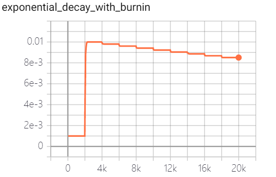

### piecewise  decay with warm-up

带预热的分段常数衰减

* 方法接口

  ```python
  piecewise_with_warmup
  ```

  * boundaries：学习率衰减边界；
  * values：不同阶段对应学习率。
  * warmup：warm-up 标志，如果为 True, 分段衰减的第一阶段采用warm-up策略，如果为False,等价于常规的分段常数衰减

* 代码验证

  ```python
  import os
  import tensorflow as tf
  
  summary_path = './summary'
  method = 'piecewise_with_warmup'
  
  max_step = 20000
  base_learning_rate = 0.01
  warmup_rates = 0.00001
  decay_boundaries = [5000, 8000]
  learning_rates = [base_learning_rate, base_learning_rate/10., base_learning_rate/100.]
  
  warmup_steps = 2000
  decay_boundaries_warmup = [warmup_steps, 5000, 8000]
  learning_rates_warmup = [warmup_rates, base_learning_rate, base_learning_rate/10., base_learning_rate/100.]
  
  
  summary_step = 10
  
  def main():
  
      global_step_op = tf.train.get_or_create_global_step()
  
      learning_rate_no_warmup = piecewise_with_warmup(boundaries=decay_boundaries,
                                                rates = learning_rates,
                                                warmup=False,
                                                global_step=global_step_op,)
      tf.summary.scalar("piecewise_no_warmup", learning_rate_no_warmup)
      learning_rate_with_warmup = piecewise_with_warmup(boundaries=decay_boundaries_warmup,
                                                rates=learning_rates_warmup,
                                                warmup=True,
                                                global_step=global_step_op, )
      tf.summary.scalar("piecewise_with_warmup", learning_rate_with_warmup)
      summary_op = tf.summary.merge_all()
  
      init_op = tf.group(tf.global_variables_initializer(),
                         tf.local_variables_initializer())
  
      with tf.Session() as sess:
          sess.run(init_op)
  
          summary_write = tf.summary.FileWriter(os.path.join(summary_path, method))
          coord = tf.train.Coordinator()
          threads = tf.train.start_queue_runners(sess, coord)
          try:
              if not coord.should_stop():
                  for step in range(max_step):
                      if step % summary_step == 0:
                          summary, global_step = sess.run([summary_op, global_step_op], feed_dict={global_step_op:step})
                          summary_write.add_summary(summary, global_step=global_step)
                          summary_write.flush()
  
                      summary, global_step = sess.run([summary_op, global_step_op], feed_dict={global_step_op:step})
  
          except Exception as e:
              # Report exceptions to the coordinator.
              coord.request_stop(e)
          finally:
              coord.request_stop()
              coord.join(threads)
              print('all threads are asked to stop!')
  
              
  def piecewise_with_warmup(global_step, boundaries, rates, warmup=False):
    """Manually stepped learning rate schedule
    """
    if any([b < 0 for b in boundaries]) or any(
        [not isinstance(b, int) for b in boundaries]):
      raise ValueError('boundaries must be a list of positive integers')
    if any([bnext <= b for bnext, b in zip(boundaries[1:], boundaries[:-1])]):
      raise ValueError('Entries in boundaries must be strictly increasing.')
    if any([not isinstance(r, float) for r in rates]):
      raise ValueError('Learning rates must be floats')
    if len(rates) != len(boundaries) + 1:
      raise ValueError('Number of provided learning rates must exceed '
                       'number of boundary points by exactly 1.')
  
    if boundaries and boundaries[0] == 0:
      raise ValueError('First step cannot be zero.')
  
    if warmup and boundaries:
      slope = (rates[1] - rates[0]) * 1.0 / boundaries[0]
      warmup_steps = list(range(boundaries[0]))
      warmup_rates = [rates[0] + slope * step for step in warmup_steps]
      boundaries = warmup_steps + boundaries
      rates = warmup_rates + rates[1:]
    else:
      boundaries = [0] + boundaries
    num_boundaries = len(boundaries)
  
    def eager_decay_rate():
      """Callable to compute the learning rate."""
      rate_index = tf.reduce_max(tf.where(
          tf.greater_equal(global_step, boundaries),
          list(range(num_boundaries)),
          [0] * num_boundaries))
      return tf.reduce_sum(rates * tf.one_hot(rate_index, depth=num_boundaries),
                           name='learning_rate')
    if tf.executing_eagerly():
      return eager_decay_rate
    else:
      return eager_decay_rate()
  
  
  if __name__ == "__main__":
      main()
  ```

* 输出结果

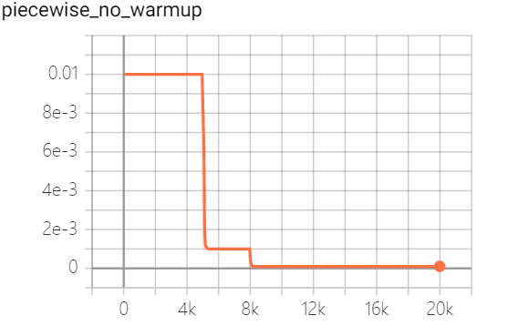

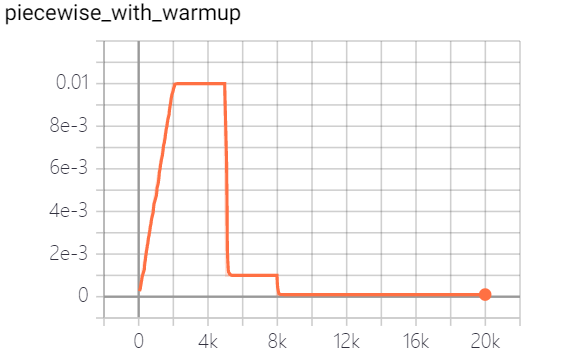

### cosine decay with warm-up

带预热的余弦衰减

* 方法接口

  ```python
  piecewise_with_warmup
  ```

  * learning_rate_base: 基学习率
  * total_decay_steps: 总的学习率衰减步数
  * alpha: 最小学习率
  * warmup_learning_rate：warm-up 学习率
  * warmup_steps： warm-up 迭代次数
  * hold_base_rate_steps：保持基学习率的步数

* 代码验证

  ```python
  import os
  import numpy as np
  import tensorflow as tf
  
  summary_path = './summary'
  method = 'cosine_decay_with_warmup'
  
  max_step = 20000
  total_decay_step = 15000 # under normal conditions the total_step equal to max_step
  base_learning_rate = 0.01
  warmup_learning_rate = 0.0001
  warmup_steps = 2000
  hold_base_rate_steps_2000 = 2000
  hold_base_rate_steps_0 = 0
  alpha = 0.00001
  summary_step = 10
  
  def main():
  
      global_step_op = tf.train.get_or_create_global_step()
  
      learning_rate = cosine_decay_with_warmup(learning_rate_base=base_learning_rate,
                                               total_decay_steps=total_decay_step,
                                               alpha = alpha,
                                               warmup_learning_rate=warmup_learning_rate,
                                               warmup_steps=warmup_steps,
                                               hold_base_rate_steps=hold_base_rate_steps_2000,
                                               global_step=global_step_op)
      tf.summary.scalar("cosine_decay_with_warmup_hold_2000", learning_rate)
      learning_rate = cosine_decay_with_warmup(learning_rate_base=base_learning_rate,
                                               total_decay_steps=total_decay_step,
                                               alpha=alpha,
                                               warmup_learning_rate=warmup_learning_rate,
                                               warmup_steps=warmup_steps,
                                               hold_base_rate_steps=0,
                                               global_step=global_step_op)
      tf.summary.scalar("cosine_decay_with_warmup_hold_no", learning_rate)
      summary_op = tf.summary.merge_all()
  
      init_op = tf.group(tf.global_variables_initializer(),
                         tf.local_variables_initializer())
  
      with tf.Session() as sess:
          sess.run(init_op)
  
          summary_write = tf.summary.FileWriter(os.path.join(summary_path, method))
          coord = tf.train.Coordinator()
          threads = tf.train.start_queue_runners(sess, coord)
          try:
              if not coord.should_stop():
                  for step in range(max_step):
                      if step % summary_step == 0:
                          summary, global_step = sess.run([summary_op, global_step_op], feed_dict={global_step_op:step})
                          summary_write.add_summary(summary, global_step=global_step)
                          summary_write.flush()
  
                      summary, global_step = sess.run([summary_op, global_step_op], feed_dict={global_step_op:step})
  
          except Exception as e:
              # Report exceptions to the coordinator.
              coord.request_stop(e)
          finally:
              coord.request_stop()
              coord.join(threads)
              print('all threads are asked to stop!')
  
  def cosine_decay_with_warmup(global_step,
                               learning_rate_base,
                               total_decay_steps,
                               alpha = 0.0,
                               warmup_learning_rate=0.0,
                               warmup_steps=0,
                               hold_base_rate_steps=0):
    """Cosine decay schedule with warm up period.
    In this schedule, the learning rate grows linearly from warmup_learning_rate
    to learning_rate_base for warmup_steps, then transitions to a cosine decay
    schedule."""
    def eager_decay_rate():
      """Callable to compute the learning rate."""
      learning_rate = tf.train.cosine_decay(learning_rate=learning_rate_base,
                                            decay_steps=total_decay_steps - warmup_steps - hold_base_rate_steps,
                                            global_step= global_step - warmup_steps - hold_base_rate_steps,
                                            alpha=alpha)
      if hold_base_rate_steps > 0:
        learning_rate = tf.where(
            global_step > warmup_steps + hold_base_rate_steps,
            learning_rate, learning_rate_base)
      if warmup_steps > 0:
        if learning_rate_base < warmup_learning_rate:
          raise ValueError('learning_rate_base must be larger or equal to '
                           'warmup_learning_rate.')
        slope = (learning_rate_base - warmup_learning_rate) / warmup_steps
        warmup_rate = slope * tf.cast(global_step,
                                      tf.float32) + warmup_learning_rate
        learning_rate = tf.where(global_step < warmup_steps, warmup_rate,
                                 learning_rate)
      return tf.where(global_step > total_decay_steps, alpha, learning_rate,
                      name='learning_rate')
  
    if tf.executing_eagerly():
      return eager_decay_rate
    else:
      return eager_decay_rate()
  
  
  if __name__ == "__main__":
      main()
  ```

  

* 输出结果

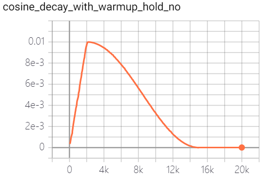

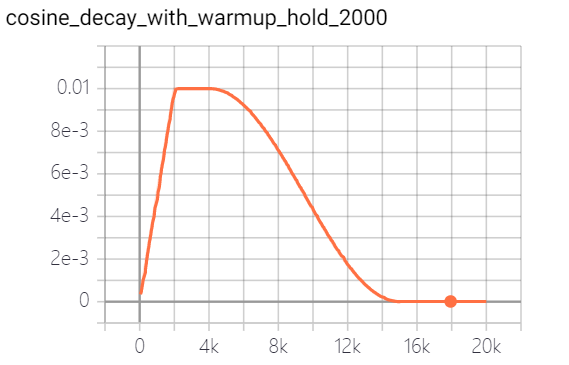

## 参考资料

* <https://github.com/tensorflow/models/blob/v1.13.0/official/resnet/resnet_run_loop.py#L225>
* <https://github.com/tensorflow/models/blob/master/research/object_detection/utils/learning_schedules.py>
* <https://www.zhihu.com/question/338066667/answer/771252708>

