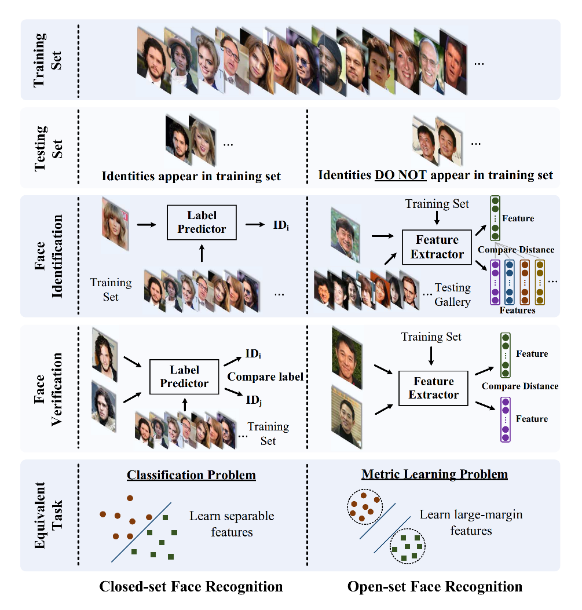
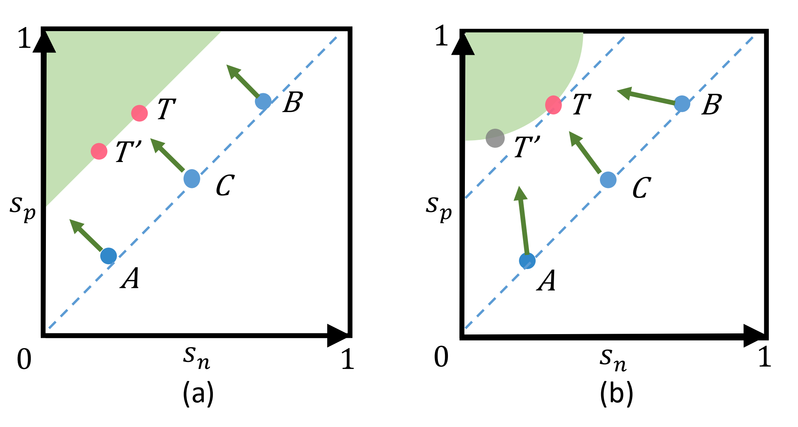
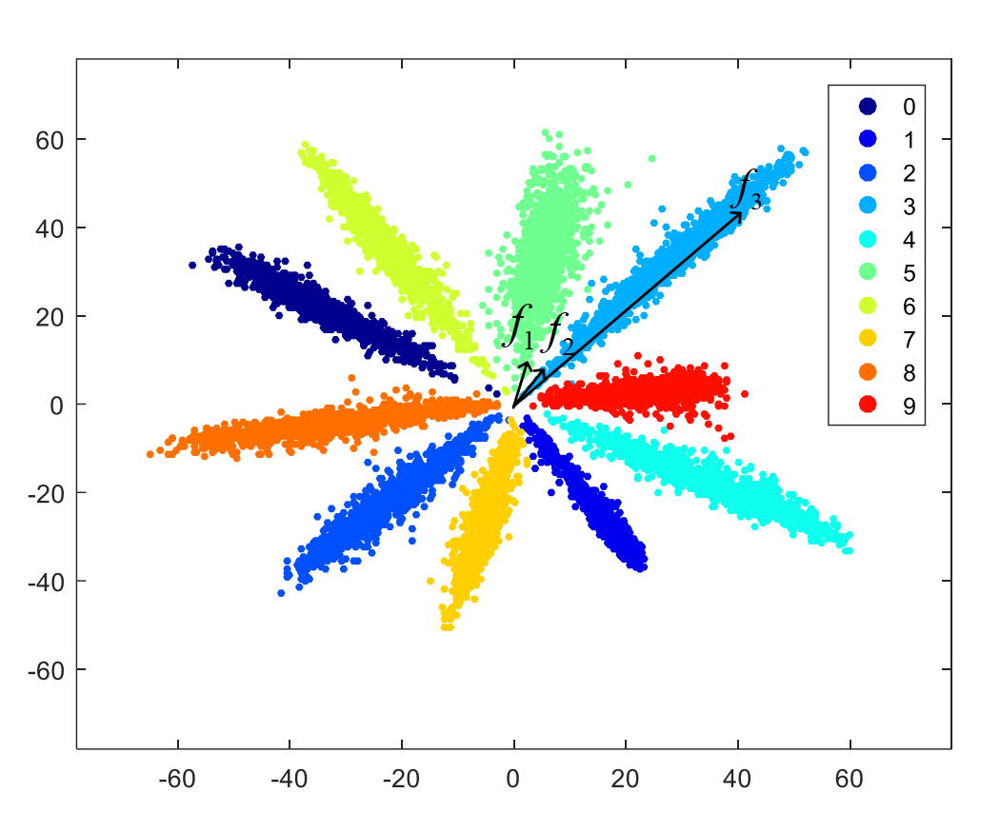

# 人脸识别技术总结

## 概述

一个端到端的人脸识别系统通常包括人脸检测，人脸配准、人脸表示三个关键元素。可以表示为给定一张自然图像，输出图像中人脸的特征。

人脸识别根据训练集与验证集的数据分布的关系可以分为闭集合人脸识别和开放集合人脸识别问题。**闭集合人脸识别**问题中测试集的ID 样本会出现在训练集中，因此可以作为一个分类问题被解决，而分类问题的优化目标是希望特征可分离。**开放集合人脸识别**问题是我们实际中的场景，测试集与训练集通常不相交。由于不可能把测试集的分类人脸到训练集中已知的实体， 我们需要将人脸映射到判别特征空间。

开放集合人脸识别本质上是一个度量学习问题，其关键是学习到有判别力的大裕度特征。与分类问题相比，度量学习的目标是大的类间（class-inter）方差和小的类间（class-intra） 方差。

## 基于深度学习的算法

人脸识别算法的损失函数可以分为基于欧式距离的损失、基于角/余弦裕度的损失和 softmax 损失及其变种等三种类型。

### 基于欧式距离的损失

基于欧式距离的损失将图像嵌入到欧式空间，使得类内方差减小，类间方差增大。

* DeepID2(2014)

  识别损失(Identification Loss)将每个人脸分类到每个不同的实体
  $$
  Ident(f,t,\theta_{id}) = -log\hat{p}_t
  $$
  

  验证损失(Vertification Loss)直接正则化DeepID2，同时降低人脸内部的变化
  $$
  Verif(f_i,f_j,y_{ij},\theta_{ve})=
  \begin{cases}
  \frac{1}{2}|| f_i-f_j||_2^2  \quad &if\, y_{ij}=1\\
  \frac{1}{2}max(0,m-||f_i-f_j||)^2 &if\,y_{ij}=-1\\
  \end{cases}
  $$

* FaceNet(2015)
  $$
  ||f(x_i^{\alpha})-f(x_i^{p})||_2^2 + \alpha < ||f(x_i^{\alpha})-f(x_i^{n})||_2^2
  $$
  $\alpha$ 表示 anchor；$p$ 表示 positive；$n$表示 negtive。

* Center Loss(2016)

  学习每一个类的中心，并把特征到中心的距离作为惩罚

  $$
  L=L_S + L_C = -\sum_{i=1}^mlog{\frac{e^{W^T_{y_i}x_i+b_{y_i}}}{\sum_{j=1}^ne^{W^T_jx_i+b_j}}} + \frac{\lambda}{2}\sum_{i=1}^m||x_i-c_{y_i}||_2^2
  $$
  $c_{y_i}$ 表示第 $y_i$ 个类中心。

### 基于余弦/角裕度的损失

基于角裕度(angular margin)的损失使学到的特征具有潜在的大的角距离。

* L-Softmax(2016)
  $$
  L_i=-log(\frac{e^{||W_{y_i}||||x_i||\psi(\theta_{y_i})}}{e^{||W_{y_i}||||x_i||\psi(\theta_{y_i})}+\sum_{j\neq y_i}e^{||W_{j}||||x_i||cos(\theta_{j})}})
  $$
  
* A-Softmax/SphereFace(2017)

  A-Softmax 可以看做是对 L-Softmax 的权重归一化的版本。A-Softmax 通过权重归一化，新的决策边界只依赖于角度，能够显示地执行角度优化。A-Softmax 看作是在超球流形约束的情况下优化判别特征。
  $$
  L_i=-log(\frac{e^{||x_i||\psi(\theta_{y_i})}}{e^{\||x_i||\psi(\theta_{y_i})}+\sum_{j\neq y_i}e^{||x_i||cos(\theta_{j})}})
  $$
  
* NormFace(2017)

  
  
* CosFace/AM-Softmax(2018)

  采用更严格的角裕度限制，将乘性的裕度优化方式改为加性的，利于角度优化。通过归一化特征和权重去移出径向变量，在训练时直接优化余弦相似度。
  $$
  L_{lmc}=-\frac{1}{N}(\frac{e^{s(cos(\theta_{y_i}, i)-m)}}{e^{s(cos(\theta_{y_i}, i)-m)}+\sum_{j\neq y_i}e^{||x_i||scos(\theta_{j}, i)}})
  $$

* ArcFace(2019)

  使用加性角裕度去获取更具判别性的特征
  $$
  L=-\frac{1}{N}(\frac{e^{s(cos(\theta_{y_i}+m)}}{e^{s(cos(\theta_{y_i}+m)}+\sum_{j\neq y_i}e^{||x_i||scos(\theta_{j}, i)}})
  $$

* MV-Softmax(2020)

  将困难负例挖掘和角裕度集中到同一的损失函数中。自适应地重点关注误分类的特征向量，以此指导判别性特征学习。

  定义指示函数$I_k$动态地指定一个样本是否为误分类，其中误分类时指数函数为1
  $$
  I_k=
  \begin{cases}
  0,  \quad f(m,cos(\theta_{w_k,x}) \geq0\\
  1,  \quad f(m,cos(\theta_{w_k,x})<0\\
  \end{cases}
  $$
  损失函数如下
  $$
  L=-\frac{1}{N}(\frac{e^{sf(m,\theta_{y_i},x)}}{e^{sf(m,\theta_{y_i},x)}+\sum_{k\neq y_i}h(t,\theta_{k,x},I_k)e^{sf(m,\theta_{k,x},x)}})
  $$
  其中
  $$
  h(t,\theta_{k,x},I_k)=e^{st(cos(\theta_{k},x)+1)I_k}
  $$

  

* Circle Loss(2020)

  针对主流的损失函数将类内相似度 $s_p$ 和类间相似度 $s_n$ 成对去降低$s_p - s_n$，这种优化不灵活，因为每个相似性分数的惩罚强度都被限制为相等。Circle Loss 的动机是如果一个相似度分数远离最优点，它应该被强调。Circle Loss 通过重新加权每个相似度得分去强调欠优化的相似度分数。

  之所以成为Circle Loss 是因为它的决策边界是个圆，如图b

  
  $$
  \begin{align} L_{circle}=& log[1+\sum_{i=1}^K\sum_{j=1}^Lexp(\gamma(\alpha_n^js_n^j-\alpha_p^is_p^i))] \\ =& log[1+\sum_{j=1}^Lexp(\gamma\alpha_n^js_n^j)\sum_{i=1}^Kexp(-\gamma\alpha_p^is_p^i)] \end{align}
  $$
  其中 $\alpha_p^i$ 和 $\alpha_n^j$为非负的权重因子 
  $$
  \begin{cases}
  \alpha_p^i=[O_p-s_p^i]_+\\
  \alpha_n^j=[s_n^j-O_s]_+\\
  \end{cases}
  $$
  全局最优点可以表示为
  $$
  \begin{cases}
  O_p=1+m\\
  O_n=-m\\
  \end{cases}
  $$

* CurricularFace(2020)

  按照从简单到困难的程度来学习课程，这样容易使模型找到更好的局部最优，同时加快训练速度。与 MV-Softmax 相比，不总是强调困难样例，在早期阶段关注容易样本， 在后期关注困难样本，并根据样例的困难程度对困难样例分配不同的权重。
  $$
  L=-\frac{1}{N}(\frac{e^{s(cos(\theta_{y_i}+m)}}{e^{s(cos(\theta_{y_i}+m)}+\sum_{j\neq y_i}e^{sN(t^{(k)},cos\theta_j)}})
  $$
  其中$N(t^{(k)},cos\theta_j)$表示正例和负例的相似度分别如下
  $$
  T(cos\theta_{y_i})=cos(\theta_{y_i}+m)
  $$

  $$
  N(t^{(k)},cos\theta_j)=
  \begin{cases}
  cos\theta_j,  \quad T(cos\theta_{y_i})-cos\theta_j\geq 0 \\
  cos\theta_j(t+cos\theta_j),  \quad T(cos\theta_{y_i})-cos\theta_j<0\\
  \end{cases}
  $$

  负例的的相似度函数同时取决于 $t$ 和 $\theta_j$ , $t$ 表示正余弦相似度的移动平均值，随着训练的进行 $t$ 的值逐渐从0增大到1。
  $$
  t^{(k)}=\alpha r^{(k)} +(1-\alpha)r^{(k-1)}
  $$
  其中 $k$表示训练的批次数。
  $$
  r^{(k)}=\sum_icos\theta_{y_i}
  $$

* MagFace(2021)

  MagFace 提出了一个新 Loss，通过该 Loss 学的的特征不仅有良好的区分度，而且特征幅度和人脸质量相关。幅度大的特征对应较容易识别的人脸图片，幅度小的特征对应较难识别的人脸图片。

  

  ArcFace 只利用了相位信息，对所有的特征类别设置了相同的裕度$m$, 论文提出了一种自适应的margin来将 easy samples更加拉近到类中心，而将 hard samples 拉远，因此来获得一个更好的类内特征分布。这样做可以避免模型 过度overfit到一些noisy low-quality 的样本，提高了泛化性。

  另外作者指出，如果只修改margin项，那么该损失函数对于高质量的训练样本来说会非常不稳定，因为这些高质量的样本会有非常高的自由度,会在可行区域内移动。因此，作者提出了正则项来限制这些大 magnitude 的样本。其中， g(a)是一个凸单调减函数。
  $$
  \begin{align} L_{Mag}=& \frac{1}{N}\sum_{i=1}^{N}L_i  \\ L_i=& -log\frac{e^{scos(\theta_{y_i}+m(\alpha_i))}}{e^{scos(\theta_{y_i}+m(\alpha_i))}+\sum_{j\neq y_i}e^{scos\theta_j}}+\lambda_gg(\alpha_i) \end{align}
  $$
  其中$\alpha_i=||f_i||$表示不归一化情况下每个特征二范数，$m(\alpha_i)$表示幅度感知角裕度函数。$g(\alpha_i)$表示正则话项，是一个单调减函数。

### 关键知识点

* 权重归一化的作用

  权重归一化的定义
  $$
  W_k \rightarrow \frac{W_k}{||W_k||_2}
  $$
  **对于权重范数(weight norm)，一般认为样本越多、越简单的类别权重范数越大；反之越小[A-Softmax]。**

  权重归一化主要是为了**改善数据集中长尾分布等数据不平衡问题**，加快网络收敛。

  
* 特征归一化的作用

  特征归一化的定义
  $$
  X \rightarrow \frac{X}{||X||_2}
  $$
  **对于特征范数(feature norm)，一般认为易分/简单样本的特征范数大，难分/困难样本的特征范数小[L2-Softmax]**

  

  NormFace 论文中以 MNIST 数据集为例，给出了数据样本特征的分布图。 上图中$f_1$（困难样本）和$f_2$（困难样本）属于不同类；$f_2$（难分样本）和$f_3$（易分样本）为同一类；。但是由于范数相差太大$f_2$和$f_3$ 的内积反而大于$f_1$和$f_2$的内积，造成误分类。因此使用欧式距离作为特征间相似度的度量是不稳定的。

  我们希望通过余弦角度去作为特征间差异的度量，因此需要**通过特征归一化去剔除范数不稳定性的影响**。
* 尺度系数的作用

  使用了权重归一化和特征归一化后，我们希望网络去学习角度方向的差异。但是加入余弦相似度替换内积训练特征归一化后的模型会可能出现不收敛问题。[NormFace]给出了数值化的分析，指出当权重和特征都归一化为1之后，在类别数较多时，即使是正确分类的样本，都将获得与分错的样本在数值上差不多大小的梯度，而这自然就会影响网络去关注那些更需要学习的样本，所以该模型总是试图给容易分类的样本提供较大的梯度，而不容易分类的样本可能得不到足够的梯度。

  **假设每个类都有相同数量的样本，且所有样本都是很好的分离，所有样本都是正确分类。如果正则话特征和每一列的权重，其中权重的范数为$l$，那么softmax损失将有一个下界（bound)$log（1+（n-1）e^{-\frac{n}{n-1}l^2}）$**

  通过引入一个尺度系数$s$，将权重特征列标准化的值变为更大的值$l$而不是1，softmax 的损失会继续降低。在实际中，在余弦层后直接添加一个缩放层来实现。$s$一般为一个固定值。

  

## 参考资料

* <https://zhuanlan.zhihu.com/p/76391405>

​	
