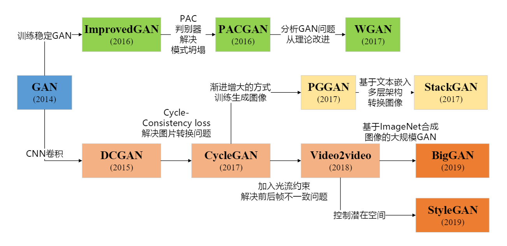

# GAN 基础知识

* GenerativeAdversarialNetworks(GANs)

  * Generative学习一个生成式模型
  * Adversarial使用对抗的方法训练
  * Networks使用神经网络

* GAN 发展脉络

  

* 纳什均衡

  纳什均衡又称为非合作博弈均衡，是博弈论的一个重要术语，以约翰·纳什命名

  纳什均衡是指博弈中这样的局面，对于每个参与者来说，只要其他人不改变策略，他就无法改善自己的状况