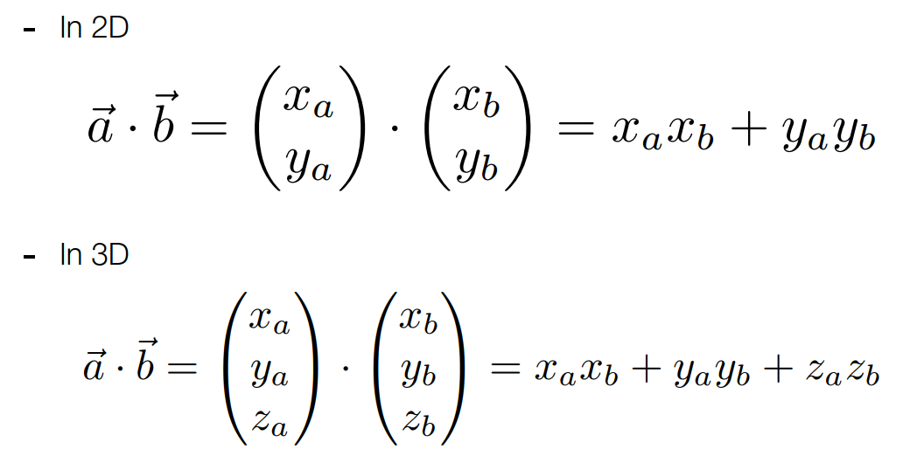
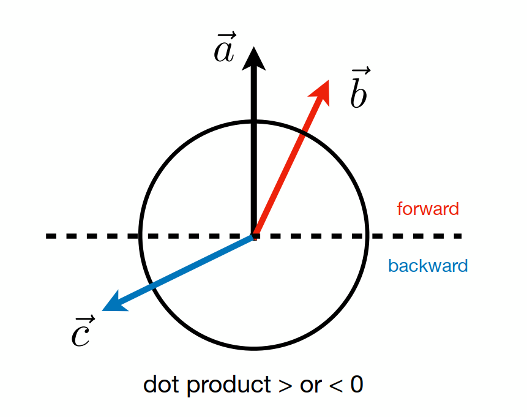
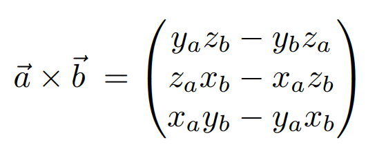
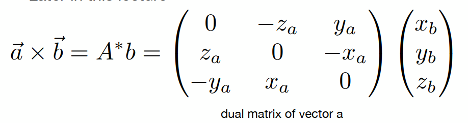
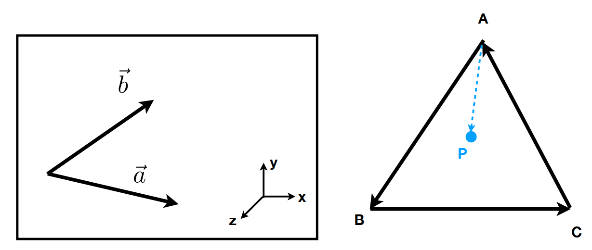

# 计算机图形学概述

## 大纲

* Rasterization(光栅化)

  把三维空间的几何形体显示在屏幕上

* Curves and Meshes（曲线和曲面）

* Ray Tracing（光线追踪）

* Animation / Simulation（动画/模拟）

## 依赖

### Basic mathematics

Linear algebra, calculus, statistics

### Basic physics

Optical, Mechanics

### Misc

signal processing

numerical analysis

### A bit of aesthetics

## Linear algebra

### vector

* vector magnitude  矢量幅度

* cartesian coordinates 笛卡尔坐标系
* orthonormal coordinate 直角坐标系

* Dot(scalar)  product 点乘 

  * find angle between to vector

  * finding projection(投影) of one vector on another

    

  * Measure how close two directions are

  * Decompose a vector

  * Determine forward / 
backward

    

* Cross(vector) Product 叉乘

  * Cross product is orthogonal to initial vectors

  * Direction determined by right-head rule

    

    

  * Determine left / right
  * Determine inside / outside
    

### matrices

In Graphics, pervasively used to represent transformations: Translation, rotation, shear, scale...

## Transforms

### model

### view

