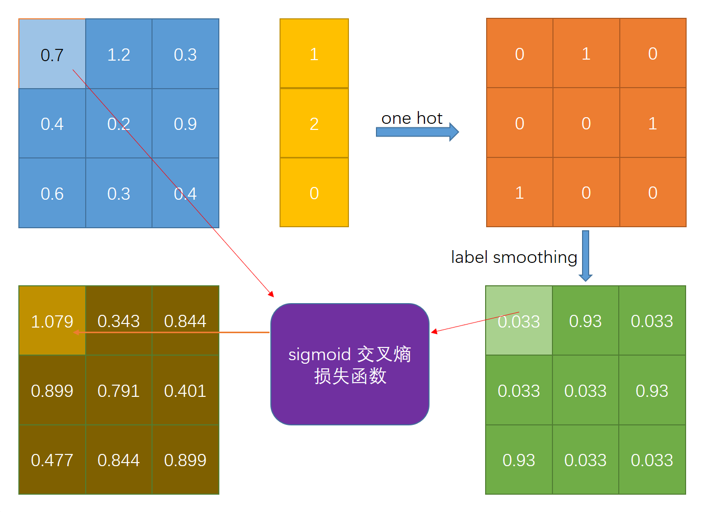
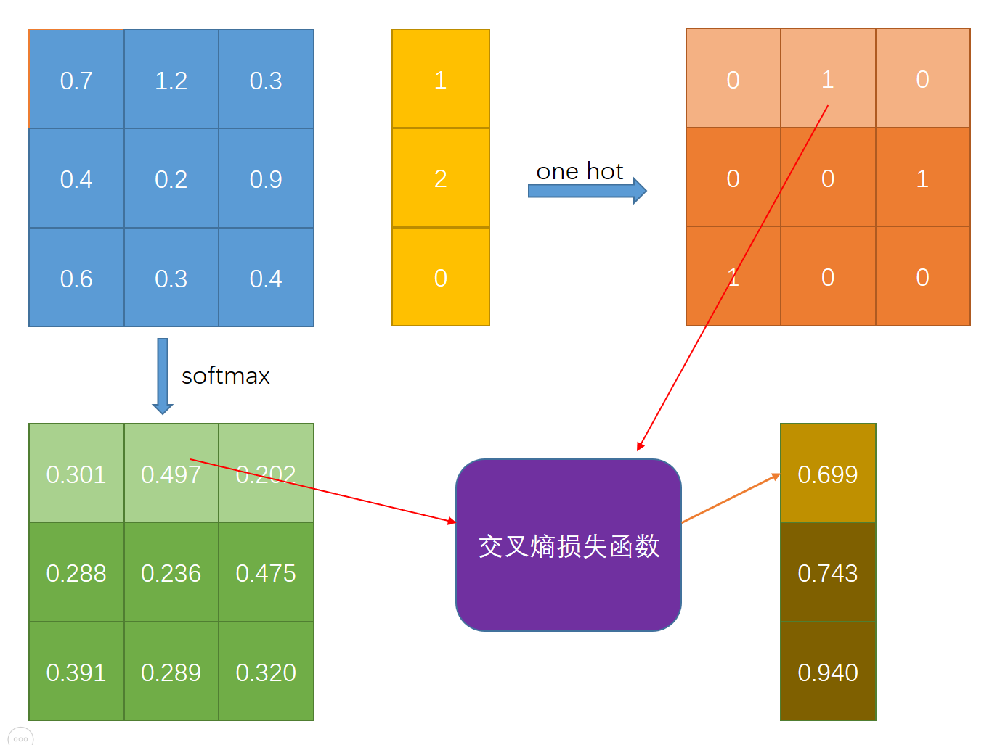

#  图像分类任务中的损失函数

## 基本概念

在机器学习中常见的损失函数有 均方误差损失（Mean Square  Error, MSE）， 合页损失（hinge loss）和 交叉熵损失（cross entropy loss）等。在图像分类任务中通常使用交叉熵损失作为损失函数，关于为什么分类任务中要使用交叉熵损失可以参考[为什么使用交叉熵作为损失函数](https://zhuanlan.zhihu.com/p/63731947)。针对不同的分类任务如二分类、多分类或多标签分类任务，又可以具体分为**sigmoid 交叉熵损失函数**和 **softmax 交叉熵损失函数**两种损失函数。

### 极大似然估计

* 概念

  设$x$为样本，在样本空间$X$内取值；$\theta$为参数，在参数空间$\Theta$内取值。当固定$\theta$, 通过$\theta$去估计$x$在样本空间$X$的分布函数，称为**概率函数**$f(x; \theta)$。当固定$x$, 把$f(x; \theta)$看成$\theta$的定义在参数空间$\Theta$的函数时，称为**似然函数**。在已知样本$x$的情况下，取得似然性最大的值，称为**极大似然估计**。统计意义理解为：把参数$\theta$和样本$x$分别看作是“原因”和“结果”。从正面看，定了$\theta$的值，就可以确定$x$的样本分布; 从反面看，当有了结果$x$时，这个结果**看起来像**由$\theta$而产生的可能性。“似然”的字面意思就是“看起来像”。

* 计算公式

  假设一系列**离散样本**$\{x_1, x_2,...x_n\}$满足独立同分布，对应的概率质量函数（Probability Mass Function, PMF）为$p(x_i;\theta)$（如果为连续分布函数，替换成对应的概率密度函数（ Probability Density Function, PDF）即可）,这时${X=x_1, X=x_2,...X=x_n}$的**联合概率分布**可以表示为
  $$
  L(x_1,x_2...x_n;\theta) = \prod_i^n p(x_i;\theta)  \tag{1-1}
  $$
  其中$x_i$为已知样本， $\theta$为未知参数。**这时$L(x_1,x_2...x_n;\theta) $就是样本组{x_1, x_2,...x_n\}的似然函数**。

  **求解极大似然估计等价于在参数空间$\Theta$中找到使得似然函数取得最大值的参数$\hat{\theta}$, 这时$\hat{\theta}$称为似然函数的极大似然估计。**

  到这里容易得到，求解极大似然估计， 只需要对似然函数$L(x_1,x_2...x_n;\theta)$求导，**取得的极值点就是极大似然估计值**。

  实际中为了方便求解，通常讲似然函数转换为效果等价的对数似然函数
  $$
  ln(L(x_1,x_2...x_n;\theta)) = \sum_i^n ln(p(x_i;\theta))  \tag{1-2}
  $$
  然后再对对数似然函数进行求导，求解极大似然估计值。

* 实例说明

  以对于抛硬币实验， 单次抛掷硬币正面朝上的概率称为参数$\theta$。

  **已知硬币参数$\theta$，就可以去推测抛硬币的各种情况$x$的可能性, 称为概率。** 

  假设$\theta=0.6$, 推测抛10次硬币，其中6次正面朝上的概率为
  $$
  P(6;0.5) = C_{10}^{6}(0.6)^6(1-0.6)^4  \approx 0.2508  \tag{1-3}
  $$
  **硬币参数$\theta$ 未知，通过抛硬币的情况去推测硬币的参数，称为似然， 而得到的最可能的参数称为极大似然估计值**。

  同样还是抛硬币实验， 假设进行了10次独立实验获得的一组结果为：正、正、反、正、正、反、正、反、正、反，且$X$满足Bernoulli 分布，即$P（{X=正}）= \theta$, $P（{X=反}）= 1- \theta$。这组的数据的极大似然估计求解过程如下

  首先建立似然函数： 
  $$
  \begin{align}
  L(x_1, x_2,...,x_{10};\theta ) =& \theta* \theta * (1-\theta) * \theta*\theta*(1-\theta)*\theta*(1-\theta)*\theta*(1-\theta) \\
  =& \theta^6 * (1-\theta)^4   \tag{1-3}
  \end{align}
  $$
  对应的对数似然函数为
  $$
  \begin{align}
  ln(L(x_1, x_2,...,x_{10};\theta )) =& ln(\theta^6 * (1-\theta)^4) = 6ln(\theta) + 4ln(1-\theta) \tag{1-4}
  
  \end{align}
  $$
  对数似然函数求导获得极值点
  $$
  \frac{dln(L(x_1, x_2,...,x_{10};\theta ))}{d\theta} = \frac{6}{\theta} -\frac{4}{1-\theta} = 0  \tag{1-5}
  $$
  容易得到极大似然估计结果$\hat{\theta}$(即极大值点)的值为 $\hat{\theta} = 0.6$

如果想进一步了解极大似然估计的可以参考[如何通俗地理解概率论中的「极大似然估计法」?](https://www.zhihu.com/question/24124998/answer/1304697251)，大佬给出了生动的解释。

### 交叉损失熵

* 熵

  在信息论中，熵(entropy) 用来衡量一个随机事件的不确定性。  假设随机变量$X$, 对应的概率分布为$p(x)$， **自信息$I(x)$**表示$X=x$时的信息量或编码长度，表示为
  $$
  I(x)= -log(p(x))  \tag{1-7}
  $$
  这时随机变量$X$的熵为
  $$
  H(X) = - \sum p(x)log(p(x))  \tag{1-8}
  $$
  熵是一个随机变量的平均编码长度，即自信息的数学期望。熵越高，则随机变量的信息越多；熵越低，则信息越少。  

* 交叉熵

  交叉熵（Cross Entropy）是按照**概率分布q**的最优编码对**真实分布为p**的信息进行编码的长度，定义为  
  $$
  H(p,q) = - \sum_x p(x)log(q(x))  \tag{1-9}
  $$
  在给定p的情况下，如果q 和p越接近，交叉熵越小；如果q 和p越远，交叉熵就越大。  

* 相对熵

  相对熵(Relative Entropy)又称为KL散度（Kullback-Leibler Divergence），是用概率分布q 来近似p时所造成的信息损失量。  对于离散概率分布p和q，从q 到p的KL散度定义为
  $$
  \begin{align}
  D_{KL}(p||q) =& H(p,q) - H(p) = \sum p(x)log\frac{p(x)}{q(x)} \\
  =& \sum p(x)log(p(x)) -\sum p(x)logq(x)  \tag{1-10}
  \end{align}
  $$
  KL散度可以是衡量两个概率分布之间的距离。   

考虑一组训练集$\mathbb{X}=\{x^{(1)}, x^{(2)},...,x^{(m)}\}$由m个独立同分布的样本组成，即每个数据由未知的真实数据分布$p_{data}(x)$独立随机地产生。

令$p_{model}(x:\theta)$是一族由$\theta$ 确定再相同空间上概率分布， 即模型的参数$\theta$属于同一个参数空间$\Theta$。**通过$p_{model}(x:\theta)$可以将输入$x$进行映射操作，得到真实概率$p_{data}(x)$的估计值。**

**模型训练的目标是使得模型分布$p_{model}(x:\theta)$尽可能地和检验分布$p_{data}(x)$想匹配**，**等价于获取$\theta$的最大似然估计$\hat{\theta}$, 使得模型分布$p_{model}(x:\theta)$概率取得极大值。**极大似然估计可以表示为
$$
\hat{\theta} = \underset{\theta}{argmax} \prod_i^m logp_{model}(x^{(i)}:\theta) \tag{1-11}
$$
进一步得到等价的对数形式最大似然估计
$$
\hat{\theta} = \underset{\theta}{argmax} \mathbb{E}_{x \sim \hat{p}_{data}} logp_{model}(x:\theta) \tag{1-12}
$$
极大似然估计可以看作是最小化训练集上的经验分布$\hat{p}_{data}$和模型分布$p_{model}$之间的差异。两者之间的差异度可以用KL散度度量。KL散度可以被定义为
$$
\begin{align}
D_{KL}(\hat{P}_{data}||p_{model}) =& \mathbb{E}_{x\sim\hat{p}_{data}}[log\hat{p}_{data} - logp_{model}] \\
=&  \mathbb{E}_{x\sim\hat{p}_{data}}log\hat{p}_{data} -  \mathbb{E}_{x\sim\hat{p}_{data}}logp_{model} \tag{1-13}
\end{align}
$$
其中左边一项对应数据生成过程，与模型无关。在训练模型最小化KL散度时，只需要考虑最小化第二项 $-  \mathbb{E}_{x\sim\hat{p}_{data}}logp_{model}$

公式$(1-10)$与$(1-12)$本质上相同, 容易得到
$$
-  \mathbb{E}_{x\sim\hat{p}_{data}}logp_{model} = -\sum \hat{p}_{data}logp_{model}   \tag{1-14}
$$
结合公式$(1-9)$可以得到，**最小化KL散度其实就是最小化分布之间的交叉熵。**最大化最大似然变成最小化对数似然函数或者等价的最小化交叉熵。

## sigmoid 交叉熵损失函数

> sigmoid 交叉损失函数主要用于度量离散分类任务中每个类**独立**且**不互斥**的情况下的概率误差。

**不互斥是指一个样本的可能具有多个类别，样本属于每个分类的概率之和可能不等于1**。sigmoid 交叉损失函数主要用于**二分类任务** 和 **多标签分类问题**。

sigmoid函数可以表示为
$$
\sigma(x) = \frac{1}{1+e^{-x}} \tag{2-1}
$$


### 二分类

对于二分类问题，输出预测结果$f(x;\theta)$一个标量值（scalar), 输入标签为$y \in {0, 1}$，损失函数可以表示为
$$
L(y;f(x;\theta)) = -y\times log\sigma(f(x;\theta)) - (1-y)log(1-\sigma(f(x;\theta)))  \tag{2-2}
$$


### 多标签分类

对于多标签分类，输出的预测结果为一个tensor，其中每个位置分别对应类别的概率， 输入标签为多分类标签。

计算过程将输出结果的每个节点使用sigmoid 函数激活，然后再使用激活后的每个输出节点与对应的输入节点做交叉损失熵。本质上就是对每一个输出节点与对应的输入节点计算二分类交叉熵损失。

这里参考YOLOv3中的分类损失函数，使用label-smoothing 构造多标签，进行多标签分类说明。

假设输出的预测结果为 
$$
f(x;\theta) =\left[ \begin{matrix} 0.7 & 0.2 & 0.3 \\ 0.4 & 0.2 & 0.9 \\ 0.6 & 0.3 & 0.4 \end{matrix} \right]
$$
输入的标签为
$$
y =\left[ \begin{matrix} 1 \\ 2 \\ 0 \end{matrix} \right]
$$


首先将输入标签进行独热(one-hot)编码，结果如图橙色（**对于常规多标签分类忽略这一步操作**）

```
labels = tf.one_hot(labels, depth)
```

然后采用label-smoothing 构建soft one-hot 标签， smoothing 可以理解为给one-hot 标签加入噪声，减少了真实样本标签的类别在计算损失函数时的权重，最终起到抑制过拟合的效果。（**对于常规多标签分类忽略这一步操作**）

```python
def label_smoothing(inputs, epsilon=0.1):
    """
    label smoothing
    see. https://arxiv.org/abs/1906.02629
    :param inputs: input_label
    :param epsilon: smoothing rate
    :return:
    """
    v = inputs.get_shape().as_list()[-1]
    return tf.multiply(1.0-epsilon, inputs) + tf.div(epsilon, v)
```

**注意，对于正常的多标签分类任务， 不需要进行前两步 one-hot 和 label smoothing 操作 ！！！**

最后对输入的预测结果和平滑后的标签， 逐个节点计算对应的交叉熵损失，下面以坐标为$(0,0)$的输出节点的交叉熵损失的计算为例进行说明。此时 $y=0.033$, $f(x;\theta)=1.103$, 带入$(2-2)$式进行计算。
$$
L((0,0);\theta) = -(0.033 \times log(\frac{1}{1+e^{-1.103}}) + (1-0.033) \times log(1- \frac{1}{1+e^{-1.103}})) = 1.07985271089  \tag{2-3}
$$
可以看出， 由于对预测数据逐个节点计算，因此最后得到的sigmoid 交叉熵损失与输入的预测数据保持相同的形状。

### 自定义sigmoid交叉熵损失函数

```python
def sigmoid_cross_entropy(logits=None, labels=None):
    """
    x = logits, z = labels
    loss = z * -log(sigmoid(x)) + (1 - z) * -log(1 - sigmoid(x))
         = x - x * z + log(1 + exp(-x))
    loss = max(x, 0) - x * z + log(1 + exp(-abs(x)))
    :param label:
    :param logits:
    :return:
    """
    zeros = tf.zeros_like(logits, dtype=logits.dtype)
    cond = (logits >= zeros)
    relu_logits = tf.where(cond, logits, zeros)
    abs_logits = tf.where(cond, logits, -logits)
    return tf.add(relu_logits - tf.multiply(logits, labels), tf.log(sigmoid_reciprocal(abs_logits)))


def sigmoid_reciprocal(inputs):
    """
    (1 + exp(-x))
    :param inputs:
    :return:
    """
    return tf.add(1.0,  tf.exp(-inputs))
```

## softmax  交叉熵损失函数

> softmax 交叉损失函数用主要用于度量离散分类任务中每个类别**独立**且**互斥**的情况下的概率误差。

设一个预测向量为$\hat{y}$, 它的每个元素为$\hat{y}_i=P(y=i|x)$表示样本$x$属于类别$i$的概率大小，**互斥表示预测向量$y_i$的整个向量之和为1**。softmax 交叉损失函数主要用于**多分类、单标签问题**。

softmax 函数可以表示为
$$
softmax = \frac{e^{x_i}}{\sum_j e^{x_j}}  \tag{2-4}
$$
softmax 可以看作是sigmoid 函数的扩展，**softmax 可以理解为计算取得各个类别值的可能性，且各个类别的概率值之和为1。**这意味着一个类别的概率值增加必然对应着取得其他类别的概率值减小。通过softmax 函数的实际意义是放大了向量中的较大值，同时抑制了较小值，这样做的结果是突出了最大值对应分类的概率值。

假设输出的预测结果为 
$$
f(x;\theta) =\left[ \begin{matrix} 0.7 & 0.2 & 0.3 \\ 0.4 & 0.2 & 0.9 \\ 0.6 & 0.3 & 0.4 \end{matrix} \right]
$$
输入的标签为
$$
y =\left[ \begin{matrix} 1 \\ 2 \\ 0 \end{matrix} \right]
$$


首先将输入标签进行独热(one-hot)编码，结果如图橙色

```python
labels = tf.one_hot(labels, depth)
```

然后对输入的预测数据做softmax 变换，得到softmax 后的预测结果，如图中绿色tensor。

```python
softmax_logits = tf.nn.softmax(logits, axis=-1)
```

最后利用前两步得到的结果分别**逐行(逐样本)**计算 softmax 交叉损失熵损失。下面以第一行$(0,:)$输出节点的交叉熵损失的计算为例进行说明。此时 $y=[0,1,0] $，$f(x;\theta)=[0.301, 0.497, 0.202]$, 带入$(1-9)$式进行计算。
$$
L((0,:);\theta) = -(0 \times log(0.301) + 1 \times log(0.479) +  0 \times log(0.202)) = 0.699165252886 \tag{2-5}
$$
可以看出，由于逐行计算，最终得到的 softmax 交叉熵损失与预测数据的形状不同。 

### 自定义 softmax 交叉熵损失函数

```python
def softmax_cross_entropy(labels, logits):
    """
    :param labels: (batch_size, label_depth)
    :param logits: (batch_size, label_depth)
    :return:
    """
    softmax_logits = tf.nn.softmax(logits, axis=-1)
    log_logits = tf.log(softmax_logits)
    loss = - tf.reduce_sum(tf.multiply(labels, log_logits), axis=-1)

    return loss
```

## 代码验证

使用自定义的两种交叉熵损失函数与tensorflow api接口提供的对应交叉熵损失函数的输出结果进行对比。

* 完整代码

  ```python
  import os
  import tensorflow as tf
  
  
  def softmax_cross_entropy(labels, logits):
      """
      :param labels: (batch_size, label_depth)
      :param logits: (batch_size, label_depth)
      :return:
      """
      softmax_logits = tf.nn.softmax(logits, axis=-1)
      log_logits = tf.log(softmax_logits)
      loss = - tf.reduce_sum(tf.multiply(labels, log_logits), axis=-1)
  
      return loss
  
  
  def sigmoid_cross_entropy(logits=None, labels=None):
      """
      x = logits, z = labels
      loss = z * -log(sigmoid(x)) + (1 - z) * -log(1 - sigmoid(x))
           = x - x * z + log(1 + exp(-x))
      loss = max(x, 0) - x * z + log(1 + exp(-abs(x)))
      :param label:
      :param logits:
      :return:
      """
      zeros = tf.zeros_like(logits, dtype=logits.dtype)
      cond = (logits >= zeros)
      relu_logits = tf.where(cond, logits, zeros)
      abs_logits = tf.where(cond, logits, -logits)
      return tf.add(relu_logits - tf.multiply(logits, labels), tf.log(sigmoid_reciprocal(abs_logits)))
      # return tf.add(logits - tf.multiply(logits, labels), tf.log(sigmoid_reciprocal(logits)))
  
  
  def sigmoid_reciprocal(inputs):
      """
      (1 + exp(-x))
      :param inputs:
      :return:
      """
      return tf.add(1.0,  tf.exp(-inputs))
  
  
  def label_smoothing(inputs, epsilon=0.1):
      """
      label smoothing
      see. https://arxiv.org/abs/1906.02629
      :param inputs: input_label
      :param epsilon: smoothing rate
      :return:
      """
      v = inputs.get_shape().as_list()[-1]
      return tf.multiply(1.0-epsilon, inputs) + tf.div(epsilon, v)
  
  
  if __name__ == "__main__":
  
      logits = tf.Variable(initial_value=[[0.7, 1.2, 0.3],
                                          [0.4, 0.2, 0.9],
                                          [0.6, 0.3, 0.4]])
      labels = tf.Variable([1, 2, 0])
      labels = tf.one_hot(labels, depth=3)
  
      softmax_predict = tf.nn.softmax(logits, axis=-1)
      smooth_labels = label_smoothing(labels)
  
      loss_sigmoid = tf.nn.sigmoid_cross_entropy_with_logits(labels=smooth_labels, logits=logits)
      loss_softmax = tf.nn.softmax_cross_entropy_with_logits(labels=labels, logits=logits)
  
      custom_sigmoid_loss = sigmoid_cross_entropy(labels=smooth_labels, logits=logits)
      custom_softmax_loss = softmax_cross_entropy(labels=labels, logits=logits)
  
      init_op = tf.group(tf.global_variables_initializer(),
                         tf.local_variables_initializer())
  
      with tf.Session() as sess:
          sess.run(init_op)
  
          print("onehot label:\n", labels.eval())
          print("smooth label:\n", smooth_labels.eval())
  
          assert loss_sigmoid.eval().all() == custom_sigmoid_loss.eval().all()
          print("sigmoid cross entropy loss with api: \n", loss_sigmoid.eval())
          print("sigmoid cross entropy loss with custom: \n", custom_sigmoid_loss.eval())
  
          assert softmax_predict.eval().all() == custom_softmax_loss.eval().all()
          print("softmax cross entropy loss with api: \n", loss_softmax.eval())
          print("softmax cross entropy loss with custom: \n", custom_softmax_loss.eval())
  
          print('Done!')
  
  ```

  * 输出结果

    ```
    onehot label:
     [[ 0.  1.  0.]
     [ 0.  0.  1.]
     [ 1.  0.  0.]]
    smooth label:
     [[ 0.03333334  0.93333334  0.03333334]
     [ 0.03333334  0.03333334  0.93333334]
     [ 0.93333334  0.03333334  0.03333334]]
    sigmoid cross entropy loss with api: 
     [[ 1.0798527   0.34328249  0.84435523]
     [ 0.89968193  0.7914722   0.40115389]
     [ 0.47748795  0.84435523  0.89968193]]
    sigmoid cross entropy loss with custom: 
     [[ 1.0798527   0.34328249  0.84435523]
     [ 0.89968193  0.7914722   0.40115389]
     [ 0.47748795  0.84435523  0.89968193]]
    softmax cross entropy loss with api: 
     [ 0.69967604  0.74342006  0.93983102]
    softmax cross entropy loss with custom: 
     [ 0.69967604  0.74342006  0.93983102]
    Done!
    ```

    

## 参考资料

* <https://www.zhihu.com/question/24124998/answer/1304697251>
* <https://zhuanlan.zhihu.com/p/61944055>
* <https://stackoverflow.com/questions/34240703/what-is-logits-softmax-and-softmax-cross-entropy-with-logits?noredirect=1&lq=1%5D>