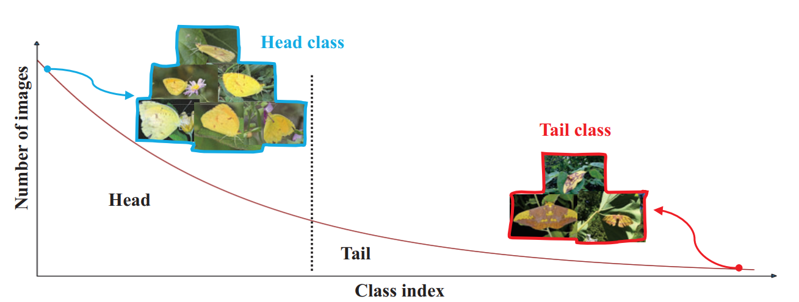

# 长尾(Long Tail)分布问题

## 概念

**真实世界数据集总是具有长尾的倾斜分布(skewed distribution)**

​	 头部类(head)种类少样本多，而尾部类(tail)种类多样本少。

## 解决方案

### Re-balancing strategies

### Re-sampling

* Over-sampling by simply repeat data for minority classes

  对尾部数据进行简单重复采样

* Under-sampling by abandoning data for dominate classes

  通过摒弃头部类的数据

* 其他介于两者直接的方法

### Re-weight

* allocate large weights for training samples of tail classes in loss function
  $$
  -\sum_{i=1}^{c}w_iy_ilogp_i
  $$

### other strategies

* Two-stage-finetuning
  * stage 1: trained network as usual on the original imbalanced data
  * stage 2: utilize re-balancing at the second stage to fine-tune the network with  a small learning rate
* Meta learning/Transfer learning
* Metric learning

## what is problem of re-balance stategies

Two stage finetuing >  directly RS(re-sampling)/RW(re-weight)

