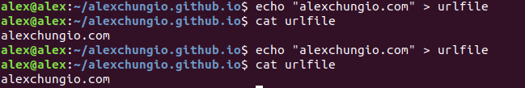
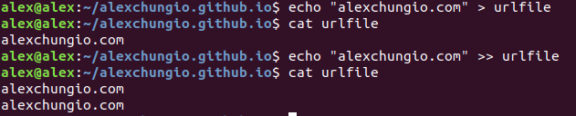
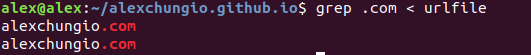
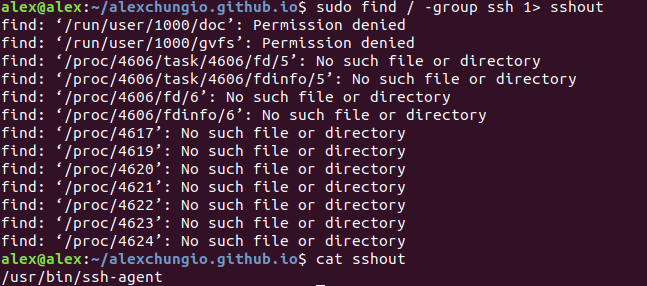
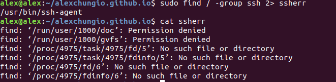
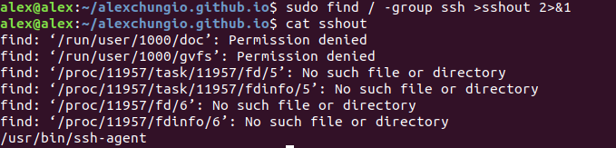
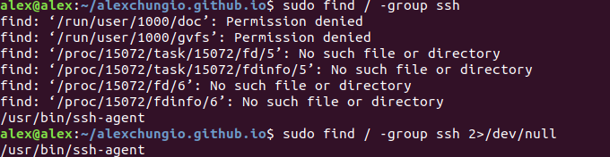
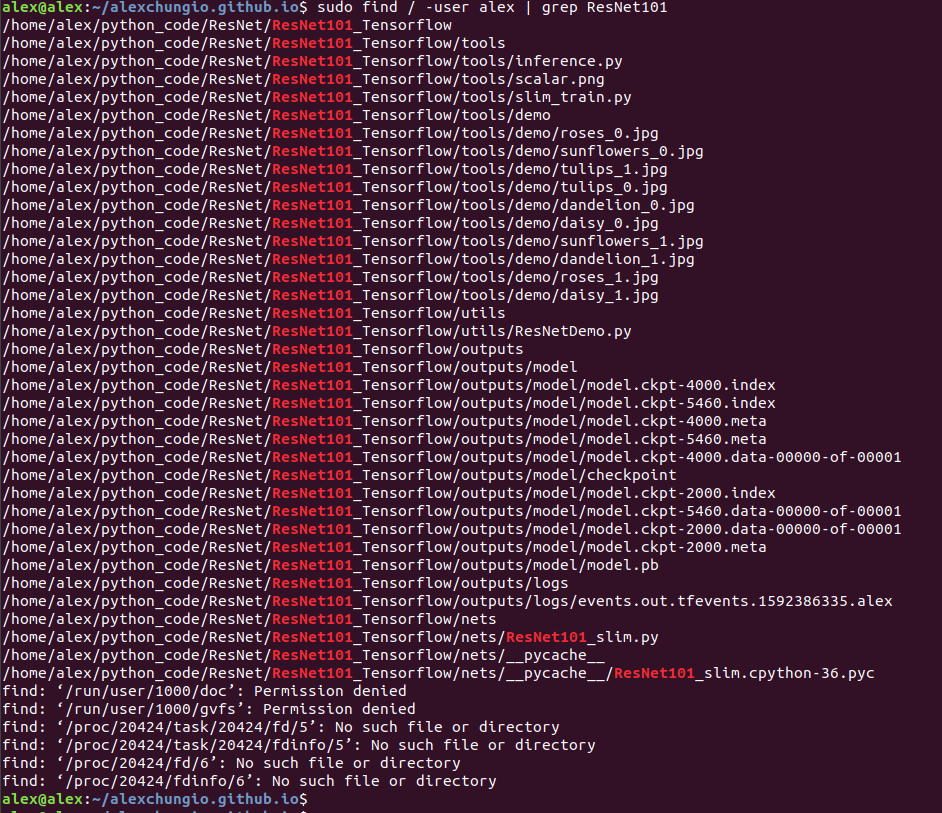
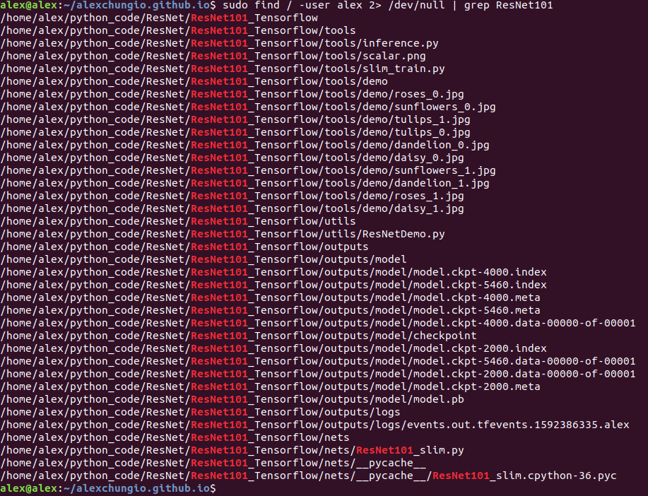

# 多命令协作：管道(pipeline)和重定向(redirect)

> 开源文化的核心理念就是不要重复发明轮子，很多开源软件都是现有软件、代码和功能的重新集合，就像通过零件组装机器一样，源代码的开放和共享让这成为可能，同时也大大提高了效率和生产力。

​       在linux系统中，大多数命令都很简单，很少出现复杂功能的命令，每个命令往往只实现一个或几个简单的功能，我们可以通过将不同功能的命令组合在一起使用，以达到某个复杂功能的目地。linux中几乎所有命令的返回数据都是纯文本的（由于命令运行在CLI下），而纯文本形式的数据又是绝大部分命令的输入格式，这让多命令协作成为可能。

​       linux的命令行为为我们提供了管道和重定向机制，多命令协作就是通过管道和重定向完成的。

## 命令行中shell数据流

|  名称  |   说明   | 编号 | 默认 |
| :----: | :------: | :--: | :--: |
| stdin  | 标准输入 |  0   | 键盘 |
| stdout | 标准输出 |  1   | 终端 |
| stderr | 标准错误 |  2   | 终端 |

* 通过stdin接收参数或数据，
* 通过stdout输出结果
* 通过stderr输出错误

## 重定向(redirect)

重定向通常是用来保存某命令的输出信息或错误信息，可以用来记录执行结果或保存错误信息到一个制定文件。


* \> 

  将重定向到文件(rewrite)

  ```shell
  echo "alexchungio.com" > urlfile
  ```

  

  两次操作以后，文件的内容相同，只保留了最新一次操作的结果。

* \>>

  将stdout重定向到文件(append)

  ```shell
  echo "alexchungio.com" >> urlfile
  ```

  

  第二次使用追加操作，保留了两次操作的结果。

* <

   重定向到STDIN

  ```shell
  grep .com < urlfile
  ```

  

* 1>

  stdout重定向输出，等价于>

  ```shell
  sudo find / -group ssh 2> sshout
  ```

  

* 2>

  stderr重定向到输出

  ```shell
  sudo find / -group ssh 2> ssherr
  ```

  

* 2>&1 

  重定向stderr到stdout，将错误日志添加到输出日志文件中

  ```shell
  sudo find / -group ssh >sshout 2>&1
  ```

  

* 不显示错误信息

  ```shell
  sudo find / -group ssh
  sudo find / -group ssh 2>/dev/null
  ```

  

  通过将错误信息重定向到**/dev/null**目录实现，**所有重定向到/dev/null目录的信息都会自动丢失掉**

## 管道(pipeline)

管道通常用来组合不同的命令，以实现一个复杂的功能。

* |

  将一个命令的stdout作为另一个命令的stdin

  ```
  sudo find / -user alex | grep ResNet101
  ```

  

  或者丢弃错误信息

  ```
  sudo find / -user alex 2> /dev/null | grep ResNet101
  ```

  

# 参考资料

[参考资料一](https://www.gnu.org/software/bash/manual/html_node/Redirections.html "GNU")

[参考资料二](https://chem.uncg.edu/bsbc/user-support/basic-linux-commands/)

[参考资料三](https://www.guru99.com/linux-redirection.html)

