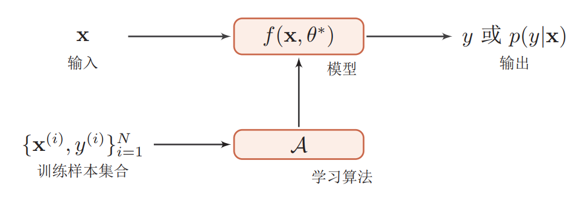

# 机器学习准则（期望风险、经验风险、结构风险）

## 基本概念

### 输入空间、特征空间和输出空间 

> 在监督学习中，将输入和输出所有可能的取值的集合分别称为**输入空间(input space)**和**输出空间(output space)**。
>
> 每个具体的输入是一个实例(instance)， 通常由特征向量(feature vector)表示。这时，所有特征向量存在的空间称为**特征空间(feature space)**。
>
> 在监督学习的过程中, 将输入和输出看作是定义在输入空间和输出空间上的随机变量的取值，习惯上**输入变量**和**输出变量**分别用大写字母$X$, $Y$表示。输入变量的取值用小写字母$x$表示，输出变量的取值用小写字母$y$表示

### 联合概率分布

>监督学习中假设输入与输出变量$X$和$Y$遵循联合概率分布$P(X,Y)$。$P(X,Y)$表示分布函数或概率密度函数。**$X$和$Y$遵循联合概率分布的假设是监督学习关于数据的基本假设**

### 假设空间

> 输入空间$X$和输出空间$Y$构成一个样本空间。对于样本空间中的样本$(x, y)\in (X,Y)$假定存在一个未知的真实**映射(决策)函数**$f:X\rightarrow Y$使得
> $$
> y = f(x)   \tag{1-1}
> $$
> 或者真实**条件概率分布**
> $$
> p(y|x) \tag{1-2}
> $$
> 监督学习中的模型可以是概率模型或非概率模型，分别由条件概率分布$p(y|x)$和决策函数$y = f(x)$ 表示。
>
> 机器学习的目标是找到一个模型来近似真实映射函数$y=f(x)$或真实条件概率分布$p(y|x)$。  
>
> 由于我们不知道真实的映射函数$f(x)$或条件概率分布p(y|x)的具体形式，只能根据经验来确定一个假设函数集合$F$，这个集合称为**假设空间（hypothesis space)**。**假设空间的确定意味着学习范围的确定**。
>
> 假设空间$F$通常为一个参数化的函数族  
> $$
> F = \{f(x, \theta)| \theta \in \mathbb{R}^m\} \tag{1-3}
> $$
> 其中 $f(x,\theta)$表示假设空间中的模型
>
> ​        $\theta$  表示一组可学习的参数
>
> ​        $m$为参数的数量。
>
> ​		$\mathbb{R}^m$ 为 $m$维欧式空间，称为参数空间
>
> ​      

### 机器学习三要素

机器学习方法可以大致地分为三个基本要素：模型、学习准则、优化算法。  

通过一个学习算法（learning algorithm）$A$，在训练集$T$上找到一组参数$\theta^*$，使得函数$f(\theta^*)$可以近似真实的映射关系。这个过程称为学习（learning）或训练（training）过程，函数$f(x, \theta)$称为模型。

* 模型

模型就是要学习的条件概率分布或决策函数。模型的假设空间$F$包含所有的条件概率分布或决策函数。**学习的目标就是，通过观察假设空间在训练集上的特性，从中选择一个理想的假设(hypothesis) $f^* \in F$**。

* 学习准则

统计学习的目标在于从假设空间中学习最优模型。**有了模型的假设空间后，统计学习需要确定使用什么样的准则进行学习或者选择最优模型。**这其中就涉及到**期望风险最小化**、**经验风险最小化**和**结构风险最小化**等学习准则。

* 优化算法

  在确定了训练集$T$、假设空间$F$以及学习准则后，如何找到最优的模型$f(x, \theta^*)$就成了一个最优化问题。机器学习的训练过程其实就是最优化问题的求解过程。  

**本文主要总结学习准则相关的知识点，主要包括损失函数、期望风险、经验风险和结构风险四个部分**

## 损失函数

​	  监督学习问题是在假设空间$F$中选取模型作为决策函数$f$作为决策函数，对于给定的输入$x$， 由$f(x, \theta^*)$给出相应的输出$y$。一个好的模型 $f(x, \theta^*)$ 应该在所有$(x, y)$的可能取值上都与真实映射函数$y=g(x)$一致。然而，输出的预测值$f(x, \theta^*)$与真实值$y$可能一致也可能不一致，需要用一个**损失函数（loss function）**或**代价函数（cost function）**用来量化模型预测和真实标签之间的差异。**损失函数是一个非负实值函数**，记作$L(y, f(x,\theta))$，以绝对损失函数为例可以表示为。
$$
L(y, f(x,\theta)) = |f(x, \theta) - y| < \epsilon \quad \forall\in X \times Y \tag{2-1}
$$
其中$\epsilon$为一个很小的正数。

​    常见的损失函数有如下几种

* 0-1损失函数（0-1 loss function）
  $$
  L(y, f(x,\theta))=
  \begin{cases}
  0 &if \text{ y=f(x, $\theta$)} \\
  1 &if \text{ y$\neq$f(x, $\theta$)}   \tag{2-2}
  \end{cases}
  $$
  或者
  $$
  L(y, f(x,\theta))= I(y\neq f(x, \theta)) \tag{2-3}
  $$
  其中$I(\cdot)$为指示函数

  虽然0-1损失能够客观的评价模型的好坏，但缺点是数学性质不是很好：不连续且导数为0，难以优化。因此经常用连续可微的损失函数替代。  

* 平方损失函数（quadratic loss function）
  $$
  L(y, f(x,\theta)) = (f(x,\theta) - y)^2 \tag{2-4}
  $$
  经常用在预测标签$y$为实数值的任务中(如回归任务) 

* 绝对损失函数（absolute loss function）
  $$
  L(y, f(x,\theta)) = |f(x,\theta) - y| \tag{2-5}
  $$
  绝对损失函数一般用于回归问题

* 对数损失函数（logarithmic loss function）
  $$
  L(y, f(x,\theta)) = -logf(x,\theta) \tag{2-6}
  $$
  
* 交叉熵损失函数  (cross-entropy loss function)

  假设样本标签$y\in\{1,2,..., C\}$为离散类别, 模型$f(x,\theta) \in [0,1]^C$ 的输出为标签为类别标签的条件概率分布。

  用$C$维的one-hot向量$y$来表示类别标签。
  $$
  L(y, f(x,\theta)) = -\sum_{c=1}^{C}y_clogf_c(x, \theta) \tag{2-7}
  $$
  

  式中 $y$标签向量，看作是样本标签的真实概率分布。

  ​        $y_c(c \in [0,1])$ 表示样本标签向量第$c$维所对应类别的真实概率。

  ​	   $f_c(x, \theta)$表示输出标签第$c$维对应类别的条件概率

  交叉损失函数一般用于多分类问题

* 合页损失函数（hinge loss function）
  $$
  \begin{align}
  L(y, f(x,\theta)) =& max(0, 1-yf(x,\theta)) \\  \tag{2-8}
  \end{align}
  $$
  合页损失函数用于支持向量机（SVM),要求样本点被正确分类且函数间隔（置信度）大于时损失是0， 否则损失是$1-yf(x,\theta)$

  合页函数一般用于二分类问题

## 期望风险

> 损失函数：度量模型一次预测的好坏
> 风险函数：度量平均意义下的模型预测好坏

​		损失函数的值越小， 模型就越好。由于模型的输入、输出$(X,Y)$是随机变量，遵循联合概率分布$P(X,Y)$，所以损失函数的期望（平均）表达为如下公式
$$
R_{exp}(\theta)=E_P[L(y, f(x,\theta))] = \int_{X \times Y}L(y, f(x, \theta))P(x,y)dxdy \tag{3-1}
$$
​		这是理论上模型$f(x,\theta)$关于联合分布$P(X,Y)$的平均意义下的代价损失，称为**风险函数（risk function）**或**期望损失（expected loss)**。

​       **机器学习算法的目标就是降低式所示的期望泛化误差（这个数据量被称为风险），选择期望风险最小的模型。这里强调该期望取值真实的潜在分布$P(X,Y)$。**

如果我们知道了真实分布$P(X,Y)$，那么最小化风险就变成一个可以被优化算法解决的优化问题。然而，我们遇到的机器学习问题通常是不知道真实分布的，只知道训练集中样本的分布。这样监督学习就称为了一个**病态问题（ill-formed problem）**

## 经验风险

​	  将机器学习问题转换回一个优化问题的最简单的方法是通过**最小化训练集上的期望损失**。**这意味着用训练集上的经验分布$\hat{P}(X,Y)$,替代真实的分布$P(X,Y)$**。

​	给定一个训练数据集 $\{(x^n, y^n)\}_{n=1}^{N}$, 计算模型$f(x, \theta)$在训练集上的平均损失（也可以理解为$\hat{P}(X,Y)= \frac{1}{N}$）
$$
R_{emp}(\theta) = \frac{1}{N}\sum_{n=1}^{N}L(y, f(x,\theta)) \tag{4-1}
$$
​	    $R_{emp}$称为**经验风险（empirical risk）**或**经验损失（empirical loss）**

​       这种基于最小化平均训练误差的训练过程被称为**经验风险最小化（empirical risk minimization）**。**这种情况下我们并不是直接最优化风险，而是最优化经验风险**

​	**期望风险$R_{exp}(\theta)$是模型关于联合分布的期望损失， 经验风险$R_{emp}(\theta)$是模型关于训练集的平均损失**

   **根据大数定律，当样本容量$N$趋近于无穷时，经验风险$R_{emp}(\theta)$趋近于期望风险$R_{exp}(\theta)$**。

​    在假设空间、损失函数以及训练数据集确定的情况下，就可以确定经验风险函数。一种优化准则为是找到一组$\theta^*$使得经验损失函数取得最小值
$$
\theta^* = {arg}\underset{\theta}{min} R_{emp}(\theta)  \tag{4-2}
$$
​	  这就是**经验风险最小化（Empirical Risk Minimization, ERM）**准则。

​      这时经验风险就是最优化的目标函数， 监督学习优化问题转换为经验风险函数的最优化问题。

## 结构风险

​	   当样本容量足够大时，经验风险最小化能够保证恒昊的学习效果，在现实中被广泛采用，如极大似然估计。然而通常情况下，我们无法获取无限的训练样本，并且训练样本往往是真实数据的一个很小的子集或者包含一定的噪声数据，不能很好地反映全部数据的真实分布。经验风险最小化原则很容易导致模型在训练集上错误率很低，但是在未知数据上错误率很高。这就是所谓的**过拟合（over-fitting）**现象。

​	   **结构风险最小化（Structural Risk Minimization, SMR）**准则是为了防止过拟合而提出来的策略。过拟合问题往往是由于训练数据少和噪声以及模型能力强等原因造成的。为了解决过拟合问题，一般在经验风险最小化的基础上再引入参数的正则化（regularization），来限制模型能力，使其不要过度地最小化经验风险。 

​	  结构风险最小化等价于正则化。$结构风险=经验风险+正则化项$在假设空间、损失函数以及训练集确定的情况下，结构风险的定义如下
$$
\begin{align}
R_{srm}(\theta)=& R_{emp} + \lambda J(\theta)\\
=& \frac{1}{N}\sum{_{n=1}^{N}L(y,f(x, \theta))} + \lambda J(\theta) \\  \tag{5-1}
\end{align}
$$
式中$J(\theta)$为模型的复杂度，是定义在假设空间$F$上的泛函，常用的有$L_1$范数和$L_{2}$范数。$J(\theta)$ 可以理解为对模型复杂度的惩罚项。

​		$\lambda>0$，用来控制正则化强度，以权衡经验风险和模型复杂度

结构风险最小化准则，认为经验风险最小的模型是最优模型。求最优化模型就是找到一组$\theta^*$使得结构孙树函数取得最小值
$$
\theta^* = {arg}\underset{\theta}{min} R_{srm}(\theta) \tag{5-2}
$$
这时结构风险就是最优化的目标函数，监督学习优化问题转换为结构l风险函数的最优化问题。

## 参考资料

* 《统计学习方法》
* 《神经网络与深度学习》
* 《深度学习》