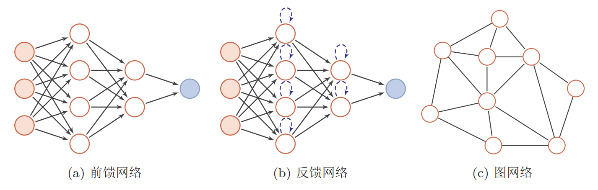
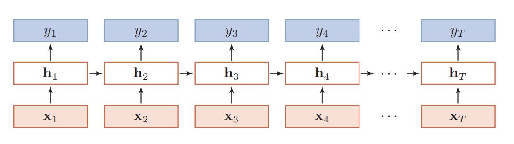
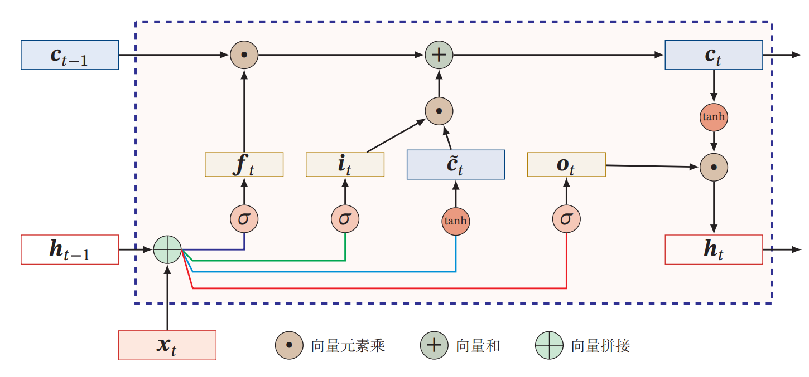
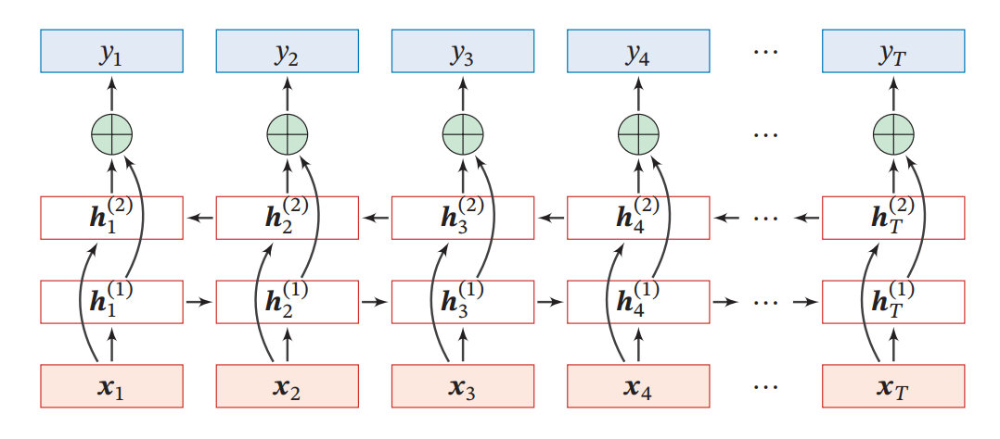

#  RNN LSTM GRU 总结

## 为什么要使用反馈神经网络

### 常用网络结构概述

> **前馈神经网络**: 网络中中各个神经元按接受信息的先后分为不同的组。每一组可以看作一个神经层。每一层中的神经元接受前一层神经元的输出，并输出到下一层神经元。  整个网络中的信息是朝一个方向传播，没有反向的信息传播，可以用一个有向无环路图表示。 前馈网络包括全连接前馈网络和卷积神经网络。
>
> **反馈网络**: 网络中神经元不但可以接收其它神经元的信号，也可以接收自己的反馈信号。和前馈网络相比，反馈网络中的神经元具有记忆功能，在不同的时刻具有不同的状态。反馈神经网络中的信息传播可以是单向或双向传递，因此可用
> 一个有向循环图或无向图来表示。反馈网络包括循环神经网络， Hopfield、玻尔兹曼机等。为了增强记忆网络的记忆容量，可以引入外部记忆单元和读写机制，用来保存一些网络的中间状态，称为记忆增强网络（Memory-Augmented Neural Network），比如神经图灵机和记忆网络 等  。
>
> **图网络**：图网络是定义在图结构数据上的神经网络 。图中每个节点都一个或一组神经元构成。节点之间的连接可以是有向的，也可以是无向的。每个节点可以收到来自相邻节点或自身的信息。   



### 前馈神经网络缺点

> 在前馈神经网络中，信息的传递是单向的，这种限制虽然使得网络变得更容易学习，但在一定程度上也减弱了神经网络模型的能力。在生物神经网络中。
>
> 前馈神经网络可以看着是一个复杂的函数，每次输入都是独立的，即网络的输出只依赖于当前的输入。但是在很多现实任
> 务中，网络的输入不仅和当前时刻的输入相关，也和其过去一段时间的输出相关。  
>
> 此外，前馈网络难以处理时序数据，比如视频、语音、文本等。时序数据的长度一般是不固定的，而前馈神经网络要求输入和输出的维数都是固定的，不能任意改变。因此，当处理这一类和时序相关的问题时，就需要一种能力更强的模型。 

### 反馈神经网络优点

> **循环神经网络（Recurrent Neural Network， RNN）**是一类具有短期记忆能力的神经网络。在循环神经网络中，神经元不但可以接受其它神经元的信息，也可以接受自身的信息，形成具有环路的网络结构。  
>
> 循环神经网络的参数学习可以通过随时间反向传播算法 来学习，随时间反向传播算法即按照时间的逆序将错误信息一步步地往前传递。当输入序列比较长时，会存在梯度爆炸和消失问题也称为长期依赖问题。为了解决这个问题， 提出了对RNN的改进网络，如**长短期记忆（ LSTM， Long Short-Term Memory）**和**门控循环单元（ GRU， Gated Recurrent Unit）**   

## RNN

循环神经网络（Recurrent Neural Network, RNN）

### 增加记忆能力

**为了处理这些时序数据并利用其历史信息，我们需要让网络具有短期记忆能力。而前馈网络是一个静态网络，不具备这种记忆能力。   ** 可以通过三种方法增加短期记忆能力。

* 延时神经网络（Time Delay Neural Network， TDNN）  

  延时神经网络是在前馈网络中的非输出层都添加一个延时器，记录最近几次神经元的输出。通过延时器，前馈网络就具有了短期记忆的能力。    

* 有外部输入的非线性自回归模型（Nonlinear Autoregressive with Exogenous Inputs Model， NARX）  

  NARX通过一个延时器记录最近几次的外部输入和输出。

* RNN

  循环神经网络通过使用带自反馈的神经元，能够处理任意长度的时序数据。  

> 前馈神经网络可以模拟任何连续函数，而循环神经网络可以模拟任何程序。  



### 循环神经网络的几种模式

* 序列到类别模式、 
* 同步的序列到序列模式
* 异步的序列到序列模式  

## LSTM

长短期神经网络（Long Short Term Memory, LSTM）

遗忘门(forget gate) $f_t$，控制上一个时刻的内部状态$c_{t-1}$ 需要遗忘多少信息。  

输入门(input gate)$i_t$，控制当前时刻的候选状态$\tilde{c}^t$有多少信息需要保存。  

输出门(output gate)$o_t$， 控制当前时刻的内部状态 $c_t$ 有多少信息需要输出给外部状态$h_t$



## GRU

门控循环单元（Gate Recurrent Units, GRU）

重置门（reset gate）$r_t$: 用来控制候选状态$\tilde{h}$的计算是否依赖上一时刻的状态$h_{t-1}$

更新门  (update gate) $z_t$: 来控制当前状态需要从历史状态$h_{t-1}$中保留多少信息， 以及需要从候选状态$\tilde{h}$中接受多少新信息。  


## 双向循环神经网络

双向循环神经网络（ Bidirectional Recurrent Neural Network， Bi-RNN） 由两层循环神经网络组成， 它们的输入相同， 只是信息传递的方向不同。  

**注意， 这里正向传播层和反向传播层之间的隐藏层节点没有信号传递, 同时间步的Forward state的输出 并不会连接到backward state 的输入。**



## Dropout

对于RNN 进行dropout 操作时，对于RNN部分不进行dropout, 对于同一层的t-1时间步到t时间步的状态传递计算时不进行dropout; 仅在同一时刻时的多层状态信息传递的时候进行dropout。其实也可以理解， 如果在层执行dropout，意味着整个层后续的时间点的信息也被全部丢弃了， 对网络训练影响太剧烈了， 而在不同同一时间步的不同层之间执行dropout是更合适的选择。

```python
tf.nn.rnn_cell.DropoutWrapper
```


## 参考资料

* <https://www.tensorflow.org/tutorials/text/text_generation>
* <https://zhuanlan.zhihu.com/p/51383402>
* <https://zhuanlan.zhihu.com/p/28196873>
* <https://zhuanlan.zhihu.com/p/32085405>
* <https://medium.com/machine-learning-algorithms/mnist-using-recurrent-neural-network-2d070a5915a2>
* <https://arxiv.org/pdf/1412.3555.pdf>
* <https://stanford.edu/~shervine/teaching/cs-230/cheatsheet-recurrent-neural-networks#architecture>

