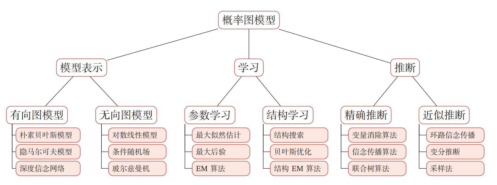
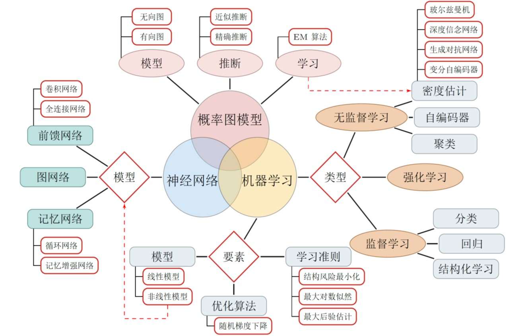

# 概率图模型

## 概述

### 概念

概率图模型（ Probabilistic Graphical Model， PGM）， 简称**图模型（ Graphical Model， GM）**， 是指一种用图结构来描述多元随机变量之间条件独立关系的概率模型， 从而给研究高维空间中的概率模型带来了很大的便捷性 。

### 图模型基本问题

* 表示问题
* 学习问题：结构学习、参数学习
* 推理问题

## 概率图模型 与机器学习的关系

## 参考资料

* 

