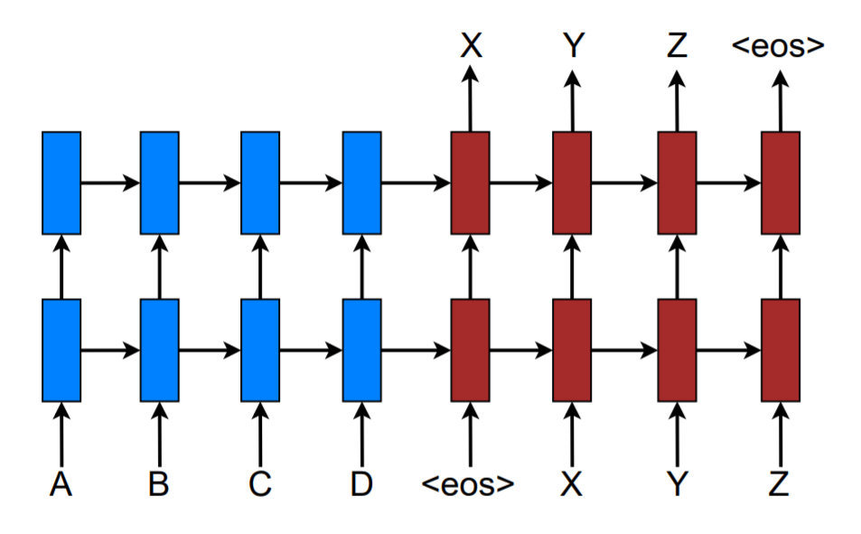
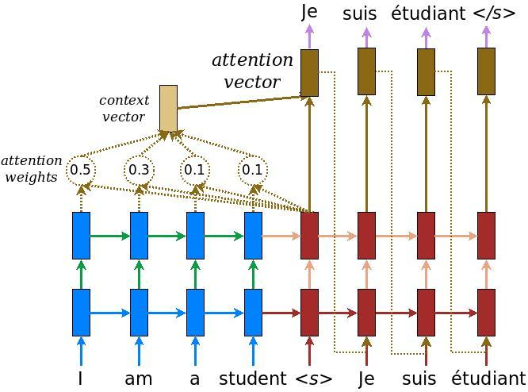
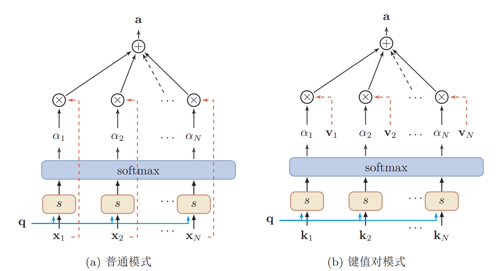
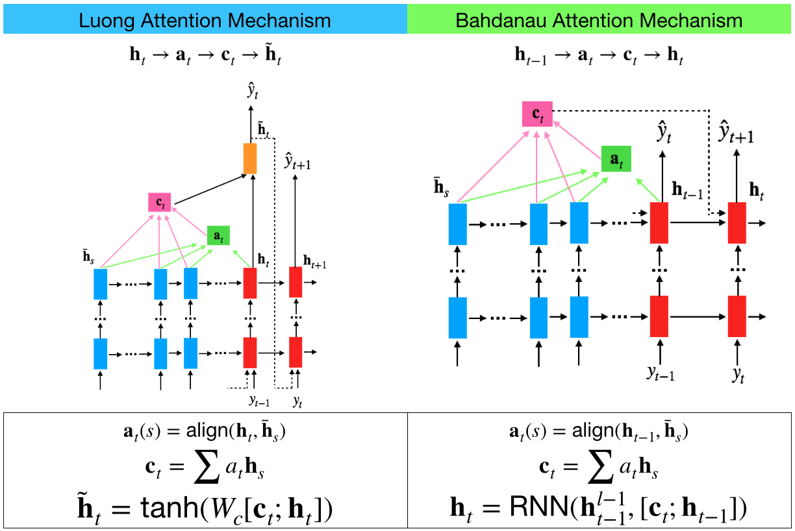

# 注意力机制（Attention Mechanism）

## 概念

### 为什么需要注意力机制

神经网络中可以存储的信息量称为**网络容量（ Network Capacity）**  

> 利用一组神经元来存储信息时， 其存储容量和神经元的数量以及网络的复杂度成正比.  要存储的信息越多， 神经元数量就要越多或者网络要越复杂， 进而导致神经网络的参数成倍地增加．
>
> 人脑的生物神经网络同样存在网络容量问题， 人脑中的工作记忆大概只有几秒钟的时间， 类似于循环神经网络中的隐状态．人脑在有限的资源下， 并不能同时处理这些过载的输入信息． 大脑神经系统有两个重要机制可以解决信息过载问题： 注意力和记忆机制.    

通过借鉴人脑解决信息过载的机制， 从两方面来提高神经网络处理信息的能力． 一方面是注意力， 通过**自上而下的信息选择机制**来过滤掉大量的无关信息； **另一方面是引入额外的外部记忆， 优化神经网络的记忆结构来提高神经网络存储信息的容量**. 

### 什么注意力机制

>  **注意力机制也可称为注意力模型**．在计算能力有限的情况下，注意力机制（ Attention Mechanism） 作为一种资源分配方案， 将有限的计算资源用来处理更重要的信息， 是解决信息超载问题的主要手段． 

在目前的神经网注意力机制也可称为注意力络模型中，我们可以将**最大汇聚（max pooling）**、**门控（gating）机制**来近似地看作是**自下而上的基于显著性的注意力机制**。**自上而下的会聚式注意力**也是一种有效的信息选择方式。

### 注意力机制使用样例

Seq2Seq 翻译模型通常由encoder 和decoder 组成，运行过程如下：

*  encoder（蓝色方块）负责对输入的源序列（source）进行编码， 并输出输出**语义向量 c**
*  decoder 接收到来自encoder 的语义向量 c， 并利用语义向量和输入的值， 逐个完成翻译。 注意， **语义向量c作用于decoder 的每一步**

简单的encoder-decoder模型有一个缺点，翻译过度依赖于将整个句子信息压缩成固定的语义输出c, 如果句子过程不可避免地会丢失部分信息， 导致翻译结果不准确。因为在未引入注意力机制之前，解码时仅仅只依靠上一时刻的输出而忽略的编码阶段每个时刻的输出（“称之为记忆”）。

注意力机制的思想在于，希望在解码的时刻能够参考编码阶段的记忆，对上一时刻输出的信息做一定的处理（即只注意其中某一部分），然后再喂给下一时刻做解码处理。这样就达到了解码当前时刻时，仅仅只接受与当前时刻有关的输入，类似与先对信息做了一个筛选（注意力选择）

如上图所示$\overline{h}_s$ 表示编码器输出的**所有时刻编码器（source）的隐藏状态**； $h_t$表示解码器（target）**当前时刻输出目标的隐藏状态**。

如上图所示，英文句子“I am a student”被输入到一个两个的LSTM编码网络（蓝色部分），经过编码后输入到另外一个两层的LSTM解码网络（红色部分）。此时$\overline{h}_s$包括四个词对应的隐藏状态$\overline{h}_1$、$\overline{h}_2$、 $\overline{h}_3$、 $\overline{h}_4$。 $h_t$表示'<s>'对应的解码器的隐藏状态， 此时从经验的角度，与$h_t$最相关的应该为‘I’ 对应的隐藏状态$\overline{h}_1$。 因此我们的**目标是在解码的第一个时刻时， 将注意力集中于$\overline{h}_1$。**由于此时的$h_t$与编码部分的隐含状态$\overline{h}_s$都处于同一个Embedding space，所以我们可以通过相似度对比来告诉解码网络：哪个编码时刻的隐含状态与当前解码时刻的隐含状态最为相似。这样，在解码当前时刻时，网络就能将“注意力”尽可能多的集中于对应编码时刻的隐含状态。

具体的数学流程如下：

* 首先计算相似分数

  这里相似度分数的计算有多种形式， 比较典型的两种是Bahanau-Attention对应的的加性（additive）风格和Luong-Attention 对应的点积（multiplicative）风格
  $$
  score(h_t, \overline{h}_s) = \begin{cases}
  \mathit{h}_t^{\top}\mathit{W} \mathit{h}_s^{\top} & \text{[Luong multiplicative stype]}\\
  \mathit{v}_{\alpha}^{\top} tanh\left(\mathit{W}_1 \mathit{h}_t + \mathit{W}_2 \overline{\mathit{h}}_s\right) & \text{[Bahanau additive stype]}
  \end{cases}
  $$
   

* 计算注意力权重（attention weights）

  根据得到的相似分数， ~~利用softmax 执行归一化， 得到基于编码器当前状态$\mathit{h}_t$的条件概率分布。
  $$
  \alpha_{ts} =
  \frac{exp(score(h_t, \overline{h}_s))}{\sum_{s^{\prime}}^S exp(score(h_t, \overline{h}_{s^{\prime}}))}       \qquad \text{[Attension weights]}\\
  $$
  

* 计算上下文向量 ( context vector)

  以$\alpha_{ts}$为权重，编码器的所有输出状态$\overline{\mathit{h}}_s$进行加权求和， 得到上下文向量。
  $$
  \mathit{c}_t = \sum_s \alpha_{ts}\overline{\mathit{h}}_s
  $$

* 获得注意力向量（attention vector）

  将上下文向量$\mathit{c}_t$和当前编码器的状态$h_t$组合得到最终的输出。
  $$
  \mathit{a}_t = f(\mathit{c}_t, \mathit{h}_t) = tanh(\mathit{W}_c[\mathit{c}_t;\mathit{h}_t])
  $$

## 注意力机制的计算

注意力机制的计算可以分为两步： 

* 首先在所有输入信息上**计算注意力分布**
*  然后根据注意力分布来**计算输入信息的加权平均**．  

### 注意力分布

### 加权平均

###  打分函数/对齐函数

## 注意力机制类型

### 普通注意力模式

如上所述为普通注意力机制

### 键值对注意力机制（Key-Value Attention  ）

### 多头注意力机制（Multi-Head Attention  ）

### 双向注意力（ Bi-Directional Attention  ）

### 自注意力 （Self/Intra Attention  ）

##  Bahdanau-Attention 与  Luong-Attention 区别

### 两种机制比较

### 多种对齐函数/ 打分函数

## 参考资料

* 《神经网络与深度学习》
* <https://medium.com/heuritech/attention-mechanism-5aba9a2d4727>
* <http://colah.github.io/posts/2015-08-Understanding-LSTMs/>
* <https://zhuanlan.zhihu.com/p/129316415>
* <http://cnyah.com/2017/08/01/attention-variants/>
* <https://zhuanlan.zhihu.com/p/70905983>
* <https://towardsdatascience.com/attention-seq2seq-with-pytorch-learning-to-invert-a-sequence-34faf4133e53>
* <https://www.tensorflow.org/tutorials/text/nmt_with_attention>
* <https://zhuanlan.zhihu.com/p/67909876>

