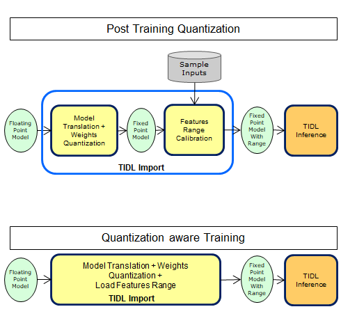
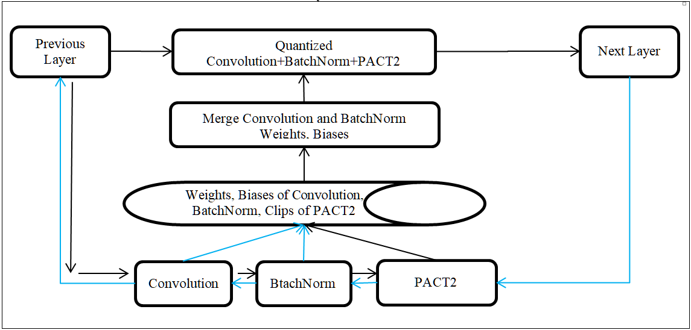
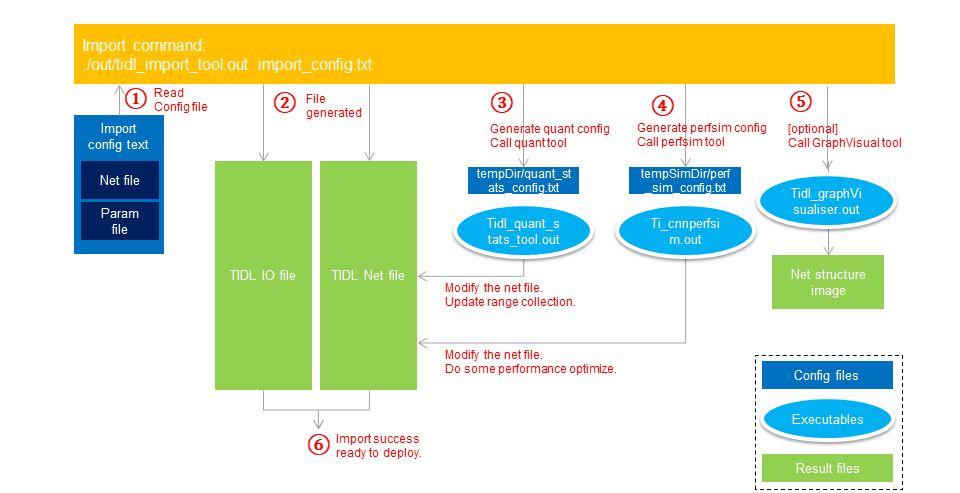

# 基于 TIDL 的模型量化实现

## TIDL 量化过程

TIDL 库支持两种量化方法后训练量化（Post Training Quantization, PTQ）和量化感知训练(Quantization Aware, QAT ) 量化两种方式。




TIDL 提供了 一个封装模块`QuantTrainModule` ，可以去自动化QAT所有的任务。用户只需要使用`QuantTrainModule`封装模型并进行训练。

### QuantTrainModule 处理流程



1. 用PACT2 替换模型中的所有RELU、RELU6 层：具体实现中，使用 pytorch 中 nn.Modules 的前向 hook 机制去回调额外的激活函数。这样能够不干扰现有预训练权重的情况下添加这些额外的激活。
2. 权重范围裁剪：如果权重的范围太高，就裁剪权重的值到合适的范围
3. 卷积层与批归一化层合并：在量化训练的前向过程中，将融合卷积层与其相邻的BN 层动态地合并，可以提高缩放因子$S$ 和零点预估准确性，提升量化感知训练的精度。
4. 在量化训练的过程中同时量化权重和激活。

### PACT2 激活模块


PACT2 激活模块用于将激活限制为2的幂次方值，PACT2 用于替代常用的激活函数如ReLU、ReLU6 等。TIDL 的QAT 训练时会在在必要时自动插入PACT2激活模块，以限制激活值范围。在PACT2中使用统计范围（而不是最大最小值）进行限幅来提高量化精度。

### QAT 训练过程

1. 每次迭代，使用原始的权重和偏差执行前向浮点运算。**这个过程中，PACT2 层会使用直方图和移动平均收集输入的范围，使用统计范围进行裁剪来提高量化精度（与最大-最小范围裁剪相比）**
2. 执行卷积和BN 的合并，并量化合并后得到的权重。这些量化和反量化的权重被用与前向推理。PACT2 收集的范围用于激活量化和量化输出。
3. 使用**STE(Straight-Through Estimation)**反向传播更新参数，去降低量化损失。
4. 使用小的学习率，训练少量 epoch，获得合理的量化精度。

### 关于QAT 部署的推荐和限制规则

* **同一模块不应在模块内重复使用**，以保证特征图范围估计的准确性。这里比如在ResNet 的 BasicBlock 和 BottleneckBlock 中的同一个ReLU在不同层重复使用多次。在执行感知量化前需要对对应模块进行重写，为每一个卷积层分配不同的ReLU激活层。*这里与pytorch 官方QAT量化训练的要求一致*
* **使用`Modules` (继承自nn.Module的类)替换 `funtionals` 或 `operations`**。比如使用 `torch.nn.ReLU` 替换 `torch.nn.functional.relu()`，使用`torch.nn.AdaptiveAvgPool2d()` 替换 `torch.nn.functional.adaptive_avg_pool2d()`， 使用 `torch.nn.Flatten()`替换` torch.nn.functional.flatten()`等。这样做的目的是为了方便量化感知训练过程中的范围收集、卷积层与BN 层的合并等操作。*这里与pytorch 官方QAT量化训练的要求一致*
* **TIDL 量化库自定义的模块**：`xnn.layers.AddBlock`执行元素级加法，`xnn.layers.CatBlock`执行张量拼接。这里是**与第二条规则对应的**，使用自定义的模块去解决，pytorch 官方库中只有`funtionals`，而没有对应`Modules`类的问题。当然，这些**自定义模块也遵循第一条规则**。
* **关于模型导出为onnx**：`Interpolation`/`Upsample`/`Resize`这些操作在pytorch 导出onnx 的过程中有一定的棘手性，必须使用正确的选项才能获得干净的onnx图。TIDL 库提供了这些运算符的`funtionals`形式`xnn.layer.resize_with`和`Modules`形式`xnn.layers.ResizeWith`导出干净的onnx 图。
* **关于训练**：在QAT训练期间的几个 epoch 之后，**冻结BN 和 量化范围对获得更高的量化准确性有益**，实用的函数 `xnn.utils.freeze_bn(model) `和` xnn.layers.freeze_quant_range(model) `可以被用在这里。 
* 其他：如果一个函数不改变特征图的范围，那么是否以`Modules`形式使用它并不重要。比如`torch.nn.functional.interpolate`

## edgeai-torchvision 量化库使用

### PTQ

PTQ(Post-Train-Quantization) 对应的模块为`QuantCalibrateModule`(edgeailite/xnn/quantize/quant_calib_module.py)

### QAT

QAT(Quantization Aware Training) 对应的模块为`QuantTrainModule`(edgeailite/xnn/quantize/quant_calib_module.py)

QAT 的默认的量化方式为**对称（symmetric）**、**二次幂（power-of-two）量化**。

**QAT 量化训练的流程**如下：

1. 第一步，插入伪量化节点 `model_surgery_quantize`(edgeailite/xnn/quantize/quant_train_module.py): 将计算图中所有的模块替换为伪量化模块。*这里会对激活函数做特殊处理，如果激活函数为ReLU 或者 ReLU6，调整符号标签`sign=False`，即使用**无符号量化**。*
2. 第二步，设置模块属性控制模块的行为`apply_setattr`(edgeailite/xnn/quantize/quant_base_module.py)：配置模块属性，使设置生效
3. 第三步，执行量化训练。 量化训练过程中，会通过`merge_quantize_weights`(edgeailite/xnn/quantize/quant_train_module.py)会执行 conv 与 bn 层的合并，以优化量化精度。
4. 第四步，保存量化训练模型

**获取权重、激活函数和偏差的尺度因子**的代码分别为 `get_clips_scale_w`，`get_clips_scale_w` 和 `get_clips_scale_bias` (edgeailite/xnn/quantize/quant_base_module.py)

1. 第一步，统计浮点数的的进行对称处理和二次幂向上取整（$\hat{x} = pow(2, ceil(log(x)))$）裁剪之后的最小值 clip_min和最大值clip_max。
2. 第二步，计算对应量化 tensor （weight，bias，activation）对应量化位数取值范围的最小值width_min和最大值width_max。
3. 第三步，计算尺度系数scale，$scale= \frac{width_{max} } {clip_{max}}$

**伪量化节点**的代码为`quantize_dequantize_func`(edgeailite/xnn/layers/functional.py)

1. 第一步，对尺度系数s进行二次幂向下取整，$\tilde{s} = pow(2, floor(log(s)))$
2. 第二步，使用**量化**公式，浮点数的值乘以尺度系数得到**伪量化后的值**（训练时还是浮点数） $x_{scale} = x \cdot \tilde{s}$
3. 第三步，计算尺度系数的倒数 $\tilde{s}_{inv}=\frac{1}{\tilde{s}}$
4. 第四步，对量化后的值执行范围裁剪（clamp）， $x_{clamp}=clamp(x_{scale};width_{min}, width_{max})$
5. 第五步，对量化后的值进行**反量化**，得到**浮点数值**，$\hat{x}=x_{clamp}\cdot \tilde{s}_{inv}$
6. 第六步，返回**引入量化误差**后的浮点数值

**关于量化模型权重的保存和加载**

模型量化相关的参数主要保存在`QuantiTrainPAct2`(edgeailite/xnn/quantize/quant_train_module.py)中，而它又继承自`PAct2`（edgeailite/xnn/layers/activation.py）模块中。

PAct2 中用于保存量化信息的参数有两个：

* clip_act:

  ```python
  self.register_buffer('clips_act', torch.tensor(default_clips, dtype=torch.float32))
  ```

  **训练时**，计算图汇总的 `clips_act`时浮点型的连续值值，其中`clips_act[0]` 和`clip_act[1]`分别表示对应tensor 的最小值和最大值；**推理时**，计算图中的clips_act 表示，首先对clip_act 真实值**取绝对值的最大值（clip_max=max(abs(clip_act[0]), abs(clip_act[1])))**，然后再对clip_max 进行**二次幂向上取整（clip_max=pow(2, ceil(log(clip_max)))进行裁剪**之后的**二次幂整数值**，最后的clip_act 的取值范围为**(-clip_max, clip_max) **。推理时的clip_act 值，同时对应于onnx 计算图中clip 算子的参数值。demo 代码如下

  ```python
  clip_max = torch.max(torch.max(clips_act))
  clip_max = torch.pow(2, torch.ceil(torch.log2(clip_max)))
  clip_act = (-clip_max, clip_max)
  ```

* num_batch_tracked: 

  ```python
  self.register_buffer('num_batches_tracked', torch.tensor(-1.0, dtype=torch.float32))
  ```

## TIDL 库量化操作

TIDL 支持caffe、tensorflow(pb)、onnx 和 tflite 等多种格式的模型，这里只对 onnx 作为模型文件进行量化进行说明。

TIDL 主要有两个核心功能，模型导入（import）和模型（模拟）推理（infer）。

### 模型导入（import）

模型导入主要的功能是根据把不同格式的模型描述文件，转换（translate）/导入（convert）为适合TIDL 推理引擎的通用模型描述文件。模型导入（import）工具会利用模型加速工具来优化输入模型。模型导入后会量化（quant）工具和模型编译（compile）工具去进行范围收集（range collection）和优化（optimization）

#### 输入输出格式

* 输入：导入配置文件（import config）和模型描述文件。
* 输出： 主要输出两个文件，网络描述（net description）文件和输入输出接口（io buf）文件。其他文件包括层名称文件等。

#### 模型导入流程



模型导入主要包括以下步骤

1. 读取配置文件和模型描述文件
2. 转换/导入层或算子为TIDL文件，包括**TIDL-IO文件**和**TIDL-Net 文件**，可能会进行层融合。
3. 生成量化文件，调用量化工具去进行范围收集（range collection）并**更新 TIDL-Net 文件**。
4. 调用性能仿真工具去生成配置文件，用来进行网络编译。调用编译器去进行性能优化并**更新TIDL-Net 文件**。
5. 调用计算图可视化工具生成网络结构图像（可选）
6. 成功导入并准备部署。

#### 模型导入代码框架

代码框架的文件目录是`ti_dl/utils/tidlModelImport`，主要涉及如下文件

* ti_dl.h：描述导入文件的中间架构
* tidl_import_api.h：模型导入核心函数的头文件
* tidl_import_main.cpp： 导入工具的主函数
* tidl_import_config.cpp：通用代码，用于读取配置文件
* tidl_onnxImport.cpp： onnx 模型导入工具
* tidl_import_core.cpp：模型导入的核心函数
* tidl_import_common_model_check.cpp：通用代码，用于模型完整性检查
* tidl_import_common.cpp：通用代码，用层融合（layer merging）、reshape 和 其他通用功能组件。

#### 模型导入核心函数说明

* `readparamfile`/`readparamarg`（common/configparser.c）：用于读取配置文件
* `onnx_import`（tidl_onnxImport.cpp）: 从onnx 文件中导入计算图
* `tidl_optimizeNet`（tidl_import_core.cpp）：执行计算图优化并转换计算图到目标格式，看作是**模型量化的预处理步骤**，是模型量化的一个关键节点。
* `TIDL_import_backend`（tidl_import_core.cpp）：运行模型量化和编译，是**模型量化的核心环节**。

#### 计算图导入(onnx_import)

计算图导入时，模型中的不同类型层都会存储为相同的结构体`sTIDL_LayerPC_t`（ti_dl.h），如下

```c++
typedef struct {
    sTIDL_LayerParams_t layerParams;
    sTIDL_LayerPCParams_t layerPCParams;
    sTIDL_ActParams_t    actParams;
    int32_t layerType;
    int32_t numInBufs;
    int32_t numOutBufs;
    int64_t numMacs;
    int8_t  name[TIDL_STRING_SIZE];
    int8_t  inDataNames[TIDL_NUM_IN_BUFS][TIDL_STRING_SIZE];
    int8_t  outDataNames[TIDL_NUM_OUT_BUFS][TIDL_STRING_SIZE];
    int32_t outConsumerCnt[TIDL_NUM_OUT_BUFS];
    int32_t outConsumerLinked[TIDL_NUM_OUT_BUFS];
    sTIDL_DataParams_t inData[TIDL_NUM_IN_BUFS];
    sTIDL_DataParams_t outData[TIDL_NUM_OUT_BUFS];
    sBuffer_t weights;
    sBuffer_t bias;
    /* Buffer to store per channel weight scales */
    sBuffer_t perChannelWeightScale;
    sBuffer_t slope;
    sBuffer_t priorBox;
    sBuffer_t perChannelPadConstTensor;
    int32_t weightsElementSizeInBits;  //kernel weights in bits
    /** Offset selection method for stride. \ref eTIDL_StrideOffsetMethod */
    int32_t strideOffsetMethod;

}sTIDL_LayerPC_t;
```

结构体中`sTIDL_ActParams_t`参数用于**保存模型量化的关键参数最小值和最大值**，如下

```c++
/**
 @struct  sTIDL_ActParams_t
 @brief   This structure define the parameters of ReLU activation layer
           in TIDL
*/
typedef struct {
  /** Buffer containing Slope vales for PRelU */
  int32_t   slope;
  /**  Floating point scale value of slope values for PRelU */
  float32_tidl     slopeScale;
  /**  minimum value for clip */
  float32_tidl     clipMin;
  //**  maximum value for clip */
  float32_tidl     clipMax;
  /** value indicates different types of ReLU supported \ref eTIDL_ActType*/
  int32_t   actType;
}sTIDL_ActParams_t;
```

#### 计算图优化的流程(tidl_optimizeNet)

1. 输入数据处理：检查模型中出现的所有输入，根据配置文件更新输入数据的形状

2. 根据计算图中个层的计算类型，分别进行特殊处理。

3. 对计算图中的层进行融合，并在融合后移除无用的层。涉及QAT 量化模型的主要是对`clip`层的融合操数，`tidl_mergeClipLayer`，其对应的融合流程如下：

   * 首先根据当前层是否是`TIDL_ClipLayer`，然后根据当前层和输入确定是否执行融合

   * 根据前一层激活参数的类型，初始化裁剪/截断的最小值和最大值

   * 根据前一层和当前层的裁剪最小值和最大值取交，获取融合后的最小值和最大值

     ```c++
     TIDLPCLayers.actParams.clipMin = clipMin > TIDLPCLayers.actParams.clipMin ? clipMin : TIDLPCLayers.actParams.clipMin;
               TIDLPCLayers.actParams.clipMax = clipMax < TIDLPCLayers.actParams.clipMax ? clipMax : TIDLPCLayers.actParams.clipMax;
     ```

#### 模型量化的流程(TIDL_import_backend)

1. 基于导入配置文件修改量化相关的默认参数

2. 设置默认的权重位数宽度(`bitwidth`)

3. 根据配置中`calibrationOption`判断量化方式，`calibrationOption`的取值范围为`0`，`1`，`2`，`4`，`8`，`16`, `32`，分别对应于不同的量化方式，其中默认值为`0`，对应简单量化。 对于QAT 量化来说`calibrationOption=0`，此时不执行后量化，直接进行量化转换和分析，对应函数为`TIDL_quantStatsFixedOrFloat`。 需要注意，`TIDL_runIterativeCalibration`函数的内部也会调用`TIDL_quantStatsFixedOrFloat`函数。

   ```c++
    if(tIDLNetStructure.isQuantStatsAvailable == 0)
       {
         if (TIDL_isIterativeCalibrationRequired(&gParams))
         {
           /* Run Iterative loop for per channel quantization and bias calibration */
           TIDL_runIterativeCalibration(&orgTIDLNetStructure,
                                       &tIDLNetStructure,
                                       &gParams);
         }
         else
         {
           TIDL_quantStatsFixedOrFloat(&orgTIDLNetStructure,
                                       &tIDLNetStructure,
                                       &gParams,
                                       STATS_COLLECTION_FIXED_POINT);
         }
       }
       else /* if(tIDLNetStructure.isQuantStatsAvailable == 1) Avoids running QS tool*/
       {
         TIDL_importQuantLayerParams(&orgTIDLNetStructure,
             &tIDLNetStructure,
             &gParams,
             orgTIDLNetStructure.numLayers);
         updatePadAndWriteModel(&orgTIDLNetStructure, &tIDLNetStructure, &gParams);
       }
   
     }
   ```

   QAT 量化对应于`TIDL_quantStatsFixedOrFloat`（tidl_import_core.cpp）中的定点（fixed）模式的量化分析工具，主要流程

   1. 使用 `TIDL_importQuantLayerParams`（tidl_import_common.cpp） 完成参数量化，这是**量化操作的核心环节**。
   2. 使用`updatePadAndWriteModel` (tidl_import_core.cpp)保存量化后的模型。
   3. 使用 `tidlRunQuantStatsTool` (tidl_import_core.cpp)进行量化分析，用于收集量化后模型的状态。

   ```c++
   TIDL_importQuantLayerParams(pOrgTIDLNetStructure,
                                       pTIDLNetStructure,
                                       configParams,
                                       numLayers);
   updatePadAndWriteModel(pOrgTIDLNetStructure, pTIDLNetStructure, configParams);
   pTIDLNetStructure->isQuantStatsAvailable = 0;
   pOrgTIDLNetStructure->quantStats = TIDL_QUANT_STATS_NONE;
   
   /* Call the stats collection in fixed point mode mode */
   tidlRunQuantStatsTool(pOrgTIDLNetStructure,
                                     pTIDLNetStructure,
                                     configParams,
                                     numLayers);
   ```

### 参数量化(TIDL_importQuantLayerParams)

参数量化会分别对`TIDL_ConvolutionLayer`、`TIDL_ConvolutionLayer`、`TIDL_InnerProductLayer`和`TIDL_BatchNormLayer`等类型的层进行量化操作。这里主要以`TIDL_ConvolutionLayer`的量化为例进行说明。

1. 初始化量化参数

2. 对偏置(`bias`) 进行量化

   1. 首先，通过 `TIDL_findRange`(tidl_import_common.cpp) 获取 bias 的量化区间。代码如下

      ```C++
      void TIDL_findRange(float * data, int32_t dataSize, float * minOut, float * maxOut, float scale)
      {
        float min = FLT_MAX;
        float max = -FLT_MAX;
        int32_t i;
        // get min and max value of data
        for (i = 0; i < dataSize; i++)
        {
          min = ((data[i] * scale) < min) ? (data[i] * scale) : min;
          max = ((data[i] * scale) > max) ? (data[i] * scale) : max;
        }
        // restrict the min value and max_value
        *minOut = (min < *minOut) ? min : *minOut;
        *maxOut = (max > *maxOut) ? max : *maxOut;
      }
      ```

   2. 通过 `tidl_getElementSizeInBits`，获取元素的量化位数，应用于`CalibOptionPerChannelWeightQuantization`量化方式。

      ```c++
      int32_t tidl_getElementSizeInBits(int32_t elementType)
      {
        int32_t size = 1;
        if ((elementType == TIDL_SignedChar) || (elementType == TIDL_UnsignedChar))
        {
          size = 1;
        }
        else if ((elementType == TIDL_SignedShort) || (elementType == TIDL_UnsignedShort))
        {
          size = 2;
        }
        else if ((elementType == TIDL_SinglePrecFloat) || (elementType == TIDL_UnsignedWord) || (elementType == TIDL_SignedWord))
        {
          size = 4;
        }
        else
        {
          size = 1;
        }
        return (size * 8);
      }
      ```

   3. 通过`TIDL_findMaxQuantizationScale`, 获取量化的尺度，应用于`CalibOptionPerChannelWeightQuantization`量化方式

      ```c++
      float TIDL_findMaxQuantizationScale(float min, float max, int32_t elementSizeInBits)
      {
        // symmetric quantize
        // get max_range
        float absRange = (fabs(max) > fabs(min)) ? fabs(max) : fabs(min);
      
        if (gParams.quantizationStyle == TIDL_QuantStyleP2Dynamic)
        {
          // power-of-two format of abs_range
          // abs_range = pow(2.0, ceil(log2(abs_range))
          absRange = (float)ceil(log((double)absRange) / log((double)2));
          absRange = pow(2.0, (double)absRange);
        }
      
        float quantPrec;
        if (absRange != 0)
        {
          // q_max = 1.0*(1 << (elementSizeInBits - 1)
          // scale = q_max / r_max
          quantPrec = ((1.0*(1 << (elementSizeInBits - 1))) / absRange);
        }
        else
        {
          quantPrec = 1;
        }
        return quantPrec;
      ```

      **对于 QAT 量化只需要执行第一步和第四步。**

   4. 通过`TIDL_QuantizeSignedMax` 同时完成**尺度获取**和**参数量化**

      ```c++
      #define TIDL_MINIMUM_QUANTIZATION_RANGE  (pow(10.0,-15.0))
      
      template <class Tout>
      float TIDL_QuantizeSignedMax(Tout * params,
                                  float * data,
                                  int32_t dataSize,
                                  float min,
                                  float max,
                                  int32_t weightsElementSizeInBits,
                                  float maxScale)
      
      {
        int32_t i;
        // symmetric quantize
        // get max_range
        float absRange = (fabs(max) > fabs(min)) ? fabs(max) : fabs(min);
      
        /* If absolute range is below minimum and treat it as zero */
        if ( absRange < TIDL_MINIMUM_QUANTIZATION_RANGE)
        {
          absRange = 0;
        }
        else if (gParams.quantizationStyle == TIDL_QuantStyleP2Dynamic)
        {
          // power-of-two format of abs_range
          // abs_range = pow(2.0, ceil(log2(abs_range))
          absRange = (float)ceil(log((double)absRange) / log((double)2));
          absRange = pow(2.0, (double)absRange);
        }
        else
        {
      
        }
      
        float quantPrec = FLT_MAX;
        float pData;
        int32_t param;
        int32_t weightBits = weightsElementSizeInBits;
      
        /* Reduce weight bits till the scale is less than or equal to
        the maxScale */
        do
        {
          if (absRange != 0)
          {
            quantPrec = ((1.0*(1 << (weightBits - 1))) / absRange);
          }
          else
          {
            /* If absRange is 0, data values are forced to 0 and quantPrec set to -1. If quantPrec == -1, weightScale is set to 1 and
            biasScale to FLT_MAX in order to prevent tensorScale from getting reduced in updateScaleFactors to prevent bias saturation */
            quantPrec = -1;
          }
          weightBits--;
          /* If scale is greater than maxScale clip it to maxScale */
          if ( quantPrec > maxScale )
          {
            quantPrec = maxScale;
          }
          else
          {
            break;
          }
        } while ( weightBits != 0 );
        weightBits++;
      	
        // execute quantization with scale and number of weightBits
        for (i = 0; i < dataSize; i++)
        {
          if(absRange == 0)
          {
            params[i] = 0;
          }
          else
          {
            pData = data[i];
            if (pData > 0)
            {
              // q = r * scale + eps
              param = (pData *  quantPrec + QUAN_STYLE2_ROUND);
            }
            else
            {
              // q = r * scale - eps
              param = (pData *  quantPrec - QUAN_STYLE2_ROUND);
            }
            param = param > ((1 << (weightBits - 1)) - 1) ? ((1 << (weightBits - 1)) - 1) : param;
            params[i] = param < (-1 * (1 << (weightBits - 1))) ? (-1 * (1 << (weightBits - 1))) : param;
            /* If weigtBits is 1 then it indicates that there are no bits avaialable to quantize weights
            hence explicitly set weights as 0 */
            if ( weightBits == 1)
            {
              params[i] = 0;
            }
          }
        }
        TIDL_CompareParams(params, data, dataSize, quantPrec);
        return (quantPrec);
      }
      
      ```

3. 对权重(weights) 进行量化

   1. 首先通过 `TIDL_findRange`(tidl_import_common.cpp) 获取 weights 中的最小值和最大值。
   2. 使用数据直方图获取量化区间`TIDL_findRangeHist`(tidl_import_common.cpp)，应用于`CalibOptionWeightRange`量化方式。
   3. 使用数据的中值获取量化区间`TIDL_findRangeUsingMedian`，应用于`CalibOptionWeightRange`量化方式。
   4. 通过`TIDL_QuantizeSignedMax` 同时完成**尺度获取**和**参数量化**。

   **对于 QAT 量化只需要执行第一步和第四步。**

### 模型推理（infer）

略

## 参考资料

* <https://github.com/TexasInstruments/edgeai-torchvision/blob/master/docs/pixel2pixel/Quantization.md>
* https://software-dl.ti.com/jacinto7/esd/processor-sdk-rtos-jacinto7/08_04_00_06/exports/docs/tidl_j721e_08_04_00_16/ti_dl/docs/user_guide_html/md_tidl_fsg_quantization.html>

* <https://github.com/TexasInstruments/edgeai-torchvision>