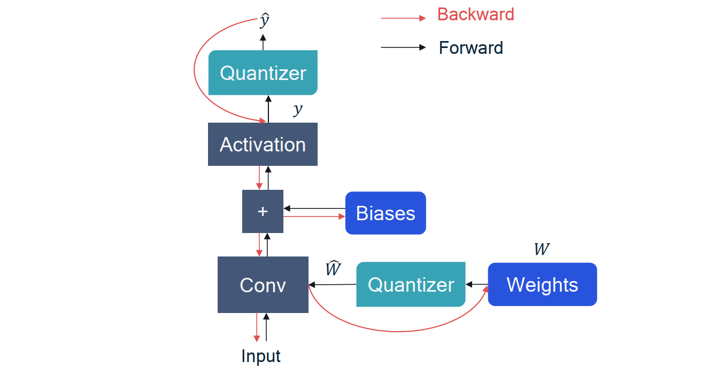
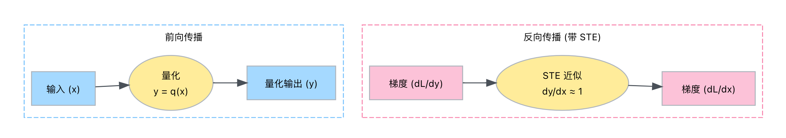

# 模型量化总结

## 基本概念

量化的目的是将浮点型（float32）的数值从浮点型空间映射到整型（int8/int32）的空间。其中 `int8` 类型对应的取值范围为$(q_{min},q_{max})=(-2^{b-1},2^{b-1}-1)$，`uint8`类型对应的取值范围为$(q_{min},q_{max})=(0,2^{b}-1)$。

### 反量化

参考 [QAT](https://arxiv.org/pdf/1712.05877.pdf) 中的公式，首先引入**反量化（dequntization）**公式，可以表示为
$$
r = S(q-Z)
$$
其中 $r$ 表示FP32 的浮点数类型的真实值(**r**eal value)；$q$ 为INT8 的量化后的IN8/INT16 的量化值(**q**uantization value)；$S$表示缩放因子（**s**cale-factor）；$Z$ 表示零点(**z**ero-point)。

### 量化

对应的可以得出**量化（quantization）**公式如下
$$
q = \lfloor \frac{r}{S} + Z \rceil = round(\frac{r}{S} + Z)
$$
参数含义，其中$\lfloor \cdot \rceil$表示将浮点数**舍入(round)**到最接近的整数。**量化中的误差主要是由于舍入（round）操作引起的**

容易看出，**量化的目的本质是确定$S$ 和 $Z$ 这两个参数，这两个参数直接决定了量化的精度**。当确定了$S$ 和$Z$我们就可以执行最后的量化操作，完成量化。

假设浮点类型参数的取值空间为$[r_{min}, r_{max}]$，量化后参数的取值空间为$[q_{min}, q_{max}]$，缩放因子$S$ 可以表示为
$$
S = \frac{r_{max} - r_{min}}{q_{max} - q_{min}}
$$
进一步容易得到，零点的公式
$$
Z = -\frac{r_{min}}{S} + q_{min}
$$

在实际操作过程中，浮点数的值$r$ 可能会超过浮点数的取值范围$[r_{min}, r_{max}]$, 对应的量化后数值也可能会超过的取值范围$[q_{min}, q_{max}]$，**具有固定类型精度的编程语言会裁剪（clip/clamp）超出范围的值**。具体来说，量化过程中会增加额外的裁剪步骤。引入裁剪操作的量化公式如下
$$
q = clip(round(\frac{r}{S}+Z); q_{min}, q_{max})
$$
其中裁剪公式
$$
clip(x;l,u)=\begin{cases}
l \quad if\ x \leq l \\
x \quad if\ l< x < u \\
u \quad if\ x \geq u \\
\end{cases}
$$

### 对称量化和非对称量化

* 非对称量化

  非对称量化(Asymmetric quantization) 通过三个参数定义，缩放因子s，零点z和位宽b 确定，即
  $$
  q = clamp(\lfloor\frac{r}{s}\rceil + z; q_{min},q_{max})
  $$

  $$
  r = s(q-z)
  $$

  非对称量化中缩放因子计算公式如公式$(3)$，零点计算公式如公式$(4)$（实际应用中可能有差异）

* 对称量化

  对称量化(symmetric quantization) 可以看作是普通非对称量化的简化版本，**对称量化限制零点 $z$ 为 0**。对称量化减少了处理零点偏移的计算损耗。但是缺乏偏移因子，这也限制了整数域和浮点数域之间的映射。

  对称量化的公式表示如下
  $$
  q = clamp(\lfloor\frac{r}{s}\rceil; q_{min},q_{max})
  $$

  $$
  r = sq
  $$

  特别地，对于有符号(sign)量化和无符号(unsign)量化可以分别表示为
  $$
  q = clamp(\lfloor\frac{r}{s}\rceil; 0,2^b-1)
  $$

  $$
  q = clamp(\lfloor\frac{r}{s}\rceil; -2^{b-1},2^{b-1}-1)
  $$

  对称量化中缩放因子的计算公式可以表示如下（实际应用中可能有差异）
  $$
  s = \frac{max(abs(r_{min}),abs(r_{max})) \times2}{q_{max}-q_{min}}
  $$

* 二次幂量化

  二次幂(power-of-two)量化是对成量化的一种特殊情形，它的尺度因子$s$被限制为二次幂$2^k$。二次幂量化使用的缩放因子$s$对应简单的移位操作，可以提升硬件的效率。但是受限于缩放因子$s$的表现能力，使得舍入和裁剪误差之间的权衡变得复杂。


### 小结

量化(quantization)公式可以表示为
$$
f_q(r, S, Z) = clip(round(\frac{r}{S}+Z), q_{min}, q_{max})
$$
反量化(de-quantization)公式可以表示为
$$
f_{d}(q,S,Z) =S(q-Z)
$$

## 量化方法

### PTQ量化

* 量化流程

  ```mermaid
  graph TD
  
  A(预训练) -->B(校准)
  B --> |执行量化| C(模型量化)
  C --> D(模型导出)
  ```

  

  1. 预训练：预训练首先以FP32 精度训练模型，得到预训练模型。

  2. 校准(calibration)

     校准具体可以分为两步

     1. 使用小部分数据对FP32模型进行校准，统计网络各层的权重和激活的数据分布（最大最小值）
     2. 使用数据分布特性，计算各层的缩放因子$S$和零点参数$Z$。

  3. 模型量化：使用校准得到的量化参数对FP32模型的各层进行量化。

  4. 模型导出：将模型导出为 onnx 

PQT 量化对于达模型来说很有效，但是对于小模型会导致准确度的显著下降。

### QAT 量化

神经网络中使用量化会引入信息损失，因此量化后的整数模型的精度一般会低于浮点数模型。**这种信息丢失是由于浮点数经过量化和反量化是不能够完全恢复的导致的**。这可以公式化为
$$
x = f_d(f_q(x, s_x, z_x), s_x, z_x) + \Delta x
$$
其中$\Delta x$ 是一个未知的很小的值，表示偏差。如果$\Delta x=0$表示量化后的整数模型的精度会与浮点数模型的精确度完全相同。

[QAT](https://arxiv.org/pdf/1712.05877.pdf)  量化算法由Google 提出，QAT 的思想是要求神经网络在训练期间考虑这种信息丢失造成的影响。通过在训练期间**模拟前向过程中量化的效果**，模型在训练过程中逐渐适应这种量化损失，使得模型在推理过程中损失最小。

具体来说，QAT 是在模型训练时为每一个变量（权重、激活等）加入量化（quantization）和反量化层（de-quantization），称为**伪量化（fake quantization）**节点，模拟量化引起的误差。可以公式化为
$$
\begin{align*}
\hat{x} &= f_d(f_q(x, s_x, z_x), s_x, z_x) \\
&=s_x(clamp(round(\frac{x}{s_x} + z_x);x_{min}, x_{max})-z_x)
\end{align*}
$$

QAT 训练过程中尺度因子$S$ 和零点$Z$ 会被收集，用于最后的量化操作。 


* 伪量化节点

  假设浮点型参数的取值范范围为$[a, b]$，通过量化级别的数量和范围截断，点级量化过程可以参数化为如下公式：

  首先对真实的浮点数值进行裁剪（clamb/clip）操作
  $$
  clamb(r;a,b) := min(max(r,a),b)
  $$
  结合公式$(3)$ 可以得到缩放因子
  $$
  s(a,b,n):= \frac{b-a}{n-1}
  $$


  式中 $n$ 表示量化级别的数量，如8比特量化时$n=2^8=256$。

  结合公式$(2)$ 和 $(1)$ 分别执行量化（quantization) 和反量化（quantization）操作得到**引入模拟量化操作后的浮点数值**。


$$
q(r:a,b,n) = \lfloor \frac{clamb(r;a,b)-a}{s(a,b,n)} \rceil s(a,b,n) + a
$$
容易得出，**每一个伪量化节的实质是量化-伪量化操作组合，其中$\lfloor \frac{clamb(r;a,b)-a}{s(a,b,n)} \rceil$ 模拟量化过程，$(\cdot)s(a,b,n)+a$ 表示反量化过程，从而实现在模型中模拟量化操作**

**伪量化节点的**会收集缩放因子$S$和零点$Z$的值。**在微调过程中，各层伪量化节点中的缩放因子$S=s(a,b,n)$ 和零点 $Z=z(a,b,n)$会得到估计和更新**

* QAT量化过程

  在训练/微调过程中，所有的变量和节点都使用32位浮点进行运算。在需要量化的参数后面插入**伪量化节点**（quantizer），来模型量化的效果。同时使用常规的优化算法进行训练。

  在推理过程中，推理框架根据不同类型计算类型可能会对应不同的计算精度。其中卷积和激活算子采用INT8精度；偏置加法只涉及INT32精度。

  **伪量化节点可以看作是通过模型模型量化过程中的舍入取整操作引起的误差，并将这种误差看作一种训练噪声。通过fine-tune过程，让模型去适应这种噪声。从而在模型量化位IN8时，减少由于量化操作造成的精度损失**

  

* 量化流程

  ```mermaid
  graph TD
  
  A(预训练) -->B(插入伪量化节点)
  B -->  C[微调 QAT 模型]
  C --> |存储量化参数|D(模型量化)
  D --> E(模型导出)
  ```

  1. 预训练：预训练首先以FP32 精度训练模型，得到预训练模型。
  2. 插入伪量化节点：在预训练模型中插入伪量化节点，得到QAT 模型
  3. 微调 QAT 模型：估计和更新各层伪量化节点中的缩放因子$S$ 和零点$Z$等量化参数
  4. 模型量化：使用得到的量化参数如scale等，对FP32模型执行量化操作得到量化模型
  5. 模型导出：将模型导出为 onnx 

* 量化训练的反向传播

  伪量化节点(以对称量化为例)的计算过程如下
  $$
  \text{fake\_quant} = clamp(round(x/scale),-2^b, 2^b-1) * scale
  $$
  

  这里`round` 操作为阶梯函数，不可微，**梯度基本为零**。从而导致伪量化算子，**无法直接通过梯度反向传播的方式进行训练**。

  为了解决这个问题，QAT 在反向传播期间依赖于一种，成为“**直通估计器(Straight-Through Estimation，STE)**”梯度计算的近似方法。有效使梯度绕过不可微的量化步骤，从而使模型的权重得以更新。原理如下

  

  假设伪量化函数为$y=q(x)$，$x$为浮点输入，$y$为浮点输出，损失为$L$。

  反向传播时，根据链式法则， $\frac{\partial L}{\partial x} = \frac{\partial L}{\partial y} \cdot \frac{\partial y}{\partial x}$。由于 $\frac{\partial y}{\partial x}$由于round操作，不可导，梯度基本为0，阻止了梯度的传播。

  STE的核心思想是，为了克服以上问题，忽略$q(x)$的真实导数，即$\frac{\partial y}{\partial x} = \frac{\partial q(x)}{\partial x}\approx 1 $, 采用近似的方法执行梯度传播。具体如下

  * 前向传播，按照正常量化公式执行操作，$y=q(x)$。

  * 反向传播，计算$L$ 相对于$x$的梯度，根据链式法则， $\frac{\partial L}{\partial x} = \frac{\partial L}{\partial y} \cdot \frac{\partial y}{\partial x} \approx \frac{\partial L}{\partial y} \cdot 1 = \frac{\partial L}{\partial y}$。

  这意味着为量化节点输出计算的梯度 $\frac{\partial L}{\partial y}$被“直通”传递，近似成为对于损失对于输入的梯度$\frac{\partial L}{\partial x}$。

  实际代码中，**$STE$ 用来替换round 操作**，在梯度反向传播过程中，替换为可导的近似操作。
  
  [STE示例代码](https://github.com/NVIDIA/TensorRT/blob/main/tools/pytorch-quantization/pytorch_quantization/tensor_quant.py)

### qat 量化 的一些trick

1. 量化步骤：优先使用PTQ 量化，当PTQ精度不满足时，才使用QAT。

2. QAT 量化一般会预加载PTQ的权重，作为权重初始化，提升量化效果。

3. 关于**舍入误差**，round 操作会引入舍入误差，会导致不同大小的浮点数的量化结果相同。针对误差，最直接的方法是可以考虑使用小的scale，但可能会导致截断误差。通常的方法是，使用更高的精度，从而在小的scale的情况下，避免截断误差。

4. 关于**截断误差**，clamp 操作会引入截断误差，会导致量化后的结果操作量化范围的最大值或最小值。针对截断误差，最直接的方法是使用更大的 scale，但由于scale 是由于量化工具的统计方法得到，通常需要考虑是否是因为校准方式的问题，导致scale的取值不合理。当然，也可以考虑，使用更高的精度，避免截断误差。

5. **敏感层分析**，确定那些层或算子对于量化比较敏感，并针对敏感层设计特定的量化策略。敏感层的搜索步骤，首先所有层都使用高精度算子，获取精度的上限。逐层使用，讲高精度的量化算子替换为低精度的量化算子，当替换后整体的模型精度急剧下降时，认为当前层或算子为敏感层。

6. **混合精度量化**，对于识别出的敏感层，可以替换为更高精度的量化算，而其他不敏感层依然采用低精度算子。如in8/int16的混合量化。

7. **算子融合**，检查模型是否存在可融合但是没有融合的模块，比如，conv/bn/relu 这三个算子，通常会在量化前合并层同一个模块，避免之前插入伪量化节点，导致精度的轻微下降。其他算子如add，同理也可以融合。

8. 针对**共享模块**，当一个模块被多次调用，但一个模块通常仅能统计一组量化信息。因此，当模块多次调用的输出数据差距较大时，通常需要将共享模块拆分或备份为多份，分别执行调用操作，从而避免同一组量化参数可能导致的误差。

9. 使用**固定尺度(fix scale)**，当算子的输入值域确定时，可以设置固定的scale，提升量化精度。由于量化的scale是基于统计的方式获取的，在数据校准过程中，很难保证样本达到边界状况，因此很难获得最佳的scale。这种情况下，手动设置scale 效果更佳。

   ```python
   def get_scale(grid_shape, view_shape, precision=16):
       """
       (x_max - x_min) / (2^15 - 1) -> (x_max - x_min) / 2**15 -> 1 / 2^(15 - log2(x_max - x_min))
       """
       max_coord = max(*grid_shape, *view_shape)
       coord_bit_num = math.ceil(math.log(max_coord + 1, 2))
       coord_shift = (precision - 1) - coord_bit_num
       coord_shift = max(min(coord_shift, 8), 0)
       quant_scale = 1.0 / (1 << coord_shift)  
       return quant_scale
   ```

   

10. 优化**模型结构**，当某些层的取值范围异常时，可以考虑加入加入一些正则化层做抑制。比如，纯conv层之后，可以插入BN层去缓解输出值异常的问题。


## 参考资料

* <https://leimao.github.io/article/Neural-Networks-Quantization/#Quantization>
* <https://zhuanlan.zhihu.com/p/548174416>
* <https://pytorch.org/blog/quantization-in-practice/>
* <https://onnxruntime.ai/docs/performance/model-optimizations/quantization.html>
* [Quantization and Training of Neural Networks for Efficient Integer-Arithmetic-Only Inferencen](https://arxiv.org/abs/1712.05877)
* [A White Paper on Neural Network Quantizatio](https://arxiv.org/abs/2106.08295)
* https://apxml.com/zh/courses/practical-llm-quantization/chapter-4-quantization-aware-training-qat/simulating-quantization-training
* Nonuniform-to-Uniform Quantization: Towards Accurate Quantization via Generalized Straight-Through Estimation