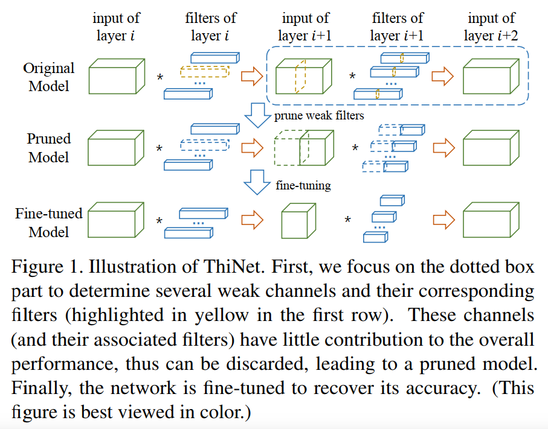
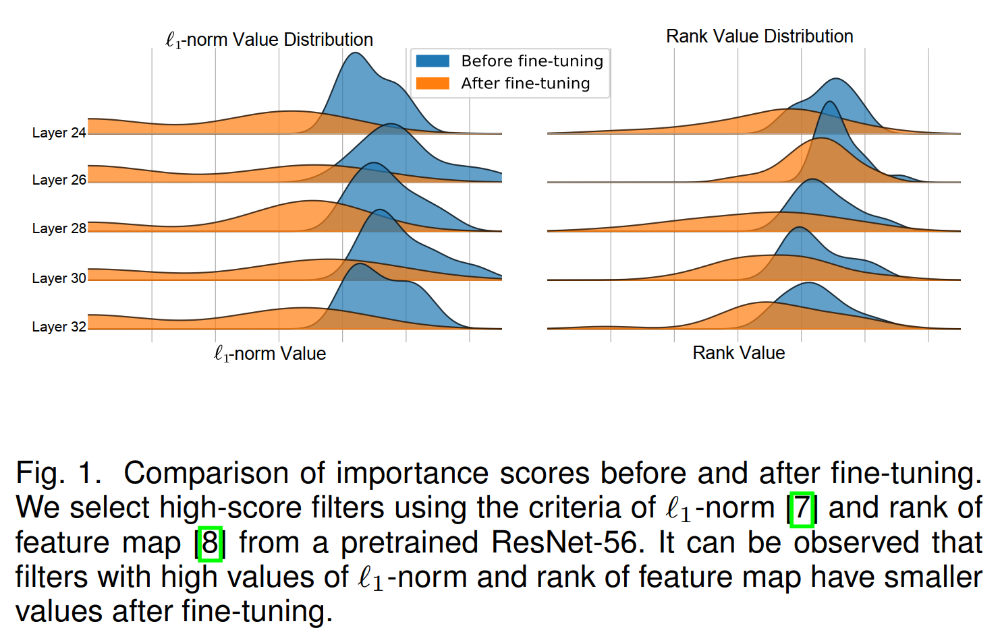

# 网络剪枝调研

## 概述

过参数化(over-parameterized )是深度神经网络的特性之一，这些冗余参数并不能进一步提高结果的准确性。网络剪枝（network-pruning）指在保持精度变化可接受的情况下（模型精度可能会提升），去移除不需要的神经元和连接，达到模型压缩/加速的目的。

### 剪枝算法分类

剪枝算法可以通过不同角度进行划分：

* 根据剪枝算法的粒度（granularity）可以分为**结构化剪枝(structured pruning)**和**非结构化剪枝(unstructured pruning)**，这里的结构可以理解为网络中结构单元，如滤波器、层或者模块。结构化的剪枝粒度一般是指通道级或以上的剪枝，剪枝的结果仍然是结构化的网络。而非结构化的剪枝，指的是剪枝权重的单个元素，会产生非结构化的网络。结构化的剪枝对于硬件更友好，易于部署；而非结构化的剪枝需要特定的硬件支持，部署不方便。

  

  上图中矩形方块表示卷机核，其中从左到右的不同颜色分别为元素级、通道级、形状级、滤波器级和层级，稀疏度依次降低。其中元素级有最小的稀疏影响，从而产生非结构化的模型。

  

  上图表示分别表示非结构化剪枝和结构化剪枝

  

* 根据剪枝模型执行剪枝和推理的位置可以分为**静态剪枝(static pruning)**和**动态剪枝(dynamic prunng)**。静态剪枝是在训练之后和推理之前，离线地移除神经元；而动态剪枝是在运行阶段决定哪些层、通道或神经不参与后续的计算，即运行阶段执行剪枝。典型的动态剪枝一般不需要进行微调和重新训练。

* 根据剪枝模型的初始状态可以分为**训练后剪枝(Pruning after Train, PaT)**和**初始化剪枝(Pruning at Initialization, PaI)**。PaT 通常由3个步骤组成：预训练一个（冗余）稠密模型；剪枝稠密模型为稀疏模型；微调稀疏模型去恢复性能。PaI 从一个随机初始化(randomly initialized) 而不是一个预训练好的的稠密网络开始剪枝， 去取得（接近）稠密模型的准确性。特别地，大多数的PaI 聚焦于非结构话的剪枝。

### 剪枝标准

* $L_p$ 范数

  $L_p$范数的定义如下
  $$
  ||X||_p=(\sum_{i=1}^n|x_i|^p)^{\frac{1}{p}}
  $$
  其中$p\in \{N,\infty\}$，其中$N$ 是自然数；$x$ 是一个包含$n$个元素的向量。

  $L_0$范数表示向量中所有有非零元素的数量

  $L_1$范数就是熟知的曼哈顿范数**(Mahattan norm)**，对应的正则化被称为**LASSO(Least Absolute Shrinkage and Selection Operator)**

  $L_2$ 范数就是欧式范数**(Euclidea norm)**，对应的正则化被称为**Ridge**。

* 基于幅度的剪枝

  基于幅度的剪枝(Magnitude-based pruning)主要时基于训练得到权重中**更大值的权重比更小值的权重更重要**这一观点。基于梯度的剪枝主要是试图去定位不需要的权重或特征，并在运行评估/推理时移除它们。大多数基于大小的剪枝，是去剪枝所有值为零的权重或者所有绝对值小于阈值的权重。

* 基于惩罚的剪枝

  基于惩罚的剪枝(Penalty-based pruning)的目标是在训练过程中，通过修改损失函数或者引入其他约束/偏置项引入惩罚因子。惩罚之用于更新权重的值为零或者接近于零，如稀疏训练。

* 基于冗余的剪枝

  基于冗余的剪枝(Redundancy-based pruning) 主要是另一种角度进行剪枝，基于重要性的剪枝，特征的“重要“性随着训练的不同阶段可能会发生改变。而基于惩罚的剪枝，与其他滤波器相似而被剪枝，实际可能是需要的，造成网络准确性的下降。给予上述分析，提出了剪枝冗余的权重而不是”重要的“权重。

## 网络剪枝相关算法

### L1/L2 Norm(Pruning Filters for Efficient ConvNets, ICLR 2017)

* 类型: 基于幅度的剪枝，结构化剪枝

* 摘要：论文展示了一种加速方法，从CNN 中剪枝那些识别为对输出准确性影响较小的滤波器。通过移除网络中的整个滤波器和他们对应的特征图，显著地压缩计算损耗。

* 关键点
  * 论文通过计算它的权重绝对值的之和， 度量每一层一个滤波器的相对重要性。如$L_1$范数。

  * 剪枝细节
  
    
    
    1. 计算每一层滤波器的权重绝对值之和$s_j$，作为通道重要性指标。
    2. 根据$s_j$排序滤波器
    3. 剪枝m个最小值的滤波器，并移除它对应的特征图和下一层中相关的核。
    4. 将为第$i$层和第$i+1$层创建新的核矩阵，并将剩余的核权重复制到新模型中。
  
* 贡献

### Slimming(Learning Efficient Convolutional Networks through Network Slimming, ICCV 2017)

* 类型： 结构化剪枝，基于惩罚的剪枝

* 摘要：论文提出新的方法可以直接应用于现代的CNN架构，在训练过程中引入最小的计算开销，且不需要额外的软硬件加速。这种方法称为**slimming**，使用宽的和大的网路作为输入模型，在训练过程中可以自动识别不重要的通道，然后进行剪枝。

* 关键点
  * 稀疏化训练

    在BN层的尺度因子上进行L1 正则化，推动尺度因子的值接近于零，使得我们能够识别不显著/重要的通道，其中每个尺度因子对应一个特殊的卷积通道。

  * 剪枝

    经过引入正则话进行通道级的稀疏化训练，会得到很多BN尺度因子接近于0的模型。然后我们通过移除尺度因子接近于零的的通道对应传入传出和对应的权重，完成通道剪枝。论文**剪枝通道使用一个对所有层的全局阈值， 它定义作为一个所有尺度因子值的一个百分比**

  * 微调

    当剪枝率很高时，剪枝可能会暂时损失一定的准确性损失。通过在剪枝后的网络上进行微调可以很大地补偿这个损失。

  * 剪枝架构
  
    
  
  * 结论
  
    重复多次上述的过程，可以产生多通道网络的slimming 方案，产生更紧凑的网络。
  
* 贡献

### ThiNet(ThiNet: A Filter Level Pruning Method for Deep Neural Network Compression, ICCV 2017)

* 类型：结构化剪枝，基于惩罚的剪枝

* 摘要：论文提出了新的架构同时在训练和推理阶段加速和压缩CNN。首先将滤波器剪枝定义为一个优化问题。其次，揭示了需要基于下一层而不是当前层的信息剪枝滤波器，这是ThiNet 与其他剪枝算法的主要区别。

* 关键点

  * 动机： 论文的主要观点是，建立了一个良好定义的优化问题，它表明**滤波器是否可以被剪枝取决于其下一层的输出，而不是其自己的层**。

  * 论文通过贪婪算法去最小化特征的重建误差来进行通道选择

  * 剪枝框架

    

    1. 特征选择：使用第$i+1$ 层的统计信息去指导第$i$ 层的剪枝。
    2. 剪枝：第$i+1$ 层弱(weak) 的输入和它们对应于第$i$层的滤波器会被剪枝。
    3. 微调： 微调去恢复模型由于滤波器剪枝导致的泛化能力的下降。
    4. 迭代到第一步去剪枝下一层

* 贡献:

### ADMM(A Systematic DNN Weight Pruning Framework using Alternating Direction Method of Multipliers, ECCV 2018)

* 类型：非结构化/结构化剪枝， 动态剪枝

* 摘要

  当前的剪枝方法是启发式的、迭代的剪枝，因此缺乏权重下降比率和收敛时间的保证。论文使用交替方向乘数法(Alternating Direction Method of Multipliers)进行系统性的剪枝。论文将权重剪枝问题表述为具有指定稀疏性要求的组合约束的非凸优化问题（nonconvex optimizer problem）。通过ADMM，原始的凸优化被解耦为两个问题进行迭代的解决。一个子问题可以被随机梯度下降解决，而另一个子问题可以解析求解。

* 关键点

  * 动机

    之间的剪枝都剪枝算法都是基于评估模型权重或滤波器的重要性进行剪枝的，而在剪枝剪枝之前都会进行稀疏化训练。稀疏化训练一般是通过添加正则化项得到。但是现有的算法都是启发式的，不能取得最优的剪枝率，缺乏压缩性能的理论保证，并且需要耗时的迭代再训练过程。ADMM 将剪枝任务看作是对模型稀疏度有限制的优化任务。这种有限制的优化问题会用到拉格朗日乘子法，将约束融入我们优化的问题中，然后分别针对原任务和约束进行迭代求解。

  * 权重剪枝

    ADMM 的思想是将原任务和约束条件解耦为两个子问题，独立和有效地解决。模型剪枝任务中，原任务是可微的，可以使用随机梯度下降进行优化求解；而约束条件求解是不可微的，使用拉格朗日乘子法进行优化。

    1. 第一步，利用随机梯度下降算法更新原任务权重${W_i^{k+1}, b_i^{i+1}}$
    2. 第二步，更新权重剪枝项相关的权重${Z_i^{k+1}}$。
    3. 第三步，利用${W_i^{k+1}, b_i^{i+1}}$和${Z_i^{k+1}}$更新定义的缩放变量
    4. 迭代直到满足中止条件

  * 总结

    采用 ADMM 算法，将剪枝问题转化为数学优化问题，在剪枝的同时训练剩余权重。

* 贡献

### FPGM(Filter Pruning via Geometric Median for Deep Convolutional Neural Networks Acceleration, CVPR 2019)

* 类型：结构化剪枝， 基于冗余的剪枝

* 摘要：当前的方法利用“越小的权重越少的的重要性（smaller-norm-less-import）”的准则去剪枝卷积网络中具有小范数值的通道。论文指出基于范数剪枝的有效性依赖于两个点：滤波器的标准差应该足够大；滤波器的最小范数应该很小。为了解决这个问题，论文提出**几何中值滤波器剪枝(Filter Pruning via Geometric Median, FPGM)**，能够忽略这两个要求去压缩模型。FPGM 通过剪枝冗余的滤波器，而不是重要性相对较小的滤波器进行剪枝。

* 关键点
  * 基于范数剪枝标准的限制

    
  
    对于“足够大的标准差”这个条件：当标准差很小时，如上图(a)范数的值都集中在很小的区域，意味着一个小的搜索空间，从而导致很难发现合适的阈值去剪枝。
  
    对于“范数应该很小”这个条件：具有最小滤波器的范数不可能任意小，如上图(b)在这种情况下，那些被认为最不重要的过滤器仍然对网络有很大的贡献，这意味着每个过滤器都具有高度的信息量。如果剪枝那些具有最小范数值的滤波器将对网络产生负面影响。
  
  * 剪枝架构
  
    
    
    **几何中值(Geometric Median，GM)**指的是：对于给定的一组点，找到一个点能够最小化它们的欧式距离之和。论文认为滤波器也是欧式空间中的点，可以通过GM来获得这些**滤波器的中心**。
    
    *在每一层发现那些最靠近滤波器中心的滤波器，这些滤波器可以由同一层的其他滤波器表示，因此剪枝掉它们对于网络性能没有很大的负面影响*。
    
    通过几何中值去进行剪枝操作，克服了基于范数剪枝的限制通过修剪具有冗余的滤波器来压缩模型，而不是移除那些重要性相对较低的滤波器。
  
* 贡献

### Taylor(Importance Estimation for Neural Network Pruning, CVPR 2019)

* 类型： 结构化剪枝，基于幅度的剪枝，开源
* 摘要：论文提出了新的方法取估计一个神经元/滤波器对于最终损失的贡献，并迭代地移除这些具有更小分数的滤波器。论文描述了使用一阶和二阶泰勒展开式去近似一个滤波器的贡献的方法的两种变体。
* 关键点
  * 论文将重要性定义为从网络中移除特定滤波器所导致的损失的**平方变化**。论文使用泰勒展开式去近似预定义的重要性。
  * 参数的重要性可以通过通过将它们移除产生所的平方误差进行量化。
  * 通过损失在权重$W$附近的二阶泰勒展来近似平方误差损失函数，从而避免评估M个不同的网络。可以使用一阶泰勒展开更紧凑地近似为$L_m^{l}(W)=(g_mw_m)^2$
  * 剪枝算法
    1. 对于每个最小批次，通过梯度下降计算参数的梯度并更新网络权重。
    2. 使用最小批次的梯度平均，计算每个神经元的重要性。
    3. 经过一个预定义训练的批次后，平均每个神经元所有批次的重要性分数，并移除N个最小重要分数的神经元。
    4. 微调并继续剪枝直到达到合适的剪枝率
* 贡献
  * 与操作再BN层的剪枝算法相比，它能够应用到网络的任意层，不止是BN层

### LTH(The Lottery Ticket Hypothesis: Finding Sparse, Trainable Neural Networks, ICLR 2019)

* 类型：结构化剪枝，基于幅度的剪枝
* 摘要：提出了彩票假设理论(Lottery Ticket Hypothesis, LTH)：在稠密随机初始化的前向网络中包含子网络（中奖彩票）， 从头独立训练时可以在相似的迭代次数达到与原始网络相似的精度。
* 关键点

  * 剪枝流程（找出高品质的子网络）

    1. 随机初始化一个稠密网络$f(x:\theta_0)$
    2. 训练这个网络，迭代$j$ 次，到达参数$\theta_j$
    3. 剪枝掉$\theta_j$中$p\%$ 的参数，并创建一个mask $m$用于剪枝。
    4. 重置剩下的参数值为$\theta_0$中的值，这样就构建了一个 winning tickets $f(x;m\odot\theta_0)$。中奖彩票的权重与剪枝前网络对应的权重保持一致，会使得训练更有效
    5. 按照初始化值，训练中奖彩票，验证中奖彩票的准确性
    6. 迭代地重复上述步骤，完成剪枝
* 贡献

### Rethinking-Network-Pruning(Rethinking the Value of Network Pruning, ICLR 2019)

* 类型

* 摘要

  微调一个剪枝模型会获得比使用随机初始化权重训练模型相当或者更差的表现。对于一个预定义目标网络架构的剪枝算法，可以完全摆脱pipeline(training，pruning，fine-tuning)，直接从头开始训练。

* 关键点

  * 获得一个大的过参数模型，没必要获取一个最终的有效模型
  * 学习到的大模型的“重要”权重通常对小修剪模型不太有用
  * 剪枝得到的架构本身而不是继承的重要权重，对于剪枝模型的性能更重要。

* 贡献

### AutoSlim(AutoSlim: Towards One-Shot Architecture Search for Channel Numbers, NIPS 2019)

* 类型: 结构化剪枝，开源

* 摘要：

* 关键点

  * 剪枝流程

    

* 贡献

### SCP(Operation-Aware Soft Channel Pruning using Differentiable Masks, ICML 2020)

* 类型：结构化剪枝，未开源
* 摘要：
* 关键点
* 贡献:

### Auto Compress Pruner(AutoCompress: An Automatic DNN Structured Pruning Framework for Ultra-High Compression Rates, AAAI 2020)

* 类型：结构化剪枝，动态剪枝

* 摘要：结构化剪枝涉及大量灵活的超参数，因此自动超参数确定过程是必要的。为解决结构化剪枝中超参数的决策问题，将超参数的设置转变为一种自动化过程将大大提高模型权重剪枝的算法实现效率。论文提出了一种结构剪枝架构，具有三个改进:在自动过程中有效地结合结构化修剪方案的组合；采用最先进的基于ADMM的结构化权重修剪作为核心算法，并提出了一个创新的额外净化步骤，以进一步减少权重而不损失精度；提出通过基于经验的引导搜索增强的有效启发式搜索方法，取代先前的深度强化学习技术，之前技术与目标修剪问题存在潜在的不兼容性。

* 关键点

  * 算法结构

    

    通过基于启发式搜索算法的自动化代理模块的指导，AutoCompress 框架进行模型自动化剪枝主要分为两个步骤。
    
    步骤 1：通过基于 ADMM 算法的结构化剪枝，得到权重分布结构性稀疏化的模型；
    
    步骤 2：通过网络结构净化（Purification）操作，将 ADMM 过程中无法完全删除的一小部分冗余权重找到并删除。值得注意的是，这两个步骤都是基于相同的启发式搜索机制。

* 贡献

  * 提出混合型的结构化剪枝维度；采用高效强大的神经网络剪枝算法 ADMM（交替乘子优化算法）对训练过程中的正则项进行动态更新；利用了增强型引导启发式搜索的方式进行行为抽样。

### DCP(Discrimination-aware Network Pruning for Deep Model Compression, 2021)

* 类型：结构化剪枝，基于冗余的剪枝

* 摘要：现有的剪枝算法可以分为两种： 使用稀疏化从头开始训练和最小化与预训练模型之间特征映射的重建误差。前者计算昂贵且收敛困难，后者忽略了通道的判别能力。为了解决这个问题，论文引入了判别感知通道剪枝（Discrimination-aware Channel Pruning, DCP)去选择真正有助于网络判别力的通道。论文将通道剪枝公式化为具有凸目标的稀疏诱导优化问题。此外，论文指出除了通道冗余，一些核也可能存在冗余，对网络的判别能力没有贡献，导致了核冗余。论文提出了判别感知核剪枝(Discrimination-aware Kernel Pruning, DKP)

* 关键点

  * 动机

    论文提出，任何信息通道/核都应具有足够的辨别能力，否则就应将其移除。基于此，论文提出了DCP和DKP分别取选择真正对网络判别力的滤波器和核，完成模型的剪枝/压缩。

  * 损失

    论文引入了基于通道和基于核的多个判别感知损失，去增加网络的判别能力。

    在执行通道选择去选择最有判别力的通道时，同时考虑了**基于判别的损失**和特征图的**重建误差**。

  * 算法结构

    

    上图表示了基于判别感知的通道剪枝的流程图。其中$L_{S}^{P}$表示第$L_p$的判别感知损失，$L_M$表示了重建损失，$L_{f}$表示最终损失。

    1. 首先构建每一层的判别感知损失$\{L_S^p\}_{p=1}^P$，并插入到它们到对应的层$\{L_1,\cdots,L_P\}$
    2. 同时使用判别感知损失$\{L_S^p\}_{p=1}^P$和最终损失$L_f$，学习参数$\{\theta^p\}_{p=1}^P$并微调模型$M$中的参数。通过微调，中间层的判别能力会有很大的提高。
    3. 然后使用微调后的模型初始化Baseline 模型$M^b$, 并使用$P+1$阶段执行当前阶段的通道剪枝。
    4. 在每个阶段，独立的考虑当前的阶段的层，比如在$p$阶段，使用$\{L_{p-1}+1,\cdots,L_p\}$层对应的$L_S^P$和$L_M$ 执行通道选择。

* 贡献

### Rethinking the Pruning Criteria for Convolutional Neural Network(NIPS 2021)

* 类型：
* 摘要
* 关键点
* 贡献:

### DCFF(Training Compact CNNs for Image Classification using Dynamic-coded Filter Fusion, 2022)

* 类型：结构化剪枝，基于惩罚的剪枝

* 摘要：论文提出动态编码滤波器融合(dubbed dynamic-coded filter fusion,DCFF)，每个滤波器首先被赋予一个以温度参数作为滤波器代理的互相似性分布。在这个基础上，提出了一个新的基于KL散度的动态编码准则来评估滤波器的重要性。与简单地保持高分数的滤波器方法不同，论文提出了**滤波器融合**的概念。当温度参数接近无穷大时，我们获得了一个one-hot 的互相似性分布。这样，每个滤波器的相对重要性可以随着紧凑型CNN的训练而变化，产生了动态可变的融合滤波器，而不依赖于预训练的模型和引入稀疏约束。

* 关键点

  * 动机

    

    传统的硬编码方法依赖于在预训练模型上选择固定的“重要”滤波器。论文通过实验观察微调后，之前具有高的的L1 范数或者秩的特征图的值会变得很小。

    这主要是由于两个方面的原因：首先虽然这些标准确实是每个过滤器的固有属性，但不同过滤器之间的相互相似性不能很好地反映出来。其次，在不同的训练阶段，许多过滤器的相对重要性发生了很大变化。因此，基于预训练模型评估滤波器的重要是不合适是的。

    在能够**反映滤波器之间相似性**的前提下，构建一个能够度量滤波器的重要性的合适场景。这个场景以**动态编码**的形式进行，**以跟踪CNN训练期间每个滤波器实时的重要性**。

    以动态编码的方式执行滤波器剪枝，每个滤波器的重要性随着紧凑性网络的训练进行动态捕捉。

    

  * 剪枝流程

    
    
    1. 对于每一层，首先计算滤波器之间相互的相似性，并为每个滤波器计算具有温度系数$t$ 的分布代理$p_k$
    2. 通过计算滤波器代理之间的差异(比如KL散度)，度量每个滤波器的重要性分数。
    3. 在训练的前：第i层原始的滤波器被融合到第$i$个融合层的滤波器组中，构成紧凑性网络。
    4. 在训练的前向阶段： 使用紧凑型网络作为主干推理输入的图像。
    5. 在训练的反向阶段：使用紧凑型网络的输出更新原始的滤波器。注意这里紧凑型网络的融合层只是中间结果，不可记忆。
    6. 在推理阶段：在常规网络训练之后，只有融合滤波器被保留下来，作为剪枝后的紧凑型模型。

* 贡献:

### Random Channel Pruning(Revisiting Random Channel Pruning for Neural Network Compression, CVPR 2022)

* 类型：通道级剪枝，未开源
* 摘要：
* 关键点
* 贡献

## 开源仓库

* https://github.com/microsoft/nni
* https://github.com/open-mmlab/mmrazor

## 参考链接

- [Pruning and Quantization for Deep Neural Network Acceleration: A Survey](https://arxiv.org/abs/2101.09671)

* https://towardsdatascience.com/neural-network-pruning-101-af816aaea61

* https://nni.readthedocs.io/en/latest/compression/pruning.html

* https://zhuanlan.zhihu.com/p/270413414

  
