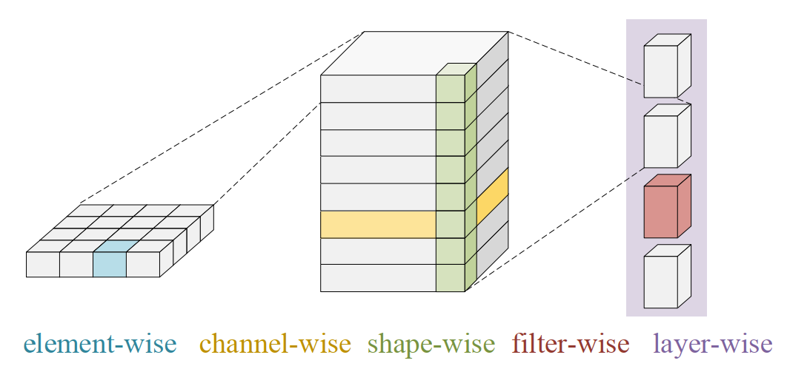
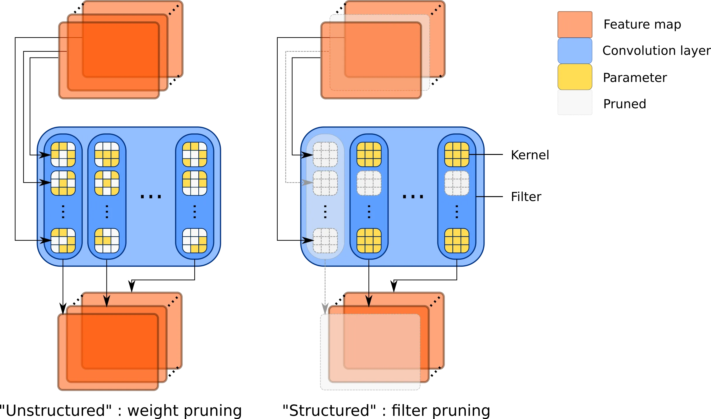
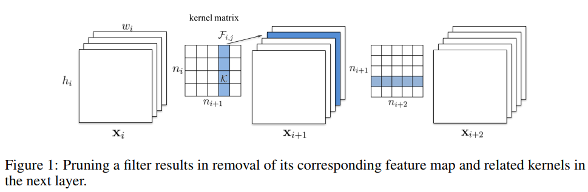
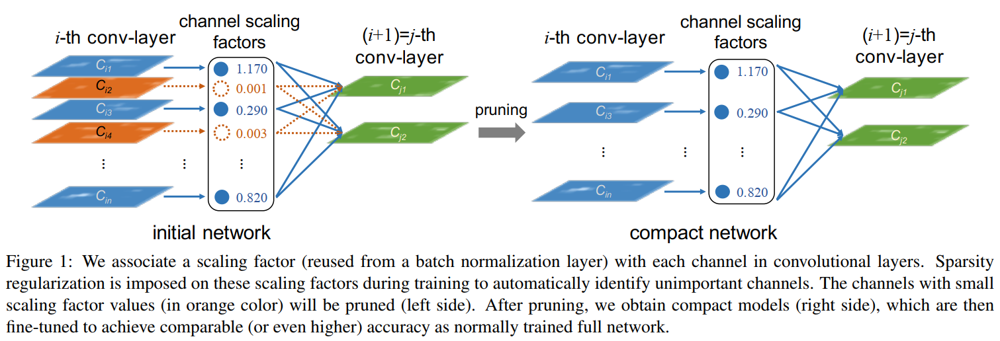
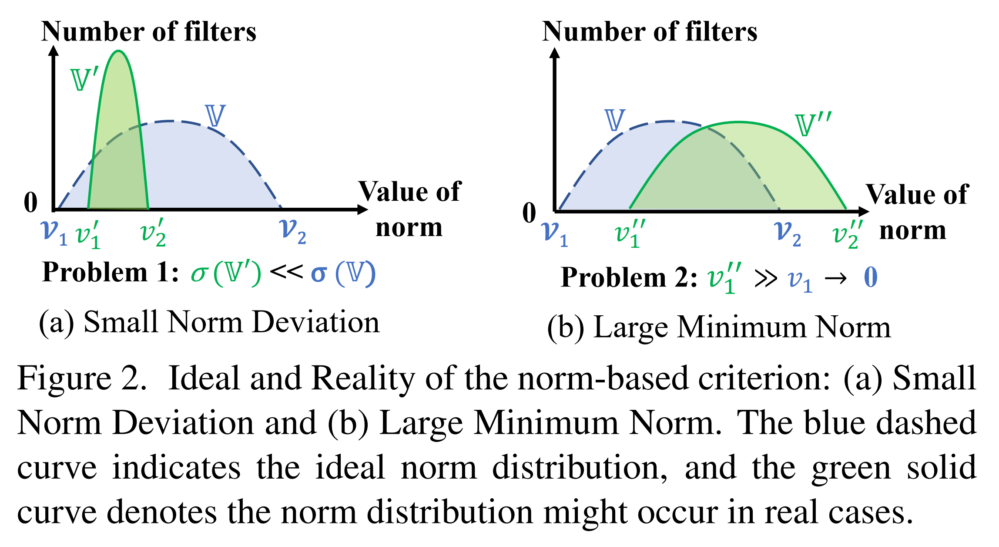
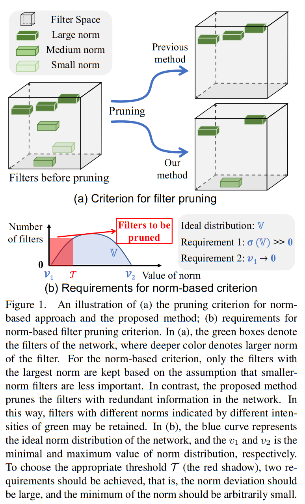
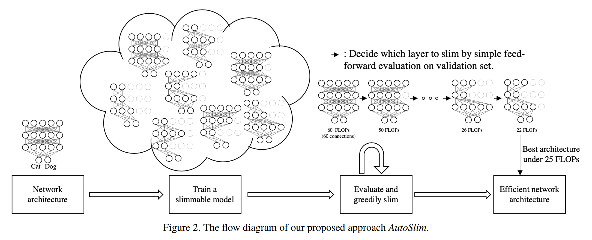
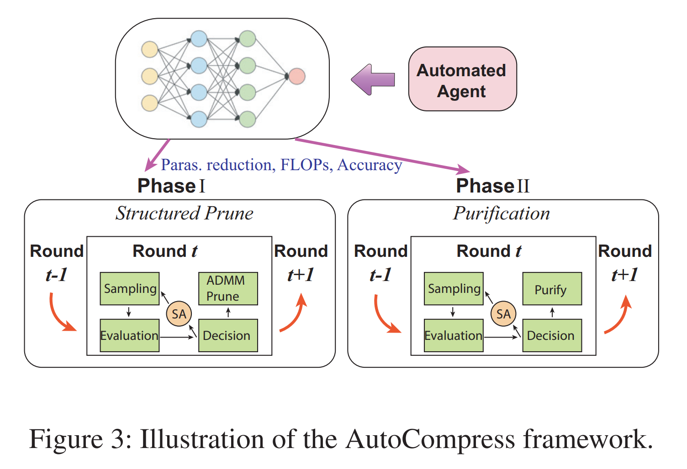
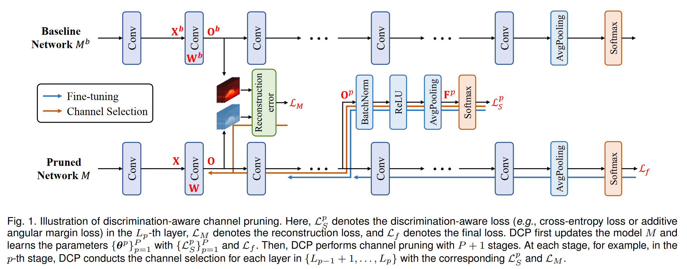
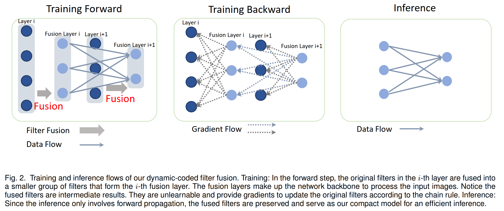

# 网络剪枝调研

## 概述

过参数化(over-parameterized )是深度神经网络的特性之一，这些冗余参数并不能进一步提高结果的准确性。网络剪枝（network-pruning）指在保持精度变化可接受的情况下（模型精度可能会提升），去移除不需要的神经元和连接，达到模型压缩/加速的目的。

剪枝算法可以通过不同角度进行划分：

* 根据剪枝算法的粒度（granularity）可以分为结构剪枝（structured pruning）和非结构剪枝（unstructured pruning）其中结构化的剪枝粒度不细致，比如通道级或滤波器的剪枝等。而非结构化的剪枝，指的是剪枝权重的单个元素，其中元素没有对应的结构。一般来说结构化的剪枝对于硬件更友好，易于部署；而非结构化的剪枝需要特定的硬件支持，部署不方便。

  

  上图中矩形方块表示卷机核，其中从左到右的不同颜色分别为元素级、通道级、形状级、滤波器级和层级，稀疏度依次降低。其中元素级有最小的系数影响，从而产生非结构化的模型。

  

  上图表示分别表示非结构化剪枝和结构化剪枝

  

* 根据剪枝模型执行剪枝和推理的位置可以分为静态剪枝（static pruning）和动态剪枝(dynamic prunng)。静态剪枝在推断之前所有的剪枝步骤都是离线进行的，而动态剪枝是在运行阶段执行剪枝。

* 根据剪枝模型的初始状态可以分为训练后剪枝(Pruning after Train, PaT)和初始化剪枝(Pruning at Initialization, PaI)。PaT 通常由3个 步骤组成：预训练一个（冗余）稠密模型；剪枝稠密模型为稀疏模型；微调稀疏模型去恢复性能。PaI 从一个随机初始化(randomly initialized) 而不是一个预训练好的的稠密网络开始剪枝， 去取得（接近）稠密模型的准确性。特别地，大多数的PaI 聚焦于非结构话的剪枝。

## 网络剪枝相关算法

### L1/L2 Norm(Pruning Filters for Efficient ConvNets, ICLR 2017)

* 类型: 通道级剪枝， 开源

* 摘要

* 关键点
  * 用权重的L1范数的最小值剪枝输出通道

  * 剪枝细节
  
    
  
* 贡献

### Slimming(Learning Efficient Convolutional Networks through Network Slimming, ICCV 2017)

* 类型： 通道级剪枝，开源

* 摘要：论文提出新的方法可以直接应用于现代的CNN架构，在训练过程中引入最小的计算开销，且不需要额外的软硬件加速。

  这种方法称为**slimming**，使用宽的和大的网路作为输入模型，在训练过程中可以自动识别不重要的通道，然后进行剪枝。

* 关键点
  * 稀疏化训练

    在BN层的尺度因子上进行L1 正则化，推动尺度因子的值接近于零，使得我们能够识别不显著/重要的通道，其中每个尺度因子对应一个特殊的卷积通道。

  * 剪枝

    经过引入正则话进行通道级的稀疏化训练，会得到很多BN尺度因子接近于0的模型。然后我们通过移除尺度因子接近于零的的通道对应传入传出和对应的权重，完成通道剪枝。论文**剪枝通道使用一个对所有层的全局阈值， 它定义作为一个所有尺度因子值的一个百分比**

  * 微调

    当剪枝率很高时，剪枝可能会暂时损失一定的准确性损失。通过在剪枝后的网络上进行微调可以很大地补偿这个损失。

  * 剪枝架构
  
    
  
  * 结论
  
    重复多次上述的过程，可以产生多通道网络的slimming 方案，产生更紧凑的网络
  
* 贡献

### ADMM(A Systematic DNN Weight Pruning Framework using Alternating Direction Method of Multipliers, ECCV 2018)

* 类型：权重剪枝， 开源

* 摘要

  当前的剪枝方法是启发式的、迭代的剪枝，因此缺乏权重下降比率和收敛时间的保证。论文使用交替方向乘数法(Alternating Direction Method of Multipliers)进行系统性的剪枝。论文将权重剪枝问题表述为具有指定稀疏性要求的组合约束的非凸优化问题（nonconvex optimizer problem）。通过ADMM，原始的凸优化被解耦为两个两个问题进行迭代的解决。一个子问题可以被随机梯度下降解决，而另一个子问题可以解析求解。

* 关键点

  * 动机

    之间的剪枝都剪枝算法都是基于评估模型权重或滤波器的重要性进行剪枝的，而在剪枝剪枝之前都会进行稀疏化训练。稀疏化训练一般是通过添加正则化项得到。但是现有的算法都是启发式的，不能取得最优的剪枝率，缺乏压缩性能的理论保证，并且需要耗时的迭代再训练过程。ADMM 将剪枝任务看作是对模型稀疏度有限制的优化任务。这种有限制的优化问题会用到拉格朗日乘子法，将约束融入我们优化的问题中，然后分别针对愿任务和约束进行迭代求解。

  * 权重剪枝系统

    ADMM 的思想是对原任务和约束条件合并，在进行分布求解。即原模型部分的求解与稀疏度约束条件是独立进行的，原任务的时候使用随机梯度下降进行优化求解；约束条件求解的时候，使用拉格朗日乘子法进行优化。

  * 总结

    采用 ADMM 算法，将剪枝问题转化为数学优化问题，在剪枝的同时训练剩余权重。ADMM 可以将原始剪枝问题分解为两个子问题，用传统梯度下降法求解子问题一，并引入一个二次项迭代求解子问题二。

* 贡献

### FPGM(Filter Pruning via Geometric Median for Deep Convolutional Neural Networks Acceleration, CVPR 2019)

* 类型：通道级剪枝， 开源

* 摘要：当前的方法利用“越小的权重越少的的重要性”的准则去剪枝卷积网络中具有小范数值的通道。论文指出基于范数剪枝的有效性依赖于两个点：滤波器的标准差应该足够大；滤波器的最小范数应该很小。为了解决这个问题，论文提出**几何中值滤波器剪枝(Filter Pruning via Geometric Median, FPGM)**，能够忽略这两个要求去压缩模型。FPGM 通过剪枝冗余的滤波器，而不是重要性相对较小的滤波器进行剪枝。

* 关键点
  * 基于范数的剪枝标准

    
  
    对于“足够大的标准差”这个条件：当标准差很小时，如上图(a)范数的值都集中在很小的区域，意味着一个小的搜索空间，从而导致很难发现合适的阈值去剪枝。
  
    对于“范数应该很小”这个条件：具有最小滤波器的范数不可能任意小，如上图(b)在这种情况下，那些被认为最不重要的过滤器仍然对网络有很大的贡献，这意味着每个过滤器都具有高度的信息量。如果剪枝那些具有最小范数值的滤波器将对网络产生负面影响。
  
  * 剪枝架构
  
    
    
    **几何中值(Geometric Median，GM)**指的是：对于给定的一组点，找到一个点能够最小化它们的欧式距离之和。论文认为滤波器也是欧式空间中的点，可以通过GM来获得这些**滤波器的中心**。
    
    *在每一层发现那些最靠近滤波器中心的滤波器，这些滤波器可以由同一层的其他滤波器表示，因此剪枝掉它们对于网络性能没有很大的负面影响*
    
    通过几何中值去进行剪枝操作，克服了基于范数剪枝的限制通过修剪具有冗余的滤波器来压缩模型，而不是移除那些重要性相对较低的滤波器。
  
* 贡献

### Taylor(Importance Estimation for Neural Network Pruning, CVPR 2019)

* 类型： 通道级剪枝，开源
* 摘要
* 关键点
  * 基于权重一阶泰勒展开计算的估计重要性，对权重第一维度进行剪枝，实现网络的稀疏化

* 贡献

### LTH(The Lottery Ticket Hypothesis: Finding Sparse, Trainable Neural Networks, ICLR 2019)

* 类型：

* 摘要：提出了彩票假设理论(Lottery Ticket Hypothesis, LTH)：在稠密随机初始化的前向网络中包含子网络（中奖彩票）， 从头独立训练时可以在相似的迭代次数达到与原始网络相似的精度。
  
* 关键点

  * 找出高品质的子网络(wining ticket)

    先训练一个网络，剪掉一部分，剩下的没剪掉的连接或者权重就构成了 winning tickets; 中奖彩票的权重与剪枝前网络对应的权重保持一致，会使得训练更有效；再按照这个初始化值直接训练子网络即可
  
* 贡献

### Rethinking-Network-Pruning(Rethinking the Value of Network Pruning, ICLR 2019)

* 类型

* 摘要

  微调一个剪枝模型会获得比使用随机初始化权重训练模型相当或者更差的表现。对于一个预定义目标网络架构的剪枝算法，可以完全摆脱pipeline(training，pruning，fine-tuning)，直接从头开始训练。

* 关键点

  * 获得一个大的过参数模型，没必要获取一个最终的有效模型
  * 学习到的大模型的“重要”权重通常对小修剪模型不太有用
  * 剪枝架构本身而不是继承的重要权重，对于总重模型的有效性更重要

* 贡献

### AutoSlim(AutoSlim: Towards One-Shot Architecture Search for Channel Numbers, NIPS 2019)

* 类型: 结构化剪枝，开源

* 摘要

  

* 关键点

  * 剪枝流程

    

* 贡献

### SCP(Operation-Aware Soft Channel Pruning using Differentiable Masks, ICML 2020)

* 类型：
* 摘要
* 关键点
* 贡献:

### Auto Compress Pruner(AutoCompress: An Automatic DNN Structured Pruning Framework for Ultra-High Compression Rates, AAAI 2020)

* 类型：结构化剪枝

* 摘要：结构化剪枝涉及大量灵活的超参数，因此自动超参数确定过程是必要的。为解决结构化剪枝中超参数的决策问题，将超参数的设置转变为一种自动化过程将大大提高模型权重剪枝的算法实现效率。论文提出了一种结构剪枝架构，具有三个改进:在自动过程中有效地结合结构化修剪方案的组合；采用最先进的基于ADMM的结构化权重修剪作为核心算法，并提出了一个创新的额外净化步骤，以进一步减少权重而不损失精度；提出通过基于经验的引导搜索增强的有效启发式搜索方法，取代先前的深度强化学习技术，之前技术与目标修剪问题存在潜在的不兼容性。

* 关键点

  * 算法结构

    

    通过基于启发式搜索算法的自动化代理模块的指导，AutoCompress 框架进行模型自动化剪枝主要分为两个步骤。步骤 1：通过基于 ADMM 算法的结构化剪枝，得到权重分布结构性稀疏化的模型；步骤 2：通过网络结构净化（Purification）操作，将 ADMM 过程中无法完全删除的一小部分冗余权重找到并删除。值得注意的是，这两个步骤都是基于相同的启发式搜索机制。

* 贡献

  * 提出混合型的结构化剪枝维度；采用高效强大的神经网络剪枝算法 ADMM（交替乘子优化算法）对训练过程中的正则项进行动态更新；利用了增强型引导启发式搜索的方式进行行为抽样。

### Adapt-DCP(Discrimination-aware Network Pruning for Deep Model Compression, 2021)

* 类型：结构化剪枝

* 摘要：现有的剪枝算法可以分为两种： 使用稀疏化从头开始训练和最小化与预训练模型之间特征映射的重建误差。前者计算昂贵且收敛困难，后者忽略了通道的判别能力。为了解决这个问题，论文引入了判别感知通道剪枝（Discrimination-aware Channel Pruning, DCP)去选择真正有助于网络判别力的通道。论文将通道剪枝公式化为具有凸目标的稀疏诱导优化问题。此外，论文指出除了通道冗余，一些核也可能存在冗余，对网络的判别能力没有贡献，导致了核冗余。论文提出了判别感知核剪枝(Discrimination-aware Kernel Pruning, DKP)

* 关键点

  * 动机

    论文提出，任何信息通道/核都应具有足够的辨别能力，否则就应将其移除。基于此，论文提出了DCP和DKP分别取选择真正对网络判别力的滤波器和核，完成模型的剪枝/压缩。

  * 算法结构

    

  

* 贡献

### Rethinking the Pruning Criteria for Convolutional Neural Network(NIPS 2021)

* 类型：
* 摘要
* 关键点
* 贡献:

### DCFF(Training Compact CNNs for Image Classification using Dynamic-coded Filter Fusion, 2022)

* 类型：通道级剪枝，未开源

* 摘要

* 关键点

  * 剪枝流程

    

* 贡献:

### Random Channel Pruning(Revisiting Random Channel Pruning for Neural Network Compression, CVPR 2022)

* 类型：通道级剪枝，未开源
* 摘要：
* 关键点
* 贡献

## 参考链接

* <https://towardsdatascience.com/neural-network-pruning-101-af816aaea61>
* https://nni.readthedocs.io/en/latest/compression/pruning.html
* https://zhuanlan.zhihu.com/p/270413414
* https://zhuanlan.zhihu.com/p/103257169
