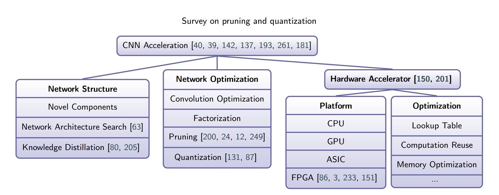
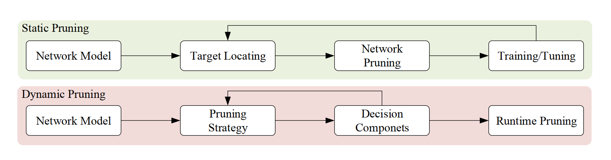
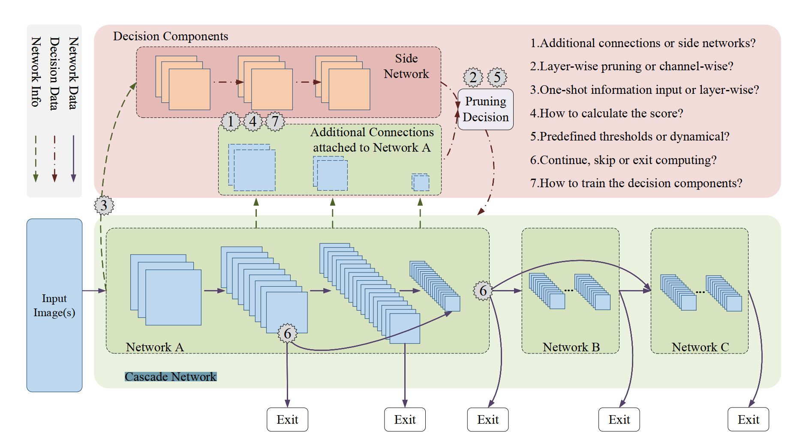
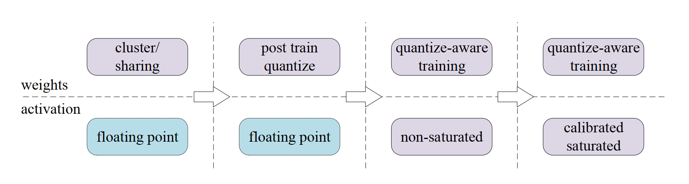

# 网络压缩

## 动机

复杂的的网络架构对实时性应用的效率造成挑战， 它要求很大的计算资源和内存损耗。

过度参数化是神经网络的特性，冗余神经元不能提高结果的准确性，可以使用很少或几乎没有的准确率损失一出这些冗余。

可以从三个方面去考虑解决过度参数化

* 网络架构
* 网络优化
* 硬件加速

## 剪枝

* 静态剪枝： 离线优化推理速度
* 动态剪枝： 在线优化推理速度

### 基于梯度的剪枝

具有较大值的训练权重比具有较小值的训练权重更重要。

基于梯度的剪枝方法是去定位不重要的权重和特征， 在评估时移出它们。 基于梯度的剪枝方法是剪枝所有的零值权重，或所有绝对值在一定阈值内的权重。

### 基于惩罚的剪枝

### 动态剪枝

动态剪枝可以利用输入数据的潜在变化来克服静态剪枝的局限性减少计算、带宽和功耗。

## 量化

## 参考资料

* <https://zhuanlan.zhihu.com/p/176982058>
* <https://zhuanlan.zhihu.com/p/97198052>
* <https://www.zhihu.com/question/303922732/answer/1013355063>

* <https://www.zhihu.com/question/323214798/answer/678706173>

