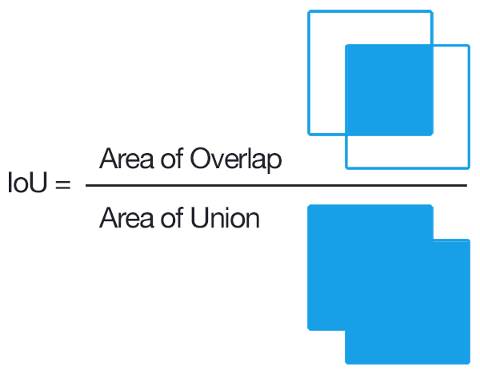
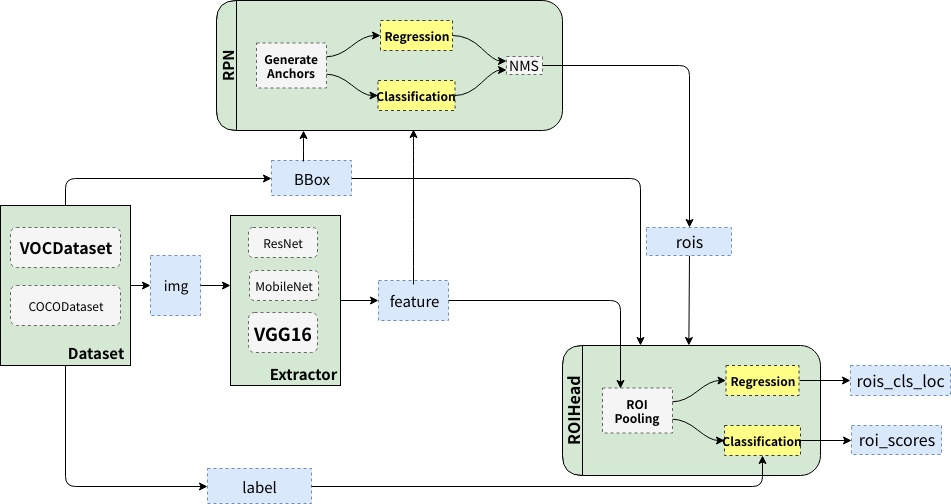
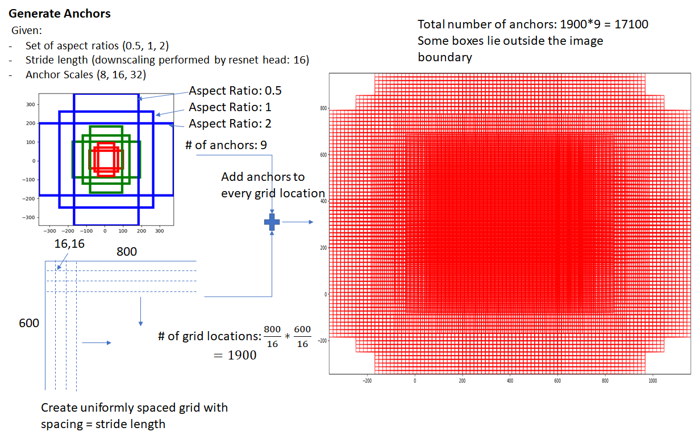
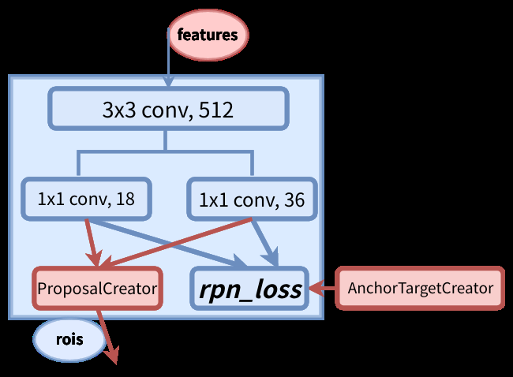
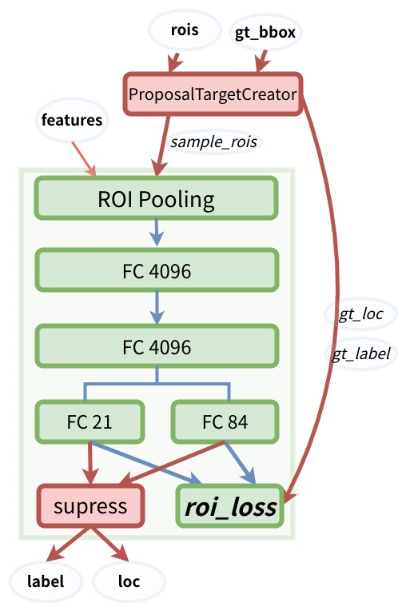

# Faster RCNN 与 FPN 网络解读

## 基本概念

### IoU

## 概述

### 网络结构

Faster RCNN 的网络结构可以分为三个组件（部分）：

* Extractor：为一个全卷积网络， 通常为一个分类网络（原始论文中为VGG, 后面通常采用ResNet系列）的**表示学习(represent learing)部分**，即网络的卷积部分， **执行特征提取(feature)**。对应代码中 **backbone** 部分。
* RPN(Region Proposal Network): 区域候选网络是一个全卷积网络，**负责提供候选区域**。 **利用Backbone提取的的特征**去找出可能包含（前景）目标的希望的RoI（Region of Interest).  对应代码中的 **rpn_head(rpn) **部分。**rpn-head 对 anchor 执行分类和回归操作 **, 其中分类输出大小是2，分别代表目标区域和背景区域；回归是仅仅对于前景样本(正样本)进行基于anchor的变换回归。
* Fast RCNN(ROI-Head) ：由卷积层和全连接层组成，可以看作是对RPN得到的目标（前景）rois的微调， **利用 Backbone 产生的特征(features)**和 **RPN网络的产生目标区域（rois）**， 对应代码中的 **roi_head** 部分。 **roi-head 对 rois 执行分类和回归操作**， 其中分类输出的大小是$m + 1$其中(m 代表真实的类别数， 1 代表背景)；回归是对rois 的位置进行微调。

### 优化目标（损失函数）

Faster RCNN 的优化目标为得到正确目标框（bbox）和对应的类别(label)。对应于网络架构， 优化目标又可以具体分为两个：

* rpn-head

  RPN 网络的目标是在feature包含的所有anchor 中找到正确的目标区域roi的anchor,   对应的损失为 proposal_loss

  ​                                                   **proposal_loss = loss_objectness + loss_rpn_box_reg**

  其中 loss_objectness  表示对应前景（目标）区域的分类损失（前景和背景的2分类损失）， loss_rpn_box_reg 表示前景（目标）区域相对于gt_anchor 的损失。

* roi-head

  Fast RCNN 网络的目标是对对 rpn-head 找到的 roi 进行分类, 并对 roi 的边框进行微调，得到最终的目标检测结果， 对应的损失为  detector_loss。

  ​                                                **detector_loss  = loss_classify + loss_box_reg**

  其中 loss_clsssify 表示 rois 所属具体类别的分类损失（真实类别个数+1， 其中1代表背景），loss_box_reg 表示rois 的位置相对于gt gt_box 的回归损失。

网络总的损失函数 为 **loss = proposal_loss  + detector_loss**， 将得到的总的损失函数通过反向传播，进行模型优化。

## Extractor

Extractor 一般使用通过ImageNet 数据集训练好的模型， 提取图片的特征。

在原论文中使用VGG16 进行特征提取，并选择 conv5_3 层的输出作为特征。**特征所对应的 stride 为 16**， 特征相当于通过输入图片下采样16倍得到。 conv5_3的感受野为228，即feature map上每一个点，都包含了对应原图上一个大小为$228 \times 228$区域的信息。（如上图中的head 部分）。 

**下面的内容中默认以 PASCAL VOC 数据集（20种分类), VGG16 为Backbone 构建网络的进行说明 **

## RPN

**Faster RCNN 最突出的贡献就是提出RPN(Region Proposal Network)取代 Fast RCNN 中的 SS(Selective Search), 将提取候选区域的时间开销几乎降为0**

### Anchor 

RPN 网络首先引入了 anchor 的概念， 表示大小和尺寸固定的候选框。 论文中有3种尺度（scale）和 3种（长宽）比率（ratio）共9种 anchor。如上图所示3 种尺度分别对应 8， 16， 32， 3 种比率分别对应 0.5， 1， 2。由于得到feature 对应的 stride 为 16， 因此对应到真实图片的anchor尺度分别为$(8, 16, 32) \times 16 \Rightarrow (128, 256, 512)$.

对于一张大小尺度为$800 \times600 \times3$的输入图片， 通过Backbone 网络提取的feature 形状为$(50, 38，512)$，共有$50 \times 38 \times 9 \sim 20000$ 个 anchor。可以看出类似于暴利穷举的方法， 可以理解为，假设这20000个anchor 可以包含一张图片的所有真实anchor。

anchor 的 数量与featuure map 的大小有关系， 不同的 feature map 对应 的 anchor 数量也不一样。

**anchor 对应于代码中的 AnchorGenerator 和 RPNHead  两个类**

### 网络结构

RPN 的 结构图如下

**RPN网络的主干网络的第一层是一个卷积层， 第二层包含两个卷积分支。两个分支利用卷积核大小为$18 \times 1 \times 1$和 $36 \times 1 \times 1$ 分别进行分类和位置回归预测。**分类对应的卷积核通道数为$9 \times 2 = 18$(其中 9代表特征每个位置的9个anchor,  2代表每个anchor为前景或背景的分类)， 进行回归的卷积核通道数为 $ 9 \times 4$ (其中 9代表特征每个位置的9个anchor,  4代表每个anchor对应的四个位置), 对于大小为$(50, 38，512)$ 的特征得到的**分类特征`rpn_cls_score`**和**回归特征`rpn_box_pred`**的大小分别为$(50, 38, 18)$和$(50, 38, 36)$

**此外还包含 AnchorTargetCreator 和 ProposalCreator 两个组件， 其中AnchorTargetCreator用于计算rpn网络的损失，ProposalCreator用于产生建议的rois。** 

RPN 模块的训练和推理阶段会共享上述卷积操作的到的分类和回归特征，然后分别执行对应的任务。

### 训练

对于训练阶段RPN主要是利用 `AnchorTargetGenerator` 从接近20000 多个候选anchor中选出256 个anchor 进行分类和位置回归， 可以分为两步

* 第一步：利用 `AnchorGenerator` 生成的所有anchor 和 真实目标框 gt_bbox（ground truth bounding box, 这里只包含正样本边框, **这里是第一次使用gt_box**）， 通过`AnchorTargetGenerator` 生成真实box的**目标边框`rpn_target_box`**和**目标标签`rpn_target_label`**(这里同时包含目标、背景和可忽略的三种类型的边框和标签)。这个过程会涉及四个超参数`rpn_iou_positive_threshold=0.7`, `rpn_iou_negtive_threshold=0.3`, `rpn_minibatch_size=256`,  `rpn_positive_rate`规则如下：
  - [ ] 对于每一个gt_box, 选择与gt_bbox 重叠度最高的一个anchor作为正样本。
  - [ ] 对于剩下的anchor, 从中随机选择和任意一个gtbox重叠度超过`rpn_iou_positive_threshold` 的anchor作为正样本， 通过两步得到的正样本的总数量num_fg 不超过$256 \times 0.5 = 128$.  
  - [ ] 随机选取和gt_bbox 重叠度小于`rpn_iou_negtive_threshold`的anchor 作为负样本（背景）， 负样本的总数为 num_bg
  - [ ] 负样本和正样本的总数  num_fg + num_bg = 256, anchor的正负样本比例接近1：1。

* 第二步：分别利用 `rpn_cls_score`和`rpn_box_pred` 作为预测值， `rpn_target_box`和`rpn_target_label`作为目标值， 分别计算rpn 网络的分类和回归损失， 相加得到总的rpn网络损失`rpn_loss`。

   计算分类损失用的是**交叉熵损失**， 计算回归损失使用**smooth_l1 损失**。 

  **在计算回归损失时只计算正样本（前景）的损失，不计算背景的损失。**

### 推理 / Rois 生成

Faster作为两阶段的网络， RPN 网络作为第一阶段，主要目的是建议候选目标区域rois， 然后将rois作为训练样本输入到下一阶段的网络（Fast RCNN / RoIHead）， 对rois区域进行具体的分类和边框微调。 因此在进入下一阶段之前， 还需要利用已经得到的**分类特征`rpn_cls_score`**和**回归特征`rpn_box_pred`**，**执行建议（propsal）操作, 本质上可以理解为对rois的过滤操作**。对应代码的`PropsalCreater`/ `ProposalFilter`， 这里涉及四个超参数，`num_top_k_num_train=12000`， `rpn_maximum_proposal=2000`，

**num_top_k_num_test=6000**， **rpn_maximum_proposal=300**, **nms_threshold=0.7**可以分为三步：

* 第一步： 根据`rpn_cls_score`对`rpn_box_pred` 进行从到小排序， 选取前`num_top_k_num_train`（推理阶段为`num_top_k_num_test`）个anchor , 完成第一次过滤。
* 第二步：对选取的`num_top_k_num_train`（推理阶段为`num_top_k_num_test` ）的位置进行修正（解码）
* 第三步：利用非最大抑制（Non-Maximum Suppression, NMS）， 选出概率最大的`rpn_maximum_proposal`（推理阶段为`rpn_maximum_proposal`）个rois, 完成第二次过滤。

### RPN网络输出

* 建议目标候选框的位置：`rois_box`(boxes)
* 建议目标候选框对应的概率：` rois_scores`

## RoIHead / Fast RCNN

RPN给可能包含目标的rois, RoIHead模块会对rois进行进一步的如分类和边框回归等操作。得到最终的方框标签和方框位置。

### 网络结构

**Fast RCNN 网络的主干的第一层为RoI Pooling 层， 第二层和第三层为两个全连接层， 第三层包含两个全连接层分支，第三层的连个分支分别用来预测rois具体类别和对rois 进行位置回归（微调）。** **分类分支的输出cls_score**大小为的21（以PascalVoc 数据集为例$20+1=21$， 其中20代表真实目标，1代表背景）， 同理**回归分支的输出bbox_pred**大小为84（以PascalVoc 数据集为例$（20+1）\times 4 = 84$， 其中20代表真实目标，1代表背景）。

此外还包括`ProposalTargetCreator` 和 `supress`两个组件。 其中`ProposalTargetCreator`用于对第一阶段得到的rois 进行采样， 并获取真实的边框`gt_box` 和 边框标签`gt_label`。 `supress`组件对最后输出的结果再执行一次 NMS, 得到最终的边框标签（label）和 边框位置（loc）

### 训练

* 第一步：生成`sample_rois`,`target_bbox`（gt_loc）, `target_label`(gt_label)

  在训练阶段， 第一阶段网络的RPN 网络会给出接近2000个可能包含目标的rois， 第二阶段的网络，并不会把这2000个 rois 都拿去进行训练，而是利用 ProposalTargetCreator生成的一部份rois和 真实目标框 gt_bbox（ground truth bounding box, 这里只包含正样本的边框, **这里是第二次使用gt_box**）进行训练，  通过ProposalTargetCreator生成真实的**边框 `target_box` **、  **标签`target_label`**和 **采样后的rois**(同时包含目标、背景两种类型的边框和标签)。这个过程中涉及四个参数`fastrcnn_iou_positive_threshold=0.5`, `fastrcnn_iou_negtive_threshold=0.1`, `fastrcnn_minibatch_size=128`, `fastrcnn_positive_rate=0.25`. 选择规则如下

  - [ ] 选择与gt_box 的iou 大于 `fastrcnn_iou_positive_threshold` 的 rois, 并从中随机采样$128 \times 0.25 = 32$个rois作为正样本
  - [ ] 选择与gt_box 的iou 小于 f`astrcnn_iou_negtive_threshold`的 rois, 并从中随机采样$128 \times 0.75 = 96$个rois作为负样本
  - [ ] 正负样本的总数为 `fastrcnn_minibatch_size`,正负样本的比例约为1：3

* 第二步：计算分类损失和回归损失

   对于分类问题,直接利用交叉熵损失. 

  对于位置的回归损失,一样采用Smooth_L1Loss, 注意这里**只对正样本计算损失**， **而且是只对正样本中的真实的类别边框回归计算损失**。

### 推理

测试的时候对所有的RoIs（大概300个左右) 计算概率，并利用位置参数调整预测候选框的位置。然后再用一遍极大值抑制（之前在RPN的`ProposalCreator`用过）。

## 补充

### 整体结构图（VGG16）

### 关于 Creator

- `AnchorTargetCreator` ： 负责在训练RPN的时候，从上万个anchor中选择一些(比如256)进行训练，以使得正负样本比例大概是1:1. 同时给出训练的位置参数目标。 即返回`rpn_target_box`*和`rpn_target_label`。
- `ProposalTargetCreator`： 负责在训练RoIHead/Fast R-CNN的时候，从RoIs选择一部分(比如128个)用以训练。同时给定训练目标, 返回（`sample_rois`, `rois_box`, `rois_score`）
- `ProposalCreator`： 在RPN中，从上万个anchor中，选择一定数目（2000或者300），调整大小和位置，生成RoIs，用以Fast R-CNN训练或者测试。

其中`AnchorTargetCreator`和`ProposalTargetCreator`是为了生成训练的目标，只在训练阶段用到，`ProposalCreator`是RPN为Fast R-CNN生成RoIs，在训练和测试阶段都会用到。三个共同点在于他们都不需要考虑反向传播（因此不同框架间可以共享numpy实现）

### 关于 NMS

​    **Faster-RCNN 的整个推理过程中会执行两次NMS**,

* 在RPN 阶段的 的`ProposalCreator` 组件，对rois 做第一次NMS

* 二次在Fast-RCNN 的推理阶段对输出的目标bbox 做第二次NMS。

### 关于 IoU

   **Faster 中两次会用到两次 IoU**

* 第一次是训练时 RoI-Head 阶段时`ProposalTargetCreator`组件，**计算每个propsal产生的rois(训练阶段为2000个， 推理阶段为300个) 与`gt_box`的 IoU**, 将Proposal 划分为正样本（目标） 和 负样本（背景），并从正负样本中采样， 使得它们的比例满足1：3 且总数一般为128， 然后把采样后的（128个）rois，送入 RoIPooling 进行下一步操作。 在推理时，此时RPN 网络送入Fast RCNN 阶段的 roi 数量时300，由于没有 `gt_box` 因此不会经过`ProposalTargetCreator`组件进行 IoU 计算, 直接将（300个）rois 送到 `RoIPooling`中， 之后进行类别分类和边框回归。
* 第二次是计算使用 IoU 是在计算 mAP 时

### 关于分类

* 在RPN阶段分类是二分类
* 而Fast RCNN阶段是多分类（真实目标类别+1）

### 关于回归

**在RPN的时候，发生了两次回归操作**

* 在RPN阶段已经对anchor的位置做了第一次边框
* 在Fast-RCNN阶段对 bbox 做第二次边框回归， 第二次边框回归可以看作是对第一次的微调。

##  参考资料

* <https://zhuanlan.zhihu.com/p/145842317>
* <https://www.telesens.co/2018/03/11/object-detection-and-classification-using-r-cnns/>
* <https://zhuanlan.zhihu.com/p/138824387>
* <https://zhuanlan.zhihu.com/p/32404424>

