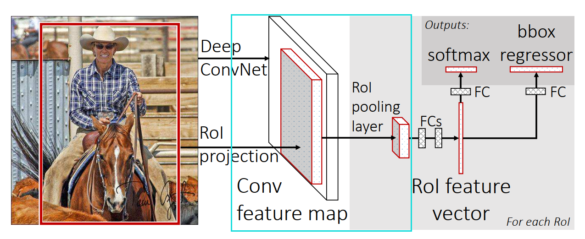
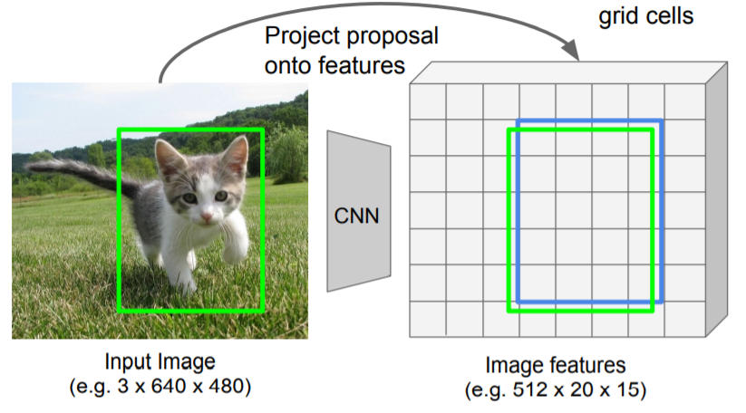
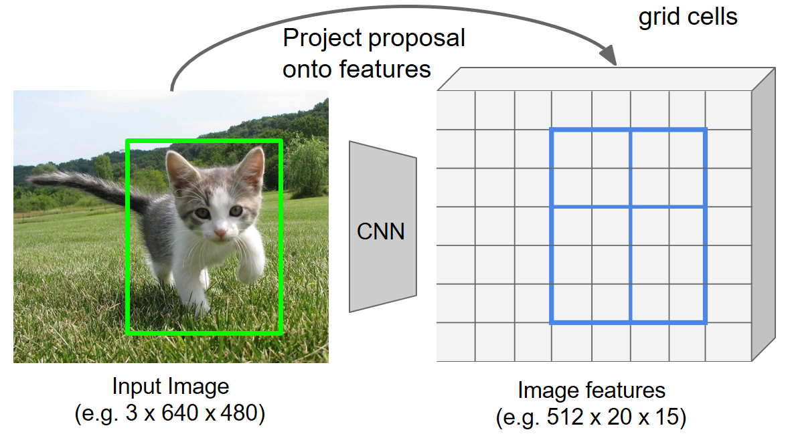
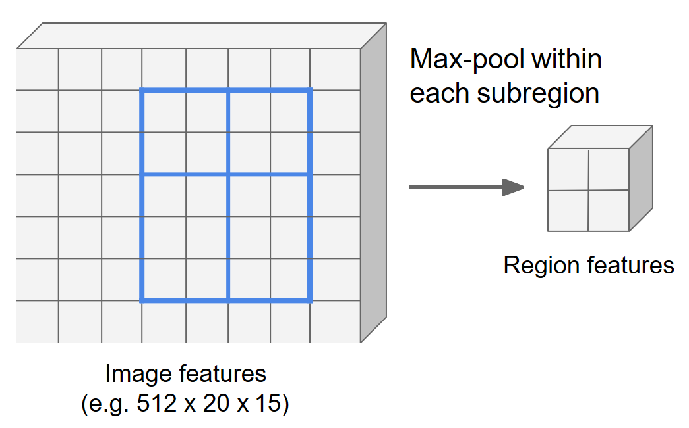
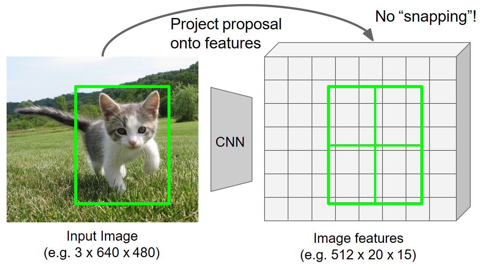
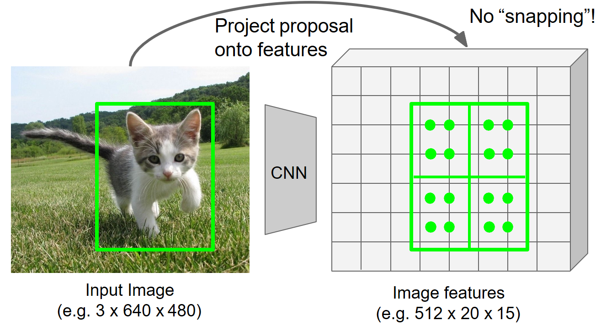
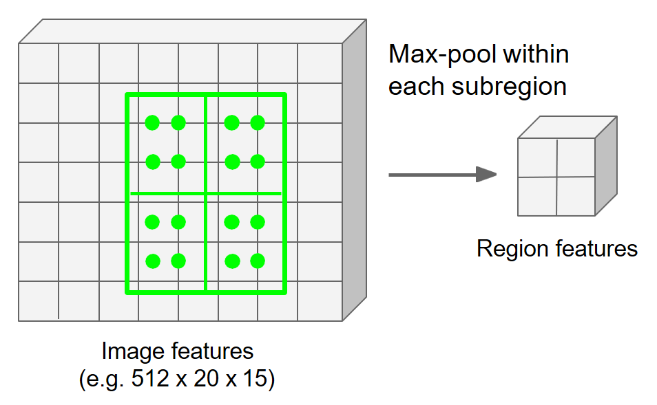
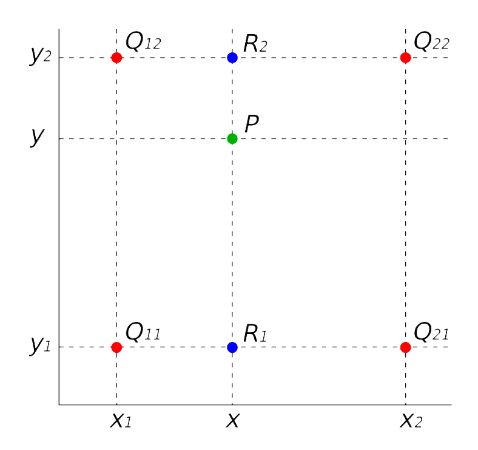
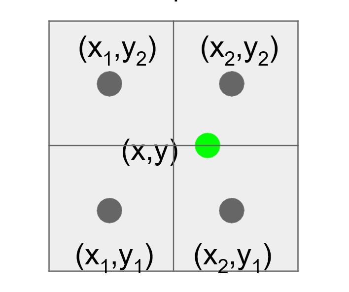
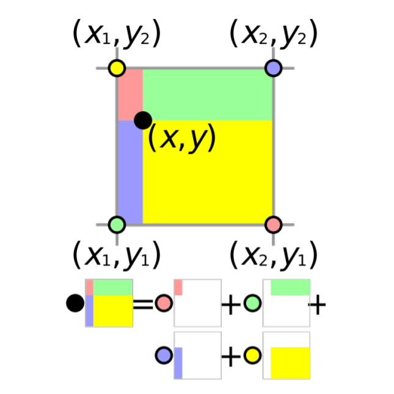

# R0I Pooling 与 R0I Align 区别

## 基本概念

### RoI

RoI(Region of Interest)是通过不同区域选择方法，从**原始图像(original image)**得到的候选区域(proposal region)。

需要注意的一点是**RoI并不等价于bounding box**, 它们可能看起来像，但是RoI只是为了进一步处理而产生的候选区域。

## bounding box

boundding box 指的是检测目标的边界矩形框。

## 量化

> 量化(quatization)是指将输入从连续值（或大量可能的离散取值）采样为有限多个离散值的过程。也可以理解为，将输入数据集（如实数）约束到离散集（如整数）的过程。

## R0I Pooling 和 R0I Align的作用

RoI Pooling 对于任意大小的图像输入，总能产生固定大小的输出。

> Region features always the same size even if input regions have different sizes!

## R0I Pooling 原理

**RoI Pooling在Faste RCNN 中被首次提出。**

RoIPooling，直接从feature map 里截取各个兴趣区域(Region of Interest, RoI)的feature, 并换为为相同大小的feature输出。

**RoI Pooling =  crop feature +  resize feature**

通过上图的容易得到，RoI Pooling的作用本质上是为了将不同尺寸的RoI特征转换为相同的特征图输出，保证特征图展开（flatten）后具有相同的大小尺寸，能够与下层的全连接层连接，分别执行线性分类(linear classifier)和边框回归(bounding box regressor)。

### 执行步骤

* 前置条件

  对于输入图片，通过候选区域方法发网得固定大小数量(Faster RCNN中为256)的候选区域坐标，。

  将整个输入图片喂入基网络（如vgg, resnet等）提取图片的特征（Fast RCNN 中为vgg网络的conv5层特征）。

  **下面以输出目标特征图尺寸大小为$2\times2\times512$进行说明**

* 对齐到网格单元（snap to grid cell）

  首先将一个浮点数RoI量化为特征映射的离散粒度。表现为RoI对应的特征图的与原始特征图的网格单元对齐。**这里为第一次量化操作**

  如下图中绿色框为RoI对应的实际区域（**由于经过特征尺度变换，导致RoI的坐标会可能会落到特征图的单元（cell）之间**）， 蓝色框为量化后的RoI所对应的特征图。（得到到量化特征图尺寸为$5\times5\times512$）

  

* 划分网格为子区域（bin）

  粗略地将网格分为$H\times W$（Fast RCNN 中设为$7\times7$）个子网格区域。将上一步得到的量化RoI 特征进一步细分为量化的空间单元(bin)。**这里进行了第二次量化操作。**

  **如果无法通过直接均分得到量化的子区域，通过分别采取向上取整（ceil）和向下取整（floor）的到对应的单元尺寸大小**。以*当前 $4\times5$尺寸的特征图为例，对于宽度方向 $4\div2=2$ ，但是对于高度方向由于$5\div2=2.5$， 通过向上和向下取整整，确定高度方向特征子区域的大小分别为2和3。

  

* 最大池化操作

  在每一个子区域执行聚合操作得到单元的特征值（一般是最大池化）。对上一步得到的$2\times2$个子区域分别做最大池化操作，得到$2\times2\times512$的目标特征图。

  

### 执行结果

通过RoI Pooling, 对于具有不同特征大小的的输入区域, 都可以得到相同大小输出特征。

### 缺点

每一次量化操作都会对应着轻微的区域特征错位（misaligned），xiang 这些量化在RoI和提取到的特征之间引入了偏差。这些量化可能不会影响对分类任务，但它对预测像素精度掩模有很大的负面影响。

## R0I Align 原理

**RoI Align 在 Mask RCNN 中被首次提出。**

针对RoI Pooling在语义分割等精细度任务中精确度的问题提出的改进方案。

### 执行步骤

​	**下面以输出目标特征图尺寸大小为$2\times2\times512$进行说明**

* 遍历候选每个候选区域，保持浮点数边界不做量化（不对齐网格单元）；同时平均分网格分为$H\times W$（这里为$2\times2$）个子网格区域，每个单元的边界也不做量化。

* 对于每个区域选择4个规则采样点（分别对应将区域进一步平均分为四个区域，取每个子区域的中点），利用双线性插值计算得到四个采用点的像素值大小。

* 利用最大池化（max pooling）或平均池化(average pooling)分别对每个子区域执行聚合操作，得到最终的特征图。

### 执行结果

通过RoI Align, 对于具有不同特征大小的的输入区域, 都可以得到相同大小输出特征。

## 补充

### 双线性插值

* 概念

双线性插值(bilinear interpolation)，又称为双线性内插。在数学上，双线性插值是有两个变量的插值函数的[线性插值](https://baike.baidu.com/item/线性插值/19113392)扩展，其核心思想是在两个方向分别进行一次线性插值。在数字图像和音频处理领域都有应用。

在图像处理中，双线性插值法**考虑围绕未知像素的计算位置的$2\times2$最近邻域的已知像素**。然后对这4个像素进行加权平均，以得出其最终的内插值。

* 公式推导

如图，已知求位置像素P的像素值， 已知相邻$2\times2$像素区域对应位置和像素值，其中坐下角像素区域标号为11，左上角像素区域标号为12，右下角像素区域标号为21，右上角像素区域标号为22。

注意这里的$Q_{11}=(x_1, y_1)$,$Q_{12}=(x_1, y_2)$,$Q_{21}=(x_2, y_1)$,$Q_{22}=(x_2, y_2)$,分别对应**像素单元（区域）的中心点**。

已知直线上两点$y_1=\phi(x_1, y_1)$， $y_2=\phi(x_2, y_2)$, 求直线上任意一点$(x,y)$的值$\phi(x,y)$。
$$
\phi（x,y） = \frac{x-x_1}{x_2-x_1}y_2 +\frac{x-x_2}{x_1-x_2}y_1 \tag{1}
$$

第一步，利用公式$1$执行两次线性插值操作：使用$Q_{11}$和$Q_{21}$计算$R_1=（x,y_1）$点的像素值大小；使用$Q_{12}$和$Q_{22}$计算$R_2=(x, y_2)$点像素值大小。
$$
\begin{align}
\phi(x,y_1) =& \frac{x-x_1}{x_2-x_1}\phi(x_2, y_1) +\frac{x-x_2}{x_1-x_2}\phi(x_1, y_1) \tag{2}\\
\phi(x,y_2)=& \frac{x-x_1}{x_2-x_1}\phi(x_2, y_2) +\frac{x-x_2}{x_1-x_2}\phi(x_1, y_2) \tag{3}\\  
\end{align}
$$
第二步， 利用公式$2$和公式$3$的到的结果，再次执行一次线性插值，得到目标位置$P$的像素值。
$$
\begin{align}
\phi(x,y) =& \frac{y-y_1}{y_2-y_1}\phi(x, y_2) +\frac{y-y_2}{y_1-y_2}\phi(x, y_1) \\
=&\frac{y-y_1}{y_2-y_1}(\frac{x-x_1}{x_2-x_1}\phi(x_2, y_2) +\frac{x-x_2}{x_1-x_2}\phi(x_1, y_2) ) +\frac{y-y_2}{y_1-y_2}(\frac{x-x_1}{x_2-x_1}\phi(x_2, y_1) +\frac{x-x_2}{x_1-x_2}\phi(x_1, y_1)) \\
=& \frac{1}{(y_2-y_1)(x_2, x_1)}((x-x_1)(y-y_1)\phi(x_2, y_2) +(x-x_2)(y-y_1)\phi(x_1, y_2) +(x-x_1)(y-y_2)\phi(x_2, y_1) + (x-x_1)(y-y_1)\phi(x_2, y_2))\\
\tag{4}
\end{align}
$$
由于$Q_{11}$,$Q_{12}$,$Q_{21}$,$Q_{22}$分别为相邻像素的中间位置坐标，如下图所示。

容易得到$y_2 - y_1=1$，$x_2-x_1=1$，因此双线性插值公式$4$可以进一步简化为
$$
\phi(x,y) =(x-x_1)(y-y_1)\phi(x_2, y_2) +(x-x_2)(y-y_1)\phi(x_1, y_2) +(x-x_1)(y-y_2)\phi(x_2, y_1) + (x-x_1)(y-y_1)\phi(x_2, y_2) \tag{5}
$$
公式$5$也可以进一步表示为
$$
\phi(x,y) = \sum_{i,y=1}^2{\phi(x_i, y_j)max(0, 1-|x-x_i|)max(0, 1-|y-x_i|)}   \tag{6}
$$

* 公式物理意义

通过公式$5$可以看出， 双线性插值本质上是目标像素值相邻四个像素的像素值加权和值。

对于第一项$(x-x_1)(y-y_1)\phi(x_2, y_2) $表示右上角像素$(x_2, y_2)$的像素值加权后的结果，其对应的权重公式为$(x-x_1)(y-y_1)$，可以看出第一项权重本质上是目标像素与$(x_2,y_2)$对应的对角像素$(x_1, y_1)$所构成的矩形区域的面积大小，如上图紫色区域。同理其它三项也满足同样的规律。

综上可以得到， **双线性插值本质上是目标像素所相邻的四个像素， 分别以像素对应的对角像素与目标像素的构成的矩形区域为权重，像素大小为值的加权和**。

## 参考资料

* <http://cs231n.stanford.edu/slides/2020/lecture_12.pdf>
* <https://towardsdatascience.com/understanding-region-of-interest-part-2-roi-align-and-roi-warp-f795196fc193>
* <https://tjmachinelearning.com/lectures/1718/instance/instance.pdf>
* <https://en.wikipedia.org/wiki/Bilinear_interpolation>

