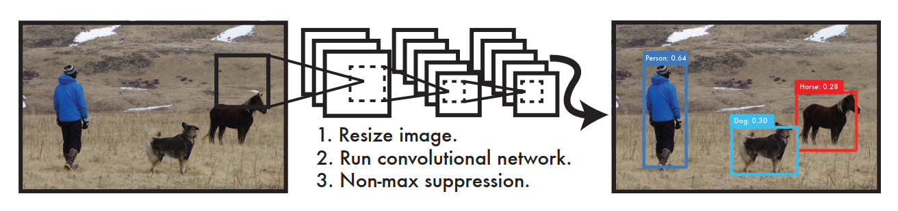
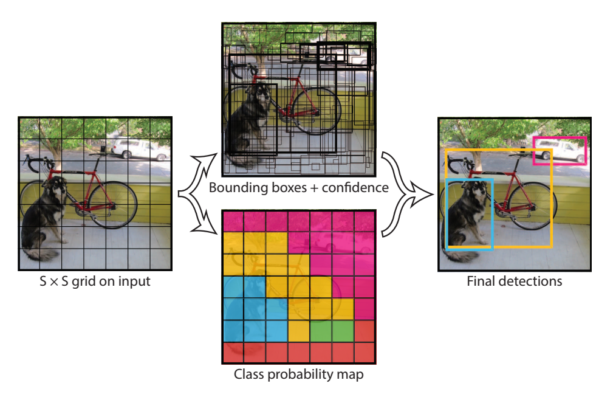
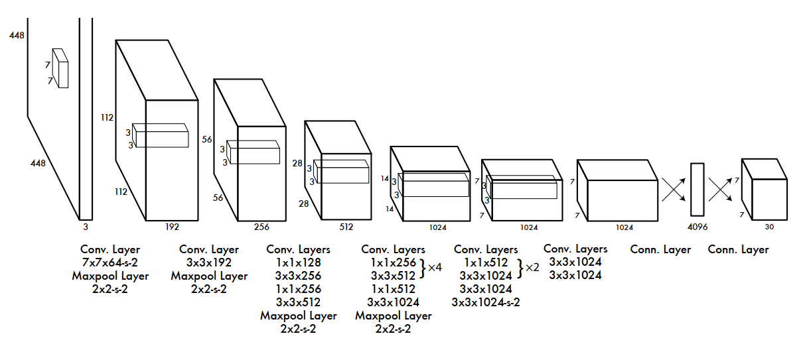

# YOLOv1 网络解读

## 摘要

之前的目标检测算法如DPM、R-CNN等网络通过重新调整分类器来执行检测任务。**YOLO（You Only Look Once ）将目标检测作为一个回归问题，处理空间分离的边界框和相关的类概率**。在一次评估中，单个神经网络直接从完整图像中预测边界框和类概率。由于整个检测管道是一个单一的网络，因此可以直接对检测性能进行端到端的优化。

## 动机

人类的视觉系统， 只需要瞥一眼图片就能知道图片中存在的目标、目标的位置和目标之间的相互关系。同时更快更准确的算法允许计算机在不使用传感器的情况下驱动汽车，允许辅助设备传输实时的信息给人类用户。

## 贡献

## 网络结构

## 训练细节

## 性能指标

## YOLO 性能评价

* YOLO对相互靠的很近的物体，还有很小的群体，检测效果不好，这是因为一个网络中只预测了两个框，并且只属于一类。
* YOLO对测试图像中，同一类物体出现的新的不常见的长宽比及其他情况泛化能力较弱。
* 由于损失函数的问题，定位误差是影响检测效果的主要原因，尤其是对小物体的处理上有待加强。

## 参考资料

* <https://openaccess.thecvf.com/content_cvpr_2016/html/Redmon_You_Only_Look_CVPR_2016_paper.html>
* <https://blog.csdn.net/u011974639/article/details/78208773>

* [YOLO PPT](https://docs.google.com/presentation/d/1aeRvtKG21KHdD5lg6Hgyhx5rPq_ZOsGjG5rJ1HP7BbA/pub?start=false&loop=false&delayms=3000&slide=id.g137784ab86_4_4409 "presentation")

* <https://blog.csdn.net/App_12062011/article/details/77554288>

