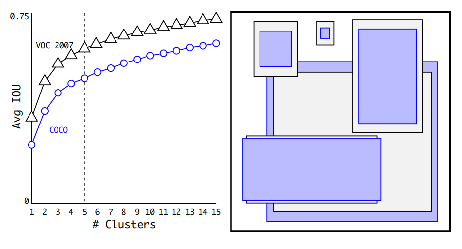
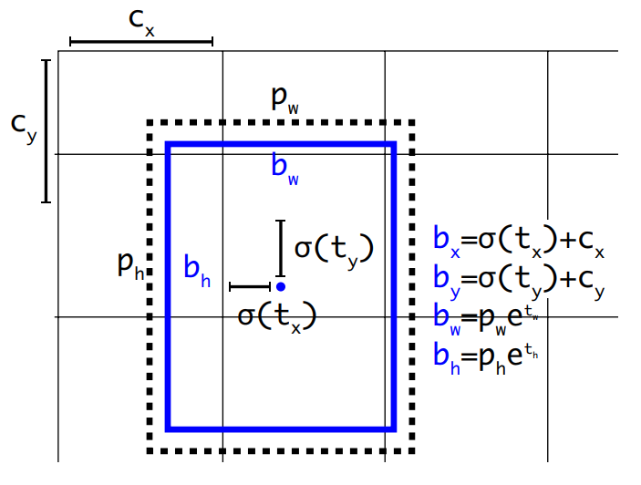

# YOLO v2 网络解读

## 摘要

YOLOv2(YOLO9000)是一个能够检测9000类别目标的实时检测系统。首先，提出了对YOLOv1算法的各种改进，既新颖又借鉴了以往的工作。最后，提出了联合训练和检测的方法，通过这种方法可以同时训练YOLO9000在COCO目标检测数据集和ImageNet 分类数据集。

## 动机

自从引入神经网络以来，目标检测架构变得越来越快和越来越准确，但是大多数的检测方法仍然限制于小的目标集。

目前的目标检测数据集相比其他分类和标记等任务是受限的。最常见的检测数据集包含数千到数十万个图像，其中有几十到几百个标签[3]而分类数据集有数以百万计的图像，有几十万个类别。

论文提出利用已有的大量分类数据，并将其用于扩展现有检测系统的范围。方法使用对象分类的层架架构部视角将不同的数据集组合在一起。

论文提出了一种联合训练算法，能够在检测和分类数据集上训练检测器。方法利用标记的检测图像来学习精确定位对象，同时使用分类图像来增加词汇量和鲁棒性。

YOLO 9000是一种能够检测超过9000种检测类别的目标检测器：首先，在YOLO的基础上进行优化的到YOLOv2检测器，达到了SOTA的实时检测。然后使用数据解组合方法和联合训练算法去训练一个模型，基于超过9000种类别的ImageNet和COCO检测数据集。

## 贡献

与Faster RCNN相比，YOLO具有显著数量的定位错误和低的召回率的表现。YOLOv2 方法主要聚焦在保持分类准确性的同时提高召回率和定位准确性。

### 优化细节

YOLOv2 没有扩大YOLO网络，而是简化了网络，使得网络更容易学习。论文通过聚合了之前工作的各种trick，同时结合新的概念去优化YOLO的表现。具体采用的优化策略如下：

* Batch Normalization

  批归一化

* High Resolution Classifier

  高分辨率的分类器

* Convolutional With Anchor Boxes  

  使用先验框，与YOLOv1相比不直接预测矩形框的宽和高，而是预测与Anchor 的偏差（offset）。每个格点指定n个Anchor框。在训练时，最接近ground truth的框产生loss，其余框不产生loss。

* Dimension Clusters  

  尺寸聚类，**在YOLO中使用先验框时会遇到两个问题，第一个问题是先验框尺寸数手工设定的。**之前检测器中的先验框尺寸是手工设定的，选择合适的先验框尺寸有助于网络更容易地进行回归到实际边框。YOLOv2对目标检测数据集（如PASACAL VOC， COCO ）中训练集样本的实际边框进行聚类操作，自动地获取更好的先验框尺寸。

  

  根据YOLOv2源码[VOC](https://github.com/pjreddie/darknet/blob/master/cfg/yolov2-voc.cfg)和[COCO](https://github.com/pjreddie/darknet/blob/master/cfg/yolov2.cfg)配置文件，可以分别得到各自的利用k=5执行聚类后的5个先验框（anchor box）的尺寸大小，其中每个尺寸元组分别代表先验框的宽和高的比率。

  * VOC: (1.3221, 1.73145), (3.19275, 4.00944), (5.05587, 8.09892), (9.47112, 4.84053), (11.2364, 10.0071)
  * COCO:  (0.57273, 0.677385), (1.87446, 2.06253), (3.33843, 5.47434), (7.88282, 3.52778), (9.77052, 9.16828)

* Direct location prediction  

  直接位置预测，约束预测边框的位置。**YOLO中使用先验框遇到的第二个问题是，模型不稳定， 尤其在早期的迭代过程中。**

  

* Fine-Grained Features  

* Multi-Scale Training  

* Further Experiments.    

## 网络结构

## 训练细节

## 性能指标

## 参考资料

* <https://openaccess.thecvf.com/content_cvpr_2017/html/Redmon_YOLO9000_Better_Faster_CVPR_2017_paper.html>
* <https://zhuanlan.zhihu.com/p/47575929>
* <[https://medium.com/@jonathan_hui/real-time-object-detection-with-yolo-yolov2-28b1b93e2088#:~:text=SSD%20is%20a%20strong%20competitor,locate%20all%20objects)%20is%20lower.](https://medium.com/@jonathan_hui/real-time-object-detection-with-yolo-yolov2-28b1b93e2088#:~:text=SSD is a strong competitor,locate all objects) is lower.)>
* <https://github.com/pjreddie/darknet/tree/master/cfg>

