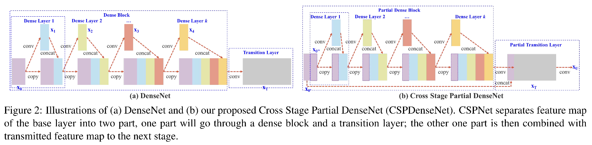
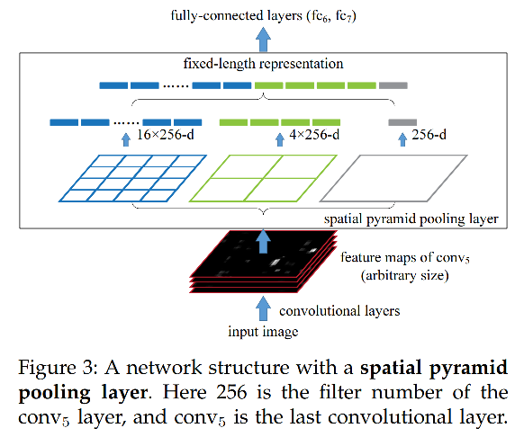
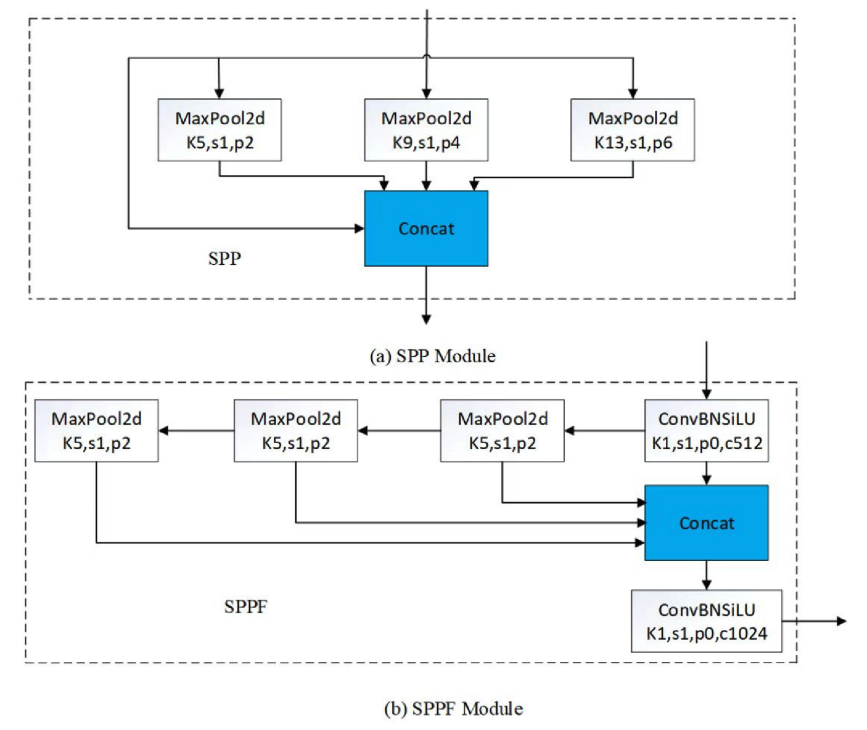
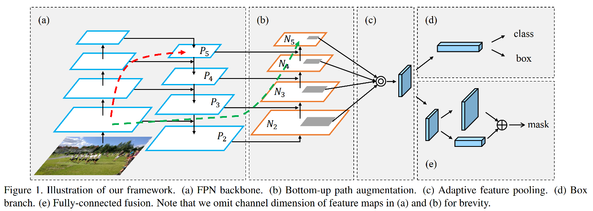
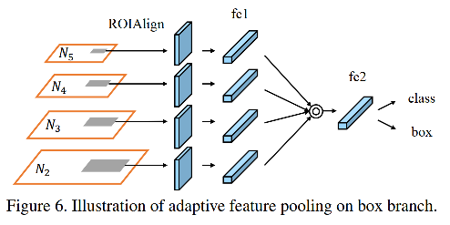

# YOLOv5 网络解读

## 网络框架


DarkNet  + PA-FPN

## backbone

### CSPNet



CSPNet(Cross Stage Parial Network) 从网络结构的角度去缓解网络推理过程中需要大量计算的问题。论文中认为网络推理成本过高**归因于网络优化中的梯度信息重复导致的**。论文提出通过将梯度的变化从头到尾集成到特征图中，从而在减少计算量的同时保持模型精度。

论文指出， DenseNet 大量的梯度信息被重复用于更新不同密集层的权重，这导致不同稠密层重复学习复制的梯度信息。

一个 CSPNet 阶段由**局部稠密块（partial dense block）**和 **局部过渡层（partial  transition layer）**组成。

* 局部稠密块的目的

  * 通过并归策略增加梯度路径

  * 平衡每一层的计算量

  * 减少内存占用。

* 局部过渡层的目的
  * 最大化梯度组合的差异。局部过渡层是一种层次化的特征融合机制，它使用**截断梯度流**（truncation the f）的策略来防止不同的层学习重复的梯度信息。

**CSPNet 保持了DenseNet 重用特征特性的优势，同时通过截断梯度流阻止了过多的重复梯度信息。**CSPNet 也可以应用到ResNet 和 ResNeXt 等其他架构。

* 实现代码

  ```python
  class BottleneckCSP(nn.Module):
      # CSP Bottleneck https://github.com/WongKinYiu/CrossStagePartialNetworks
      def __init__(self, c1, c2, n=1, shortcut=True, g=1, e=0.5):  # ch_in, ch_out, number, shortcut, groups, expansion
          super().__init__()
          c_ = int(c2 * e)  # hidden channels
          self.cv1 = Conv(c1, c_, 1, 1)
          self.cv2 = nn.Conv2d(c1, c_, 1, 1, bias=False)
          self.cv3 = nn.Conv2d(c_, c_, 1, 1, bias=False)
          self.cv4 = Conv(2 * c_, c2, 1, 1)
          self.bn = nn.BatchNorm2d(2 * c_)  # applied to cat(cv2, cv3)
          self.act = nn.SiLU()
          self.m = nn.Sequential(*(Bottleneck(c_, c_, shortcut, g, e=1.0) for _ in range(n)))
  
      def forward(self, x):
          y1 = self.cv3(self.m(self.cv1(x)))
          y2 = self.cv2(x)
          return self.cv4(self.act(self.bn(torch.cat((y1, y2), 1))))
  ```

  

### STDC

## neck

### SPP



​		流行的CNN 要求输入固定尺寸的图像，这同时限制了输入图像的比率和尺度。当前的方法通过crop或者warp 去使得输入图像符合固定尺寸大小。但是 crop 区域可能不包含整个目标，而 warp 内容可能会导致不想要的集合形变。

​		CNN 主要包含卷积层和全连接层两部分。其中卷积层没有固定图像尺寸的限制，并可以生成任意尺寸的特征图。而全连接层需要输入预定义的固定大小的输入。**因此，固定大小的限制只来自于全连接层，这些层在网络的更深层阶段。**

​		论文中提出了**空间金字塔池化(Spatial Pyramid Pooling, SPP) **层去移除网络固定输入尺寸的限制。论文中在**最后一个卷积层的顶部**引入了SPP 层。通过SPP层 池化特征，生成固定大小的输入，然后把它们喂入全连接层。通过在网络层级更深阶段执行信息“聚合”，避免了开始阶段的 crop 和 warp。

* SPP

  在每个空间中，我们池化每个滤波器的响应（论文使用最大池化）。输出的空间金字塔是一个具有$M$个bin的$kM$ 维向量，其中$k$是最后一个卷积层的卷积核数量。这个固定维度的向量作为全连接层的输入。

* 实现代码

  ```python
  class SPP(nn.Module):
      # Spatial Pyramid Pooling (SPP) layer https://arxiv.org/abs/1406.4729
      def __init__(self, c1, c2, k=(5, 9, 13)):
          super().__init__()
          c_ = c1 // 2  # hidden channels
          self.cv1 = Conv(c1, c_, 1, 1)
          self.cv2 = Conv(c_ * (len(k) + 1), c2, 1, 1)
          self.m = nn.ModuleList([nn.MaxPool2d(kernel_size=x, stride=1, padding=x // 2) for x in k])
  
      def forward(self, x):
          x = self.cv1(x)
          return self.cv2(torch.cat([x] + [m(x) for m in self.m], 1))
  ```

### SPPF



* 实现代码

  ```python
  class SPPF(nn.Module):
      # Spatial Pyramid Pooling - Fast (SPPF) layer for YOLOv5 by Glenn Jocher
      def __init__(self, c1, c2, k=5):  # equivalent to SPP(k=(5, 9, 13))
          super().__init__()
          c_ = c1 // 2  # hidden channels
          self.cv1 = Conv(c1, c_, 1, 1)
          self.cv2 = Conv(c_ * 4, c2, 1, 1)
          self.m = nn.MaxPool2d(kernel_size=k, stride=1, padding=k // 2)
  
      def forward(self, x):
          x = self.cv1(x)
          y1 = self.m(x)
          y2 = self.m(y1)
          return self.cv2(torch.cat((x, y1, y2, self.m(y2)), 1))
  ```

  

### PAN



PAN(Path Aggregation Network) 的目的是提升基于区域候选实例分割框架的信息流。论文通过**自底向上（Bottom-Up）**的增强方式，使用底层中精确的定位信号来增强整个特征层次，它缩短了底层和最顶层特征之间的信息路径。

FPN(Feature Pyramid Network) 被提出去提取网络内的层级特征，其中具有横向连接（lateral connection）的**自顶向下（Top-Down）**的路径被增强去传播具有更强语义特征。

论文发现，低层的特征有利于大型实例的定位。但是从底层结构到高层特征有很长的路径，这增加了困难去获取准确的定位信息。进一步来说，每个建议的预测，是基于一个来自启发式分配的特征层的特征网格。这个过程可以被更新，由于其他层被忽略的信息可能有助于最后。最后，在单视角上预测mask , 失去了机会去集成更多多样性的信息。

为了**缩短信息信息路径**并**使用低层中准确的定位的信息去增强特征金字塔**，自底向上的路径增强被创建，通过传播底层的特征去增强整个特征层级。

* 自底向上的增强架构

  增强路径从最底层的$P_2$ 开始逐渐接近$P_5$，使用$\{N_2,N_3,N_4,N_5\}$表示新生成的特征，分别对应$\{P_2,P_3,P_4,P_5\}$，其中$P_2$只是$N_2$，没有任何处理。

  每一个构建块采用高分辨率的特征图$N_i$，首先通过一个卷积核大小为$3\times3$，stride 为2的卷积去降低空间大小。然后，每个特征图$P_{i+1}$与降采样后的特征图通过横向连接相加。最后，融合后的特征通过另一个$3\times3$的矩阵处理生成$N_{i+1}$，为了接下来的子网络。这个过程迭代进行，直到处理完$P_5$ 为止。每个建议的特征从新的特征池化得到。

* 自适应特征池化

  

  在 FPN 中，建议(proposal)会根据它的尺寸被分配到不同的特征层。这尽管简单有效，但仍然可能生成非最优的结果。相差几个像素的建议可能被分到不同的层，而这两个建议可能非常相似。进一步，特征的重要性可能与其所属的级别没有强烈的相关性。

  论文对于每个建议池化来自所有层的特征并融合它们，为了后续的预测。这称为**自适应特征池化(adaptive feature pooling)**

  对于每一个建议，首先映射它们到不同的特征层；然后，ROIAlign 被用来去池化来自不同层的特征网格；最后一个融合操作（像素级最大/和）被应用去融合来自不同层的特征网格。

### ASFF

### PAFPN

## head


## 参考资料

* <https://mmyolo.readthedocs.io/zh_CN/latest/>
* https://github.com/ShuLiu1993/PANet/blob/master/lib/modeling/FPN.py
* <https://github.com/ultralytics/ultralytics/blob/main/ultralytics/nn/modules.py>


