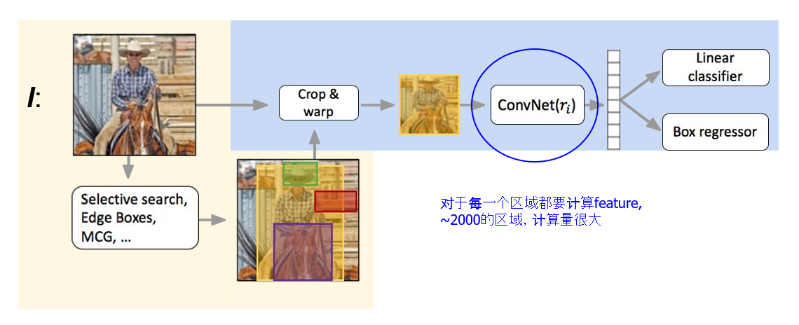
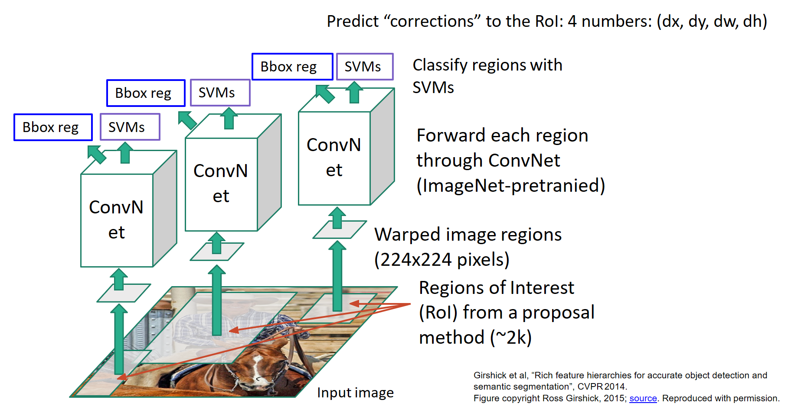
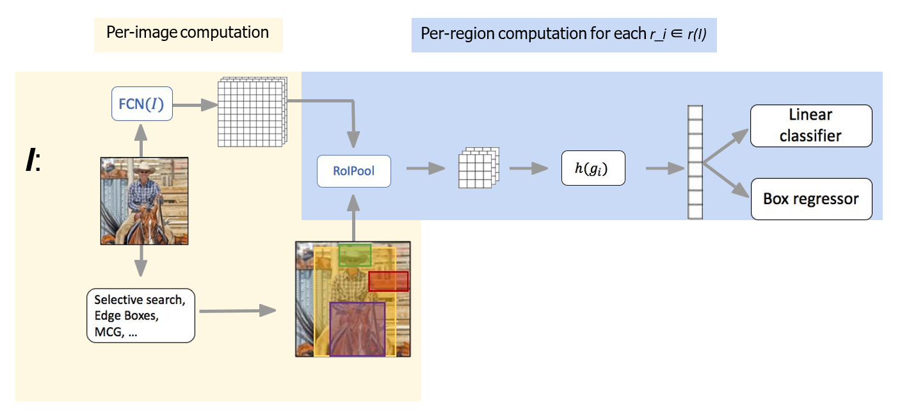
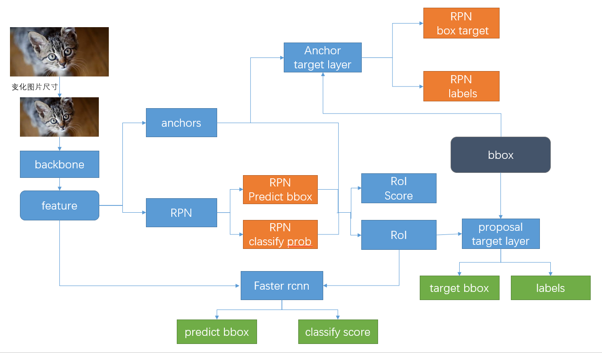
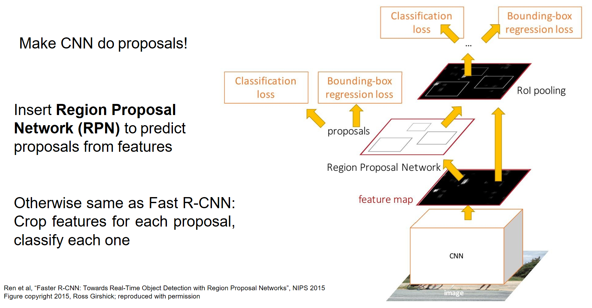
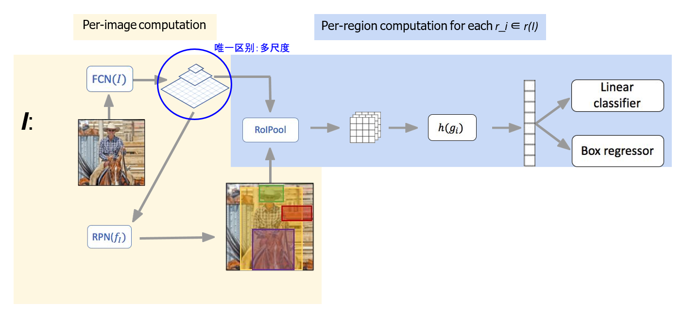

# 从R-CNN到Faster-RCNN

## R-CNN(CVPR_2014)

### 贡献

### 缺点

计算效率低下，每一张图像约有2K个区域需要通过神经网络进行特征提取，重叠区域反复计算。

## Fast-RCNN(ICCV_2015)

### 贡献

* 利用卷积网络对全图提取特征， 利用区域候选方法产生感兴趣的区域（RoI）（2K）
* 通过RoI Pooling 对RoI进行裁剪和缩放，得到相同尺寸的特征图，执行后续的分类和回归任务。

## Fater-RCNN(NIPS_2015)L

## FPN(CVPR_2017)

## 参考资料

[cs231n 2020](http://cs231n.stanford.edu/slides/2020/lecture_12.pdf)

[Object Detection in 20 Years: A Survey](https://hotcomputerscience.com/paper/object-detection-in-20-years-a-survey.pdf)

[RCNN paper](https://www.cv-foundation.org/openaccess/content_cvpr_2014/papers/Girshick_Rich_Feature_Hierarchies_2014_CVPR_paper.pdf)

[Fast-RCNN](https://www.cv-foundation.org/openaccess/content_iccv_2015/papers/Girshick_Fast_R-CNN_ICCV_2015_paper.pdf)

[Fater-RCNN](https://papers.nips.cc/paper/5638-faster-r-cnn-towards-real-time-object-detection-with-region-proposal-networks.pdf)

[FPN](https://openaccess.thecvf.com/content_cvpr_2017/papers/Lin_Feature_Pyramid_Networks_CVPR_2017_paper.pdf)