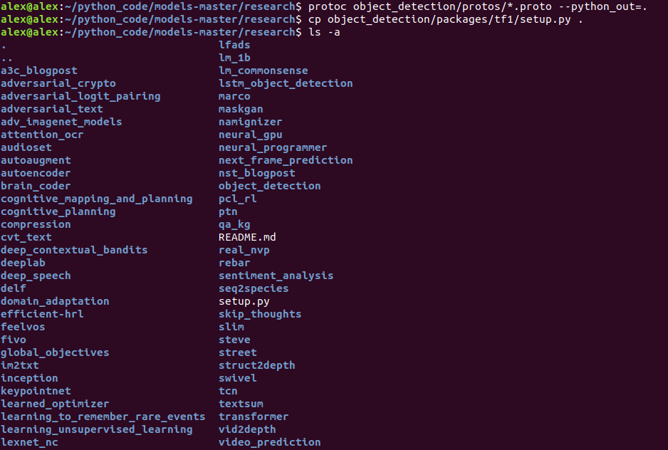
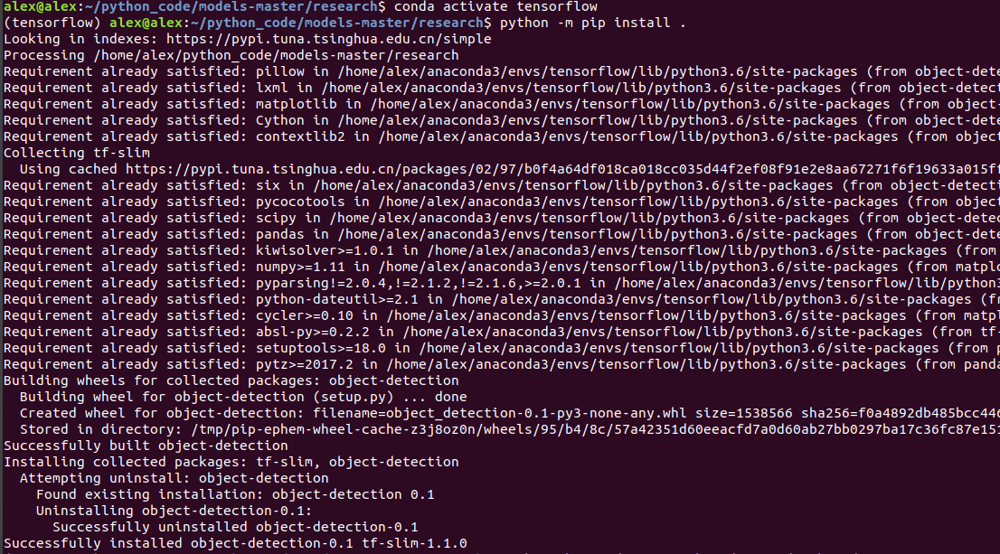
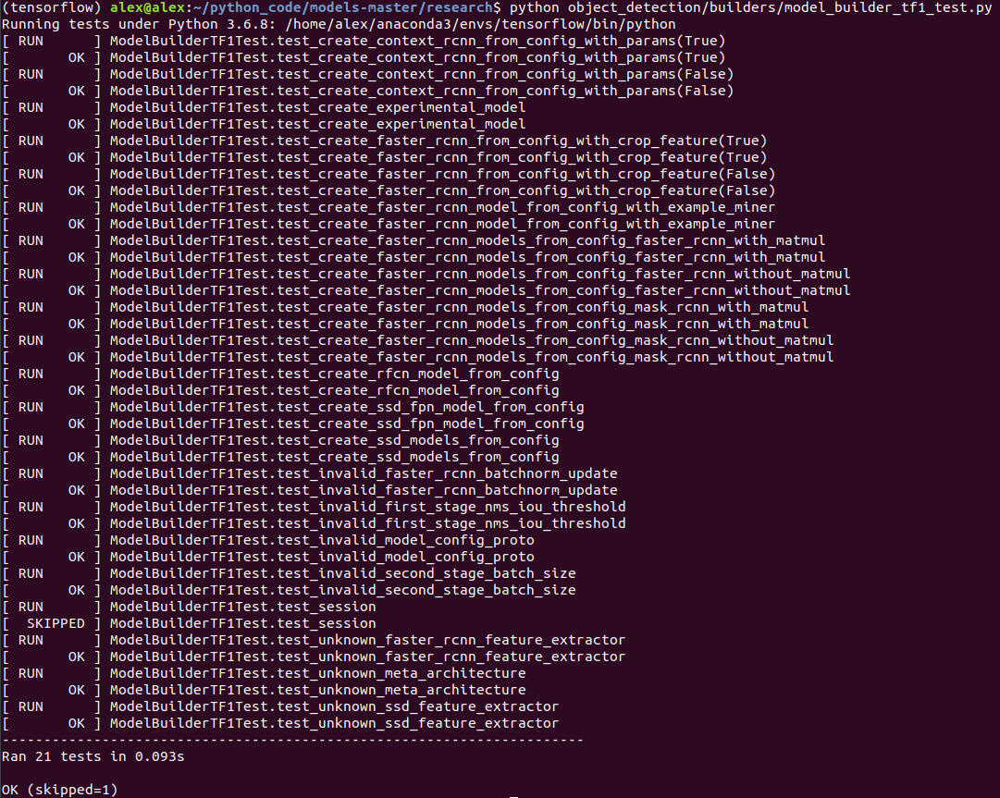
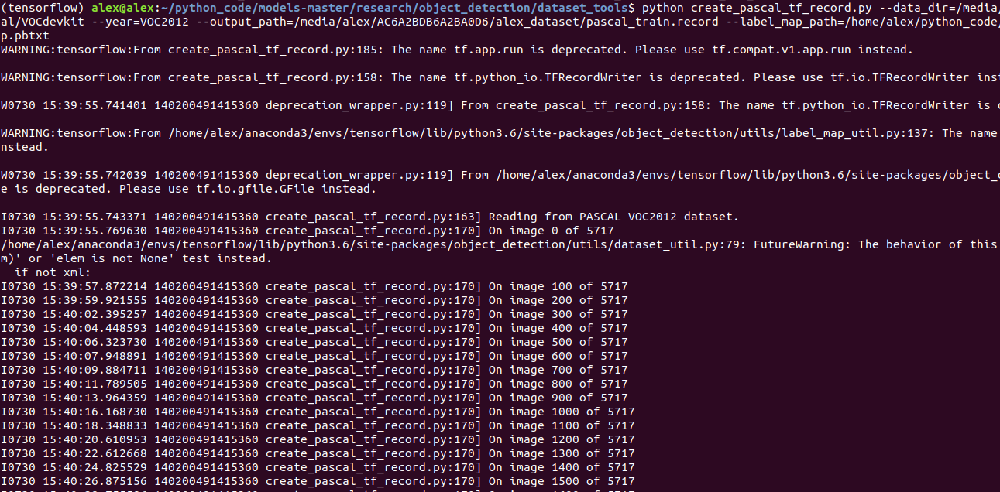
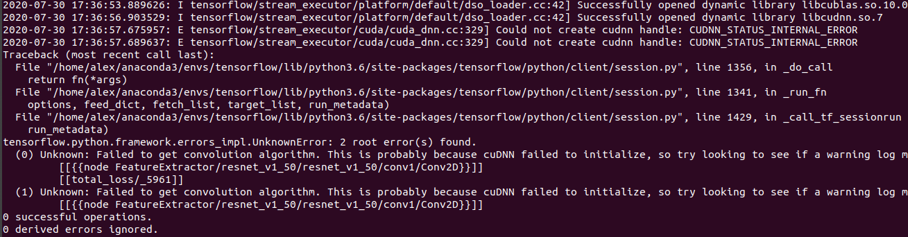

# 使用tensorflow 官方 object detection API 训练自己数据

## 克隆官方项目

```shell
git clone https://github.com/tensorflow/models.git
```

## python 依赖库安装

```shell
cd models/research
# Compile protos.
protoc object_detection/protos/*.proto --python_out=.
```



```shell
# Install TensorFlow Object Detection API.
cp object_detection/packages/tf1/setup.py .
python -m pip install .
```



```shell
# test
python object_detection/builders/model_builder_tf1_test.py
```



## 生成训练数据

参考代码定义

```shell
python object_detection/dataset_tools/create_pascal_tf_record.py \
        --data_dir=/home/user/VOCdevkit \
        --year=VOC2012
        --output_path=/home/user/pascal.record
```

自定义

```shell
cd /home/alex/python_code/models-master/research/object_detection/dataset_tools

python create_pascal_tf_record.py 
    --data_dir=/media/alex/AC6A2BDB6A2BA0D6/alex_dataset/Pascal_VOC_2012/VOCtrainval/VOCdevkit
    --year=VOC2012 
    --output_path=/media/alex/AC6A2BDB6A2BA0D6/alex_dataset/pascal_train.record 
    --label_map_path=/home/alex/python_code/models-master/research/object_detection/data/pascal_label_map.pbtxt 
```



## 下载预训练训练模型

<https://github.com/tensorflow/models/blob/master/research/object_detection/g3doc/tf1_detection_zoo.md>

## 配置训练文件

<https://github.com/tensorflow/models/tree/master/research/object_detection/samples/configs>

## 训练自己的数据

```shell
python model_main.py --model_dir=/media/alex/AC6A2BDB6A2BA0D6/alex_dataset/object_detect_offical/outputs/trained_model --pipeline_config_path=/media/alex/AC6A2BDB6A2BA0D6/alex_dataset/object_detect_offical/configs/ssd_resnet50_v1_fpn_shared_box_predictor_640x640_coco14_sync.config --num_train_steps=20000
```

## 错误日志

* 问题描述

  Could not create cudnn handle: CUDNN_STATUS_INTERNAL_ERROR

  

* 原因

  现存不足

* 解决

  修改 model_main.py 文件

  ```python
  session_config = tf.ConfigProto()
  session_config.gpu_options.allow_growth = True
  session_config.gpu_options.per_process_gpu_memory_fraction = 0.8
  config = tf.estimator.RunConfig(model_dir=FLAGS.model_dir,
                                  session_config=session_config)
  ```
  
  

