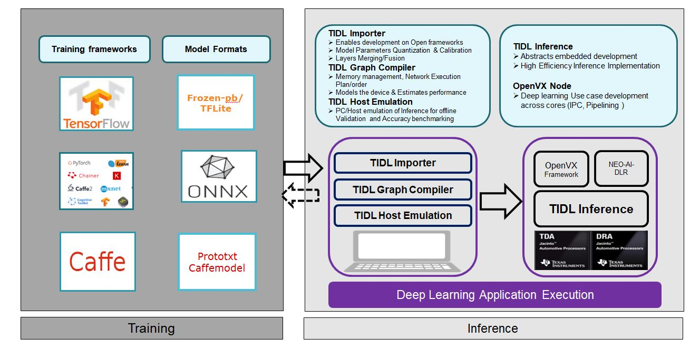

# TDA4 模型推理仿真流程

## TIDL 模块



## TIDL 开发容器构建

### 加载镜像

-i/--input  读取一个tar存档文件

```shell
docker load -i tda4.tar
```

### 查看镜像

```shell
docker image ls
```

### 移除镜像

-f/--force 取消标记（untag）, 并移除指定ID所匹配到的所有镜像

```shell
docker rmi [IMAGE-ID]
```

### 创建并启动容器

* 启动容器

  -i/--interactive 即使没有连接也保持标准输入流(STDIN)为打开状态，方式sh程序立即退出。

  -t/--tty 分配一个伪的tty，用于Unix / Linux处理终端访问的方式，添加一个终端驱动程序

  ```shell
  docker run --name tda4-demo -it tda4:7.3 
  ```

  -v/--volume 绑定外部挂在目录

  ```shell
  docker run --name tda4-demo -v /Users/alex/Documents/tda4/ti-processor-sdk-rtos-j721e-evm-07_03_00_07/tidl_j7_02_00_00_07:/usr/local/tidl_j7_02_00_00_07 -itd tda4:7.3
  ```

  

* 启动并后台运行

  -d/--detach  后台运行容器并打印容器ID

  ```shell
  docker run --name tda4-demo -itd tda4:7.3 
  ```

### 查看容器

-a/--all 所有容器（默认查看正在运行的容器）

```shell
docker ps -a
```

### 进入容器

进入运行中的容器

```shell
docker exec -it tda4-demo /bin/bash
```

### 开始(被停止的)容器

```shell
docker start [CONTAINER]
```

### 停止容器

```shell
docker stop [CONTAINER]
```

### 移除容器

-f/--force 强制移除正在运行的容器（默认移除停止的容器）

```shell
docker rm [CONTAINERE]
```

## 环境安装

* 配置 TIDL 库

  ```shell
  export TIDL_INSTALL_PATH=/usr/local/tidl_j7_02_00_00_07
  ```

* 配置 graphviz

  ```
  sudo apt install graphviz-dev
  export TIDL_GRAPHVIZ_PATH=/us
  ```

## TIDL 模型导入

TIDL 翻译（translation）/导入（import）可以接受一个一个使用**caffe**、 **tensorflow **训练的模型，或导出为**onnx** 的预训练浮点模型。导入步骤也会使用**范围收集（range collection）工具**生成输出（用于量化操作）。这个输出与推理库最终期望的输出非常相似。

在推理库尝试被导出的模型之前，通过比较导入模型的输出和期望输出去评估模型导入步骤的准确性。


### 编辑导入配置文件

```shell
vim ${TIDL_INSTALL_PATH}/test/testvecs/config/import/public/onnx/tidl_import_resnet18v2.txt 

```

* 导入配置接口

  ```
  ${TIDL_INSTALL_PATH}/ti_dl/utils/tidlModelImport/tidl_import_config.cpp
  ```

* 编辑 titidl_import_resnet18v2.txt

  ```
  modelType          = 2
  numParamBits       = 8
  inputNetFile      = "../../test/testvecs/models/public/onnx/resnet18v2.onnx"
  outputNetFile      = "../../test/testvecs/config/tidl_models/onnx/tidl_net_resnet18v2.bin"
  outputParamsFile   = "../../test/testvecs/config/tidl_models/onnx/tidl_io_resnet18v2_"
  inDataNorm  = 1
  inMean = 123.675 116.28 103.53
  inScale = 0.017125 0.017507 0.017429
  resizeWidth = 256
  resizeHeight = 256
  inWidth  = 224
  inHeight = 224
  inNumChannels = 3
  inData = ../../test/testvecs/config/imageNet_sample_val.txt
  postProcType = 1
  perfSimConfig = ../../test/testvecs/config/import/device_config.cfg
  ```

### 执行模型导入

```shell
cd ${TIDL_INSTALL_PATH}/ti_dl/utils/tidlModelImport
./out/tidl_model_import.out ../../test/testvecs/config/import/public/onnx/tidl_import_resnet18v2.txt 
```

## TIDL 模型仿真

### 编辑推理配置文件

```bash
vim ${TIDL_INSTALL_PATH}/ti_dl/test/testvecs/config/infer/public/onnx/tidl_infer_resnet18v2.txt
```

* 推理配置接口

  ```
  ${TIDL_INSTALL_PATH}/ti_dl/utils/tidlModelImport/tidl_import_config.cpp
  ```
  
  
  
* 编辑推理配置文件 tidl_infer_resnet18v2.txt

  ```
  inFileFormat    = 2
  postProcType = 1
  numFrames   = 1
  netBinFile      = "testvecs/config/tidl_models/onnx/tidl_net_resnet18v2.bin"
  ioConfigFile   = "testvecs/config/tidl_models/onnx/tidl_io_resnet18v2_1.bin"
  inData  =   testvecs/config/classification_list.txt
  outData =   testvecs/output/airshow_onnx_resnet18v2.bin
  debugTraceLevel = 0
  writeTraceLevel = 0
  ```

### 编辑单次推理配置文件

```bash
vim ${TIDL_INSTALL_PATH}/ti_dl/test/testvecs/config/config_list.txt
```

* config_list.txt 中添加推理配置文件目录

  ```
  2 -------------resnet18v2_test_cases---------------------
  1 testvecs/config/infer/public/onnx/tidl_infer_resnet18v2.txt
  0
  ```

​	其中**0**开始的行表示停止测试序列；以**1**开始表示去运行一个导入模型的推理参数；以**2**开始的行表示会被忽略

### 执行单次推理

```bash
cd ${TIDL_INSTALL_PATH}/ti_dl/test
./PC_dsp_test_dl_algo.out
```

### 编辑批量推理配置文件

```bash
vim ${TIDL_INSTALL_PATH}/ti_dl/test/testvecs/config/config_accuracy_list.txt
```

* config_accuracy_list.txt 中添加配置文件信息

  ```
  2 --------------config name, inData, numFrames-----------------------
  1 testvecs/config/infer/public/onnx/tidl_infer_resnet18v2.txt                testvecs/config/imageNet_val.txt    3
  1 testvecs/config/infer/public/onnx/tidl_infer_resnet18v2_cifar10_fp32.txt   testvecs/config/cifar10_test.txt    10000
  1 testvecs/config/infer/public/onnx/tidl_infer_resnet18v2_cifar10_int8.txt   testvecs/config/cifar10_test.txt    10000
  0
  ```

### 执行批量推理

```bash
cd ${TIDL_INSTALL_PATH}/ti_dl/test
python3 run_infers_accuracy.py 
```

*输出日志保存在 ${TIDL_INSTALL_PATH}/ti_dl/test/consoles* 目录中

## 参考资料

* <https://www.ti.com/tool/download/PROCESSOR-SDK-RTOS-J721E>
* <https://docs.docker.com/engine/reference/commandline/docker/>