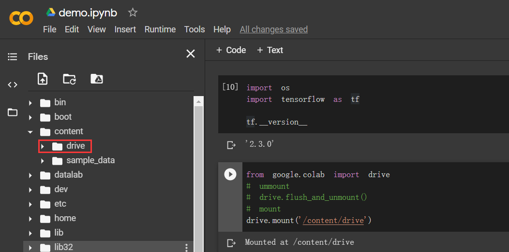
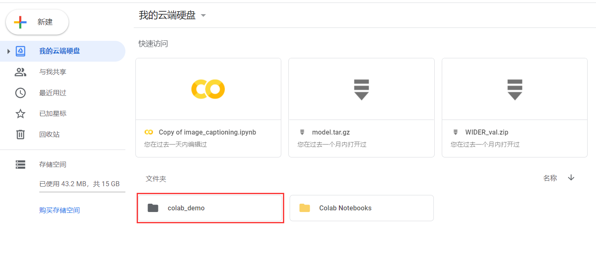
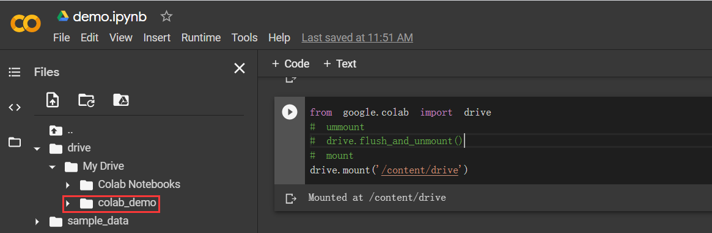
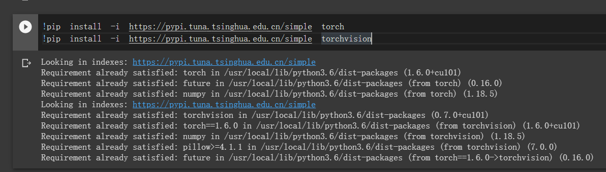
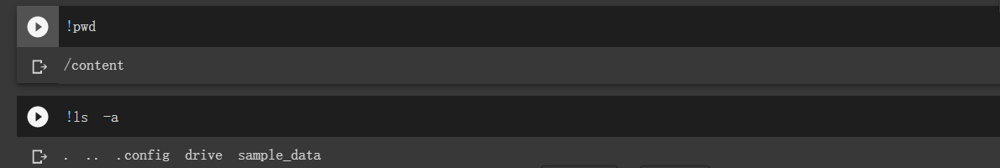
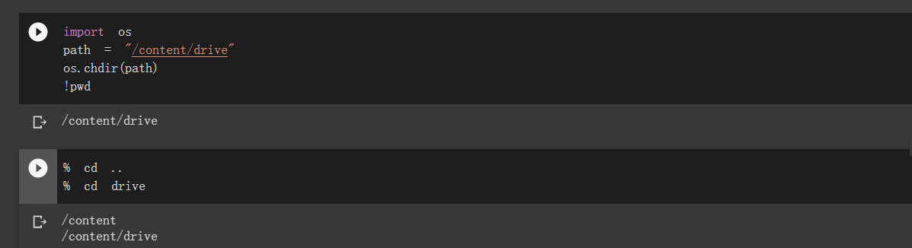
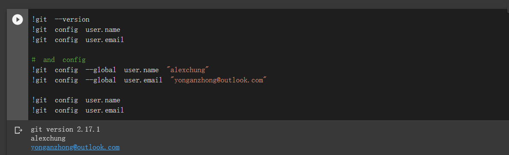
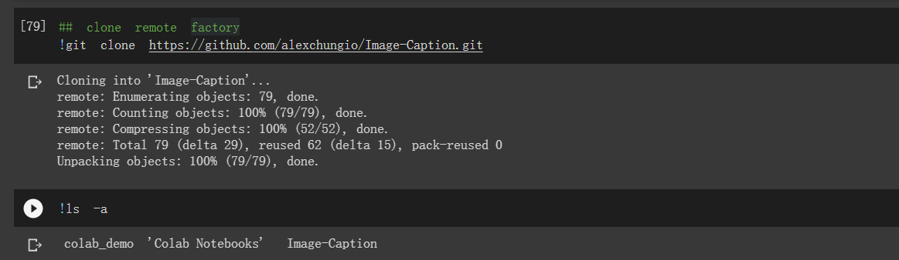
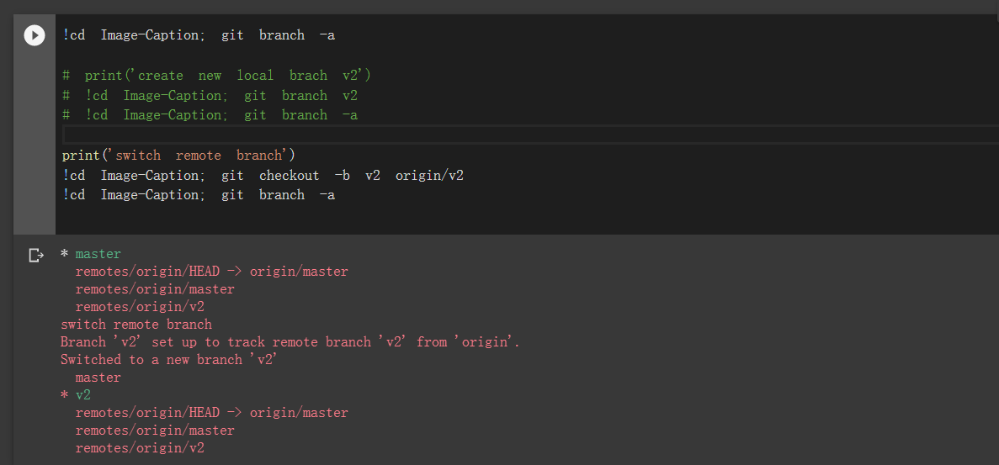

# colab 使用教程

## 挂载 google  driver 

###  挂载操作

```python
from google.colab import drive
# mount
drive.mount('/content/drive')
# unmount
```



挂载成功 !

### 验证挂载

* google driver 新建文件夹

  

* 查看 colab 挂载目录

  

  更新成功

## 安装python 库

* 以安装 pytorch and torchvision为例

  ```powershell
  !pip install -i https://pypi.tuna.tsinghua.edu.cn/simple torch
  !pip install -i https://pypi.tuna.tsinghua.edu.cn/simple torchvision
  ```

  

## linux 命令

### 显示当前工作路径

```powershell
ipwd
```

### 查看当前路径下所有文件

```powershell
!ls -a
```



### 切换工作路径

* 方法一 os.chdir

  

  ```shell
  import os
  path = "/content/drive" 
  os.chdir(path)
  !pwd
  ```

  

* 方法二 % cd {path}

  ```
  % cd ..
  % cd drive
  ```



注意：**!cd {path}  命令的作用域在条命令之内，命令执行完毕后就失效。**

## 导入 github 项目

### 配置 github

```
!git --version
!git config user.name
!git config user.email

# and config
!git config --global user.name "alexchung"
!git config --global user.email "yonganzhong@outlook.com"

!git config user.name
!git config user.email
```



### clone 远程仓库

```
!git clone https://github.com/alexchungio/Image-Caption.git
```



### 查看和切换分支

```shell
!cd Image-Caption; git branch -a

# print('create new local brach v2')
# !cd Image-Caption; git branch v2
# !cd Image-Caption; git branch -a

print('switch remote branch')
!cd Image-Caption; git checkout -b v2 origin/v2
!cd Image-Caption; git branch -a
```



### 提交代码到远程仓库

##  Clab  存储空间

* CPU/TPU 模式下分配存储空间： RAM 12G, Disk 108G
* GPU 模式下下分配存储空间： RAM 12G, Disk 68G 

存储空间不足时， 对于前期的数据处理部分使用CPU, 后期模型训练使用GPU。

## 模型保存

训练模型保存到google driver 挂载目录，

## 参考资料


