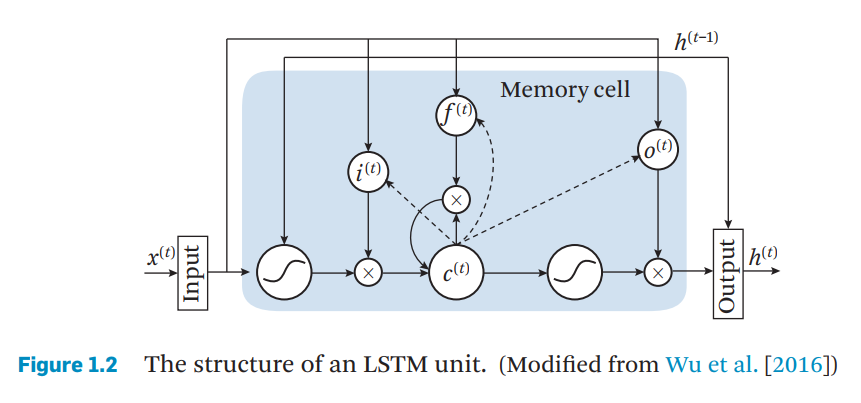

# Video Classification

## Basic Deep learning Module

### Convolutional Neural Networks (CNNs)  

* LeNet(LeCun. 1990)
* DBN(Deep Belief Network.  Hinton2006)
* AlexNet(Krizhevsky. 2012)
  * ReLUs (Rectified Linear Units)   
  * Dropout  

* VGGNet(Simonyan and Zisserman, 2015)
* GoogLeNet(Szegedy et al.  2015)
* ResNet(He. 2016)

### Recurrent Neural Networks (RNNs) 

* Basic RNN block
  $$
  \begin{aligned}
  h^{(t)}&=\sigma(W_xx^{(t)}+W_hh^{(t-1)}+b_h)\\
  z^{(t)}&=softmax(W_zh^{(t)}+b_z)
  \end{aligned}
  $$

* Long short-term memory (LSTM)   

  * LSTM 结构

    

  

$$
\begin{aligned}
i^{(t)}&=\sigma(W_{(xi)}x^{(t)}+W_{(hi)}h^{(t-1)}+W_{(ci)}c^{(t)}+b_i)\\ 
f^{(t)}&=\sigma(W_{(xf)}x^{(t)}+W_{(hf)}h^{(t-1)}+W_{(cf)}c^{(t)}+b_f)\\
c^{(t)}&=f^{(t)}c^{(t-1)}+i_ttanh(W_{(xc)}x^{(t)}+W_{(hc)}h^{(t-1)}+b_c)\\
o^{(t)}&=\sigma(W_{(xo)}x^{(t)}+W_{(co)}c^{(t-1)}+b_o)\\
h^{(t)}&=o^{(t)}tanh(c^{(t)})
\end{aligned}
$$

​	$x^{(t)}$, $h^{(t)}$ are the input and hidden vectors with the subscriptiont denoting the t-th time step, while $i^{(t)}$, $f^{(t)}$, $c^{(t)}$, $o^{(t)}$are, respectively, the activation vectors of the input gate, forget gate, memory cell, and output gate. 

## Supervised Deep Learning for Classification

### Image-Based Video Classification  

​    The general idea is to treat a video clip as a collection of frames, and then for each frame, feature representation could be derived by running a feed-forward pass till a certain fully-connected layer with state-of-the-art deep models pre-trained on ImageNet. Finally, frame-level features are averaged into
video-level representations as inputs of standard classifiers for recognition, such as the well-known SVMs.

### End-to-End CNN Architectures  

* 3D CNN(Ji et al. 2010)

  3D CNN model that operates on stacked video frames, extending the traditional 2D CNN designed for images to the spatio-temporal space.

* Two Stream(Simonyan and Zisserman. 2014）
  
* Motivated by the fact that videos can naturally be decomposed into spatial and temporal components, Two Stream breaks down the learning of video representation into separate feature learning of spatial and temporal clues.
  
* Convolutional Two-Stream(Feichtenhofer et al. 2016)

  They found that two streams could be fused using convolutional layers rather than averaging classification scores to better model the correlations of spatial and temporal streams.

* Multi-Stream(Wu et al. 2016)

* Temporal Segment Networks   (Wang et al. 2016 )

### Modeling Long-Term Temporal Dynamics  

