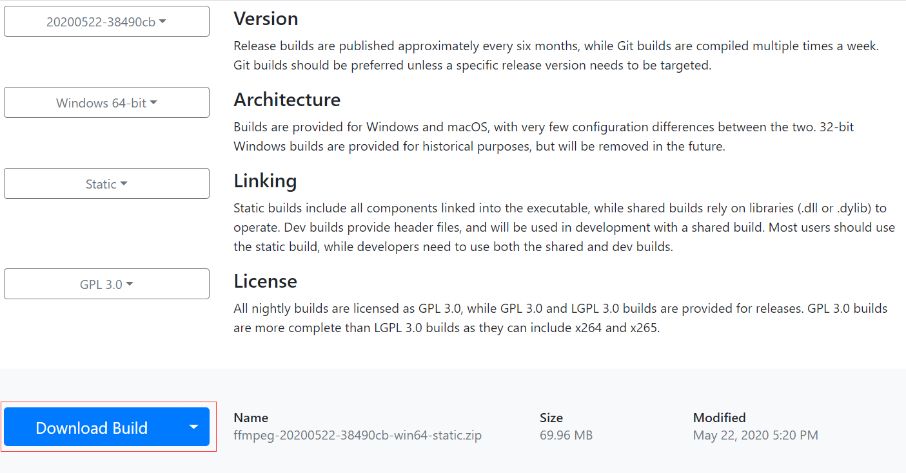
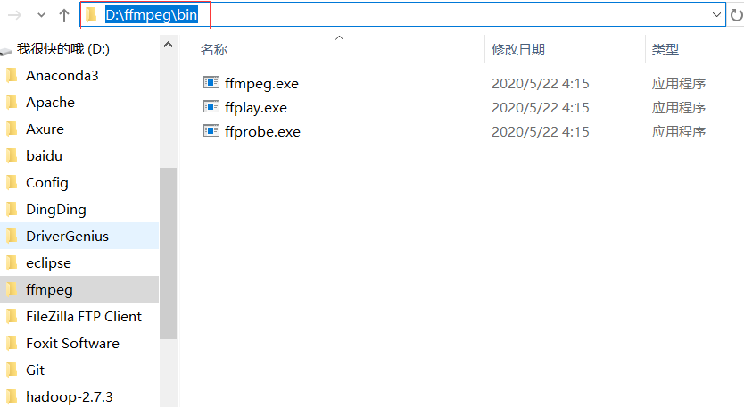
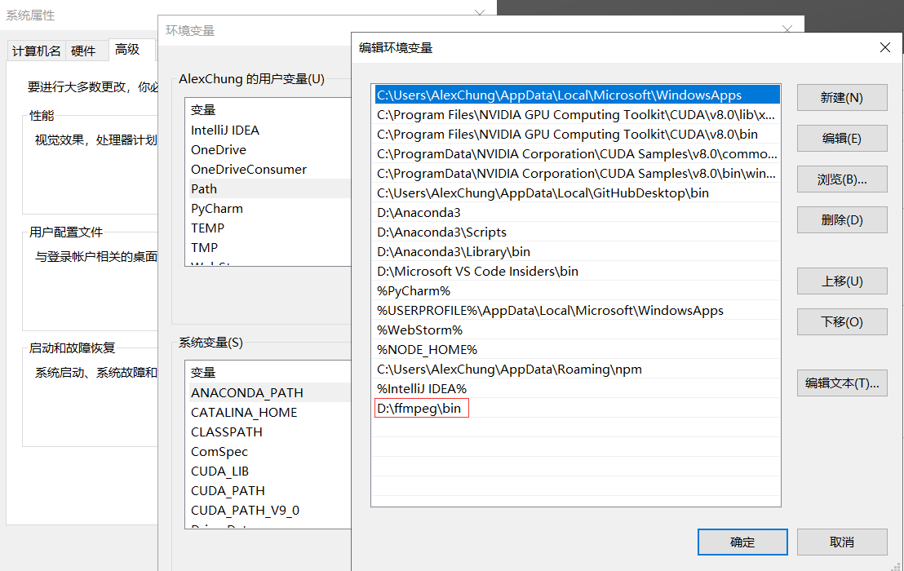
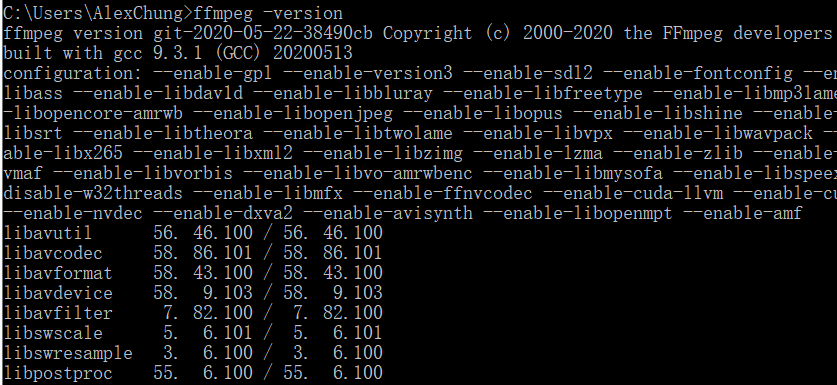
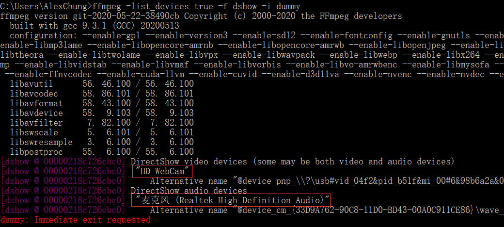
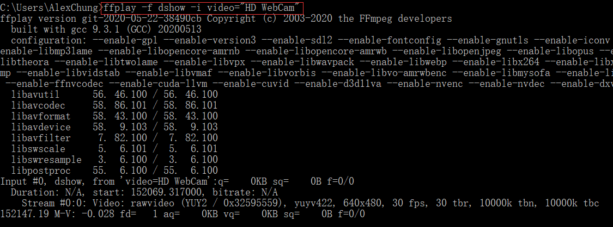

# 基于FFmpeg实现视频的编解码


[windows 下载地址](https://ffmpeg.zeranoe.com/builds/)



添加路径到环境到环境变量



属性->系统属性->Path(环境变量)



打开windows 命令交互端输入`ffmpeg -version`



安装成功

通过ffmepg 命令行获取本机音视频设别

```
ffmpeg -list_devices true -f dshow -i dummy
```



读取摄像头视频并显示

```
ffplay -f dshow -i video="HD WebCam"
```




## RTSP 协议

### 概念

​       RTSP（Real Time Streaming Protocol），RFC2326，实时流[传输协议](https://baike.baidu.com/item/传输协议)，是TCP/IP体系中的一个**应用层**协议，由Columbia University、Netscape和RealNetworks公司提交的IETF RFC标准。该协议定义了一对多应用程序如何有效地通过IP传送多媒体数据。

​		RTSP在体系结构上位于RTP和RTCP之上，它使用TCP或UDP完成数据传输。HTTP与RTSP相比，HTTP请求由客户机发出，服务器作出响应；使用RTSP时，客户机和服务器都可以发出请求，即RTSP可以是双向的。RTSP协议定义了一对多应用程序如何有效地通过 IP 网络传送多媒体数据。RTSP在体系结构上位于RTP和RTCP之上，它使用TCP或UDP完成数据传输。HTTP与RTSP相比，HTTP传送HTML，而RTSP传送的是多媒体数据。

## 参考资料


* [参考资料一](http://www.ruanyifeng.com/blog/2020/01/ffmpeg.html)
* [参考资料二](https://zhuanlan.zhihu.com/p/38136322)
* [参考资料三](https://trac.ffmpeg.org/wiki/DirectShow "DirectShow")
* [参考资料四](https://blog.csdn.net/weixin_42462202/article/details/98986535 "RTSP")

