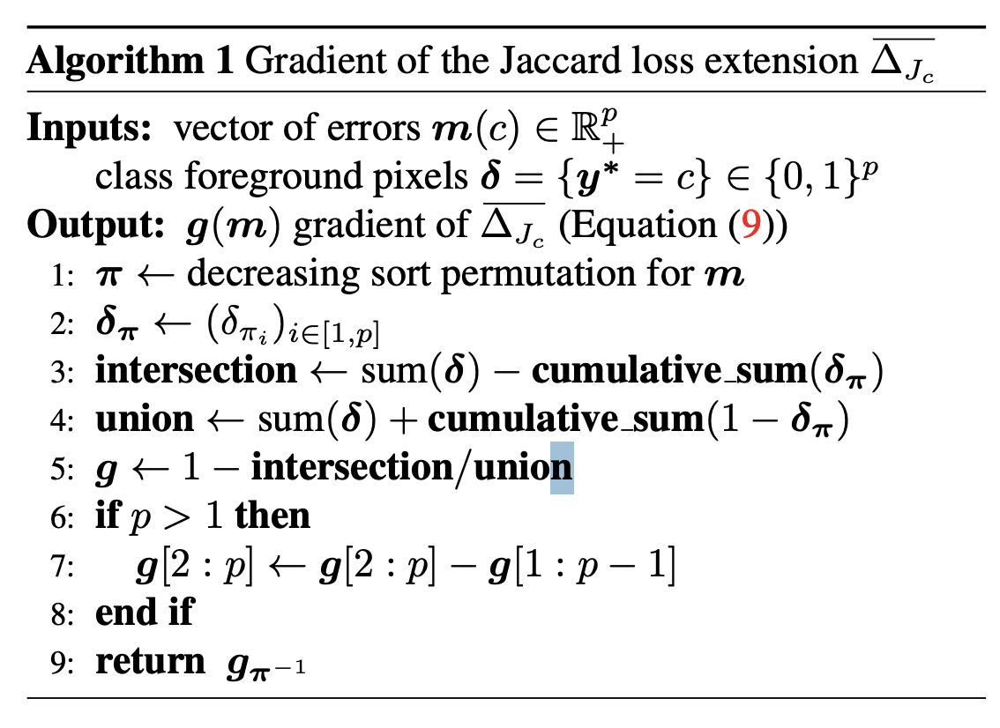

# Lovasz-Softmax 损失

## 动机

Lovasz-softmax 直接优化IOU（DICE为近似IOU）, 与优化指标一致。基于凸优化和lovasz扩展，优化具有数学理论支撑。

## 实现

### 步骤（多分类）

1. 预测归一化：输入logit 转换为 softmax

2. 计算预测误差：计算每个类别中对应每个像素的预测误差$gt - prob$。

3. 预测误差排序：分别对每个类别的预测误差做**降序**排序。

4. 计算梯度权重：利用 lovasz 扩展 技术，计算每个像素的 IOU 梯度权重。

   

5. 每个类别像素加权和：将梯度权重与排序后的预测误差做点积操作。

6. 计算所有类别损失：迭代计算所有类别的损失，并累加

### 代码

```python
def lovasz_grad(gt_sorted):
    """
    Computes gradient of the Lovasz extension w.r.t sorted errors
    利用lovasz 计算每个像素的 IOU 梯度权重
    See Alg. 1 in paper
    """
    p = len(gt_sorted)
    gts = gt_sorted.sum()
    intersection = gts - gt_sorted.float().cumsum(0)  # gts - cum_tp 剩余的正类数 （随着前缀的增加而减少）
    union = gts + (1 - gt_sorted).float().cumsum(0) # gts + cum_fp
    jaccard = 1.0 - intersection / union # (cum_tp+cum_fp)/ (gts + cum_fp)
    if p > 1:  # cover 1-pixel case
        jaccard[1:p] = jaccard[1:p] - jaccard[0:-1]  # 排序误差差分，得到每个位置的权重/导数
    return jaccard

  
def lovasz_softmax(logits, labels, classes="present", ignores=[255]):
    """
    Multi-class Lovasz-Softmax loss
      logits: [P, C] Variable, class probabilities at each prediction (between 0 and 1)
      labels: [P] Tensor, ground truth labels (between 0 and C - 1)
      classes: 'all' for all, 'present' for classes present in labels, or a list of classes to average.
    """
    probas = F.softmax(logits, dim=1)
    if probas.numel() == 0:
        # only void pixels, the gradients should be 0
        return probas * 0.0
    C = probas.size(1)
    losses = []
    class_to_sum = list(range(C)) if classes in ["all", "present"] else classes
		
    for c in class_to_sum:
        fg = (labels == c).float()  # foreground for class c
        if classes == "present" and fg.sum() == 0:
            continue
        if c in ignores:
            continue

        if C == 1:
            if len(classes) > 1:
                raise ValueError("Sigmoid output possible only with 1 class")
            class_pred = probas[:, 0]
        else:
            class_pred = probas[:, c]
        errors = (Variable(fg) - class_pred).abs()  
        errors_sorted, perm = torch.sort(errors, 0, descending=True)  
        perm = perm.data
        fg_sorted = fg[perm]
        losses.append(torch.dot(errors_sorted, Variable(lovasz_grad(fg_sorted))))
    return mean(losses)
```


## 参考资料

* [lovasz-softmax 论文](https://arxiv.org/pdf/1705.08790)