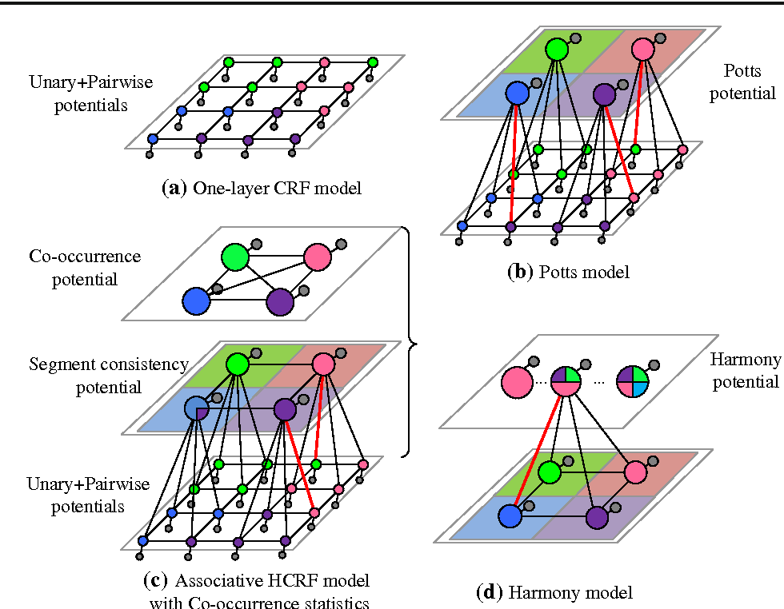

# 语义分割综述

## 发展阶段

###  基于阈值（thresholding）

### 基于聚类

### 基于边缘检测的方法

### 基于图割的方法（graph cut）

### 基于条件随机场（Condition Random Fileds, CRF）

对于每个像素 $i$ 具有类别标签$x_i$,  对应的观测值 $y_i$, 这样每个像素点作为**节点**，像素与像素之间的关系作为**边**， 即构成一个条件随机场。 可以通过观测变量$y_i$ 来推测像素$i$ 对应的类别标签 $x_i$

在CRF架构中， 每个像素被分配了一个一元损失， 比如像素到类别配置一个代价；此外，一个成对的损失函数，去模拟像素间的交互。

一元代价捕获了忽略类注释的代价，而后者惩罚了非光滑区域。CRF的目标是找到一个总成本最小化的配置。

## 深度学习方法的语义分割

### 全卷积网络

将分类网络的全连接层替换为允许按像素对图像进行分类的卷积层。

使用卷积层替换全连接层有两个明显的优势：

* 允许相同的网络架构应用到一张任意分辨率的图片
* 卷积层具有更少的参数，允许更快的训练和推理

### Encoder-Decoder 架构

* FCN

  全卷积网络

* DeconvNet

  解码器使用多层转置卷积层

* UNet

  在解码器阶段， 与 编码器阶段对应层的特征 concat 起来执行转置卷积

* SegNet

  与 DeconvNet 相比使用了类似的上采样/反池化（uppooling）方法。

  与 UNet 相比， 主要的不同是每个解码器层使用的了使用对应编码器层的最大池化索引（Pooling Indices）， 而不是执行 concat 操作

  使用最大池化索引的作用： 能够提高边界的轮廓； 降低参数的数量能够端到端地训练；这种格式的上采样可以拓展到任意的编码器解码器架构

### CRF 与 NN

CRF 具有慢的训练和推理速度， 同时学习内部参数也比较困难。 CNN 的的设计在边界区域不期望表现的很好， 边界区域两个或多个类交叉，或者可能丢失高层的信息通过多层的处理。

* DeepLab

  Deeplab 融合了两种方法， 通过组合最终神经网络层的响应与一个全连接的CRF： 全卷积网络去获取对于不同类别的粗糙的分数映射；CRF 被采用去更好地捕捉目标边界。

### 特征融合(featuer fusion)

很多技术聚焦于正确获取图像的细节，但是不同级的语义信息却丢失了。

* ParseNet

  提出采用 Global Pooling 操作计算一个全局特征作为上下文信息， 去增强每个像素的特征表达， 以帮助解决局部混淆。ParseNet 旨 在提高每个像素的特征感受野，以获取丰富的上下文信息。

* ESSN

  ESSN(Enhanced Semantic Segmentation Network), upsamples 和 concatenat 来自每一个卷积层的残差特征映射， 为了保持网络所有层级的特征。

应用 GAN 在语义分割任务。

### RNN

* ReSeg

  ReNet 模型用于图像分类， ReSeg 通过变换ReNet 层来定制语义分割任务。

* Semantic Segmentation of Video Sequences with Convolutional LSTMs

  针对连续视频帧的分割， 如果对每帧进行独立的分割，由于视频帧的高相关特性，比较没有效率。 论文提出通过添加一个lstm 去合并时序信息， 性能有很大的提升。

### GAN

### 全景分割（Panopic Segmentaion）

全景分割任务 可以看作是 语义分割和实例分割的组合任务： 对所有像素分配一个类别变脸， 同时所有的慕白哦实例被独立地分割

* Panoptic Segmentation
* Panoptic-DeepLab
* Panoptic Segmentation

### 基于注意力机制的模型

## 实时语义分割

### 快速傅立叶变换（FFT）

### 剪枝（pruning）

神经网络所需的存储和内存空间可以通过剪枝冗余的权重而降低。

使用 slimming 方法， 剪枝分为三步：

* 训练一个完整的网络
* 剪枝掉不重要的通道
* 重新训练网络去微调权重

两种剪枝方式：

* 通过逐层降低通道数， 解决 LASSO 回归优化问题
* 在迁移到分割网络之前， 剪枝backbone

### 量化

量化就是降低每一个权重表示的位数量， 压缩权重信息

* Bi-Real Net

### 深度可分离卷积

典型应用 Xception 和 MobileNet

普通的卷积操作的计算量

$$D^2 \times K^2 \times M \times N$$

输入特征图的 通道数为 $M$ , 输出特征图的通道为$N$, 对应的卷积核大小为$K \times K \times M \times N$

对于深度可分离卷积， 卷积操作分为两部分，分别对应的卷积核大小为  $K \times K \times M $ 和 $1 \times 1 \times \times M \times N$

第一步，每个通道对应一个深度卷积，对应的计算量为 $D^2 \times K^2 \times M$, 输出特征图为$D \times D \times M$

第二步, 使用 $1 \times 1$尺寸的卷积核执行逐点卷积， 进行通道融合, 对应的计算量为 $D^2 \times M \times N$

### 空洞/膨胀卷积（Dilated Convolution）

空洞卷积是通过在普通卷积的每个像素之间插入零， 去扩大卷积核的感受野。

假设卷积核大小为$k$, 膨胀系数为$d$, 膨胀卷积的等效卷积核大小为$k'$

$$k' = k + (k-1)\times(d-1)$$

假设上一层的感受野为$RF$, 当前层（膨胀卷积）的等效的感受野为$RF'$, $s$ 表示滑动步数。

$$RF'= RF + k'\prod_{j=0}^{i-1}s^j$$

空洞卷积的gridding 问题

* deeplab v2

  deeplabe v2 采用空洞卷积进行语义分割任务， 利用空洞结构扩大了卷积核的尺寸， 不经过下采样操作即可增大感受野，同时还能保留输入数据的内部结构， 避免了池化操作的一些缺陷。

* ESPNet(2018)

  ESPNet 构造了一组分解标准卷积为点级卷积和空间金字塔的膨胀卷积。

### 宽度和分辨率倍增器

 MobileNet 中除了深度可分离卷积还探索了其他方式去降低网络的复杂度。 

* 宽度倍增器（width multiplier）

  通过将每一层的输入和输出通道乘以一个缩放因子$\alpha$, 产生一个瘦的模型 

* 分辨率倍增器（resolution multiplier）

  通过降低输入图像的分辨率， 降低计算损耗。

### 提前降采样

处理大的输入帧有非常昂贵的计算损耗， 为了获取实时性，一个好的主意是在早期阶段降采样这些帧，同时保持大量低相关性的特征。（类似于PCA）

* ENet(2016)

  ENet 的动机是视觉信息在空间上是高度冗余的，信息能够压缩为更有效的表现，因此降采样对整体表现没有严重影响。

  此外论文提出，前几层并不真正有助于分类任务，而是为后续层提供有用的表示；另一方面，对下采样图像进行滤波处理的滤波器具有更大的感受野，可以为分割任务提供更多的上下文。

  降采样会导致空间信息的损失，如提出边缘形状。 ENet 根据 SegNet 的范式， 最大池化层所选择元素的索引被存储， 用于的在解码器产生稀疏的上采样映射，部分恢复空间信息。

### 小的解码器

在语义分割网络中，典型的编码器/解码器结构， 两个子组件并不是必须对称的。编码器需要比较深为了以类似于分类的任务捕获特征。然而解码器的主要任务是，去上采样演说的特征空间，为了去提供像素级的分类。因此后者可以使用一个更浅的结构获得， 提供极大的计算节约。

### 有效减少网格大小

### 使用小的卷积核

使用两个$3 \times 3$的卷积替换 $7 \times 7$ 的卷积

### 通道打乱操作（channel shuffle）

* ShffuleNet

### 双分支网络

## 参考资料

* <https://paperswithcode.com/task/real-time-semantic-segmentation>

* <https://github.com/wpf535236337/real-time-network>

